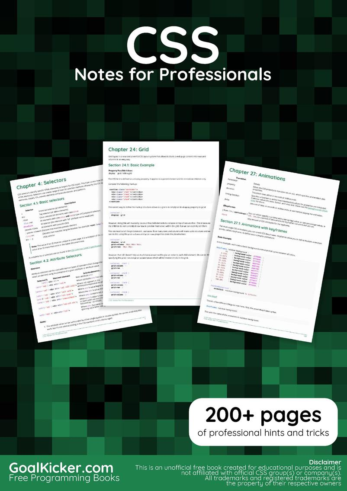
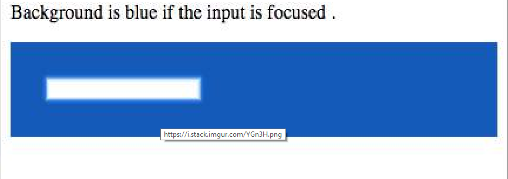

# CSS-Notes4Pros
CSS Notes For Professionals - intermediate level CSS learning course.  All on-line.  No money, unless you'd like to donate. I'm game for that.
---
title: |
  CSS Notes for Professionals
  by somebody, somewhere
author: "bbauska"
date last editted: "6/17/2024 Mon 12+pm"
output: 
  markdown:
    with some style
---

<h1 align="center">Advanced CSS Notes for Professionals</h1>

<h6 align="center">(by somebody, lecturer - somewhere @someplace)</h6>
<!--~~~~~~~~~~~~~~~~~~~~~~~~~~~~~~~~~~~~~~~~~~~~~~~~~~~~~~~~~~~~~~~~~~~~~~~~~~~~~~~~~~~~~~~~~~~~-->
<!--~~~~~~~~~~~~~~~~~~~ readme.md of CSS Advanced - Notes for Professionals ~~~~~~~~~~~~~~~~~~~~-->
<!--~~~~~~~~~~~~~~~~~~~~~~~~~~~~~ CSS-Notes4Pros.bauska.github.io ~~~~~~~~~~~~~~~~~~~~~~~~~~~~~~-->
<!--~~~~~~~~~~~~~~~~~~~~~~~~~~~~~~~~~~~~~~~~~~~~~~~~~~~~~~~~~~~~~~~~~~~~~~~~~~~~~~~~~~~~~~~~~~~~-->
<!--~~~~~~~~~~~~~~~~~~~~~~~~~~~~~~~~~ 01/02. CSS Logos (01) ~~~~~~~~~~~~~~~~~~~~~~~~~~~~~~~~~~~~-->
<p align="center" width="100%">


</p>

[**[About]** [9](#about)](#about)

[**[Chapter 1: Getting started with CSS]** [10](#section)](#section)

[[Section 1.1: External Stylesheet] [10](#section-1.1-external-stylesheet)](#section-1.1-external-stylesheet)

[[Section 1.2: Internal Styles] [11](#section-1.2-internal-styles)](#section-1.2-internal-styles)

[[Section 1.3: CSS &commat;import rule (one of CSS at-rule)] [11](#section-1.3-css-import-rule-one-of-css-at-rule)](#section-1.3-css-import-rule-one-of-css-at-rule)

[[Section 1.4: Inline Styles] [12](#section-1.4-inline-styles)](#section-1.4-inline-styles)

[[Section 1.5: Changing CSS with JavaScript] [12](#section-1.5-changing-css-with-javascript)](#section-1.5-changing-css-with-javascript)

[[Section 1.6: Styling Lists with CSS] [13](#section-1.6-styling-lists-with-css)](#section-1.6-styling-lists-with-css)

[**[Chapter 2: Structure and Formatting of a CSS Rule]** [14](#chapter-2-structure-and-formatting-of-a-css-rule)](#chapter-2-structure-and-formatting-of-a-css-rule)

[[Section 2.1: Property Lists]
[14](#section-2.1-property-lists)](#section-2.1-property-lists)

[[Section 2.2: Multiple Selectors]
[14](#section-2.2-multiple-selectors)](#section-2.2-multiple-selectors)

[[Section 2.3: Rules, Selectors, and Declaration Blocks]
[14](#section-9)](#section-9)

[**[Chapter 3: Comments]**
[14](#chapter-3-comments)](#chapter-3-comments)

[[Section 3.1: Single Line]
[14](#section-3.1-single-line)](#section-3.1-single-line)

[[Section 3.2: Multiple Line]
[15](#section-3.2-multiple-line)](#section-3.2-multiple-line)

[**[Chapter 4: Selectors]**
[16](#chapter-4-selectors)](#chapter-4-selectors)

[[Section 4.1: Basic selectors]
[16](#section-4.1-basic-selectors)](#section-4.1-basic-selectors)

[[Section 4.2: Attribute Selectors]
[16](#section-4.2-attribute-selectors)](#section-4.2-attribute-selectors)

[[Section 4.3: Combinators]
[19](#section-4.3-combinators)](#section-4.3-combinators)

[[Section 4.4: Pseudo-classes]
[20](#section-4.4-pseudo-classes)](#section-4.4-pseudo-classes)

[[Section 4.5: Child Pseudo Class]
[22](#section-4.5-child-pseudo-class)](#section-4.5-child-pseudo-class)

[[Section 4.6: Class Name Selectors]
[23](#section-4.6-class-name-selectors)](#section-4.6-class-name-selectors)

[[Section 4.7: Select element using its ID without the high specificity
of the ID selector]
[23](#section-4.7-select-element-using-its-id-without-the-high-specificity-of-the-id-selector)](#section-4.7-select-element-using-its-id-without-the-high-specificity-of-the-id-selector)

[[Section 4.8: The :last-of-type selector]
[24](#section-4.8-the-last-of-type-selector)](#section-4.8-the-last-of-type-selector)

[[Section 4.9: CSS3 :in-range selector example]
[24](#section-4.9-css3-in-range-selector-example)](#section-4.9-css3-in-range-selector-example)

[[Section 4.10: A. The :not pseudo-class example & B. :focus-within CSS
pseudo-class]
[24](#section-4.10-a.-the-not-pseudo-class-example-b.-focuswithin-css-pseudo-class)](#section-4.10-a.-the-not-pseudo-class-example-b.-focuswithin-css-pseudo-class)

[[Section 4.11: Global boolean with checkbox:checked and &#126; (general
sibling combinator)]
[26](#section-4.11-global-boolean-with-checkboxchecked-and-general-sibling-combinator)](#section-4.11-global-boolean-with-checkboxchecked-and-general-sibling-combinator)

[[Section 4.12: ID selectors]
[27](#section-4.12-id-selectors)](#section-4.12-id-selectors)

[[Section 4.13: How to style a Range input]
[27](#section-4.13-how-to-style-a-range-input)](#section-4.13-how-to-style-a-range-input)

[[Section 4.14: The :only-child pseudo-class selector
example]
[28](#section-4.14-the-only-child-pseudo-class-selector-example)](#section-4.14-the-only-child-pseudo-class-selector-example)

[**[Chapter 5: Backgrounds]**
[28](#chapter-5-backgrounds)](#chapter-5-backgrounds)

[[Section 5.1: Background Color]
[28](#section-5.1-background-color)](#section-5.1-background-color)

[[Section 5.2: Background Gradients]
[30](#section-5.2-background-gradients)](#section-5.2-background-gradients)

[[Section 5.3: Background Image]
[32](#section-5.3-background-image)](#section-5.3-background-image)

[[Section 5.4: Background Shorthand]
[32](#section-5.4-background-shorthand)](#section-5.4-background-shorthand)

[[Section 5.5: Background Size]
[33](#section-5.5-background-size)](#section-5.5-background-size)

[[Section 5.6: Background Position]
[37](#section-5.6-background-position)](#section-5.6-background-position)

[[Section 5.7: The background-origin property]
[38](#section-5.7-the-background-origin-property)](#section-5.7-the-background-origin-property)

[[Section 5.8: Multiple Background Image]
[40](#section-5.8-multiple-background-image)](#section-5.8-multiple-background-image)

[[Section 5.9: Background Attachment]
[41](#section-5.9-background-attachment)](#section-5.9-background-attachment)

[[Section 5.10: Background Clip]
[42](#section-5.10-background-clip)](#section-5.10-background-clip)

[[Section 5.11: Background Repeat]
[42](#section-5.11-background-repeat)](#section-5.11-background-repeat)

[[Section 5.12: background-blend-mode Property]
[43](#section-5.12-background-blend-mode-property)](#section-5.12-background-blend-mode-property)

[[Section 5.13: Background Color with Opacity]
[43](#section-5.13-background-color-with-opacity)](#section-5.13-background-color-with-opacity)

[**[Chapter 6: Centering]**
[45](#chapter-6-centering)](#chapter-6-centering)

[[Section 6.1: Using Flexbox]
[45](#section-6.1-using-flexbox)](#section-6.1-using-flexbox)

[[Section 6.2: Using CSS transform]
[45](#section-6.2-using-css-transform)](#section-6.2-using-css-transform)

[[Section 6.3: Using margin: 0 auto;]
[46](#section-6.3-using-margin-0-auto)](#section-6.3-using-margin-0-auto)

[[Section 6.4: Using text-align]
[48](#section-6.4-using-text-align)](#section-6.4-using-text-align)

[[Section 6.5: Using position: absolute]
[48](#section-6.5-using-position-absolute)](#section-6.5-using-position-absolute)

[[Section 6.6: Using calc()]
[49](#section-6.6-using-calc)](#section-6.6-using-calc)

[[Section 6.7: Using line-height]
[49](#section-6.7-using-line-height)](#section-6.7-using-line-height)

[[Section 6.8: Vertical align anything with 3 lines of code]
[49](#section-6.8-vertical-align-anything-with-3-lines-of-code)](#section-6.8-vertical-align-anything-with-3-lines-of-code)

[[Section 6.9: Centering in relation to another item]
[50](#section-6.9-centering-in-relation-to-another-item)](#section-6.9-centering-in-relation-to-another-item)

[[Section 6.10: Ghost element technique (Michał Czernow&apos;s
hack)]
[51](#section-6.10-ghost-element-technique-michał-czernows-hack)](#section-6.10-ghost-element-technique-michał-czernows-hack)

[[Section 6.11: Centering vertically and horizontally without worrying
about height or width]
[52](#section-6.11-centering-vertically-and-horizontally-without-worrying-about-height-or-width)](#section-6.11-centering-vertically-and-horizontally-without-worrying-about-height-or-width)

[[Section 6.12: Vertically align an image inside div]
[53](#section-6.12-vertically-align-an-image-inside-div)](#section-6.12-vertically-align-an-image-inside-div)

[[Section 6.13: Centering with fixed size]
[53](#section-6.13-centering-with-fixed-size)](#section-6.13-centering-with-fixed-size)

[[Section 6.14: Vertically align dynamic height elements]
[54](#section-6.14-vertically-align-dynamic-height-elements)](#section-6.14-vertically-align-dynamic-height-elements)

[[Section 6.15: Horizontal and Vertical centering using table
layout]
[55](#section-6.15-horizontal-and-vertical-centering-using-table-layout)](#section-6.15-horizontal-and-vertical-centering-using-table-layout)

[**[Chapter 7: The Box Model]**
[57](#chapter-7-the-box-model)](#chapter-7-the-box-model)

[[Section 7.1: What is the Box Model?]
[57](#section-7.1-what-is-the-box-model)](#section-7.1-what-is-the-box-model)

[[Section 7.2: box-sizing]
[58](#section-7.2-box-sizing)](#section-7.2-box-sizing)

[**[Chapter 8: Margins]**
[60](#chapter-8-margins)](#chapter-8-margins)

[[Section 8.1: Margin Collapsing]
[60](#section-8.1-margin-collapsing)](#section-8.1-margin-collapsing)

[[Section 8.2: Apply Margin on a Given Side]
[62](#section-8.2-apply-margin-on-a-given-side)](#section-8.2-apply-margin-on-a-given-side)

[[Section 8.3: Margin property simplification]
[63](#section-8.3-margin-property-simplification)](#section-8.3-margin-property-simplification)

[[Section 8.4: Horizontally center elements on a page using
margin]
[63](#section-8.4-horizontally-center-elements-on-a-page-using-margin)](#section-8.4-horizontally-center-elements-on-a-page-using-margin)

[[Section 8.5: Example 1:]
[64](#section-8.5-example-1)](#section-8.5-example-1)

[[Section 8.6: Negative margins]
[64](#section-8.6-negative-margins)](#section-8.6-negative-margins)

[**[Chapter 9: Padding]**
[65](#chapter-9-padding)](#chapter-9-padding)

[[Section 9.1: Padding Shorthand]
[65](#section-9.1-padding-shorthand)](#section-9.1-padding-shorthand)

[[Section 9.2: Padding on a given side]
[66](#section-9.2-padding-on-a-given-side)](#section-9.2-padding-on-a-given-side)

[**[Chapter 10: Border]**
[66](#chapter-10-border)](#chapter-10-border)

[[Section 10.1: border-radius]
[66](#section-10.1-border-radius)](#section-10.1-border-radius)

[[Section 10.2: border-style]
[67](#section-10.2-border-style)](#section-10.2-border-style)

[[Section 10.3: Multiple Borders]
[68](#section-10.3-multiple-borders)](#section-10.3-multiple-borders)

[[Section 10.4: border (shorthands)]
[69](#section-10.4-border-shorthands)](#section-10.4-border-shorthands)

[[Section 10.5: border-collapse]
[70](#section-10.5-border-collapse)](#section-10.5-border-collapse)

[[Section 10.6: border-image]
[70](#section-10.6-border-image)](#section-10.6-border-image)

[[Section 10.7: Creating a multi-colored border using
border-image]
[70](#section-10.7-creating-a-multi-colored-border-using-borderimage)](#section-10.7-creating-a-multi-colored-border-using-borderimage)

[[Section 10.8: border-&lbrack;left&vertbar;right&vertbar;top&vertbar;bottom&rbrack;]
[71](#section-10.8-border-leftrighttopbottom)](#section-10.8-border-leftrighttopbottom)

[**[Chapter 11: Outlines]**
[71](#chapter-11-outlines)](#chapter-11-outlines)

[[Section 11.1: Overview]
[72](#section-11.1-overview)](#section-11.1-overview)

[[Section 11.2: outline-style]
[72](#section-11.2-outline-style)](#section-11.2-outline-style)

[**[Chapter 12: Overflow]**
[73](#chapter-12-overflow)](#chapter-12-overflow)

[[Section 12.1: overflow-wrap]
[73](#section-12.1-overflow-wrap)](#section-12.1-overflow-wrap)

[[Section 12.2: overflow-x and overflow-y]
[74](#section-12.2-overflow-x-and-overflow-y)](#section-12.2-overflow-x-and-overflow-y)

[[Section 12.3: overflow: scroll]
[75](#section-12.3-overflow-scroll)](#section-12.3-overflow-scroll)

[[Section 12.4: overflow: visible]
[75](#section-12.4-overflow-visible)](#section-12.4-overflow-visible)

[[Section 12.5: Block Formatting Context Created with
Overflow]
[76](#section-12.5-block-formatting-context-created-with-overflow)](#section-12.5-block-formatting-context-created-with-overflow)

[**[Chapter 13: Media Queries]**
[78](#chapter-13-media-queries)](#chapter-13-media-queries)

[[Section 13.1: Terminology and Structure]
[78](#section-13.1-terminology-and-structure)](#section-13.1-terminology-and-structure)

[[Section 13.2: Basic Example]
[79](#section-13.2-basic-example)](#section-13.2-basic-example)

[[Section 13.3: mediatype]
[79](#section-13.3-mediatype)](#section-13.3-mediatype)

[[Section 13.4: Media Queries for Retina and Non Retina
Screens]
[80](#section-13.4-media-queries-for-retina-and-non-retina-screens)](#section-13.4-media-queries-for-retina-and-non-retina-screens)

[[Section 13.5: Width vs Viewport]
[80](#section-13.5-width-vs-viewport)](#section-13.5-width-vs-viewport)

[[Section 13.6: Using Media Queries to Target Dierent Screen
Sizes]
[81](#section-13.6-using-media-queries-to-target-dierent-screen-sizes)](#section-13.6-using-media-queries-to-target-dierent-screen-sizes)

[[Section 13.7: Use on link tag]
[81](#section-13.7-use-on-link-tag)](#section-13.7-use-on-link-tag)

[[Section 13.8: Media queries and IE8]
[82](#section-13.8-media-queries-and-ie8)](#section-13.8-media-queries-and-ie8)

[**[Chapter 14: Floats]**
[82](#chapter-14-floats)](#chapter-14-floats)

[[Section 14.1: Float an Image Within Text]
[82](#section-14.1-float-an-image-within-text)](#section-14.1-float-an-image-within-text)

[[Section 14.2: clear property]
[83](#section-14.2-clear-property)](#section-14.2-clear-property)

[[Section 14.3: Clearfix]
[84](#section-14.3-clearfix)](#section-14.3-clearfix)

[[Section 14.4: In-line DIV using float]
[85](#section-14.4-in-line-div-using-float)](#section-14.4-in-line-div-using-float)

[[Section 14.5: Use of overflow property to clear floats]
[87](#section-14.5-use-of-overflow-property-to-clear-floats)](#section-14.5-use-of-overflow-property-to-clear-floats)

[[Section 14.6: Simple Two Fixed-Width Column Layout]
[87](#section-14.6-simple-two-fixed-width-column-layout)](#section-14.6-simple-two-fixed-width-column-layout)

[[Section 14.7: Simple Three Fixed-Width Column Layout]
[88](#section-14.7-simple-three-fixed-width-column-layout)](#section-14.7-simple-three-fixed-width-column-layout)

[[Section 14.8: Two-Column Lazy/Greedy Layout]
[88](#section-14.8-two-column-lazygreedy-layout)](#section-14.8-two-column-lazygreedy-layout)

[**[Chapter 15: Typography]**
[89](#chapter-15-typography)](#chapter-15-typography)

[[Section 15.1: The Font Shorthand]
[89](#section-15.1-the-font-shorthand)](#section-15.1-the-font-shorthand)

[[Section 15.2: Quotes]
[90](#section-15.2-quotes)](#section-15.2-quotes)

[[Section 15.3: Font Size]
[90](#section-15.3-font-size)](#section-15.3-font-size)

[[Section 15.4: Text Direction]
[91](#section-15.4-text-direction)](#section-15.4-text-direction)

[[Section 15.5: Font Stacks]
[91](#section-15.5-font-stacks)](#section-15.5-font-stacks)

[[Section 15.6: Text Overflow]
[91](#section-15.6-text-overflow)](#section-15.6-text-overflow)

[[Section 15.7: Text Shadow]
[92](#section-15.7-text-shadow)](#section-15.7-text-shadow)

[[Section 15.8: Text Transform]
[92](#section-15.8-text-transform)](#section-15.8-text-transform)

[[Section 15.9: Letter Spacing]
[93](#section-15.9-letter-spacing)](#section-15.9-letter-spacing)

[[Section 15.10: Text Indent]
[93](#section-15.10-text-indent)](#section-15.10-text-indent)

[[Section 15.11: Text Decoration]
[93](#section-15.11-text-decoration)](#section-15.11-text-decoration)

[[Section 15.12: Word Spacing]
[94](#section-15.12-word-spacing)](#section-15.12-word-spacing)

[[Section 15.13: Font Variant]
[94](#section-15.13-font-variant)](#section-15.13-font-variant)

[**[Chapter 16: Flexible Box Layout (Flexbox)]**
[96](#chapter-16-flexible-box-layout-flexbox)](#chapter-16-flexible-box-layout-flexbox)

[[Section 16.1: Dynamic Vertical and Horizontal Centering (align-items,
justify-content)]
[96](#section-16.1-dynamic-vertical-and-horizontal-centering-alignitems-justify-content)](#section-16.1-dynamic-vertical-and-horizontal-centering-alignitems-justify-content)

[[Section 16.2: Sticky Variable-Height Footer]
[102](#section-16.2-sticky-variable-height-footer)](#section-16.2-sticky-variable-height-footer)

[[Section 16.3: Optimally fit elements to their container]
[103](#section-16.3-optimally-fit-elements-to-their-container)](#section-16.3-optimally-fit-elements-to-their-container)

[[Section 16.4: Holy Grail Layout using Flexbox]
[104](#section-16.4-holy-grail-layout-using-flexbox)](#section-16.4-holy-grail-layout-using-flexbox)

[[Section 16.5: Perfectly aligned buttons inside cards with
flexbox]
[105](#section-16.5-perfectly-aligned-buttons-inside-cards-with-flexbox)](#section-16.5-perfectly-aligned-buttons-inside-cards-with-flexbox)

[[Section 16.6: Same height on nested containers]
[107](#section-16.6-same-height-on-nested-containers)](#section-16.6-same-height-on-nested-containers)

[**[Chapter 17: Cascading and Specificity]**
[108](#chapter-17-cascading-and-specificity)](#chapter-17-cascading-and-specificity)

[[Section 17.1: Calculating Selector Specificity]
[108](#section-17.1-calculating-selector-specificity)](#section-17.1-calculating-selector-specificity)

[[Section 17.2: The !important declaration]
[110](#section-17.2-the-important-declaration)](#section-17.2-the-important-declaration)

[[Section 17.3: Cascading]
[111](#section-17.3-cascading)](#section-17.3-cascading)

[[Section 17.4: More complex specificity example]
[112](#section-17.4-more-complex-specificity-example)](#section-17.4-more-complex-specificity-example)

[**[Chapter 18: Colors]**
[113](#chapter-18-colors)](#chapter-18-colors)

[[Section 18.1: currentColor]
[113](#section-18.1-currentcolor)](#section-18.1-currentcolor)

[[Section 18.2: Color Keywords]
[114](#section-18.2-color-keywords)](#section-18.2-color-keywords)

[[Section 18.3: Hexadecimal Value]
[120](#section-18.3-hexadecimal-value)](#section-18.3-hexadecimal-value)

[[Section 18.4: rgb() Notation]
[121](#section-18.4-rgb-notation)](#section-18.4-rgb-notation)

[[Section 18.5: rgba() Notation]
[122](#section-18.5-rgba-notation)](#section-18.5-rgba-notation)

[[Section 18.6: hsl() Notation]
[122](#section-18.6-hsl-notation)](#section-18.6-hsl-notation)

[[Section 18.7: hsla() Notation]
[123](#section-18.7-hsla-notation)](#section-18.7-hsla-notation)

[**[Chapter 19: Opacity]**
[125](#chapter-19-opacity)](#chapter-19-opacity)

[[Section 19.1: Opacity Property]
[125](#section-19.1-opacity-property)](#section-19.1-opacity-property)

[[Section 19.2: IE Compatibility for &apos;opacity&apos;]
[125](#section-19.2-ie-compatibility-for-opacity)](#section-19.2-ie-compatibility-for-opacity)

[**[Chapter 20: Length Units]**
[125](#chapter-20-length-units)](#chapter-20-length-units)

[[Section 20.1: Creating scalable elements using rems and
ems]
[125](#section-20.1-creating-scalable-elements-using-rems-and-ems)](#section-20.1-creating-scalable-elements-using-rems-and-ems)

[[Section 20.2: Font size with rem]
[126](#section-20.2-font-size-with-rem)](#section-20.2-font-size-with-rem)

[[Section 20.3: vmin and vmax]
[127](#section-20.3-vmin-and-vmax)](#section-20.3-vmin-and-vmax)

[[Section 20.4: vh and vw]
[127](#section-20.4-vh-and-vw)](#section-20.4-vh-and-vw)

[[Section 20.5: using percent %]
[128](#section-20.5-using-percent)](#section-20.5-using-percent)

[**[Chapter 21: Pseudo-Elements]**
[128](#chapter-21-pseudo-elements)](#chapter-21-pseudo-elements)

[[Section 21.1: Pseudo-Elements]
[129](#section-21.1-pseudo-elements)](#section-21.1-pseudo-elements)

[[Section 21.2: Pseudo-Elements in Lists]
[129](#section-21.2-pseudo-elements-in-lists)](#section-21.2-pseudo-elements-in-lists)

[**[Chapter 22: Positioning]**
[130](#chapter-22-positioning)](#chapter-22-positioning)

[[Section 22.1: Overlapping Elements with z-index]
[130](#section-22.1-overlapping-elements-with-z-index)](#section-22.1-overlapping-elements-with-z-index)

[[Section 22.2: Absolute Position]
[132](#section-22.2-absolute-position)](#section-22.2-absolute-position)

[[Section 22.3: Fixed position]
[132](#section-22.3-fixed-position)](#section-22.3-fixed-position)

[[Section 22.4: Relative Position]
[132](#section-22.4-relative-position)](#section-22.4-relative-position)

[[Section 22.5: Static positioning]
[133](#section-22.5-static-positioning)](#section-22.5-static-positioning)

[**[Chapter 23: Layout Control]**
[134](#chapter-23-layout-control)](#chapter-23-layout-control)

[[Section 23.1: The display property]
[134](#section-23.1-the-display-property)](#section-23.1-the-display-property)

[[Section 23.2: To get old table structure using div]
[136](#section-23.2-to-get-old-table-structure-using-div)](#section-23.2-to-get-old-table-structure-using-div)

[**[Chapter 24: Grid]**
[137](#chapter-24-grid)](#chapter-24-grid)

[[Section 24.1: Basic Example]
[137](#section-24.1-basic-example)](#section-24.1-basic-example)

[**[Chapter 25: Tables]**
[139](#chapter-25-tables)](#chapter-25-tables)

[[Section 25.1: table-layout]
[139](#section-25.1-table-layout)](#section-25.1-table-layout)

[[Section 25.2: empty-cells]
[139](#section-25.2-empty-cells)](#section-25.2-empty-cells)

[[Section 25.3: border-collapse]
[139](#section-25.3-border-collapse)](#section-25.3-border-collapse)

[[Section 25.4: border-spacing]
[140](#section-25.4-border-spacing)](#section-25.4-border-spacing)

[[Section 25.5: caption-side]
[140](#section-25.5-caption-side)](#section-25.5-caption-side)

[**[Chapter 26: Transitions]**
[140](#chapter-26-transitions)](#chapter-26-transitions)

[[Section 26.1: Transition shorthand]
[141](#section-26.1-transition-shorthand)](#section-26.1-transition-shorthand)

[[Section 26.2: cubic-bezier]
[141](#section-26.2-cubic-bezier)](#section-26.2-cubic-bezier)

[[Section 26.3: Transition (longhand)]
[142](#section-26.3-transition-longhand)](#section-26.3-transition-longhand)

[**[Chapter 27: Animations]**
[144](#chapter-27-animations)](#chapter-27-animations)

[[Section 27.1: Animations with keyframes]
[144](#section-27.1-animations-with-keyframes)](#section-27.1-animations-with-keyframes)

[[Section 27.2: Animations with the transition property]
[145](#section-27.2-animations-with-the-transition-property)](#section-27.2-animations-with-the-transition-property)

[[Section 27.3: Syntax Examples]
[146](#section-27.3-syntax-examples)](#section-27.3-syntax-examples)

[[Section 27.4: Increasing Animation Performance Using the
&apos;will-change&apos; Attribute]
[147](#section-27.4-increasing-animation-performance-using-the-will-change-attribute)](#section-27.4-increasing-animation-performance-using-the-will-change-attribute)

[**[Chapter 28: 2D Transforms]**
[147](#chapter-28-2d-transforms)](#chapter-28-2d-transforms)

[[Section 28.1: Rotate]
[148](#section-28.1-rotate)](#section-28.1-rotate)

[[Section 28.2: Scale]
[148](#section-28.2-scale)](#section-28.2-scale)

[[Section 28.3: Skew]
[148](#section-28.3-skew)](#section-28.3-skew)

[[Section 28.4: Multiple transforms]
[149](#section-28.4-multiple-transforms)](#section-28.4-multiple-transforms)

[[Section 28.5: Translate]
[149](#section-28.5-translate)](#section-28.5-translate)

[[Section 28.6: Transform Origin]
[150](#section-28.6-transform-origin)](#section-28.6-transform-origin)

[**[Chapter 29: 3D Transforms]**
[151](#chapter-29-3d-transforms)](#chapter-29-3d-transforms)

[[Section 29.1: Compass pointer or needle shape using 3D
transforms]
[151](#section-29.1-compass-pointer-or-needle-shape-using-3d-transforms)](#section-29.1-compass-pointer-or-needle-shape-using-3d-transforms)

[[Section 29.2: 3D text eect with shadow]
[152](#section-29.2-3d-text-eect-with-shadow)](#section-29.2-3d-text-eect-with-shadow)

[[Section 29.3: backface-visibility]
[153](#section-29.3-backface-visibility)](#section-29.3-backface-visibility)

[[Section 29.4: 3D cube]
[154](#section-29.4-3d-cube)](#section-29.4-3d-cube)

[**[Chapter 30: Filter Property]**
[155](#chapter-30-filter-property)](#chapter-30-filter-property)

[[Section 30.1: Blur]
[156](#section-30.1-blur)](#section-30.1-blur)

[[Section 30.2: Drop Shadow (use box-shadow instead if
possible)]
[156](#section-30.2-drop-shadow-use-box-shadow-instead-if-possible)](#section-30.2-drop-shadow-use-box-shadow-instead-if-possible)

[[Section 30.3: Hue Rotate]
[156](#section-30.3-hue-rotate)](#section-30.3-hue-rotate)

[[Section 30.4: Multiple Filter Values]
[157](#section-30.4-multiple-filter-values)](#section-30.4-multiple-filter-values)

[[Section 30.5: Invert Color]
[157](#section-30.5-invert-color)](#section-30.5-invert-color)

[**[Chapter 31: Cursor Styling]**
[158](#chapter-31-cursor-styling)](#chapter-31-cursor-styling)

[[Section 31.1: Changing cursor type]
[158](#section-31.1-changing-cursor-type)](#section-31.1-changing-cursor-type)

[[Section 31.2: pointer-events]
[158](#section-31.2-pointer-events)](#section-31.2-pointer-events)

[[Section 31.3: caret-color]
[159](#section-31.3-caret-color)](#section-31.3-caret-color)

[**[Chapter 32: box-shadow]**
[160](#chapter-32-box-shadow)](#chapter-32-box-shadow)

[[Section 32.1: bottom-only drop shadow using a
pseudo-element]
[160](#section-32.1-bottom-only-drop-shadow-using-a-pseudoelement)](#section-32.1-bottom-only-drop-shadow-using-a-pseudoelement)

[[Section 32.2: drop shadow]
[161](#section-32.2-drop-shadow)](#section-32.2-drop-shadow)

[[Section 32.3: inner drop shadow]
[161](#section-32.3-inner-drop-shadow)](#section-32.3-inner-drop-shadow)

[[Section 32.4: multiple shadows]
[162](#section-32.4-multiple-shadows)](#section-32.4-multiple-shadows)

[**[Chapter 33: Shapes for Floats]**
[163](#chapter-33-shapes-for-floats)](#chapter-33-shapes-for-floats)

[[Section 33.1: Shape Outside with Basic Shape -- circle()]
[163](#section-33.1-shape-outside-with-basic-shape-circle)](#section-33.1-shape-outside-with-basic-shape-circle)

[[Section 33.2: Shape margin]
[164](#section-33.2-shape-margin)](#section-33.2-shape-margin)

[**[Chapter 34: List Styles]**
[166](#chapter-34-list-styles)](#chapter-34-list-styles)

[[Section 34.1: Bullet Position]
[166](#section-34.1-bullet-position)](#section-34.1-bullet-position)

[[Section 34.2: Removing Bullets / Numbers]
[166](#section-34.2-removing-bullets-numbers)](#section-34.2-removing-bullets-numbers)

[[Section 34.3: Type of Bullet or Numbering]
[166](#section-34.3-type-of-bullet-or-numbering)](#section-34.3-type-of-bullet-or-numbering)

[**[Chapter 35: Counters]**
[168](#chapter-35-counters)](#chapter-35-counters)

[[Section 35.1: Applying roman numerals styling to the counter
output]
[168](#section-35.1-applying-roman-numerals-styling-to-the-counter-output)](#section-35.1-applying-roman-numerals-styling-to-the-counter-output)

[[Section 35.2: Number each item using CSS Counter]
[169](#section-35.2-number-each-item-using-css-counter)](#section-35.2-number-each-item-using-css-counter)

[[Section 35.3: Implementing multi-level numbering using CSS
counters]
[170](#section-35.3-implementing-multi-level-numbering-using-css-counters)](#section-35.3-implementing-multi-level-numbering-using-css-counters)

[**[Chapter 36: Functions]**
[171](#chapter-36-functions)](#chapter-36-functions)

[[Section 36.1: calc() function]
[171](#section-36.1-calc-function)](#section-36.1-calc-function)

[[Section 36.2: attr() function]
[171](#section-36.2-attr-function)](#section-36.2-attr-function)

[[Section 36.3: var() function]
[171](#section-36.3-var-function)](#section-36.3-var-function)

[[Section 36.4: radial-gradient() function]
[172](#section-36.4-radial-gradient-function)](#section-36.4-radial-gradient-function)

[[Section 36.5: linear-gradient() function]
[172](#section-36.5-linear-gradient-function)](#section-36.5-linear-gradient-function)

[**[Chapter 37: Custom Properties (Variables)]**
[173](#chapter-37-custom-properties-variables)](#chapter-37-custom-properties-variables)

[[Section 37.1: Variable Color]
[173](#section-37.1-variable-color)](#section-37.1-variable-color)

[[Section 37.2: Variable Dimensions]
[173](#section-37.2-variable-dimensions)](#section-37.2-variable-dimensions)

[[Section 37.3: Variable Cascading]
[173](#section-37.3-variable-cascading)](#section-37.3-variable-cascading)

[[Section 37.4: Valid/Invalids]
[174](#section-37.4-validinvalids)](#section-37.4-validinvalids)

[[Section 37.5: With media queries]
[175](#section-37.5-with-media-queries)](#section-37.5-with-media-queries)

[**[Chapter 38: Single Element Shapes]**
[176](#chapter-38-single-element-shapes)](#chapter-38-single-element-shapes)

[[Section 38.1: Trapezoid]
[176](#section-38.1-trapezoid)](#section-38.1-trapezoid)

[[Section 38.2: Triangles]
[177](#section-38.2-triangles)](#section-38.2-triangles)

[[Section 38.3: Circles and Ellipses]
[180](#section-38.3-circles-and-ellipses)](#section-38.3-circles-and-ellipses)

[[Section 38.4: Bursts]
[181](#section-38.4-bursts)](#section-38.4-bursts)

[[Section 38.5: Square]
[183](#section-38.5-square)](#section-38.5-square)

[[Section 38.6: Cube]
[183](#section-38.6-cube)](#section-38.6-cube)

[[Section 38.7: Pyramid]
[184](#section-38.7-pyramid)](#section-38.7-pyramid)

[**[Chapter 39: Columns]**
[186](#chapter-39-columns)](#chapter-39-columns)

[[Section 39.1: Simple Example (column-count)]
[186](#section-39.1-simple-example-column-count)](#section-39.1-simple-example-column-count)

[[Section 39.2: Column Width]
[186](#section-39.2-column-width)](#section-39.2-column-width)

[**[Chapter 40: Multiple columns]**
[188](#chapter-40-multiple-columns)](#chapter-40-multiple-columns)

[[Section 40.1: Create Multiple Columns]
[188](#section-40.1-create-multiple-columns)](#section-40.1-create-multiple-columns)

[[Section 40.2: Basic example]
[188](#section-40.2-basic-example)](#section-40.2-basic-example)

[**[Chapter 41: Inline-Block Layout]**
[188](#chapter-41-inline-block-layout)](#chapter-41-inline-block-layout)

[[Section 41.1: Justified navigation bar]
[188](#section-41.1-justified-navigation-bar)](#section-41.1-justified-navigation-bar)

[**[Chapter 42: Inheritance]**
[189](#chapter-42-inheritance)](#chapter-42-inheritance)

[[Section 42.1: Automatic inheritance]
[189](#section-42.1-automatic-inheritance)](#section-42.1-automatic-inheritance)

[[Section 42.2: Enforced inheritance]
[190](#section-42.2-enforced-inheritance)](#section-42.2-enforced-inheritance)

[**[Chapter 43: CSS Image Sprites]**
[190](#chapter-43-css-image-sprites)](#chapter-43-css-image-sprites)

[[Section 43.1: A Basic Implementation]
[190](#section-43.1-a-basic-implementation)](#section-43.1-a-basic-implementation)

[**[Chapter 44: Clipping and Masking]**
[191](#chapter-44-clipping-and-masking)](#chapter-44-clipping-and-masking)

[[Section 44.1: Clipping and Masking: Overview and
Dierence]
[192](#section-44.1-clipping-and-masking-overview-and-dierence)](#section-44.1-clipping-and-masking-overview-and-dierence)

[[Section 44.2: Simple mask that fades an image from solid to
transparent]
[193](#section-44.2-simple-mask-that-fades-an-image-from-solid-to-transparent)](#section-44.2-simple-mask-that-fades-an-image-from-solid-to-transparent)

[[Section 44.3: Clipping (Circle)]
[194](#section-44.3-clipping-circle)](#section-44.3-clipping-circle)

[[Section 44.4: Clipping (Polygon)]
[195](#section-44.4-clipping-polygon)](#section-44.4-clipping-polygon)

[[Section 44.5: Using masks to cut a hole in the middle of an
image]
[195](#section-44.5-using-masks-to-cut-a-hole-in-the-middle-of-an-image)](#section-44.5-using-masks-to-cut-a-hole-in-the-middle-of-an-image)

[[Section 44.6: Using masks to create images with irregular
shapes]
[196](#section-44.6-using-masks-to-create-images-with-irregular-shapes)](#section-44.6-using-masks-to-create-images-with-irregular-shapes)

[**[Chapter 45: Fragmentation]**
[198](#chapter-45-fragmentation)](#chapter-45-fragmentation)

[[Section 45.1: Media print page-break]
[198](#section-45.1-media-print-page-break)](#section-45.1-media-print-page-break)

[**[Chapter 46: CSS Object Model (CSSOM)]**
[198](#chapter-46-css-object-model-cssom)](#chapter-46-css-object-model-cssom)

[[Section 46.1: Adding a background-image rule via the
CSSOM]
[198](#section-46.1-adding-a-background-image-rule-via-the-cssom)](#section-46.1-adding-a-background-image-rule-via-the-cssom)

[[Section 46.2: Introduction]
[198](#section-46.2-introduction)](#section-46.2-introduction)

[**[Chapter 47: Feature Queries]**
[199](#chapter-47-feature-queries)](#chapter-47-feature-queries)

[[Section 47.1: Basic &commat;supports usage]
[199](#section-47.1-basic-supports-usage)](#section-47.1-basic-supports-usage)

[[Section 47.2: Chaining feature detections]
[199](#section-47.2-chaining-feature-detections)](#section-47.2-chaining-feature-detections)

[**[Chapter 48: Stacking Context]**
[200](#chapter-48-stacking-context)](#chapter-48-stacking-context)

[[Section 48.1: Stacking Context]
[200](#section-48.1-stacking-context)](#section-48.1-stacking-context)

[**[Chapter 49: Block Formatting Contexts]**
[205](#chapter-49-block-formatting-contexts)](#chapter-49-block-formatting-contexts)

[[Section 49.1: Using the overflow property with a value dierent to
visible]
[205](#section-49.1-using-the-overflow-property-with-a-value-dierent-to-visible)](#section-49.1-using-the-overflow-property-with-a-value-dierent-to-visible)

[**[Chapter 50: Vertical Centering]**
[205](#chapter-50-vertical-centering)](#chapter-50-vertical-centering)

[[Section 50.1: Centering with display: table]
[205](#section-50.1-centering-with-display-table)](#section-50.1-centering-with-display-table)

[[Section 50.2: Centering with Flexbox]
[206](#section-50.2-centering-with-flexbox)](#section-50.2-centering-with-flexbox)

[[Section 50.3: Centering with Transform]
[206](#section-50.3-centering-with-transform)](#section-50.3-centering-with-transform)

[[Section 50.4: Centering Text with Line Height]
[207](#section-50.4-centering-text-with-line-height)](#section-50.4-centering-text-with-line-height)

[[Section 50.5: Centering with Position: absolute]
[207](#section-50.5-centering-with-position-absolute)](#section-50.5-centering-with-position-absolute)

[[Section 50.6: Centering with pseudo element]
[208](#section-50.6-centering-with-pseudo-element)](#section-50.6-centering-with-pseudo-element)

[**[Chapter 51: Object Fit and Placement]**
[209](#chapter-51-object-fit-and-placement)](#chapter-51-object-fit-and-placement)

[[Section 51.1: object-fit]
[209](#section-51.1-object-fit)](#section-51.1-object-fit)

[**[Chapter 52: CSS design patterns]**
[212](#chapter-52-css-design-patterns)](#chapter-52-css-design-patterns)

[[Section 52.1: BEM]
[212](#section-52.1-bem)](#section-52.1-bem)

[**[Chapter 53: Browser Support & Prefixes]**
[214](#chapter-53-browser-support-prefixes)](#chapter-53-browser-support-prefixes)

[[Section 53.1: Transitions]
[214](#section-53.1-transitions)](#section-53.1-transitions)

[[Section 53.2: Transform]
[214](#section-53.2-transform)](#section-53.2-transform)

[**[Chapter 54: Normalizing Browser Styles]**
[214](#chapter-54-normalizing-browser-styles)](#chapter-54-normalizing-browser-styles)

[[Section 54.1: normalize.css]
[214](#section-54.1-normalize.css)](#section-54.1-normalize.css)

[[Section 54.2: Approaches and Examples]
[215](#section-54.2-approaches-and-examples)](#section-54.2-approaches-and-examples)

[**[Chapter 55: Internet Explorer Hacks]**
[217](#chapter-55-internet-explorer-hacks)](#chapter-55-internet-explorer-hacks)

[[Section 55.1: Adding Inline Block support to IE6 and IE7]
[217](#section-55.1-adding-inline-block-support-to-ie6-and-ie7)](#section-55.1-adding-inline-block-support-to-ie6-and-ie7)

[[Section 55.2: High Contrast Mode in Internet Explorer 10 and
greater]
[217](#section-55.2-high-contrast-mode-in-internet-explorer-10-and-greater)](#section-55.2-high-contrast-mode-in-internet-explorer-10-and-greater)

[[Section 55.3: Internet Explorer 6 & Internet Explorer 7
only]
[217](#section-55.3-internet-explorer-6-internet-explorer-7-only)](#section-55.3-internet-explorer-6-internet-explorer-7-only)

[[Section 55.4: Internet Explorer 8 only]
[218](#section-55.4-internet-explorer-8-only)](#section-55.4-internet-explorer-8-only)

[**[Chapter 56: Performance]**
[219](#chapter-56-performance)](#chapter-56-performance)

[[Section 56.1: Use transform and opacity to avoid trigger
layout]
[219](#section-56.1-use-transform-and-opacity-to-avoid-trigger-layout)](#section-56.1-use-transform-and-opacity-to-avoid-trigger-layout)

[**[Credits]**](#credits)

[[222](#credits)](#credits)

# About

> Please feel free to share this PDF with anyone for free, latest
> version of this book can be downloaded from:
> [[https://goalkicker.com/CSSBook]](https://goalkicker.com/CSSBook)
>
> This *CSS Notes for Professionals* book is compiled from [[Stack
> Overflow]](https://archive.org/details/documentation-dump.7z)
>
> [[Documentation]](https://archive.org/details/documentation-dump.7z),
> the content is written by the beautiful people at Stack Overflow.
>
> Text content is released under Creative Commons BY-SA, see credits at
> the end of this book whom contributed to the various chapters. Images
> may be copyright of their respective owners unless otherwise specified
>
> This is an unofficial free book created for educational purposes and
> is not affiliated with official CSS group(s) or company(s) nor Stack
> Overflow. All trademarks and registered trademarks are the property of
> their respective company owners
>
> The information presented in this book is not guaranteed to be correct
> nor accurate, use at your own risk
>
> Please send feedback and corrections to [web@petercv.com]

# Chapter 1: Getting started with CSS

## Section 1.1: External Stylesheet

> An external CSS stylesheet can be applied to any number of HTML
> documents by placing a &lt;link**&gt;** element in each HTML document.
>
> The attribute rel of the &lt;link&gt; tag has to be set to &quot;stylesheet&quot;,
> and the href attribute to the relative or absolute path to the
> stylesheet. While using relative URL paths is generally considered
> good practice, absolute paths can be used, too. In HTML5 the type
> attribute [[can be
> omitted]](https://html.spec.whatwg.org/multipage/semantics.html#the-link-element).
>
> It is recommended that the styles are loaded before the elements they
> style are utilized. Otherwise, [[users will see a flash of unstyled
> content]](http://stackoverflow.com/a/1642259/2397327).
>
> **Example hello-world.html**

```
<! DOCTYPE html>
<html>
  <head>
    <metacharset="utf-8"/>
    <linkrel="stylesheet"type="text/css"href="style.css">
  </head>
<body>
  <h1>Hello world!</h1>
  <p>I ♥ CSS</p>
</body>
</html>

```

> style.css

```
h1 {
  color: green;
  text-decoration: underline;
}

p {
  font-size: 25px;
  font-family: 'Trebuchet MS', sans-serif;
}
```

> Make sure you include the correct path to your CSS file in the href.
> If the CSS file is in the same folder as your HTML file then no path
> is required (like the example above) but if it's saved in a folder,
> then specify it like this;
>
> href="foldername/style.css".

```
> <link rel="stylesheet" type="text/css" href="foldername/style.css">
>
> <link rel="stylesheet" type="text/css" href="foldername/style.css">
```

>
> External stylesheets are considered the best way to handle your CSS.
> There&apos;s a very simple reason for this: when you&apos;re managing a site
> of, say, 100 pages, all controlled by a single stylesheet, and you
> want to change your link colors from blue to green, it&apos;s a lot easier
> to make the change in your CSS file and let the changes &quot;cascade&quot;
> throughout all 100 pages than it is to go into 100 separate pages and
> make the same change 100 times. Again, if you want to completely
> change the look of your website, you only need to update this one
> file.
>
> You can load as many CSS files in your HTML page as needed.
>

```
> <link rel="stylesheet" type="text/css" href="main.css">
>
> <link rel="stylesheet" type="text/css" href="override.css">
```

>
> CSS rules are applied with some basic rules, and order does matter.
> For example, if you have a main.css file with some code in it:
>
```
> p.green { color: #00ff00; }
```
>
> All your paragraphs with the &apos;green&apos; class will be written in light
> green, but you can override this with another .css file just by
> including it *after* main.css. You can have override.css with the
> following code follow main.css, for example:
>
```
> p.green { color: #006600; }
```
>
> Now all your paragraphs with the &apos;green&apos; class will be written in
> darker green rather than light green.
>
> Other principles apply, such as the &apos;!important&apos; rule, specificity,
> and inheritance.
>
> When someone first visits your website, their browser downloads the
> HTML of the current page plus the linked CSS file. Then when they
> navigate to another page, their browser only needs to download the
> HTML of that page; the CSS file is cached, so it does not need to be
> downloaded again. Since browsers cache the external stylesheet, your
> pages load faster.

## Section 1.2: Internal Styles

> CSS enclosed in **&gt;** tags within an HTML document function like an
> external stylesheet, except that it lives in the HTML document it
> styles instead of in a separate file, and therefore can only be
> applied to the document in which it lives. Note that this element
> *must* be inside the **&gt;** element for HTML validation (though it
> will work in all current &lt;head&gt; browsers if placed in body).

## Section 1.3: CSS &commat;import rule (one of CSS at-rule)

> The &commat;import CSS at-rule is used to import style rules from other
> style sheets. These rules must precede all other types of rules,
> except &commat;charset rules; as it is not a nested statement, &commat;import
> cannot be used inside conditional group at-rules.
> [[&commat;import]](https://developer.mozilla.org/en/docs/Web/CSS/@import).
>
> **How to use &commat;import**
>
> You can use &commat;import rule in following ways:

A.  **With internal style tag**

B.  **With external stylesheet**

> The following line imports a CSS file named additional-styles.css in
> the root directory into the CSS file in which it appears:
>
> Importing external CSS is also possible. A common use case are font
> files.
>
> An optional second argument to &commat;import rule is a list of media
> queries:
>

```
> @import '/print-styles.css' print;
>
> @import url('landscap.css') screen and (orientation: landscape);
```

## Section 1.4: Inline Styles

  **&lt;style**

> Use inline styles to apply styling to a specific element. Note that
> this is ***not*** optimal. Placing style rules in a **&gt;** tag or
> external CSS file is encouraged in order to maintain a distinction
> between content and presentation.

  **&lt;style**

> Inline styles override any CSS in a **&gt;** tag or external style
> sheet. While this can be useful in some circumstances, this fact more
> often than not reduces a project&apos;s maintainability.
>
> The styles in the following example apply directly to the elements to
> which they are attached.
```
> **<h1** style="color: green; text-decoration:
> underline;"**>**Hello world!**</h1>**
>
> **<p** style="font-size: 25px; font-family: 'Trebuchet MS';"**>**I ♥ CSS**</p>**
```
> Inline styles are generally the safest way to ensure rendering
> compatibility across various email clients, programs and devices, but
> can be time-consuming to write and a bit challenging to manage.

## Section 1.5: Changing CSS with JavaScript

> **Pure JavaScript**
>
> It&apos;s possible to add, remove or change CSS property values with
> JavaScript through an element&apos;s style property.

**var**

```
el=document.getElementById ("element");
el.style.opacity=0.5;
el.style.fontFamily='sans-serif';
```

> Note that style properties are named in lower camel case style. In the
> example you see that the css property fontfamily becomes fontFamily in
> javascript.

```
  <style> or <link>
  <body> or <head>
```

> As an alternative to working directly on elements, you can create a
> **&gt;** element in JavaScript and append it to the **&gt;** of the HTML
> document.
>

###jQuery

> Modifying CSS properties with jQuery is even simpler.

```
$('#element').css(
  margin,'5px'
);
```

> If you need to change more than one style rule:

```
$('#element').css({
  margin:"5px",
  padding:"10px",
  color:"black"
});
```

> jQuery includes two ways to change css rules that have hyphens in them
> (i.e. font-size). You can put them in quotes or camel-case the style
> rule name.
>

```
> $('.example-class').css({
>   "background-color": "blue", 
>   fontSize: "10px" 
});
```

> **See also**

  - JavaScript documentation -- Reading and Changing CSS Style. 
  - jQuery documentation -- CSS Manipulation

## Section 1.6: Styling Lists with CSS

> There are three different properties for styling list-items:
> list-style-type, list-style-image, and list-style position, which
> should be declared in that order. The default values are disc,
> outside, and none, respectively. Each property can be declared
> separately, or using the list-style shorthand property.
>
> **list-style-type** defines the shape or type of bullet point used for
> each list-item.
>
> Some of the acceptable values for list-style-type:

  - disc 
  - circle
  - square 
  - decimal 
  - lower-roman 
  - upper-roman 
  - none
>
> (For an exhaustive list, see the 
> <a href="https://www.w3.org/wiki/CSS/Properties/list-style-type">W3C specification wiki</a>.
>
> To use square bullet points for each list-item, for example, you would
> use the following property-value pair:

```
li {
  list-style-type: square;
}
```

> The **list-style-image** property determines whether the list-item
> icon is set with an image, and accepts a value of none or a URL that
> points to an image.

````
li {
  list-style-image: url (images/bullet.png);
}
```

> The **list-style-position** property defines where to position the
> list-item marker, and it accepts one of two values: &quot;inside&quot; or
> &quot;outside&quot;.

```
li {list-style-position: inside;
}
```

# Chapter 2: Structure and Formatting of a CSS Rule

## Section 2.1: Property Lists

> Some properties can take multiple values, collectively known as a
> **property list**.

```
/* Two values in this property list */

span {
  text-shadow: yellow 0 0 3px, green 4px 4px 10px;
}

/* Alternate Formatting */
span {
  text-shadow:
    yellow 0 0 3px,
    green 4px 4px 10px;
}
```

## Section 2.2: Multiple Selectors

> When you group CSS selectors, you apply the same styles to several
> different elements without repeating the styles in your style sheet.
> Use a comma to separate multiple grouped selectors.
```
div, p {color: blue }
```

/*  **<div>**   elements and all   **<p>**   elements. */
/*  Without the comma only       **<p>** */
/*  **<div>** */

> So the blue color applies to all elements that are a child of a would
> be red.
>
> This also applies to all types of selectors.
```
p, .blue, #first, div span{ color : blue }
```

> This rule applies to:

  - <p>
  - elements of the blue class 
  - element with the ID first 
  - every <span> inside of a <div>

## Section 2.3: Rules, Selectors, and Declaration Blocks

```
> A CSS rule consists of a selector (e.g. h1) and declaration block ({}).
```

```
h1 {}
```

# Chapter 3: Comments

## Section 3.1: Single Line

```
/* This is a CSS comment */
div {
  color: red; /* This is a CSS comment */
}
```

## Section 3.2: Multiple Line

```
/*
  This
  is
  a
  CSS
  comment
*/
div {
  color: red;
}
```

# Chapter 4: Selectors

> CSS selectors identify specific HTML elements as targets for CSS
> styles. This topic covers how CSS selectors target HTML elements.
> Selectors use a wide range of over 50 selection methods offered by the
> CSS language, including elements, classes, IDs, pseudo-elements and
> pseudo-classes, and patterns.

## Section 4.1: Basic selectors

  **Selector**           **Description**
  &ast;                     Universal selector (all elements)
  div					Tag selector (all <div> elements)
  .blue					Class selector (all elements with class blue)
  #headline				ID selector (the element with "id" attribute set to headline)
  :pseudo-class			All Elements with pseudo-class
  ::pseudo-element		Element that matches pseudo-element
  :lang(en)				Element that matches :lang declaration, for example <span lang="en">
  div > p				child selector
  

> **Note:** The value of an ID must be unique in a web page. It is a
> violation of the <a href="https://www.w3.org/TR/html/dom.html#the-id-attribute">
> HTML standard to use the value of an ID more than once in the same document tree.
>
> A complete list of selectors can be found in the 
> <a href="https://www.w3.org/TR/css3-selectors/#selectors">CSS Selectors Level
> 3 specification.

## Section 4.2: Attribute Selectors

> **Overview**
>
> Attribute selectors can be used with various types of operators that
> change the selection criteria accordingly. They select an element
> using the presence of a given attribute or attribute value.

**Selector(1) Matched element Selects elements&period;.. CSS Version**

| <b>Selector(1) | Matched element | Selects elements... |
| [attr]         | <div attr> | With attribute attr |
| [attr='val'] | <div attr="val"> | Where attribute attr has value val |
| [attr~='val'] | <div attr="val val2 val3"> | Where val appears in the |
|               |                            | whitespace-separated list of attr |
| [attr^='val'] | <div attr="val1 val2">     | Where attr's value begins with val |
| [attr$='val'] | <div attr="sth aval">     | Where attr's value ends with val |
| [attr='val']  | <div attr="somevalhere">  | Where attr contains val anywhere |
| [attr|='val'] | <div attr="val-sth etc"> | Where attr's value is exactly val, |
|               |                          | or starts with val and immediately |
|               |                          | followed by - (U+002D) |
| [attr|='val' i] | <div attr="val"> | Where attr has val, |
|               |                          | ignoring val's letter casing. |
|               |                          | followed by - (U+002D) |

***Notes:***

1.  The attribute value can be surrounded by either single-quotes or
    double-quotes. No quotes at all may also work, but it&apos;s not valid
    according to the CSS standard, and is discouraged.

2.  There is no single, integrated CSS4 specification, because it is
    split into separate modules. However, there are &quot;level 4&quot; modules.
    <a href="http://caniuse.com/#feat=css-case-insensitive">See browser support</a>.

```
> Details
> [attribute]
```

> Selects elements with the given attribute.

```
div[data-color] {
  color: red;
}

<div data-color="red">This will be red</div>
<div data-color="green">This will be red</div>
<div data-background="red">This will NOT be red</div>
```

<a href="http://jsbin.com/cezale/1/edit?html,css,output">Live Demo on JSBin</a>

```
[attribute="value"]
```

> Selects elements with the given attribute and value.

```
div[data-color="red"] {
  color: red;
  }

<div data-color="red">This will be red</div>
<div data-color="green">This will be red</div>
<div data-background="red">This will NOT be red</div>
```

<a href="http://jsbin.com/waxoked/1/edit?html,css,output">Live Demo on JSBin</a>

```
[attribute="value"]
```

> Selects elements with the given attribute and value where the given
> attribute contains the given value anywhere (as a substring).

```
[class = "foo"] {
  color: red;
}

<div class="foo-123">This will be red</div>
<div class="foo123">This will be red</div>
<div class="bar123foo">This will be red</div>
<div class="barfooo123">This will be red</div>
<div class="barfo0">Ths will NOT be red</div>
```

<a href="http://jsbin.com/dazige/1/edit?html,css,output">Live Demo on JSBin</a>

```
[attribute~="value"]
```

> Selects elements with the given attribute and value where the given
> value appears in a whitespace-separated list.

```
[class~="color-red"] {
  color: red;
}

<div class="color-red foo-bar the-div">This will be red</div>
<div class="color-blue" foo-bar the-div">This will NOT be red</div>
```

<a href="http://jsbin.com/posuhim/1/edit?html,css,output">Live Demo on JSBin</a>

```
[attribute^="value"]
```

> Selects elements with the given attribute and value where the given
> attribute begins with the value.

```
[class^="foo-"] {
  color: red;
  }

<div class="foobar-file">This will be red</div>
<div class="foobar-file">This will be red</div>
<div class="foobar-input">This will NOT be red</div>
```

<a href="http://jsbin.com/yowihi/1/edit?html,css,output">Live Demo on JSBin</a>

```
[attribute|="value"]
```


  **attribute&dollar;**                         **=**   **&quot;value&quot;**


**&lbrack;&rbrack;**

> Selects elements with the given attribute and value where the given
> attribute ends with the given value.

&lbrack;

class&dollar;

=

&quot;file&quot;

&rbrack;

{

**color**

:

red

;

}

**&lt;**

**div**

class

=

&quot;foobar-file&quot;

**&gt;**

This will be red

**&lt;**

**/div**

**&gt;**

**&lt;**

**div**

class

=

&quot;foobar-file&quot;

**&gt;**

This will be red

**&lt;**

**/div**

**&gt;**

**&lt;**

**div**

class

=

&quot;foobar-input&quot;

**&gt;**

This will NOT be red

**&lt;**

**/div**

**&gt;**

[[Live Demo on
JSBin]](http://jsbin.com/yowihi/2/edit?html,css,output)

  **attribute&vertbar;**                         **=**   **&quot;value&quot;**


**&lbrack;&rbrack;**

> Selects elements with a given attribute and value where the
> attribute&apos;s value is exactly the given value or is exactly the given
> value followed by - (U+002D)

&lbrack;

lang

&vertbar;

=

&quot;EN&quot;

&rbrack;

{

**color**

:

red

;

}

**&lt;**

**div**

lang

=

&quot;EN-us&quot;

**&gt;**

This will be red

**&lt;**

**/div**

**&gt;**

**&lt;**

**div**

lang

=

&quot;EN-gb&quot;

**&gt;**

This will be red

**&lt;**

**/div**

**&gt;**

**&lt;**

**div**

lang

=

&quot;PT-pt&quot;

**&gt;**

This will NOT be red

**&lt;**

**/div**

**&gt;**

[[Live Demo on
JSBin]](http://jsbin.com/yowihi/3/edit?html,css,output)

  **attribute**                     **=**   **&quot;value&quot; i**


**&lbrack;&rbrack;**

> Selects elements with a given attribute and value where the
> attribute&apos;s value can be represented as Value, VALUE, vAlUe or any
> other case-insensitive possibility.

```
[lang|="EN"] {
  color: red;
}
```

<div lang="EN-us"

**&gt;**

This will be red

**&lt;**

**/div**

**&gt;**

**&lt;**

**div**

lang

=

&quot;en&quot;

**&gt;**

This will be red

**&lt;**

**/div**

**&gt;**

**&lt;**

div lang="PT">This will NOT be red

**&lt;**

**/div**

**&gt;**

<a href="http://jsbin.com/yowihi/4/edit?html,css,output">Live Demo on JSBin</a>

> Specificity of attribute selectors
  0-1-0

> Same as class selector and pseudoclass.

```
*[type=checkbox] // 0-1-0
```

> Note that this means an attribute selector can be used to select an
> element by its ID at a lower level of specificity than if it was
> selected with an ID selector: &lbrack;&rbrack; targets the same element as #my-ID
> but with lower specificity.
>
> See the Syntax Section for more details.

## Section 4.3: Combinators

> **Overview**

**Selector Description**

  **&lt;span**   **&gt;**s that are descendants of a                    **&lt;div**


 div span   Descendant selector (all **&gt;**)
| div span | &bsol; | s   | > Child selector | *   | **&gt;**s that are a direct   | * |
| i | > | pan | > (all           | *&lt; | child of a                  | * |
| v |   |     |                  | spa |                             | &bsol; |
|   |   |     |                  | n** |                             | < |
|   |   |     |                  |     |                             | d |
|   |   |     |                  |     |                             | i |
|   |   |     |                  |     |                             | v |
|   |   |     |                  |     |                             | * |
|   |   |     |                  |     |                             | * |

> **&gt;**)

  **&lt;span**   **&gt;**s that are siblings after an                     **&lt;a**


> a &#126; span General Sibling selector (all **&gt;**)

  a   &plus;   span   Adjacent Sibling selector   **&lt;span**   **&gt;**s that are immediately **&lt;a**
                  (all                                     after an                     

> **&gt;**)
>
> **Note:** Sibling selectors target elements that come after them in
> the source document. CSS, by its nature (it cascades), cannot target
> *previous* or *parent* elements. However, using the flex order
> property, [[a] [previous sibling selector can be simulated
> on visual
> media]](http://stackoverflow.com/a/36118012/3597276).
>
> **Descendant Combinator: selector selector**
>
> A descendant combinator, represented by at least one space character
> (), selects elements that are a descendant of the defined element.
> This combinator selects **all** descendants of the element (from child
> elements on down).

div p

{

**color**

:

red

;

}

**&lt;**

**div**

**&gt;**

**&lt;**

**p**

**&gt;**

My text is red

**&lt;**

**/p**

**&gt;**

**&lt;**

**section**

**&gt;**

**&lt;**

**p**

**&gt;**

My text is red

**&lt;**

**/p**

**&gt;**

**&lt;**

**/section**

**&gt;**

**&lt;**

**/div**

**&gt;**

**&lt;**

**p**

**&gt;**

My text is not red

**&lt;**

**/p**

**&gt;**

[[Live Demo on
JSBin]](http://jsbin.com/xonafuz/2/edit?html,css,output)

  **&lt;p**   **&gt;** elements are selected since they are both descendants of **&lt;div**
            the                                                             


> In the above example, the first two **&gt;**.

  **selector**                      **&gt;**   **selector**


> **Child Combinator:**
>
> The child (&gt;) combinator is used to select elements that are
> **children**, or **direct descendants**, of the specified element.

div

&gt;

p

{

**color**

:

red

;

}

**&lt;**

**div**

**&gt;**

**&lt;**

**p**

**&gt;**

My text is red

**&lt;**

**/p**

**&gt;**

**&lt;**

**section**

**&gt;**

**&lt;**

**p**

**&gt;**

My text is not red

**&lt;**

**/p**

**&gt;**

**&lt;**

**/section**

**&gt;**

**&lt;**

**/div**

**&gt;**

[[Live Demo on
JSBin]](http://jsbin.com/xonafuz/3/edit?html,css,output)

  **&lt;p**   **&gt;** element, as it is the only paragraph directly descended   **&lt;div**
            from a                                                           


> The above CSS selects only the first **&gt;**.

  **&lt;p**   **&gt;** element is not selected because it is not a direct child **&lt;div**
            of the                                                          


> The second **&gt;**.

  **selector**                      **+**   **selector**


> **Adjacent Sibling Combinator:**
>
> The adjacent sibling (+) combinator selects a sibling element that
> immediate follows a specified element.

p

&plus;

p

{

**color**

:

red

;

}

**&lt;**

**p**

**&gt;**

My text is not red

**&lt;**

**/p**

**&gt;**

**&lt;**

**p**

**&gt;**

My text is red

**&lt;**

**/p**

**&gt;**

**&lt;**

**p**

**&gt;**

My text is red

**&lt;**

**/p**

**&gt;**

**&lt;**

**hr**

**&gt;**

**&lt;**

**p**

**&gt;**

My text is not red

**&lt;**

**/p**

**&gt;**

[[Live Demo on
JSBin]](http://jsbin.com/xonafuz/4/edit?html,css,output)

  **&lt;p**   **&gt;** elements which are *directly preceded* by another         **&lt;p**


> The above example selects only those **&gt;** element.
>
> **General Sibling Combinator: selector &#126; selector**
>
> The general sibling (&#126;) combinator selects *all* siblings that follow
> the specified element.

p &#126; p

{

**color**

:

red

;

}

**&lt;**

**p**

**&gt;**

My text is not red

**&lt;**

**/p**

**&gt;**

**&lt;**

**p**

**&gt;**

My text is red

**&lt;**

**/p**

**&gt;**

**&lt;**

**hr**

**&gt;**

**&lt;**

**h**

**1**

**&gt;**

And now a title

**&lt;**

**/h**

**1**

**&gt;**

**&lt;**

**p**

**&gt;**

My text is red

**&lt;**

**/p**

**&gt;**

[[Live Demo on
JSBin]](http://jsbin.com/xonafuz/5/edit?html,css,output)

  -----------------------------------------------------------------------------------
  **&lt;p**   **&gt;** elements that are *preceded* by another                  **&lt;p**
  --------- --------------------------------------------------------------- ---------

  -----------------------------------------------------------------------------------

> The above example selects all **&gt;** element, whether or not they are
> immediately adjacent.

## Section 4.4: Pseudo-classes

> [[Pseudo-classes]](https://www.w3.org/TR/selectors/#pseudo-classes)
> are **keywords** which allow selection based on information that lies
> outside of the document tree or that cannot be expressed by other
> selectors or combinators. This information can be associated to a
> certain state
>
> ([[state]](https://www.w3.org/TR/selectors/#UIstates) and
> [[dynamic]](https://www.w3.org/TR/selectors/#dynamic-pseudos)
> pseudo-classes), to locations
> ([[structural]](https://www.w3.org/TR/selectors/#structural-pseudos)
> and
> [[target]](https://www.w3.org/TR/selectors/#target-pseudo)
> pseudo-classes), to negations of the former

  --------------------------------------------------------------------------------
  visited   ), the mouse is over an       hover   ), a checkbox is       checked
            element (:                            checked (:             
  --------- ----------------------------- ------- ---------------------- ---------

  --------------------------------------------------------------------------------

> ([[negation]](https://www.w3.org/TR/selectors/#negation)
> pseudo-class) or to languages
> ([[lang]](https://www.w3.org/TR/selectors/#lang-pseudo)
> pseudo-class). Examples include whether or not a link has been
> followed (:), etc.
>
> **Syntax**

selector:pseudo

&minus;

class

{

property:

**VALUE**

;

}

> **List of pseudo-classes:**

**Name Description**

[[:active](https://www.w3.org/TR/css3-selectors/#the-user-action-pseudo-classes-hover-act)]
Applies to any element being activated (i.e. clicked) by the user.

> Allows you to build sets of related selectors by creating groups that
> the
>
> [[:any]](https://developer.mozilla.org/en-US/docs/Web/CSS/:any)
> included items will match. This is an alternative to repeating an
> entire selector.
>
> Selects the current active #news element (clicked on a URL
>
> [[:target]](https://developer.mozilla.org/en-US/docs/Web/CSS/:target)
> containing that anchor name)
>
> Applies to radio, checkbox, or option elements that are checked
>
> [[:checked]](https://www.w3.org/TR/css3-selectors/#checked)
> or toggled into an &quot;on&quot; state.
>
> Represents any user interface element that is the default among a
> group of
>
> [[:default]](https://developer.mozilla.org/en-US/docs/Web/CSS/:default)
>
> similar elements.

[[:disabled](https://www.w3.org/TR/css3-selectors/#enableddisabled)]
Applies to any UI element which is in a disabled state.

[[:empty](https://www.w3.org/TR/selectors/#empty-pseudo)]
Applies to any element which has no children.

[[:enabled](https://www.w3.org/TR/css3-selectors/#enableddisabled)]
Applies to any UI element which is in an enabled state.

> Used in conjunction with the &commat;page rule, this selects the first page
> in a
>
> [[:first]](http://tympanus.net/codrops/css_reference/first)
> printed document.

[[:first-child](https://developer.mozilla.org/en-US/docs/Web/CSS/:first-child)]
Represents any element that is the first child element of its parent.

> Applies when an element is the first of the selected element type
>
> [[:first-of-type]](https://www.w3.org/TR/css3-selectors/#first-of-type-pseudo)
> inside its parent. This may or may not be the first-child.
>
> Applies to any element which has the user&apos;s focus. This can be given
> by the
>
> [[:focus]](https://www.w3.org/TR/css3-selectors/#the-user-action-pseudo-classes-hover-act)
> user&apos;s keyboard, mouse events, or other forms of input.
>
> Can be used to highlight a whole section when one element inside it is
> focused. It matches
>
> [[:focus-within]](https://developer.mozilla.org/en-US/docs/Web/CSS/:focus-within)
> any element that the :focus pseudo-class matches or that has a
> descendant focused.
>
> Applies to any element displayed in full-screen mode. It selects the
> whole stack
>
> [[:full-screen]](https://developer.mozilla.org/en-US/docs/Web/CSS/:fullscreen)
> of elements and not just the top level element.
>
> Applies to any element being hovered by the user&apos;s pointing device,
> but
>
> [[:hover]](https://www.w3.org/TR/css3-selectors/#the-user-action-pseudo-classes-hover-act)
> not activated.
>
> Applies radio or checkbox UI elements which are neither checked nor
>
> [[:indeterminate](https://www.w3.org/TR/css3-selectors/#indeterminate)]
> unchecked, but are in an indeterminate state. This can be due to an
> element&apos;s attribute or DOM manipulation.

  -----------------------------------------------------------------------
  in-range
  -----------------------------------------------------------------------

  -----------------------------------------------------------------------

> The : CSS pseudo-class matches when an element has
>
> its value attribute inside the specified range limitations for this
> element.
>
> [[:in-range]](https://developer.mozilla.org/en-US/docs/Web/CSS/:in-range)
>
> It allows the page to give a feedback that the value currently defined
> using the element is inside the range limits.

  -----------------------------------------------------------------------
  **&lt;input**
  -----------------------------------------------------------------------

  -----------------------------------------------------------------------

> Applies to **&gt;** elements whose values are invalid according to

  -----------------------------------------------------------------------
  type
  -----------------------------------------------------------------------

  -----------------------------------------------------------------------

> [[:invalid]](http://tympanus.net/codrops/css_reference/invalid/)
> the type specified in the = attribute.

  -----------------------------------------------------------------------
  **&lt;body**
  -----------------------------------------------------------------------

  -----------------------------------------------------------------------

> Applies to any element who&apos;s wrapping **&gt;** element has a properly

  -----------------------------------------------------------------------
  lang
  -----------------------------------------------------------------------

  -----------------------------------------------------------------------

> [[:lang](https://www.w3.org/TR/css3-selectors/#lang-pseudo)]
> designated = attribute. For the pseudo-class to be valid, it must
> contain a [[valid two or three letter language
> code.]](https://en.wikipedia.org/wiki/List_of_ISO_639-1_codes)

[[:last-child](https://developer.mozilla.org/en-US/docs/Web/CSS/:last-child)]
Represents any element that is the last child element of its parent.

> Applies when an element is the last of the selected element type
> inside
>
> [[:last-of-type]](https://www.w3.org/TR/css3-selectors/#last-of-type-pseudo)
> its parent. This may or may not be the last-child.
>
> Used in conjunction with the &commat;page rule, this selects all the left
>
> [[:left]](http://tympanus.net/codrops/css_reference/left_pseudo-class/)
>
> pages in a printed document.

[[:link](https://www.w3.org/TR/css3-selectors/#the-link-pseudo-classes-link-and-visited)]
Applies to any links which haven&apos;t been visited by the user.

> Applies to all elements which **do not** match the value passed to

  -------------------------------------------------------------------------
  not      &lpar;p&rpar; or :          not      (   .class-name
  -------- ------------------- -------- --- -------------------------------

  -------------------------------------------------------------------------

  --------------------------------------------------------------------------------
  [[not]](https://www.w3.org/wiki/CSS/Selectors/pseudo-classes/:not)
  --------------------------------------------------------------------------------

  --------------------------------------------------------------------------------

  -----------------------------------------------------------------------
  not
  -----------------------------------------------------------------------

  -----------------------------------------------------------------------

> (:) for example. It must have a value to be
>
> [[:()]](https://www.w3.org/wiki/CSS/Selectors/pseudo-classes/:not)
>
> valid and it can only contain one selector. However, you can chain
> multiple : selectors together.
>
> Applies when an element is the n-th element of its parent, where n
>
> [[:nth-child](https://www.w3.org/TR/css3-selectors/#nth-child-pseudo)]
> can be an integer, a mathematical expression (e.g n+3) or the keywords
> odd or even.
>
> Applies when an element is the n-th element of its parent of the
>
> [[:nth-of-type](https://www.w3.org/TR/css3-selectors/#nth-of-type-pseudo)]
> same element type, where n can be an integer, a mathematical
> expression (e.g n+3) or the keywords odd or even.

  -----------------------------------------------------------------------
  only-child
  -----------------------------------------------------------------------

  -----------------------------------------------------------------------

> The : CSS pseudo-class represents any element which is the only child
> of its parent. This is the same as
>
> [[:only-child]](https://developer.mozilla.org/en-US/docs/Web/CSS/:only-child)

  -----------------------------------------------------------------------------
  first-child    :   last-child    or :  nth-child    (1):   nth-last-child
  -------------- --- ------------- ----- ------------ ------ ------------------

  -----------------------------------------------------------------------------

> :(1), but with a lower specificity.

  -----------------------------------------------------------------------
  optional
  -----------------------------------------------------------------------

  -----------------------------------------------------------------------

> The : CSS pseudo-class represents any element

[[:optional](https://developer.mozilla.org/en-US/docs/Web/CSS/:optional)]
that does not have the required attribute set on it. This allows

> forms to easily indicate optional fields and to style them
> accordingly.

  -----------------------------------------------------------------------
  out-of-range
  -----------------------------------------------------------------------

  -----------------------------------------------------------------------

> The : CSS pseudo-class matches when an element has its value attribute
> outside the specified range limitations for this element.
>
> [[:out-of-range](https://developer.mozilla.org/en-US/docs/Web/CSS/:out-of-range)]
> It allows the page to give a feedback that the value currently defined
> using the element is outside the range limits. A value can be outside
> of a range if it is either smaller or larger than maximum and minimum
> set values.

  --------------------------------------------------------------------------------------------------------
  [[placeholder-shown]](https://developer.mozilla.org/en-US/docs/Web/CSS/:placeholder-shown)
  --------------------------------------------------------------------------------------------------------

  --------------------------------------------------------------------------------------------------------

> [[:]](https://developer.mozilla.org/en-US/docs/Web/CSS/:placeholder-shown)**Experimental.**
> Applies to any form element currently displaying placeholder text.

[[:read-only](https://developer.mozilla.org/en-US/docs/Web/CSS/:read-only)]
Applies to any element which is not editable by the user.

  -----------------------------------------------------------------------
  **&lt;input**
  -----------------------------------------------------------------------

  -----------------------------------------------------------------------

[[:read-write](https://developer.mozilla.org/en-US/docs/Web/CSS/:read-write)]
Applies to any element that is editable by a user, such as **&gt;**
elements.

> Used in conjunction with the &commat;page rule, this selects all the right
> pages in a
>
> [[:right]](http://tympanus.net/codrops/css_reference/right_pseudo-class)
> printed document.

[[:root](https://developer.mozilla.org/en-US/docs/Web/CSS/:root)]
matches the root element of a tree representing the document.

> CSS pseudo-class matches the elements that are a reference
>
> [[:scope]](https://developer.mozilla.org/en-US/docs/Web/CSS/:scope)
> point for selectors to match against.
>
> Selects the current active #news element (clicked on a URL
>
> [[:target]](https://developer.mozilla.org/en-US/docs/Web/CSS/:target)
> containing that anchor name)

[[:visited](https://www.w3.org/TR/css3-selectors/#the-link-pseudo-classes-link-and-visited)]
Applies to any links which have has been visited by the user.

  -----------------------------------------------------------------------
  visited
  -----------------------------------------------------------------------

  -----------------------------------------------------------------------

> The : pseudoclass can&apos;t be used for most styling in a lot of modern
> browsers anymore because it&apos;s a security hole. See this
> [[link]](https://hacks.mozilla.org/2010/03/privacy-related-changes-coming-to-css-vistited/)
> for reference.

## Section 4.5: Child Pseudo Class

> &quot;The :nth-child(an+b) CSS pseudo-class matches an element that has
> an+b-1 siblings before it in the document tree, for a given positive
> **or zero value** for n&quot; - [MDN :nth-child]

+------------------------------+---------------------------------------+
| **pseudo-selector**          | > **1 2 3 4 5 6 7 8 9 10**            |
+==============================+=======================================+
+------------------------------+---------------------------------------+

:first-child ✔

  -----------------------------------------------------------------------
  nth-child
  -----------------------------------------------------------------------

  -----------------------------------------------------------------------

:(3) ✔

  -----------------------------------------------------------------------
  nth-child
  -----------------------------------------------------------------------

  -----------------------------------------------------------------------

:(n+3) ✔ ✔ ✔ ✔ ✔ ✔ ✔ ✔

  -----------------------------------------------------------------------
  nth-child                                             (     3n
  ----------------------------------------------------- ----- -----------

  -----------------------------------------------------------------------

:) ✔ ✔ ✔

  -----------------------------------------------------------------------
  nth-child                                             (     3n
  ----------------------------------------------------- ----- -----------

  -----------------------------------------------------------------------

:+1) ✔ ✔ ✔ ✔

  -----------------------------------------------------------------------
  nth-child                                             (     -n
  ----------------------------------------------------- ----- -----------

  -----------------------------------------------------------------------

> :+3) ✔ ✔ ✔

  ------------------------------------------------------------------------
  nth-child                                         (     odd
  ------------------------------------------------- ----- ----------------

  ------------------------------------------------------------------------

:) ✔ ✔ ✔ ✔ ✔

  ------------------------------------------------------------------------
  nth-child                                     (     even
  --------------------------------------------- ----- --------------------

  ------------------------------------------------------------------------

:) ✔ ✔ ✔ ✔ ✔

:last-child ✔

  -----------------------------------------------------------------------
  nth-last-child
  -----------------------------------------------------------------------

  -----------------------------------------------------------------------

:(3) ✔

## Section 4.6: Class Name Selectors

  -----------------------------------------------------------------------
  **&lt;div**
  -----------------------------------------------------------------------

  -----------------------------------------------------------------------

> The class name selector select all elements with the targeted class
> name. For example, the class name .warning would select the following
> **&gt;** element:

**&lt;**

**div**

class

=

&quot;warning&quot;

**&gt;**

**&lt;**

**p**

**&gt;**

This would be some warning copy.

**&lt;**

**/p**

**&gt;**

**&lt;**

**/div**

**&gt;**

> You can also combine class names to target elements more specifically.
> Let&apos;s build on the example above to showcase a more complicated class
> selection.
>
> **CSS**

.important

{

**color**

:

orange

;

}

.warning

{

**color**

:

blue

;

}

.warning

.important

{

**color**

:

red

;

}

> **HTML**

**&lt;**

**div**

class

=

&quot;warning&quot;

**&gt;**

**&lt;**

**p**

**&gt;**

This would be some warning copy.

**&lt;**

**/p**

**&gt;**

**&lt;**

**/div**

**&gt;**

**&lt;**

**div**

class

=

&quot;important warning&quot;

**&gt;**

**&lt;**

**p**

class

=

&quot;important&quot;

**&gt;**

This is some really important warning copy.

**&lt;**

**/p**

**&gt;**

**&lt;**

**/div**

**&gt;**

> In this example, all elements with the .warning class will have a blue
> text color, elements with the .important class with have an orange
> text color, and all elements that have *both* the .important and
> .warning class name will have a red text color.

  -----------------------------------------------------------------------
  .warning.important
  -----------------------------------------------------------------------

  -----------------------------------------------------------------------

> Notice that within the CSS, the declaration did not have any spaces
> between the two class names. This means it will only find elements
> which contain both class names warning and important in their class
> attribute. Those class names could be in any order on the element.
>
> If a space was included between the two classes in the CSS
> declaration, it would only select elements that have parent elements
> with a .warning class names and child elements with .important class
> names.

## Section 4.7: Select element using its ID without the high specificity of the ID selector

> This trick helps you select an element using the ID as a value for an
> attribute selector to avoid the high specificity of the ID selector.
>
> HTML:

**&lt;**

**div**

id

=

&quot;element&quot;

**&gt;**

&period;..

**&lt;**

**/div**

**&gt;**

> CSS

&num;

element

{

&period;..

}

*/&ast; High specificity will override many selectors &ast;/*

&lbrack;

id

=

&quot;element&quot;

&rbrack;

{

&period;..

}

*/&ast; Low specificity, can be overridden easily &ast;/*

## Section 4.8: The :last-of-type selector

  -----------------------------------------------------------------------
  :last-of-type
  -----------------------------------------------------------------------

  -----------------------------------------------------------------------

> The selects the element that is the last child, of a particular type,
> of its parent. In the example below, the css selects the last
> paragraph and the last heading h1.

p

:

last-of-type

{

**background**

:

#C5CAE9

;

}

h1

:

last-of-type

{

**background**

:

#CDDC39

;

}

**&lt;**

**div**

class

=

&quot;container&quot;

**&gt;**

**&lt;**

**p**

**&gt;**

First paragraph

**&lt;**

**/p**

**&gt;**

**p**

**&lt;**

**&gt;**

Second paragraph

**&lt;**

**/p**

**&gt;**

**&lt;**

**p**

**&gt;**

Last paragraph

**&lt;**

**/p**

**&gt;**

**&lt;**

**h**

**1**

**&gt;**

Heading 1

**&lt;**

**/h**

**1**

**&gt;**

**&lt;**

**h**

**2**

**&gt;**

First heading 2

**&lt;**

**/h**

**2**

**&gt;**

**&lt;**

**h**

**2**

**&gt;**

Last heading 2

**&lt;**

**/h**

**2**

**&gt;**

**&lt;**

**/div**

**&gt;**

[[jsFiddle]](http://jsfiddle.net/MadalinaTn/YmMZZ/113/)

## Section 4.9: CSS3 :in-range selector example

**&lt;**

**style**

**&gt;**

input:in-range

{

border: 1px solid blue;

}

**&lt;**

**/style**

**&gt;**

**&lt;**

**input**

type

=

&quot;number&quot;

min

=

&quot;10&quot;

max

=

&quot;20&quot;

value

=

&quot;15&quot;

**&gt;**

**&lt;**

**p**

**&gt;**

The border for this value will be blue

**&lt;**

**/p**

**&gt;**

  -----------------------------------------------------------------------
  in-range
  -----------------------------------------------------------------------

  -----------------------------------------------------------------------

> The : CSS pseudo-class matches when an element has its value attribute
> inside the specified range limitations for this element. It allows the
> page to give a feedback that the value currently defined using the
> element is inside the range
> limits.[[&lbrack;1&rbrack;]](https://developer.mozilla.org/en-US/docs/Web/CSS/:in-range)

## Section 4.10: A. The :not pseudo-class example & B. :focuswithin CSS pseudo-class

A.  The syntax is presented above.

  -----------------------------------------------------------------------
  **&lt;input**
  -----------------------------------------------------------------------

  -----------------------------------------------------------------------

> The following selector matches all **&gt;** elements in an HTML document
> that are not disabled and don&apos;t have the class .example:
>
> HTML:

**&lt;**

**form**

**&gt;**

Phone:

**&lt;**

**input**

type

=

&quot;tel&quot;

class

=

&quot;example&quot;

**&gt;**

E-mail:

**&lt;**

**input**

type

=

&quot;email&quot;

disabled

=

&quot;disabled&quot;

**&gt;**

Password:

**&lt;**

**input**

type

=

&quot;password&quot;

**&gt;**

**&lt;**

**/form**

**&gt;**

> CSS:

input

:

not

(

&lbrack;

disabled

&rbrack;

)

:

not

(

.example

)

{

**background-color**

:

#ccc

;

}

  -----------------------------------------------------------------------
  not
  -----------------------------------------------------------------------

  -----------------------------------------------------------------------

> The :() pseudo-class will also support comma-separated selectors in
> Selectors Level 4:
>
> CSS:

input

:

not

(

&lbrack;

disabled

&rbrack;

,

.example

)

{

**background-color**

:

#ccc

;

}

[[Live Demo on
JSBin]](http://jsbin.com/japere/edit?html,css,output)

> See background syntax here.

B.  The :focus-within CSS pseudo-classHTML:

**&lt;**

**h**

**3**

**&gt;**

Background is blue if the input is focused .

**&lt;**

**/p**

**&gt;**

**&lt;**

**div**

**&gt;**

**&lt;**

**input**

type

=

&quot;text&quot;

**&gt;**

**&lt;**

**/div**

**&gt;**

> CSS:

div

{

**height**

:

80

px

;

}

input

{

**margin**

:

30

px

;

}

div

:

focus-within

{

**background-color**

:

#1565C0

;

}

## Section 4.11: Global boolean with checkbox:checked and &#126; (general sibling combinator)

> With the &#126; selector, you can easily implement a global accessible
> boolean without using JavaScript.
>
> **Add boolean as a checkbox**
>
> To the very beginning of your document, add as much booleans as you
> want with a unique id and the hidden attribute set:

**&lt;**

**input**

type

=

&quot;checkbox&quot;

id

=

&quot;sidebarShown&quot;

hidden

**/&gt;**

**&lt;**

**input**

type

=

&quot;checkbox&quot;

id

=

&quot;darkThemeUsed&quot;

hidden

**/&gt;**

*&lt;!&minus;-*

*here begins actual content, for example*

*: &minus;-&gt;*

**&lt;**

**div**

id

=

&quot;container&quot;

**&gt;**

**&lt;**

**div**

id

=

&quot;sidebar&quot;

**&gt;**

*&lt;!&minus;-*

*Menu, Search, &period;..*

*&minus;-&gt;*

**&lt;**

**/div**

**&gt;**

*&lt;!&minus;-*

*Some more content &period;..*

*&minus;-&gt;*

**&lt;**

**/div**

**&gt;**

**&lt;**

**div**

id

=

&quot;footer&quot;

**&gt;**

*&lt;!&minus;- &period;.. &minus;-&gt;*

**&lt;**

**/div**

**&gt;**

> **Change the boolean&apos;s value**
>
> You can toggle the boolean by adding a label with the for attribute
> set:

**&lt;**

**label**

for

=

&quot;sidebarShown&quot;

**&gt;**

Show/Hide the sidebar!

**&lt;**

**/label**

**&gt;**

> **Accessing boolean value with CSS**
>
> The normal selector (like .color-red) specifies the default
> properties. They can be overridden by following true / false
> selectors:

*/&ast; true: &ast;/*

&lt;

checkbox

&gt;:

checked

&#126;

&lbrack;

sibling of

checkbox

& parent of

target

&rbrack;

&lt;target

&gt;

*/&ast; false: &ast;/*

&lt;

checkbox

&gt;:

not

(

:

checked

)

&#126;

&lbrack;

sibling of

checkbox

& parent of

target

&rbrack;

&lt;target

&gt;

  -----------------------------------------------------------------------------------------------------
  **&lt;checkbox**   **&gt;**,   sibling   &rbrack;    **&lt;target**   **&gt;** should be replaced by the  sibling
                   &lbrack;        &period;..      and                  proper selectors. &lbrack;              &period;..
  ---------------- --------- --------- ----- -------------- --------------------------------- ---------

  -----------------------------------------------------------------------------------------------------

> Note that &rbrack;
>
> can be a specific selector, (often if you&apos;re lazy) simply &ast; or
> nothing if the target is already a sibling of the checkbox.
>
> Examples for the above HTML structure would be:

#sidebarShown

:

checked

&#126;

#container

#sidebar

{

**margin-left**

:

300

px

;

}

#darkThemeUsed

:

checked

&#126;

#container

,

#darkThemeUsed

:

checked

&#126;

#footer

{

**background**

:

#333

;

}

> **In action**
>
> See [[this fiddle]](https://jsfiddle.net/yokosbm0/1/) for
> a implementation of these global booleans.

## Section 4.12: ID selectors

> ID selectors select DOM elements with the targeted ID. To select an
> element by a specific ID in CSS, the &num; prefix is used.
>
> For example, the following HTML div element...

**&lt;**

**div**

id

=

&quot;exampleID&quot;

**&gt;**

**&lt;**

**p**

**&gt;**

Example

**&lt;**

**/p**

**&gt;**

**&lt;**

**/div**

**&gt;**

...

can be selected by

#exampleID

in CSS as shown below:

#exampleID

{

**width**

:

20

px

;

}

**Note**

:

The HTML specs do not allow multiple elements with the same ID

## Section 4.13: How to style a Range input

> HTML

**&lt;**

**input**

type

=

&quot;range&quot;

**&gt;**

**&lt;**

**/input**

**&gt;**

> CSS

**Effect Pseudo Selector**

  ------------------------------------------------------------------------------------------
  input&lbrack;type=range&rbrack;::-webkit-slider-thumb,   
  input&lbrack;type=range&rbrack;::-moz-range-thumb,       
  -------------------------------------------- ---------------------------------------------
  input&lbrack;type=range&rbrack;::-ms-thumb               

  ------------------------------------------------------------------------------------------

> Thumb

  -----------------------------------------------------------------------------------------------------
  input&lbrack;type=range&rbrack;::-webkit-slider-runnable-track,   
  input&lbrack;type=range&rbrack;::-moz-range-track,                
  ----------------------------------------------------- -----------------------------------------------
  input&lbrack;type=range&rbrack;::-ms-track                        

  -----------------------------------------------------------------------------------------------------

> Track

  -----------------------------------------------------------------------
  input&lbrack;type=range&rbrack;:focus
  -----------------------------------------------------------------------

  -----------------------------------------------------------------------

> OnFocus

  -----------------------------------------------------------------------
  input&lbrack;type=range&rbrack;::-moz-range-progress,
  input&lbrack;type=range&rbrack;::-ms-fill-lower
  -----------------------------------------------------------------------

  -----------------------------------------------------------------------

> Lower part of (not possible

the track in WebKit browsers currently - JS needed)

## Section 4.14: The :only-child pseudo-class selector example

  -----------------------------------------------------------------------
  :only-child
  -----------------------------------------------------------------------

  -----------------------------------------------------------------------

> The CSS pseudo-class represents any element which is the only child of
> its parent.
>
> HTML:

**&lt;**

**div**

**&gt;**

**&lt;**

**p**

**&gt;**

This paragraph is the only child of the div, it will have the color blue

**&lt;**

**/p**

**&gt;**

**&lt;**

**/div**

**&gt;**

**&lt;**

**div**

**&gt;**

**&lt;**

**p**

**&gt;**

This paragraph is one of the two children of the div

**&lt;**

**/p**

**&gt;**

**&lt;**

**p**

**&gt;**

This paragraph is one of the two children of its parent

**&lt;**

**/p**

**&gt;**

**&lt;**

**/div**

**&gt;**

> CSS:

p

:

only-child

{

**color**

:

blue

;

}

  ---------------------------------------------------------------------------------------
  **&lt;p&gt;**   element that is the unique child from its parent, in this     **&lt;div&gt;**
              case a                                                        
  ----------- ------------------------------------------------------------- -------------

  ---------------------------------------------------------------------------------------

> The above example selects the .

[[Live Demo on
JSBin]](https://jsbin.com/dizosi/edit?html,css)

# Chapter 5: Backgrounds

> With CSS you can set colors, gradients, and images as the background
> of an element.
>
> It is possible to specify various combinations of images, colors, and
> gradients, and adjust the size, positioning, and repetition (among
> others) of these.

## Section 5.1: Background Color

> The background-color property sets the background color of an element
> using a color value or through keywords, such as transparent, inherit
> or initial.
>
> **transparent**, specifies that the background color should be
> transparent. This is default. **inherit**, inherits this property from
> its parent element. **initial**, sets this property to its default
> value.

  -------------------------------------------------------------------------
  ::first-letter                        /   ::first-line
  ------------------------------------- --- -------------------------------

  -------------------------------------------------------------------------

> This can be applied to all elements, and pseudo-elements.
>
> Colors in CSS can be specified by different methods.
>
> **Color names**
>
> **CSS**

div

{

**background-color**

:

red

;

*/&ast; red &ast;/*

}

> **HTML**

**&lt;**

**div**

**&gt;**

This will have a red background

**&lt;**

**/div**

**&gt;**

The example used above is one of several ways that CSS has to represent
a single color.

> **Hex color codes**
>
> Hex code is used to denote RGB components of a color in base-16
> hexadecimal notation. #ff0000, for example, is bright red, where the
> red component of the color is 256 bits (ff) and the corresponding
> green and blue portions of the color is 0 (00).
>
> If both values in each of the three RGB pairings (R, G, and B) are the
> same, then the color code can be shortened into three characters (the
> first digit of each pairing). #ff0000 can be shortened to #f00, and
> #ffffff can be shortened to #fff.
>
> Hex notation is case-insensitive.

body

{

**background-color**

:

#de1205

;

*/&ast; red &ast;/*

}

.main

{

**background-color**

:

#00f

;

*/&ast; blue &ast;/*

}

> **RGB / RGBa**
>
> Another way to declare a color is to use RGB or RGBa.
>
> RGB stands for Red, Green and Blue, and requires of three separate
> values between 0 and 255, put between brackets, that correspond with
> the decimal color values for respectively red, green and blue.
>
> RGBa allows you to add an additional alpha parameter between 0.0 and
> 1.0 to define opacity.

header

{

**background-color**

:

rgb

(

0

,

0

,

0

)

;

*/&ast; black &ast;/*

}

footer

{

**background-color**

:

rgba

(

0

,

0

,

0

,

0.5

)

;

*/&ast; black with 50% opacity &ast;/*

}

> **HSL / HSLa**
>
> Another way to declare a color is to use HSL or HSLa and is similar to
> RGB and RGBa.
>
> HSL stands for hue, saturation, and lightness, and is also often
> called HLS:
>
> Hue is a degree on the color wheel (from 0 to 360).
>
> Saturation is a percentage between 0% and 100%.
>
> Lightness is also a percentage between 0% and 100%.
>
> HSLa allows you to add an additional alpha parameter between 0.0 and
> 1.0 to define opacity.

li a

{

**background-color**

:

hsl

(

120

,

100

&percnt;

,

50

&percnt;

)

;

*/&ast; green &ast;/*

}

#p1

{

**background-color**

:

hsla

(

120

,

100

&percnt;

,

50

&percnt;

,

.3

)

;

*/&ast; green with 30% opacity &ast;/*

}

> **Interaction with background-image**
>
> The following statements are all equivalent:

body

{

**background**

:

red

;

**background-image**

:

url

(

*partiallytransparentimage.png*

)

;

}

body

{

**background-color**

:

red

;

**background-image**

:

url

(

*partiallytransparentimage.png*

)

;

}

body

{

**background-image**

:

url

(

*partiallytransparentimage.png*

)

;

**background-color**

:

red

;

}

body

{

**background**

:

red

url

(

*partiallytransparentimage.png*

)

;

}

> They will all lead to the red color being shown underneath the image,
> where the parts of the image are transparent, or the image is not
> showing (perhaps as a result of background-repeat).
>
> Note that the following is not equivalent:

body

{

**background-image**

:

url

(

*partiallytransparentimage.png*

)

;

**background**

:

red

;

}

> Here, the value of background overrides your background-image.
>
> For more info on the background property, see Background Shorthand

## Section 5.2: Background Gradients

> Gradients are new image types, added in CSS3. As an image, gradients
> are set with the background-image property, or the background
> shorthand.
>
> There are two types of gradient functions, linear and radial. Each
> type has a non-repeating variant and a repeating variant:

  -----------------------------------------------------------------------
  linear-gradient
  -----------------------------------------------------------------------

  -----------------------------------------------------------------------

  -----------------------------------------------------------------------
  repeating-linear-gradient
  -----------------------------------------------------------------------

  -----------------------------------------------------------------------

  -----------------------------------------------------------------------
  radial-gradient
  -----------------------------------------------------------------------

  -----------------------------------------------------------------------

  -----------------------------------------------------------------------
  repeating-radial-gradient
  -----------------------------------------------------------------------

  -----------------------------------------------------------------------

> ()
>
> ()
>
> ()
>
> ()
>
> **linear-gradient()**

A linear-gradient has the following syntax **background**:
linear-gradient( &lt;direction&gt;?, &lt;color-stop-1&gt;, &lt;color-stop-2&gt;,
&period;..);

**Value Meaning**

  -----------------------------------------------------------------------------
  to top       ,   to bottom          ,   to right         or    to left
  ------------ --- ------------------ --- ---------------- ----- --------------

  -----------------------------------------------------------------------------

> Could be an argument like ; or an
> [[angle]](https://www.w3.org/TR/css3-values/#angles) as
> 0deg,

  -----------------------------------------------------------------------
  **&lt;direction**
  -----------------------------------------------------------------------

  -----------------------------------------------------------------------

> **&gt;** 90deg&period;.. . The angle starts from to top and rotates clockwise.
> Can be specified in
> [[deg]](https://www.w3.org/TR/css3-values/#deg),
> [[grad]](https://www.w3.org/TR/css3-values/#grad),
> [[rad]](https://www.w3.org/TR/css3-values/#rad), or
> [[turn]](https://www.w3.org/TR/css3-values/#turn). If
> omitted, the gradient flows from top to bottom

  -----------------------------------------------------------------------
  **&lt;color-stop-list**
  -----------------------------------------------------------------------

  -----------------------------------------------------------------------

  ---------------------------------------------------------------------------------
  yellow 10%        ,   rgba    (0,0,0,      .5   )   40px     ,   #fff 100%
  ----------------- --- ------- ------------ ---- --- -------- --- ----------------

  ---------------------------------------------------------------------------------

> List of colors, optionally followed each one by a percentage or
> [[length]](https://www.w3.org/TR/css3-values/#lengths) to
> display it at. For
>
> **&gt;** example, &period;..
>
> For example, this creates a linear gradient that starts from the right
> and transitions from red to blue

.linear-gradient

{

**background**

:

linear-gradient

(

to

left

,

red

,

blue

)

;

*/&ast; you can also use 270deg &ast;/*

}

> You can create a diagonal gradient by declaring both a horizontal and
> vertical starting position.

.diagonal-linear-gradient

{

**background**

:

linear-gradient

(

to

left

top

,

red

,

yellow

10

&percnt;

)

;

}

> It is possible to specify any number of color stops in a gradient by
> separating them with commas. The following examples will create a
> gradient with 8 color stops

.linear-gradient-rainbow

{

**background**

:

linear-gradient

(

to

left

,

red

,

orange

,

yellow

,

green

,

blue

,

indigo

,

violet

)

}

**radial-gradient()**

.radial-gradient-simple

{

**background**

:

radial-gradient

(

red

,

blue

)

;

}

.radial-gradient

{

**background**

:

radial-gradient

(

circle

farthest-corner at

top

left

,

red

,

blue

)

;

}

**Value Meaning**

circle Shape of gradient. Values are circle or ellipse, default is
ellipse.

> Keywords describing how big the ending shape must be. Values are
> closest-side, farthest-
>
> farthest-corner side, closest-corner, farthest-corner

  top left

> Sets the position of the gradient center, in the same way as
> background-position.
>
> **Repeating gradients**
>
> Repeating gradient functions take the same arguments as the above
> examples, but tile the gradient across the background of the element.

.bullseye

{

**background**

:

repeating-radial-gradient

(

red

,

red

10

&percnt;

,

white

10

&percnt;

,

white

20

&percnt;

)

;

}

.warning

{

**background**

:

repeating-linear-gradient

(

-45

deg

,

yellow

,

yellow

10

&percnt;

,

black

10

&percnt;

,

black

20

&percnt;

)

;

}

**Value Meaning**

> [[Angle unit]](https://www.w3.org/TR/css3-values/#angles).
> The angle starts from to top and rotates clockwise. Can be specified
> in [[deg]](https://www.w3.org/TR/css3-values/#deg),
> [[grad]](https://www.w3.org/TR/css3-values/#grad),
> [[rad]](https://www.w3.org/TR/css3-values/#rad), or -45deg
> [[turn]](https://www.w3.org/TR/css3-values/#turn).

  to bottom       . Syntax:     to    &lbrack;   y-axis     (   top OR bottom

  x-axis                         (     left OR


  to left


  right            )&rbrack; ie         to top right

> Direction of gradient, default is )&rbrack; &lbrack;

  yellow 10%

> Color, optionally followed by a percentage or length to display it at.
> Repeated two or more times.
>
> Note that HEX, RGB, RGBa, HSL, and HSLa color codes may be used
> instead of color names. Color names were used for the sake of
> illustration. Also note that the radial-gradient syntax is much more
> complex than linear-gradient, and a simplified version is shown here.
> For a full explanation and specs, see the [[MDN
> Docs]](https://developer.mozilla.org/en-US/docs/Web/CSS/radial-gradient)

## Section 5.3: Background Image

> The background-image property is used to specify a background image to
> be applied to all matched elements. By default, this image is tiled to
> cover the entire element, excluding margin.

.myClass

{

**background-image**

:

url

(

&apos;/path/to/image.jpg&apos;

)

;

}

  url

> To use multiple images as background-image, define comma separated ()

.myClass

{

**background-image**

:

url

(

&apos;/path/to/image.jpg&apos;

)

,

url

(

&apos;/path/to/image2.jpg&apos;

)

;

}

> The images will stack according to their order with the first declared
> image on top of the others and so on.

**Value Result**

  url      (   &apos;/path/to/image.jpg&apos;

> Specify background image&apos;s path(s) or an image resource specified
> with data URI
>
> )
>
> schema (apostrophes can be omitted), separate multiples by comma

  none                                     No background image

  initial                                  Default value

  inherit                                  Inherit parent&apos;s value

> **More CSS for Background Image**
>
> This following attributes are very useful and almost essential too.
>
> **background-size**: xpx ypx &vertbar; x% y%; **background-repeat**:
> no-repeat &vertbar; repeat &vertbar; repeat-x &vertbar; repeat-y; **background-position**:
> left offset (px/%) right offset (px/%) &vertbar; center center &vertbar; left top &vertbar;
> right bottom;

## Section 5.4: Background Shorthand

> The background property can be used to set one or more background
> related properties:

+--------------+--------------------------------------------------+----+
| **Value**    | **Description**                                  | *  |
|              |                                                  | *C |
|              |                                                  | SS |
|              |                                                  | Ve |
|              |                                                  | r. |
|              |                                                  | ** |
+==============+==================================================+====+
| back         | Background image to use                          | 1+ |
| ground-image |                                                  |    |
+--------------+--------------------------------------------------+----+
| back         | Background color to apply                        | 1+ |
| ground-color |                                                  |    |
+--------------+--------------------------------------------------+----+
| backgro      | Background image&apos;s position                     | 1+ |
| und-position |                                                  |    |
+--------------+--------------------------------------------------+----+
| bac          | Background image&apos;s size                         | 3+ |
| kground-size |                                                  |    |
+--------------+--------------------------------------------------+----+
| backg        | How to repeat background image                   | 1+ |
| round-repeat |                                                  |    |
+--------------+--------------------------------------------------+----+
| backg        | How the background is positioned (ignored when   | 3+ |
| round-origin | background-attachment is fixed)                  |    |
+--------------+--------------------------------------------------+----+
| bac          | How the background is painted relative to the    | 3+ |
| kground-clip | content-box, border-box, or the padding-box      |    |
+--------------+--------------------------------------------------+----+
| How the      |                                                  | 1+ |
| background   |                                                  |    |
| image        |                                                  |    |
| behaves,     |                                                  |    |
| whether it   |                                                  |    |
| scrolls      |                                                  |    |
| along with   |                                                  |    |
| its          |                                                  |    |
| containing   |                                                  |    |
|              |                                                  |    |
| backgroun    |                                                  |    |
| d-attachment |                                                  |    |
| block or has |                                                  |    |
| a fixed      |                                                  |    |
| position     |                                                  |    |
| within the   |                                                  |    |
| viewport     |                                                  |    |
+--------------+--------------------------------------------------+----+
| initial Sets |                                                  | 3+ |
| the property |                                                  |    |
| to value to  |                                                  |    |
| default      |                                                  |    |
+--------------+--------------------------------------------------+----+
| inherit      |                                                  | 2+ |
| Inherits     |                                                  |    |
| property     |                                                  |    |
| value from   |                                                  |    |
| parent       |                                                  |    |
+--------------+--------------------------------------------------+----+

> The order of the values does not matter and every value is optional
> **Syntax**
>
> The syntax of the background shorthand declaration is:
>
> **background**: &lbrack;&lt;background-image&gt;&rbrack; &lbrack;&lt;background-color&gt;&rbrack;
> &lbrack;&lt;background-position&gt;&rbrack;/&lbrack;&lt;background-size&gt;&rbrack;
>
> &lbrack;&lt;background-repeat&gt;&rbrack; &lbrack;&lt;background-origin&gt;&rbrack;
> &lbrack;&lt;background-clip&gt;&rbrack; &lbrack;&lt;background-attachment&gt;&rbrack;
> &lbrack;&lt;initial&vertbar;inherit&gt;&rbrack;;
>
> **Examples**

**background**

:

red

;

> Simply setting a background-color with the redvalue.

**background**

:

border-box

red

;

> Setting a background-clip to border-box and a background-color to red.

**background**

:

no-repeat

center

url

(

&quot;somepng.jpg&quot;

)

;

> Sets a background-repeat to no-repeat, background-origin to center and
> a background-image to an image.

**background**

:

url

(

&apos;pattern.png&apos;

)

green

;

> In this example, the background-color of the element would be set to
> green with pattern.png, if it is available, overlayed on the colour,
> repeating as often as necessary to fill the element. If pattern.png
> includes any transparency then the green colour will be visible behind
> it. **background**: #000000 url(&quot;picture.png&quot;) top left / 600px auto
> no-repeat;
>
> In this example we have a black background with an image
> &apos;picture.png&apos; on top, the image does not repeat in either axis and
> is positioned in the top left corner. The / after the position is to
> be able to include the size of the background image which in this case
> is set as 600px width and auto for the height. This example could work
> well with a feature image that can fade into a solid colour.
>
> **NOTE:** Use of the shorthand background property resets all
> previously set background property values, even if a value is not
> given. If you wish only to modify a background property value
> previously set, use a longhand property instead.

## Section 5.5: Background Size

> **General overview**
>
> The
> [[background-size]](https://www.w3.org/TR/2014/CR-css3-background-20140909/#the-background-size)
> property enables one to control the scaling of the background-image.
> It takes up to two values, which determine the scale/size of the
> resulting image in vertical and and horizontal direction. If the
> property is missing, its deemed auto in both width and height.
>
> auto will keep the image&apos;s aspect ratio, if it can be determined. The
> height is optional and can be considered auto. Therefore, on a 256 px
> × 256 px image, all the following background-size settings would yield
> an image with height and width of 50 px:

**background-size**

:

50

px

;

**background-size**

:

50

px

auto

;

*/&ast; same as above &ast;/*

**background-size**

:

auto

50

px

;

**background-size**

:

50

px

50

px

;

> So if we started with the following picture (which has the mentioned
> size of 256 px × 256 px),
>
> we&apos;ll end up with a 50 px × 50 px on the user&apos;s screen, contained in
> the background of our element:
>
> One can also use percentage values to scale the image with respect of
> the element. The following example would yield a 200 px × 133 px drawn
> image:

#withbackground

{

**background-image**

:

url

(

*to/some/background.png*

)

;

**background-size**

:

100

&percnt;

66

&percnt;

;

**width**

:

200

px

;

**height**

:

200

px

;

**padding**

:

0

;

**margin**

:

0

;

}

The behaviour depends on the

[background-origi]

[[n]](https://www.w3.org/TR/2014/CR-css3-background-20140909/#the-background-origin)

.

> **Keeping the aspect ratio**
>
> The last example in the previos section lost its original aspect
> ratio. The circle got into an ellipse, the square into a rectangle,
> the triangle into another triangle.
>
> The length or percentage approach isn&apos;t flexible enough to keep the
> aspect ratio at all times. auto doesn&apos;t help, since you might not
> know which dimension of your element will be larger. However, to cover
> certain areas with an image (and correct aspect ratio) completely or
> to contain an image with correct aspect ratio completely in a
> background area, the values, contain and cover provide the additional
> functionality.
>
> **Eggsplanation for contain and cover**
>
> Sorry for the bad pun, but we&apos;re going to use a [[picture of the day
> by Biswarup
> Ganguly]](https://commons.wikimedia.org/wiki/File:Chicken_Egg_without_Eggshell_5859.jpg)
> for demonstration. Lets say that this is your screen, and the gray
> area is outside of your visible screen. For demonstration, We&apos;re
> going to assume a 16 × 9 ratio.

{width="4.958333333333333in"
height="2.7916666666666665in"}

> We want to use the aforementioned picture of the day as a background.
> However, we cropped the image to 4x3 for some reason. We could set the
> background-size property to some fixed length, but we will focus on
> contain and cover. Note that I also assume that we didn&apos;t mangle the
> width and/or height of body.

**contain**

contain

Scale the image, while preserving its intrinsic aspect ratio (if any),
to the largest size such that both its

width and its height can fit inside the background positioning area.

> This makes sure that the background image is always completely
> contained in the background positioning area, however, there could be
> some empty space filled with your background-color in this case:

{width="4.958333333333333in"
height="3.09375in"}

**cover**

cover

Scale the image, while preserving its intrinsic aspect ratio (if any),
to the smallest size such that both its

width and its height can completely cover the background positioning
area.

> This makes sure that the background image is covering everything.
> There will be no visible background-color, however depending on the
> screen&apos;s ratio a great part of your image could be cut off:

{width="4.958333333333333in"
height="2.7916666666666665in"}

> **Demonstration with actual code**

div

&gt;

div

{

**background-image**

:

url

(

*http://i.stack.imgur.com/r5CAq.jpg*

)

;

**background-repeat**

:

no-repeat

;

**background-position**

:

center

center

;

**background-color**

:

#ccc

;

**border**

:

1

px

solid

;

**width**

:

20

em

;

**height**

:

10

em

;

}

div

.contain

{

**background-size**

:

contain

;

}

div

.cover

{

**background-size**

:

cover

;

}

*/&ast;&ast;&ast;&ast;&ast;&ast;&ast;&ast;&ast;&ast;&ast;&ast;&ast;&ast;&ast;&ast;&ast;&ast;&ast;&ast;&ast;&ast;&ast;&ast;&ast;&ast;&ast;&ast;&ast;&ast;&ast;&ast;&ast;&ast;&ast;&ast;&ast;&ast;&ast;&ast;&ast;&ast;&ast;&ast;*

*Additional styles for the explanation boxes*

*&ast;&ast;&ast;&ast;&ast;&ast;&ast;&ast;&ast;&ast;&ast;&ast;&ast;&ast;&ast;&ast;&ast;&ast;&ast;&ast;&ast;&ast;&ast;&ast;&ast;&ast;&ast;&ast;&ast;&ast;&ast;&ast;&ast;&ast;&ast;&ast;&ast;&ast;&ast;&ast;&ast;&ast;&ast;&ast;&ast;/*

div

&gt;

div

{

**margin**

:

0

1

ex

1

ex

0

;

**float**

:

left

;

}

div

&plus;

div

{

**clear**

:

both

;

**border-top**

:

1

px

dashed

silver

;

**padding-top**

:

1

ex

;

}

div

&gt;

div

::

after

{

**background-color**

:

#000

;

**color**

:

#fefefe

;

**margin**

:

1

ex

;

**padding**

:

1

ex

;

**opacity**

:

0.8

;

**display**

:

block

;

**width**

:

10

ex

;

**font-size**

:

0.7

em

;

**content**

:

attr

(

class

)

;

}

**&lt;**

**div**

**&gt;**

**&lt;**

**div**

class

=

&quot;contain&quot;

**&gt;**

**/div**

**&lt;**

**&gt;**

**&lt;**

**p**

**&gt;**

Note the grey background. The image does not cover the whole region, but
it&apos;s fully

**&lt;**

**em**

**&gt;**

contained

**&lt;**

**/em**

**&gt;**

.

**/p**

**&lt;**

**&gt;**

**&lt;**

**/div**

**&gt;**

**&lt;**

**div**

**&gt;**

**&lt;**

**div**

class

=

&quot;cover&quot;

**&gt;**

**/div**

**&lt;**

**&gt;**

**&lt;**

**p**

**&gt;**

Note the ducks/geese at the bottom of the image. Most of the water is
cut, as well as a part

of the sky. You don&apos;t see the complete image anymore, but neither do
you see any background color;

the image

**&lt;**

**em**

**&gt;**

covers

**&lt;**

**/em**

**&gt;**

all of the

**&lt;**

**code**

**&gt;**

&lt;

div

&gt;

**&lt;**

**/code**

**&gt;**

.

**&lt;**

**/p**

**&gt;**

**&lt;**

**/div**

**&gt;**

## Section 5.6: Background Position

> The
> [[background-position]](https://drafts.csswg.org/css-backgrounds-3/#background-position)
> property is used to specify the starting position for a background
> image or gradient

.myClass

{

**background-image**

:

url

(

&apos;path/to/image.jpg&apos;

)

;

**background-position**

:

50

&percnt;

50

&percnt;

;

}

> The position is set using an **X** and **Y** co-ordinate and be set
> using any of the units used within CSS.

**Unit Description**

> A percentage for the horizontal offset is relative to *(width of
> background positioning area - width of background image)*.
>
> *value*% *value*% A percentage for the vertical offset is relative to
> *(height of background positioning area - height of background image)*
>
> The size of the image is the size given by background-size.
>
> Offsets background image by a length given in pixels relative to the
> top left of the background *value*px *value*px positioning area
>
> Units in CSS can be specified by different methods (see here).
>
> **Longhand Background Position Properties**
>
> In addition to the shorthand property above, one can also use the
> longhand background properties backgroundposition-x and
> background-position-y. These allow you to control the x or y positions
> separately.
>
> **NOTE:** This is supported in all browsers except Firefox (versions
> 31-48)
> [[2]](http://caniuse.com/#search=background-position-x).
> Firefox 49, to be released September 2016, *will* support these
> properties. Until then, [[there is a Firefox hack within this
> Stack] [Overflow
> answer.]](http://stackoverflow.com/questions/14844407/background-position-y-doesnt-work-in-firefox-via-css/29282573#29282573)

## Section 5.7: The background-origin property

> The background-origin property specifies where the background image is
> positioned.
>
> Note: If the background-attachment property is set to fixed, this
> property has no effect. Default value: padding-box
>
> Possible values:
>
> padding-box - The position is relative to the padding box border-box -
> The position is relative to the border box content-box - The position
> is relative to the content box initial inherit
>
> **CSS**

.example

{

**width**

:

300

px

;

**border**

:

20

px

solid

black

;

**padding**

:

50

px

;

**background**

:

url

(

*https://static.pexels.com/photos/6440/magazines-desk-work-workspace-medium.jpg*

)

;

**background-repeat**

:

no-repeat

;

}

.example1

{

}

.example2

{

**background-origin**

:

border-box

;

}

.example3

{

**background-origin**

:

content-box

;

}

> **HTML**

**&lt;**

**p**

**&gt;**

No background-origin (padding-box is default):

**&lt;**

**/p**

**&gt;**

> **&lt;div** class=&quot;example example1&quot;**&gt;**
>
> **&lt;h2&gt;**Lorem Ipsum Dolor**&lt;/h2&gt;** **&lt;p&gt;**Lorem ipsum dolor sit
> amet, consectetuer adipiscing elit, sed diam nonummy nibh euismod
> tincidunt ut laoreet dolore magna aliquam erat volutpat.**&lt;/p&gt;**
> **&lt;p&gt;**Ut wisi enim ad minim veniam, quis nostrud exerci tation
> ullamcorper suscipit lobortis nisl ut aliquip ex ea commodo
> consequat.**&lt;/p&gt; &lt;/div&gt;**
>
> **&lt;p&gt;**background-origin: border-box:**&lt;/p&gt;**
>
> **&lt;div** class=&quot;example example2&quot;**&gt;**
>
> **&lt;h2&gt;**Lorem Ipsum Dolor**&lt;/h2&gt;** **&lt;p&gt;**Lorem ipsum dolor sit
> amet, consectetuer adipiscing elit, sed diam nonummy nibh euismod
> tincidunt ut laoreet dolore magna aliquam erat volutpat.**&lt;/p&gt;**
> **&lt;p&gt;**Ut wisi enim ad minim veniam, quis nostrud exerci tation
> ullamcorper suscipit lobortis nisl ut aliquip ex ea commodo
> consequat.**&lt;/p&gt; &lt;/div&gt;**
>
> **&lt;p&gt;**background-origin: content-box:**&lt;/p&gt;**
>
> **&lt;div** class=&quot;example example3&quot;**&gt;**

**&lt;h2&gt;**Lorem Ipsum Dolor**&lt;/h2&gt;** **&lt;p&gt;**Lorem ipsum dolor sit
amet, consectetuer adipiscing elit, sed diam nonummy nibh euismod
tincidunt ut laoreet dolore magna aliquam erat volutpat.**&lt;/p&gt;**
**&lt;p&gt;**Ut wisi enim ad minim veniam, quis nostrud exerci tation
ullamcorper suscipit lobortis nisl ut aliquip ex ea commodo
consequat.**&lt;/p&gt; &lt;/div&gt;** Result:

{width="7.48037510936133in"
height="6.0841666666666665in"}

> More:

[[https://www.w3.org/TR/css3-background/#the-background-origin]](https://www.w3.org/TR/css3-background/#the-background-origin)
[[https://developer.mozilla.org/en-US/docs/Web/CSS/background-origin]](https://developer.mozilla.org/en-US/docs/Web/CSS/background-origin)

## Section 5.8: Multiple Background Image

> In CSS3, we can stack multiple background in the same element.

#mydiv

{

**background-image**

:

url

(

img_1.png

)

,

*/&ast; top image &ast;/*

url

(

img_2.png

)

,

*/&ast; middle image &ast;/*

url

(

img_3.png

)

;

*/&ast; bottom image &ast;/*

**background-position**

:

right

bottom

,

left

top

,

right

top

;

**background-repeat**

:

no-repeat

,

repeat

,

no-repeat

;

}

> Images will be stacked atop one another with the first background on
> top and the last background in the back. img_1 will be on top, the
> img_2 and img_3 is on bottom.
>
> We can also use background shorthand property for this:

#mydiv

{

**background**

:

url

(

img_1.png

)

right

bottom

no-repeat

,

url

(

img_2.png

)

left

top

repeat

,

url

(

img_3.png

)

right

top

no-repeat

;

}

We can also stack images and gradients:

#mydiv

{

**background**

:

url

(

*image.png*

)

right

bottom

no-repeat

,

linear-gradient

(

to

bottom

,

#fff

0

&percnt;

,

#000

100

&percnt;

)

;

}

[Dem]

[[o]](https://jsfiddle.net/z30up2un/)

## Section 5.9: Background Attachment

> The background-attachment property sets whether a background image is
> fixed or scrolls with the rest of the page.

body

{

**background-image**

:

url

(

&apos;img.jpg&apos;

)

;

**background-attachment**

:

fixed

;

}

**Value Description**

> scroll The background scrolls along with the element. This is default.
> fixed The background is fixed with regard to the viewport. local The
> background scrolls along with the element&apos;s contents. initial Sets
> this property to its default value. inherit Inherits this property
> from its parent element.
>
> **Examples**

***background-attachment: scroll***

> The default behaviour, when the body is scrolled the background
> scrolls with it:

body

{

**background-image**

:

url

(

&apos;image.jpg&apos;

)

;

**background-attachment**

:

scroll

;

}

***background-attachment: fixed***

> The background image will be fixed and will not move when the body is
> scrolled:

body

{

**background-image**

:

url

(

&apos;image.jpg&apos;

)

;

**background-attachment**

:

fixed

;

}

***background-attachment: local***

> The background image of the div will scroll when the contents of the
> div is scrolled.

div

{

**background-image**

:

url

(

&apos;image.jpg&apos;

)

;

**background-attachment**

:

local

;

}

## Section 5.10: Background Clip

> Definition and Usage: The background-clip property specifies the
> painting area of the background.
>
> Default value: border-box
>
> Values
>
> border-box is the default value. This allows the background to extend
> all the way to the outside edge of the element&apos;s border. padding-box
> clips the background at the outside edge of the element&apos;s padding and
> does not let it extend into the border; content-box clips the
> background at the edge of the content box.
>
> inherit applies the setting of the parent to the selected element.
>
> **CSS**

.example

{

**width**

:

300

px

;

**border**

:

20

px

solid

black

;

**padding**

:

50

px

;

**background**

:

url

(

*https://static.pexels.com/photos/6440/magazines-desk-work-workspace-medium.jpg*

)

;

**background-repeat**

:

no-repeat

;

}

.example1

{

}

.example2

{

**background-origin**

:

border-box

;

}

.example3

{

**background-origin**

:

content-box

;

}

> **HTML**

**&lt;**

**p**

**&gt;**

No background-origin (padding-box is default):

**&lt;**

**/p**

**&gt;**

**&lt;**

**div**

class

=

&quot;example example1&quot;

**&gt;**

**&lt;**

**h**

**2**

**&gt;**

Lorem Ipsum Dolor

**&lt;**

**/h**

**2**

**&gt;**

**&lt;**

**p**

**&gt;**

Lorem ipsum dolor sit amet, consectetuer adipiscing elit, sed diam
nonummy nibh euismod

tincidunt ut laoreet dolore magna aliquam erat volutpat.

**&lt;**

**/p**

**&gt;**

**&lt;**

**p**

**&gt;**

Ut wisi enim ad minim veniam, quis nostrud exerci tation ullamcorper
suscipit lobortis nisl ut

aliquip ex ea commodo consequat.

**&lt;**

**/p**

**&gt;**

**&lt;**

**/div**

**&gt;**

**&lt;**

**p**

**&gt;**

background-origin: border-box:

**&lt;**

**/p**

**&gt;**

**&lt;**

**div**

class

=

&quot;example example2&quot;

**&gt;**

**&lt;**

**h**

**2**

**&gt;**

Lorem Ipsum Dolor

**&lt;**

**/h**

**2**

**&gt;**

**&lt;**

**p**

**&gt;**

Lorem ipsum dolor sit amet, consectetuer adipiscing elit, sed diam
nonummy nibh euismod

tincidunt ut laoreet dolore magna aliquam erat volutpat.

**&lt;**

**/p**

**&gt;**

**&lt;**

**p**

**&gt;**

Ut wisi enim ad minim veniam, quis nostrud exerci tation ullamcorper
suscipit lobortis nisl ut

aliquip ex ea commodo consequat.

**&lt;**

**/p**

**&gt;**

**&lt;**

**/div**

**&gt;**

**&lt;**

**p**

**&gt;**

background-origin: content-box:

**&lt;**

**/p**

**&gt;**

**&lt;**

**div**

class

=

&quot;example example3&quot;

**&gt;**

**&lt;**

**h**

**2**

**&gt;**

Lorem Ipsum Dolor

**&lt;**

**/h**

**2**

**&gt;**

> **&lt;p&gt;**Lorem ipsum dolor sit amet, consectetuer adipiscing elit, sed
> diam nonummy nibh euismod tincidunt ut laoreet dolore magna aliquam
> erat volutpat.**&lt;/p&gt;** **&lt;p&gt;**Ut wisi enim ad minim veniam, quis
> nostrud exerci tation ullamcorper suscipit lobortis nisl ut aliquip ex
> ea commodo consequat.**&lt;/p&gt; &lt;/div&gt;**

## Section 5.11: Background Repeat

> The background-repeat property sets if/how a background image will be
> repeated.
>
> By default, a background-image is repeated both vertically and
> horizontally.

div

{

**background-image**

:

url

(

&quot;img.jpg&quot;

)

;

**background-repeat**

:

repeat-y

;

}

  **background-repeat**: repeat-y

> Here&apos;s how a looks like:

{width="7.48037510936133in"
height="4.302722003499563in"}

## Section 5.12: background-blend-mode Property

.my-div

{

**width**

:

300

px

;

**height**

:

200

px

;

**background-size**

:

100

&percnt;

;

**background-repeat**

:

no-repeat

;

**background-image**

:

linear-gradient

(

to

right

,

black

0

&percnt;

,

white

100

&percnt;

)

,

url

(

&apos;https://static.pexels.com/photos/54624/strawberry-fruit-red-sweet-54624-medium.jpeg&apos;

)

;

**background-blend-mode**

:

saturation

;

}

**&lt;**

**div**

class

=

&quot;my-div&quot;

**&gt;**

Lorem ipsum

**&lt;**

**/div**

**&gt;**

See result here:
[[https://jsfiddle.net/MadalinaTn/y69d28Lb/]](https://jsfiddle.net/MadalinaTn/y69d28Lb/)

> CSS Syntax: background-blend-mode: normal &vertbar; multiply &vertbar; screen &vertbar;
> overlay &vertbar; darken &vertbar; lighten &vertbar; color-dodge &vertbar; saturation &vertbar; color &vertbar;
> luminosity;

## Section 5.13: Background Color with Opacity

> If you set opacity on an element it will affect all its child
> elements. To set an opacity just on the background of an element you
> will have to use RGBA colors. Following example will have a black
> background with 0.6 opacity.

*/&ast; Fallback for web browsers that don&apos;t support RGBa &ast;/*

**background-color**

:

rgb

(

0

,

0

,

0

)

;

*/&ast; RGBa with 0.6 opacity &ast;/*

**background-color**

:

rgba

(

0

,

0

,

0

,

0.6

)

;

*/&ast; For IE 5.5 - 7&ast;/*

**filter**

:

progid

:

DXImageTransform

.Microsoft

.gradient

(

startColorstr

=

#99000000

,

endColorstr

=

#99000000

)

;

*/&ast; For IE 8&ast;/*

&minus;

ms-filter

:

&quot;progid:DXImageTransform.Microsoft.gradient(startColorstr=#99000000,

endColorstr=#99000000)&quot;

;

# Chapter 6: Centering

## Section 6.1: Using Flexbox

> **HTML:**

**&lt;**

**div**

class

=

&quot;container&quot;

**&gt;**

**&lt;**

**img**

src

=

&quot;http://lorempixel.com/400/200&quot;

**/&gt;**

**&lt;**

**/div**

**&gt;**

> **CSS:**

html

,

body

,

.container

{

**height**

:

100

&percnt;

;

}

.container

{

**display**

:

flex

;

**justify-content**

:

center

;

*/&ast; horizontal center &ast;/*

}

img

{

**align-self**

:

center

;

*/&ast; vertical center &ast;/*

}

[[View Result]](https://jsfiddle.net/aLu05kjy/1/) **HTML:**

**&lt;**

**img**

src

=

&quot;http://lorempixel.com/400/200&quot;

**/&gt;**

> **CSS:**

html

,

body

{

**height**

:

100

&percnt;

;

}

body

{

**display**

:

flex

;

**justify-content**

:

center

;

*/&ast; horizontal center &ast;/*

**align-items**

:

center

;

*/&ast; vertical center &ast;/*

}

[[View Result]](https://jsfiddle.net/ttp0bzfm/1/)

> See Dynamic Vertical and Horizontal Centering under the Flexbox
> documentation for more details on flexbox and what the styles mean.
>
> **Browser Support**
>
> Flexbox is supported by all major browsers, [[except IE versions
> before 10]](http://caniuse.com/#search=flex).
>
> Some recent browser versions, such as Safari 8 and IE10, require
> [[vendor
> prefixes]](https://developer.mozilla.org/en-US/docs/Glossary/Vendor_Prefix).
>
> For a quick way to generate prefixes there is
> [[Autoprefixer]](https://autoprefixer.github.io/), a
> third-party tool.
>
> For older browsers (like IE 8 & 9) a [[Polyfill is
> available]](https://github.com/jonathantneal/flexibility).
>
> For a more detailed look at flexbox browser support, see [[this
> answer]](http://stackoverflow.com/a/35137869/3597276).

## Section 6.2: Using CSS transform

> CSS transforms are based on the size of the elements so if you don&apos;t
> know how tall or wide your element is, you can position it absolutely
> 50% from the top and left of a relative container and translate it by
> 50% left and upwards to center it vertically and horizontally.
>
> Keep in mind that with this technique, the element could end being
> rendered at a non-integer pixel boundary, making it look blurry. See
> [[this answer in
> SO]](http://stackoverflow.com/a/32329785/1385678) for a
> workaround.
>
> **HTML**

**&lt;**

**div**

class

=

&quot;container&quot;

**&gt;**

**&lt;**

**div**

class

=

&quot;element&quot;

**&gt;**

**&lt;**

**/div**

**&gt;**

**&lt;**

**/div**

**&gt;**

> **CSS**

.container

{

**position**

:

relative

;

}

.element

{

**position**

:

absolute

;

**top**

:

50

&percnt;

;

**left**

:

50

&percnt;

;

**transform**

:

translate

(

-50

&percnt;

,

-50

&percnt;

)

;

}

[[View example in
JSFiddle]](https://jsfiddle.net/webtiki/rz3p3ufs/)

> **CROSS BROWSER COMPATIBILITY**
>
> The transform property needs prefixes to be supported by older
> browsers. Prefixes are needed for Chrome&lt;=35, Safari&lt;=8, Opera&lt;=22,
> Android Browser&lt;=4.4.4, and IE9. CSS transforms are not supported by
> IE8 and older versions.
>
> Here is a common transform declaration for the previous example:
>
> -webkit-transform: translate(-50%, -50%); */&ast; Chrome, Safari, Opera,
> Android &ast;/*
>
> -ms-transform: translate(-50%, -50%); */&ast; IE 9 &ast;/* **transform**:
> translate(-50%, -50%);
>
> For more information see
> [[canIuse]](http://caniuse.com/#feat=transforms2d).
>
> **MORE INFORMATION**

  **position**                    :   relative

> The element is being positioned according to the first non-static
> parent ( , absolute, or fixed). Explore more in this
> [[fiddle]](https://jsfiddle.net/siavasfiroozbakht/ox8kyypa/)
> and this documentation topic.

  **left**   :   50%     and     **transform**    :   translateX          (   -50%

  **top**   :   50%     and     **transform**    :   translateY           (   -50%

> For horizontal-only centering, use ). The same goes for verticalonly
> centering: center with ).

  **right**   :   -50%       ; and      **margin-bottom**          :   -50%


> Using a non-static width/height elements with this method of centering
> can cause the centered element to appear squished. This mostly happens
> with elements containing text, and can be fixed by adding:
> **margin**;. View this
> [[fiddle]](https://jsfiddle.net/4xxmxca0/) for more
> information.

## Section 6.3: Using margin: 0 auto;

| **margin**: 0                         | > auto;                      |

> Objects can be centered by using if they are block elements and have a
> defined width.
>
> **HTML**

**&lt;**

**div**

class

=

&quot;containerDiv&quot;

**&gt;**

**&lt;**

**div**

id

=

&quot;centeredDiv&quot;

**&gt;**

**&lt;**

**/div**

**&gt;**

**&lt;**

**/div**

**&gt;**

**&lt;**

**div**

class

=

&quot;containerDiv&quot;

**&gt;**

**&lt;**

**p**

id

=

&quot;centeredParagraph&quot;

**&gt;**

This is a centered paragraph.

**&lt;**

**/p**

**&gt;**

**&lt;**

**/div**

**&gt;**

**&lt;**

**div**

class

=

&quot;containerDiv&quot;

**&gt;**

**&lt;**

**img**

id

=

&quot;centeredImage&quot;

src

=

&quot;https://i.kinja-img.com/gawker-media/image/upload/s&minus;-c7Q9b4Eh&minus;-/c_scale,fl_progressive,q_80,w&lowbar;

800

/qqyvc3bkpyl3mfhr8all.jpg&quot;

**/&gt;**

**&lt;**

**/div**

**&gt;**

> **CSS**

.containerDiv

{

**width**

:

100

&percnt;

;

**height**

:

100

px

;

**padding-bottom**

:

40

px

;

}

#centeredDiv

{

**margin**

:

0

auto

;

**width**

:

200

px

;

**height**

:

100

px

;

**border**

:

1

px

solid

#000

;

}

#centeredParagraph

{

**width**

:

200

px

;

**margin**

:

0

auto

;

}

#centeredImage

{

**display**

:

block

;

**width**

:

200

px

;

**margin**

:

0

auto

;

}

> Result:

{width="7.48037510936133in"
height="4.120708661417323in"}

JSFiddle example: [[Centering objects with margin: 0
auto;]](https://jsfiddle.net/xf1ze3v9/)

## Section 6.4: Using text-align

  **text-align**

> The most common and easiest type of centering is that of lines of text
> in an element. CSS has the rule :
>
> center for this purpose:
>
> **HTML**

**&lt;**

**p**

**&gt;**

Lorem ipsum

**&lt;**

**/p**

**&gt;**

> **CSS**

p

{

**text-align**

:

center

;

}

> *This does not work for centering entire block elements*. text-align
> controls only alignment of inline content like text in its parent
> block element.
>
> See more about text-align in Typography section.

## Section 6.5: Using position: absolute

> *Working in old browsers (IE &gt;= 8)*
>
> Automatic margins, paired with values of zero for the left and right
> or top and bottom offsets, will center an absolutely positioned
> elements within its parent.

[[View Result]](https://jsfiddle.net/stuttufu/sj2m0oo2/1/)

> **HTML**

**&lt;**

**div**

class

=

&quot;parent&quot;

**&gt;**

**&lt;**

**img**

class

=

&quot;center&quot;

src

=

&quot;http://lorempixel.com/400/200/&quot;

**/&gt;**

**&lt;**

**/div**

**&gt;**

> **CSS**

.parent

{

**position**

:

relative

;

**height**

:

500

px

;

}

.center

{

**position**

:

absolute

;

**margin**

:

auto

;

**top**

:

0

;

**right**

:

0

;

**bottom**

:

0

;

**left**

:

0

;

}

> Elements that don&apos;t have their own implicit width and height like
> images do, will need those values defined.

Other resources: [[Absolute Centering in
CSS]](http://codepen.io/shshaw/details/gEiDt)

## Section 6.6: Using calc()

  -----------------------------------------------------------------------
  calc              (    100% - 80px
  ----------------- ---- ------------------------------------------------

  -----------------------------------------------------------------------

> The calc() function is the part of a new syntax in CSS3 in which you
> can calculate (mathematically) what size/position your element
> occupies by using a variety of values like pixels, percentages, etc.
> Note: Whenever you use this function, always take care of the space
> between two values ). **CSS**

.center

{

**position**

:

absolute

;

**height**

:

50

px

;

**width**

:

50

px

;

**background**

:

red

;

**top**

:

calc

(

50

&percnt;

&minus;

50

px

/

2

)

;

*/&ast; height divided by 2&ast;/*

**left**

:

calc

(

50

&percnt;

&minus;

50

px

/

2

)

;

*/&ast; width divided by 2&ast;/*

}

> **HTML**

**&lt;**

**div**

class

=

&quot;center&quot;

**&gt;**

**&lt;**

**/div**

**&gt;**

## Section 6.7: Using line-height

> You can also use line-height to center vertically a single line of
> text inside a container :
>
> **CSS**

div

{

**height**

:

200

px

;

**line-height**

:

200

px

;

}

  **&lt;input** **/&gt;**


> That&apos;s quite ugly, but can be useful inside an element. The
> line-height property works only when the text to be centered spans a
> single line. If the text wraps into multiple lines, the resulting
> output won&apos;t be centered.

## Section 6.8: Vertical align anything with 3 lines of code

[[Supported by IE11+]](http://caniuse.com/#search=transform)

[[View Result]](https://jsfiddle.net/bnqrLgk9/1/)

> Use these 3 lines to vertical align practically everything. Just make
> sure the div/image you apply the code to has a parent with a height.
>
> **CSS**

div

.vertical

{

**position**

:

relative

;

**top**

:

50

&percnt;

;

**transform**

:

translateY

(

-50

&percnt;

)

;

}

> **HTML**

**&lt;**

**div**

class

=

&quot;vertical&quot;

**&gt;**

Vertical aligned text!

**&lt;**

**/div**

**&gt;**

## Section 6.9: Centering in relation to another item

> We will see how to center content based on the height of a near
> element.
>
> Compatibility: IE8+, all other modern browsers.
>
> **HTML**

**&lt;**

**div**

class

=

&quot;content&quot;

**&gt;**

**&lt;**

**div**

class

=

&quot;position-container&quot;

**&gt;**

**&lt;**

**div**

class

=

&quot;thumb&quot;

**&gt;**

**&lt;**

**img**

src

=

&quot;http://lorempixel.com/400/200/&quot;

**&gt;**

**&lt;**

**/div**

**&gt;**

**&lt;**

**div**

class

=

&quot;details&quot;

**&gt;**

**&lt;**

**p**

class

=

&quot;banner-title&quot;

**&gt;**

text 1

**&lt;**

**/p**

**&gt;**

**&lt;**

**p**

class

=

&quot;banner-text&quot;

**&gt;**

content content content content content content content content

content content content content content content

**&lt;**

**/p**

**&gt;**

**&lt;**

**button**

class

=

&quot;btn&quot;

**&gt;**

button

**&lt;**

**/button**

**&gt;**

**&lt;**

**/div**

**&gt;**

**&lt;**

**/div**

**&gt;**

**&lt;**

**/div**

**&gt;**

> **CSS**

.content

&ast;

{

**box-sizing**

:

border-box

;

}

.content

.position-container

{

**display**

:

table

;

}

.content

.details

{

**display**

:

table-cell

;

**vertical-align**

:

middle

;

**width**

:

33.333333

&percnt;

;

**padding**

:

30

px

;

**font-size**

:

17

px

;

**text-align**

:

center

;

}

.content

.thumb

{

**width**

:

100

&percnt;

;

}

.content

.thumb

img

{

**width**

:

100

&percnt;

;

}

> Link to
> [[JSFiddle]](https://jsfiddle.net/gasp10/6bv92mko/4/)
>
> The main points are the 3 .thumb, .details and .position-container
> containers:

  **display**                         :     table


  **width**   :   &period;...   and    **display**   :   table-cell      ,   **vertical-align**


> The .position-container must have .
>
> The .details must have the real width set : middle.

  **width**                        :      100%

> The .thumb must have if you want that it will take all the remaining
> space and it will be influenced by the .details width.

  **width**                        :      100%

> The image (if you have an image) inside .thumb should have , but it is
> not necessary if you have correct proportions.

## Section 6.10: Ghost element technique (Michał Czernow&apos;s hack)

> This technique works even when the container&apos;s dimensions are
> unknown.

  **vertical-align**

> Set up a &quot;ghost&quot; element inside the container to be centered that is
> 100% height, then use :
>
> middle on both that and the element to be centered.
>
> **CSS**

*/&ast; This parent can be any width and height &ast;/*

.block

{

**text-align**

:

center

;

*/&ast; May want to do this if there is risk the container may be narrower
than the element inside &ast;/*

**white-space**

:

nowrap

;

}

*/&ast; The ghost element &ast;/*

.block

:

before

{

**content**

:

&apos;&apos;

;

**display**

:

inline-block

;

**height**

:

100

&percnt;

;

**vertical-align**

:

middle

;

*/&ast; There is a gap between ghost element and .centered,*

*caused by space character rendered. Could be eliminated by*

*nudging .centered (nudge distance depends on font family),*

*or by zeroing font-size in .parent and resetting it back*

*(probably to 1rem) in .centered. &ast;/*

**margin-right**

:

-0.25

em

;

}

*/&ast; The element to be centered, can also be of any width and height
&ast;/*

.centered

{

**display**

:

inline-block

;

**vertical-align**

:

middle

;

**width**

:

300

px

;

**white-space**

:

normal

;

*/&ast; Resetting inherited nowrap behavior &ast;/*

}

> **HTML**

**&lt;**

**div**

class

=

&quot;block&quot;

**&gt;**

**&lt;**

**div**

class

=

&quot;centered&quot;

**&gt;**

**&lt;**

**/div**

**&gt;**

**&lt;**

**/div**

**&gt;**

## Section 6.11: Centering vertically and horizontally without worrying about height or width

> The following technique allows you to add your content to an HTML
> element and center it both horizontally and vertically **without
> worrying about its height or width**.

  **display**: table;

> **The outer container** should have
>
> **The inner container**

  **display**: table-cell;

  **vertical-align**: middle;

  **text-align**: center;

> should have should have should have
>
> **The content box**

  **display**: inline-block;

  **text-align**: left;           or    **text-align**: right;

> should have
>
> should re-adjust the horizontal text-alignment to eg. , unless you
> want text to be centered
>
> **Demo**
>
> **HTML**

**&lt;**

**div**

class

=

&quot;outer-container&quot;

**&gt;**

**&lt;**

**div**

class

=

&quot;inner-container&quot;

**&gt;**

**&lt;**

**div**

class

=

&quot;centered-content&quot;

**&gt;**

You can put anything here!

**&lt;**

**/div**

**&gt;**

**&lt;**

**/div**

**&gt;**

**&lt;**

**/div**

**&gt;**

> **CSS**

body

{

**margin**

:

0

;

}

.outer-container

{

**position**

:

absolute

;

**display**

:

table

;

**width**

:

100

&percnt;

;

*/&ast; This could be ANY width &ast;/*

**height**

:

100

&percnt;

;

*/&ast; This could be ANY height &ast;/*

**background**

:

#ccc

;

}

.inner-container

{

**display**

:

table-cell

;

**vertical-align**

:

middle

;

**text-align**

:

center

;

}

.centered-content

{

**display**

:

inline-block

;

**text-align**

:

left

;

**background**

:

#fff

;

**padding**

:

20

px

;

**border**

:

1

px

solid

#000

;

}

See also [**[this
Fiddle]**](http://jsfiddle.net/WXLsY/621/)!

## Section 6.12: Vertically align an image inside div

> **HTML**

**&lt;**

**div**

class

=

&quot;wrap&quot;

**&gt;**

**&lt;**

**img**

src

=

&quot;http://lorempixel.com/400/200/&quot;

**/&gt;**

**&lt;**

**/div**

**&gt;**

> **CSS**

.wrap

{

**height**

:

50

px

;

*/&ast; max image height &ast;/*

**width**

:

100

px

;

**border**

:

1

px

solid

blue

;

**text-align**

:

center

;

}

.wrap

:

before

{

**content**

:

&quot;&quot;

;

**display**

:

inline-block

;

**height**

:

100

&percnt;

;

**vertical-align**

:

middle

;

**width**

:

1

px

;

}

img

{

**vertical-align**

:

middle

;

}

## Section 6.13: Centering with fixed size

> If the size of your content is fixed, you can use absolute positioning
> to 50% with margin that reduces half of your content&apos;s width and
> height:
>
> **HTML**

**&lt;**

**div**

class

=

&quot;center&quot;

**&gt;**

Center vertically and horizontally

**&lt;**

**/div**

**&gt;**

> **CSS**

.center

{

**position**

:

absolute

;

**background**

:

#ccc

;

**left**

:

50

&percnt;

;

**width**

:

150

px

;

**margin-left**

:

-75

px

;

*/&ast; width &ast; -0.5 &ast;/*

**top**

:

50

&percnt;

;

**height**

:

200

px

;

**margin-top**

:

-100

px

;

*/&ast; height &ast; -0.5 &ast;/*

}

> **Horizontal centering with only fixed width**
>
> You can center the element horizontally even if you don&apos;t know the
> height of the content:
>
> **HTML**

**&lt;**

**div**

class

=

&quot;center&quot;

**&gt;**

Center only horizontally

**&lt;**

**/div**

**&gt;**

> **CSS**

.center

{

**position**

:

absolute

;

**background**

:

#ccc

;

**left**

:

50

&percnt;

;

**width**

:

150

px

;

**margin-left**

:

-75

px

;

*/&ast; width &ast; -0.5 &ast;/*

}

> **Vertical centering with fixed height**
>
> You can center the element vertically if you know the element&apos;s
> height:
>
> **HTML**

**&lt;**

**div**

class

=

&quot;center&quot;

**&gt;**

Center only vertically

**&lt;**

**/div**

**&gt;**

> **CSS**

.center

{

**position**

:

absolute

;

**background**

:

#ccc

;

**top**

:

50

&percnt;

;

**height**

:

200

px

;

**margin-top**

:

-100

px

;

*/&ast; width &ast; -0.5 &ast;/*

}

## Section 6.14: Vertically align dynamic height elements

> Applying css intuitively doesn&apos;t produce the desired results because

  **vertical-align**:middle

  **margin-top**:auto          and      **margin-bottom**:auto

  **margin-top**:-50%


> [***[isn&apos;t]*** [applicable to block-level
> elements]](http://www.w3.org/TR/CSS21/visudet.html#propdef-vertical-align)
> [[used values would compute as]
> ***[zero]***](http://www.w3.org/TR/CSS2/visudet.html#Computing_heights_and_margins)
>
> [[percentage-based margin values are calculated relative to
> the] ***[width]*** [of containing
> block]](http://www.w3.org/TR/CSS2/box.html#margin-properties)
>
> For widest browser support, a workaround with helper elements:
>
> **HTML**

**&lt;**

**div**

class

=

&quot;vcenter&minus;-container&quot;

**&gt;**

**&lt;**

**div**

class

=

&quot;vcenter&minus;-helper&quot;

**&gt;**

**&lt;**

**div**

class

=

&quot;vcenter&minus;-content&quot;

**&gt;**

*&lt;!&minus;-*

*stuff*

*&minus;-&gt;*

**&lt;**

**/div**

**&gt;**

**&lt;**

**/div**

**&gt;**

**&lt;**

**/div**

**&gt;**

> **CSS**

.vcenter

&minus;-

container

{

**display**

:

table

;

**height**

:

100

&percnt;

;

**position**

:

absolute

;

**overflow**

:

hidden

;

**width**

:

100

&percnt;

;

}

.vcenter

&minus;-

helper

{

**display**

:

table-cell

;

**vertical-align**

:

middle

;

}

.vcenter

&minus;-

content

{

**margin**

:

0

auto

;

**width**

:

200

px

;

}

[[jsfiddle]](http://jsfiddle.net/ovfiddle/yVAW9/) from
[[original
question]](http://stackoverflow.com/a/12417336/1081234).
This approach

> works with dynamic height elements respects content flow is supported
> by legacy browsers

## Section 6.15: Horizontal and Vertical centering using table layout

> One could easily center a child element using table display property.
>
> **HTML**

**&lt;**

**div**

class

=

&quot;wrapper&quot;

**&gt;**

**&lt;**

**div**

class

=

&quot;parent&quot;

**&gt;**

**&lt;**

**div**

class

=

&quot;child&quot;

**&gt;**

**&lt;**

**/div**

**&gt;**

**&lt;**

**/div**

**&gt;**

**&lt;**

**/div**

**&gt;**

> **CSS**

.wrapper

{

**display**

:

table

;

**vertical-align**

:

center

;

**width**

:

200

px

;

**height**

:

200

px

;

**background-color**

:

#9e9e9e

;

}

.parent

{

**display**

:

table-cell

;

**vertical-align**

:

middle

;

**text-align**

:

center

;

}

.child

{

**display**

:

inline-block

;

**vertical-align**

:

middle

;

**text-align**

:

center

;

**width**

:

100

px

;

**height**

:

100

px

;

**background-color**

:

teal

;

}

# Chapter 7: The Box Model

**Parameter Detail**

> content-box Width and height of the element only includes content
> area. padding-box Width and height of the element includes content and
> padding. border-box Width and height of the element includes content,
> padding and border. initial Sets the box model to its default state.
> inherit Inherits the box model of the parent element.

## Section 7.1: What is the Box Model?

> **The Edges**
>
> The browser creates a rectangle for each element in the HTML document.
> The Box Model describes how the padding, border, and margin are added
> to the content to create this rectangle.

{width="4.739583333333333in"
height="3.5416666666666665in"}

*Diagram from [[CSS2.2 Working
Draft]](https://www.w3.org/TR/CSS22/box.html#mpb-examples)*

> The perimeter of each of the four areas is called an *edge*. Each edge
> defines a *box.*
>
> The innermost rectangle is the **content box**. The width and height
> of this depends on the element&apos;s rendered content (text, images and
> any child elements it may have).
>
> Next is the **padding box**, as defined by the padding property. If
> there is no padding width defined, the padding edge is equal to the
> content edge.
>
> Then we have the **border box**, as defined by the border property. If
> there is no border width defined, the border edge is equal to the
> padding edge.
>
> The outermost rectangle is the **margin box**, as defined by the
> margin property. If there is no margin width defined, the margin edge
> is equal to the border edge.
>
> **Example** div {

**border**

:

5

px

solid

red

;

**margin**

:

50

px

;

**padding**

:

20

px

;

}

> This CSS styles all div elements to have a top, right, bottom and left
> border of 5px in width; a top, right, bottom and left margin of 50px;
> and a top, right, bottom, and left padding of 20px. Ignoring content,
> our generated box will look like this:

{width="1.8229166666666667in"
height="1.5416666666666667in"}

> *Screenshot of Google Chrome&apos;s Element Styles panel*
>
> As there is no content, the content region (the blue box in the
> middle) has no height or width (0px by 0px). The padding box by
> default is the same size as the content box, plus the 20px width on
> all four edges we&apos;re defining above with the padding property (40px
> by 40px).
>
> The border box is the same size as the padding box, plus the 5px width
> we&apos;re defining above with the border property (50px by 50px).
>
> Finally the margin box is the same size as the border box, plus the
> 50px width we&apos;re defining above with the margin property (giving our
> element a total size of 150px by 150px).
>
> Now lets give our element a sibling with the same style. The browser
> looks at the Box Model of both elements to work out where in relation
> to the previous element&apos;s content the new element should be
> positioned:

{width="3.6354166666666665in"
height="1.5416666666666667in"}

> The content of each of element is separated by a 150px gap, but the
> two elements&apos; boxes touch each other.
>
> If we then modify our first element to have no right margin, the right
> margin edge would be in the same position as the right border edge,
> and our two elements would now look like this:

{width="3.4583333333333335in"
height="1.5416666666666667in"}

## Section 7.2: box-sizing

> The default box model (content-box) can be counter-intuitive, since
> the width / height for an element will not represent its actual width
> or height on screen as soon as you start adding padding and border
> styles to the element.
>
> The following example demonstrates this potential issue with
> content-box:

textarea

{

**width**

:

100

&percnt;

;

**padding**

:

3

px

;

**box-sizing**

:

content-box

;

*/&ast; default value &ast;/*

}

> Since the padding will be added to the width of the textarea, the
> resulting element is a textarea that is wider than 100%.
>
> Fortunately, CSS allows us to change the box model with the box-sizing
> property for an element. There are three different values for the
> property available:
>
> content-box: The common box model - width and height only includes the
> content, not the padding or border

padding-box

:

Width and height includes the content and the padding, but not the
border

border-box

:

Width and height includes the content, the padding as well as the border

> To solve the textarea problem above, you could just change the
> box-sizing property to padding-box or borderbox. border-box is most
> commonly used.

textarea

{

**width**

:

100

&percnt;

;

**padding**

:

3

px

;

**box-sizing**

:

border-box

;

}

> To apply a specific box model to every element on the page, use the
> following snippet:

html

{

**box-sizing**

:

border-box

;

}

&ast;,

&ast;:

before

,

&ast;:

after

{

**box-sizing**

:

inherit

;

}

  **box-sizing**                    :   border-box

> In this coding ; is not directly applied to &ast;, so you can easily
> overwrite this property on individual elements.

# Chapter 8: Margins

**Parameter Details**

0 set margin to none

> auto used for centering, by evenly setting values on each side units
> (e.g. px) see parameter section in Units for a list of valid units
> inherit inherit margin value from parent element initial restore to
> initial value

## Section 8.1: Margin Collapsing

> When two margins are touching each other vertically, they are
> collapsed. When two margins touch horizontally, they do not collapse.
>
> **Example of adjacent vertical margins:**
>
> Consider the following styles and markup:

div

{

**margin**

:

10

px

;

}

**&lt;**

**div**

**&gt;**

some content

**&lt;**

**/div**

**&gt;**

**&lt;**

**div**

**&gt;**

some more content

**&lt;**

**/div**

**&gt;**

> They will be 10px apart since vertical margins collapse over one and
> other. (The spacing will not be the sum of two margins.)
>
> **Example of adjacent horizontal margins:**
>
> Consider the following styles and markup:

span

{

**margin**

:

10

px

;

}

**&lt;**

**span**

**&gt;**

some

**&lt;**

**/span**

**&gt;**

**&lt;**

**span**

**&gt;**

content

**&lt;**

**/span**

**&gt;**

> They will be 20px apart since horizontal margins don&apos;t collapse over
> one and other. (The spacing will be the sum of two margins.)
>
> **Overlapping with different sizes**

.top

{

**margin**

:

10

px

;

}

.bottom

{

**margin**

:

15

px

;

}

**&lt;**

**div**

class

=

&quot;top&quot;

**&gt;**

some content

**&lt;**

**/div**

**&gt;**

**&lt;**

**div**

class

=

&quot;bottom&quot;

**&gt;**

some more content

**&lt;**

**/div**

**&gt;**

> These elements will be spaced 15px apart vertically. The margins
> overlap as much as they can, but the larger margin will determine the
> spacing between the elements.
>
> **Overlapping margin gotcha**

.outer-top

{

**margin**

:

10

px

;

}

.inner-top

{

**margin**

:

15

px

;

}

.outer-bottom

{

**margin**

:

20

px

;

}

.inner-bottom

{

**margin**

:

25

px

;

}

**&lt;**

**div**

class

=

&quot;outer-top&quot;

**&gt;**

**&lt;**

**div**

class

=

&quot;inner-top&quot;

**&gt;**

some content

**&lt;**

**/div**

**&gt;**

**&lt;**

**/div**

**&gt;**

**&lt;**

**div**

class

=

&quot;outer-bottom&quot;

**&gt;**

**&lt;**

**div**

class

=

&quot;inner-bottom&quot;

**&gt;**

some more content

**&lt;**

**/div**

**&gt;**

**&lt;**

**/div**

**&gt;**

> What will be the spacing between the two texts? (hover to see answer)
>
> The spacing will be 25px. Since all four margins are touching each
> other, they will collapse, thus using the largest margin of the four.
>
> Now, what about if we add some borders to the markup above.

div

{

**border**

:

1

px

solid

red

;

}

> What will be the spacing between the two texts? (hover to see answer)
>
> The spacing will be 59px! Now only the margins of .outer-top and
> .outer-bottom touch each other, and are the only collapsed margins.
> The remaining margins are separated by the borders. So we have 1px +
>
> 10px + 1px + 15px + 20px + 1px + 25px + 1px. (The 1px&apos;s are the
> borders&period;..)
>
> **Collapsing Margins Between Parent and Child Elements:**
>
> HTML:

**&lt;**

**h**

**1**

**&gt;**

Title

**&lt;**

**/h**

**1**

**&gt;**

**&lt;**

**div**

**&gt;**

**&lt;**

**p**

**&gt;**

Paragraph

**&lt;**

**/p**

**&gt;**

**&lt;**

**/div**

**&gt;**

> CSS

h1

{

**margin**

:

0

;

**background**

:

#cff

;

}

div

{

**margin**

:

50

px

0

0

0

;

**background**

:

#cfc

;

}

p

{

**margin**

:

25

px

0

0

0

;

**background**

:

#cf9

;

}

> In the example above, only the largest margin applies. You may have
> expected that the paragraph would be located 60px from the h1 (since
> the div element has a margin-top of 40px and the p has a 20px
> margin-top). This does not happen because the margins collapse
> together to form one margin.

## Section 8.2: Apply Margin on a Given Side

> **Direction-Specific Properties**
>
> CSS allows you to specify a given side to apply margin to. The four
> properties provided for this purpose are:
>
> margin-left margin-right margin-top margin-bottom
>
> The following code would apply a margin of 30 pixels to the left side
> of the selected div. [*[View
> Result]*](https://jsfiddle.net/wm0100x9/1/)
>
> **HTML**

**&lt;**

**div**

id

=

&quot;myDiv&quot;

**&gt;**

**&lt;**

**/div**

**&gt;**

> **CSS**

#myDiv

{

**margin-left**

:

30

px

;

**height**

:

40

px

;

**width**

:

40

px

;

**background-color**

:

red

;

}

**Parameter Details**

> margin-left The direction in which the margin should be applied.

30px The width of the margin.

> **Specifying Direction Using Shorthand Property**
>
> The standard margin property can be expanded to specify differing
> widths to each side of the selected elements. The syntax for doing
> this is as follows:

**margin**

:

&lt;top

&gt;

&lt;right

&gt;

&lt;bottom

&gt;

&lt;left

&gt;

;

> The following example applies a zero-width margin to the top of the
> div, a 10px margin to the right side, a 50px margin to the left side,
> and a 100px margin to the left side. [*[View
> Result]*](https://jsfiddle.net/1979c947/)
>
> **HTML**

**&lt;**

**div**

id

=

&quot;myDiv&quot;

**&gt;**

**&lt;**

**/div**

**&gt;**

> **CSS**

#myDiv

{

**margin**

:

0

10

px

50

px

100

px

;

**height**

:

40

px

;

**width**

:

40

px

;

**background-color**

:

red

;

}

## Section 8.3: Margin property simplification

p

{

**margin**

:

1

px

;

*/&ast; 1px margin in all directions &ast;/*

*/&ast;equals to:&ast;/*

**margin**

:

1

px

1

px

;

*/&ast;equals to:&ast;/*

**margin**

:

1

px

1

px

1

px

;

*/&ast;equals to:&ast;/*

**margin**

:

1

px

1

px

1

px

1

px

;

}

> Another exapmle:

p

{

**margin**

:

10

px

15

px

;

*/&ast; 10px margin-top & bottom And 15px margin-right & left&ast;/*

*/&ast;equals to:&ast;/*

**margin**

:

10

px

15

px

10

px

15

px

;

*/&ast;equals to:&ast;/*

**margin**

:

10

px

15

px

10

px

;

*/&ast; margin left will be calculated from the margin right value (=15px)
&ast;/*

}

## Section 8.4: Horizontally center elements on a page using margin

> As long as the element is a **block**, and it has an **explicitly set
> width value**, margins can be used to center block elements on a page
> horizontally.
>
> We add a width value that is lower than the width of the window and
> the auto property of margin then distributes the remaining space to
> the left and the right:

#myDiv

{

**width**

:

80

&percnt;

;

**margin**

:

0

auto

;

}

> In the example above we use the shorthand margin declaration to first
> set 0 to the top and bottom margin values (although this could be any
> value) and then we use auto to let the browser allocate the space
> automatically to the left and right margin values.
>
> In the example above, the #myDiv element is set to 80% width which
> leaves use 20% leftover. The browser distributes this value to the
> remaining sides so:

(100% - 80%) / 2 = 10%

## Section 8.5: Example 1:

> It is obvious to assume that the percentage value of margin to
> margin-left and margin-right would be relative to its parent element.

.parent

{

**width**

:

500

px

;

**height**

:

300

px

;

}

.child

{

**width**

:

100

px

;

**height**

:

100

px

;

**margin-left**

:

10

&percnt;

;

*/&ast; (parentWidth &ast; 10/100) =&gt; 50px &ast;/*

}

> But that is not the case, when comes to margin-top and margin-bottom.
> Both these properties, in percentages, aren&apos;t relative to the height
> of the parent container but to the **width** of the parent container.
>
> So,

.parent

{

**width**

:

500

px

;

**height**

:

300

px

;

}

.child

{

**width**

:

100

px

;

**height**

:

100

px

;

**margin-left**

:

10

&percnt;

;

*/&ast; (parentWidth &ast; 10/100) =&gt; 50px &ast;/*

**margin-top**

:

20

&percnt;

;

*/&ast; (parentWidth &ast; 20/100) =&gt; 100px &ast;/*

}

## Section 8.6: Negative margins

> Margin is one of a few CSS properties that can be set to negative
> values. This property can be used to **overlap elements without
> absolute positioning**.

div

{

**display**

:

inline

;

}

#over

{

**margin-left**

:

-20

px

;

}

&lt;

div

&gt;

Base div&lt;/div

&gt;

&lt;

div id

=

&quot;over&quot;

&gt;

Overlapping div&lt;/div

&gt;

# Chapter 9: Padding

## Section 9.1: Padding Shorthand

> The padding property sets the padding space on all sides of an
> element. The padding area is the space between the content of the
> element and its border. Negative values are not allowed.
>
> To save adding padding to each side individually (using padding-top,
> padding-left etc) can you write it as a shorthand, as below:
>
> **Four values**:

**&lt;**

**style**

**&gt;**

.myDiv {

padding: 25px 50px 75px 100px; /&ast; top right bottom left; &ast;/

}

**&lt;**

**/style**

**&gt;**

**&lt;**

**div**

class

=

&quot;myDiv&quot;

**&gt;**

**&lt;**

**/div**

**&gt;**

> **Three values**:

**&lt;**

**style**

**&gt;**

.myDiv

{

padding: 25px 50px 75px; /&ast; top left/right bottom &ast;/

}

**&lt;**

**/style**

**&gt;**

**&lt;**

**div**

class

=

&quot;myDiv&quot;

**&gt;**

**&lt;**

**/div**

**&gt;**

> **Two values**:

**&lt;**

**style**

**&gt;**

.myDiv

{

padding: 25px 50px; /&ast; top/bottom left/right &ast;/

}

**&lt;**

**/style**

**&gt;**

**&lt;**

**div**

class

=

&quot;myDiv&quot;

**&gt;**

**&lt;**

**/div**

**&gt;**

> **One value**:

**&lt;**

**style**

**&gt;**

.myDiv

{

padding: 25px; /&ast; top/right/bottom/left &ast;/

}

**&lt;**

**/style**

**&gt;**

**&lt;**

**div**

class

=

&quot;myDiv&quot;

**&gt;**

**&lt;**

**/div**

**&gt;**

## Section 9.2: Padding on a given side

> The padding property sets the padding space on all sides of an
> element. The padding area is the space between the content of the
> element and its border. Negative values are not allowed.
>
> You can specify a side individually:
>
> padding-top padding-right padding-bottom padding-left
>
> The following code would add a padding of 5px to the top of the div:

**&lt;**

**style**

**&gt;**

.myClass {

padding-top: 5px;

}

**&lt;**

**/style**

**&gt;**

**&lt;**

**div**

class

=

&quot;myClass&quot;

**&gt;**

**&lt;**

**/div**

**&gt;**

# Chapter 10: Border

## Section 10.1: border-radius

> The border-radius property allows you to change the shape of the basic
> box model.
>
> Every corner of an element can have up to two values, for the vertical
> and horizontal radius of that corner (for a maximum of 8 values).

{width="6.145833333333333in"
height="1.9375in"}

> The first set of values defines the horizontal radius. The optional
> second set of values, preceded by a '/' , defines the vertical radius.
> If only one set of values is supplied, it is used for both the
> vertical and horizontal radius.

**border-radius**

:

10

px

5

&percnt;

/

20

px

25

em

30

px

35

em

;

> The 10px is the horizontal radius of the top-left-and-bottom-right.
> And the 5% is the horizontal radius of the topright-and-bottom-left.
> The other four values after &apos;/&apos; are the vertical radii for top-left,
> top-right, bottom-right and bottom-left.
>
> As with many CSS properties, shorthands can be used for any or all
> possible values. You can therefore specify anything from one to eight
> values. The following shorthand allows you to set the horizontal and
> vertical radius of every corner to the same value:
>
> HTML:

**&lt;**

**div**

class

=

&apos;box&apos;

**&gt;**

**&lt;**

**/div**

**&gt;**

> CSS:

.box

{

**width**

:

250

px

;

**height**

:

250

px

;

**background-color**

:

black

;

**border-radius**

:

10

px

;

}

> Border-radius is most commonly used to convert box elements into
> circles. By setting the border-radius to half of the length of a
> square element, a circular element is created:

.circle

{

**width**

:

200

px

;

**height**

:

200

px

;

**border-radius**

:

100

px

;

}

> Because border-radius accepts percentages, it is common to use 50% to
> avoid manually calculating the borderradius value:

.circle

{

**width**

:

150

px

;

**height**

:

150

px

;

**border-radius**

:

50

&percnt;

;

}

> If the width and height properties are not equal, the resulting shape
> will be an oval rather than a circle.
>
> Browser specific border-radius example:

-webkit-border-top-right-radius

:

4

px

;

-webkit-border-bottom-right-radius

:

4

px

;

-webkit-border-bottom-left-radius

:

0

;

-webkit-border-top-left-radius

:

0

;

-moz-border-radius-topright

:

4

px

;

-moz-border-radius-bottomright

:

4

px

;

-moz-border-radius-bottomleft

:

0

;

-moz-border-radius-topleft

:

0

;

**border-top-right-radius**

:

4

px

;

**border-bottom-right-radius**

:

4

px

;

**border-bottom-left-radius**

:

0

;

**border-top-left-radius**

:

0

;

## Section 10.2: border-style

> The border-style property sets the style of an element&apos;s border. This
> property can have from one to four values (for every side of the
> element one value.) Examples:

**border-style**

:

dotted

;

**border-style**

:

dotted

solid

double

dashed

;

> border-style can also have the values none and hidden. They have the
> same effect, except hidden works for

  **&lt;table**      **&gt;** elements. In a                  **&lt;table**

> border conflict resolution for **&gt;** with multiple borders, none has
> the lowest priority
>
> (meaning in a conflict, the border would show), and hidden has the
> highest priority (meaning in a conflict, the border would not show).

## Section 10.3: Multiple Borders

> Using outline:

.div1

{

**border**

:

3

px

solid

black

;

**outline**

:

6

px

solid

blue

;

**width**

:

100

px

;

**height**

:

100

px

;

**margin**

:

20

px

;

}

> Using box-shadow:

.div2

{

**border**

:

5

px

solid

green

;

**box-shadow**

:

0

px

0

px

0

px

4

px

#000

;

**width**

:

100

px

;

**height**

:

100

px

;

**margin**

:

20

px

;

}

> Using a pseudo element:

.div3

{

**position**

:

relative

;

**border**

:

5

px

solid

#000

;

**width**

:

100

px

;

**height**

:

100

px

;

**margin**

:

20

px

;

}

.div3

:

before

{

**content**

:

&quot; &quot;

;

**position**

:

absolute

;

**border**

:

5

px

solid

blue

;

**z-index**

:

&minus;

1

;

**top**

:

5

px

;

**left**

:

5

px

;

**right**

:

5

px

;

**bottom**

:

5

px

;

}

{width="1.4583333333333333in"
height="4.020833333333333in"}

[[http://jsfiddle.net/MadalinaTn/bvqpcohm/2/]](http://jsfiddle.net/MadalinaTn/bvqpcohm/2/)

## Section 10.4: border (shorthands)

> In most cases you want to define several border properties
> (border-width, border-style and border-color) for all sides of an
> element.
>
> Instead of writing:

**border-width**

:

1

px

;

**border-style**

:

solid

;

**border-color**

:

#000

;

> You can simply write:

**border**

:

1

px

solid

#000

;

> These shorthands are also available for every side of an element:
> border-top, border-left, border-right and border-bottom. So you can
> do:

**border-top**

:

2

px

double

#aaaaaa

;

## Section 10.5: border-collapse

  **display**                         :     table

> The border-collapse property applies only to tables (and elements
> displayed as or inlinetable) and sets whether the table borders are
> collapsed into a single border or detached as in standard HTML.

table

{

**border-collapse**

:

separate

;

*/&ast; default &ast;/*

**border-spacing**

:

2

px

;

*/&ast; Only works if border-collapse is separate &ast;/*

}

> Also see Tables - border-collapse documentation entry

## Section 10.6: border-image

> With the border-image property you have the possibility to set an
> image to be used instead of normal border styles.
>
> A border-image essentially consist of a
>
> border-image-source: The path to the image to be used
> border-image-slice: Specifies the offset that is used to divide the
> image into **nine regions** (four **corners**, four **edges** and a
> **middle**)
>
> border-image-repeat: Specifies how the images for the sides and the
> middle of the border image are scaled
>
> Consider the following example wheras border.png is a image of 90x90
> pixels:

  **border-image**     :   url    (   &quot;border.png&quot;       )   30 stretch

> ;
>
> The image will be split into nine regions with 30x30 pixels. The edges
> will be used as the corners of the border while the side will be used
> in between. If the element is higher / wider than 30px this part of
> the image will be **stretched**. The middle part of the image defaults
> to be transparent.

## Section 10.7: Creating a multi-colored border using borderimage

> **CSS**

.bordered

{

**border-image**

:

linear-gradient

(

to

right

,

red

20

&percnt;

,

green

20

&percnt;

,

green

40

&percnt;

,

blue

40

&percnt;

,

blue

60

&percnt;

,

maroon

60

&percnt;

,

maroon

80

&percnt;

,

chocolate

80

&percnt;

)

;

*/&ast; gradient with required colors &ast;/*

**border-image-slice**

:

1

;

}

> **HTML**

**&lt;**

**div**

class

=

&apos;bordered&apos;

**&gt;**

Border on all sides

**&lt;**

**/div**

**&gt;**

> The above example would produce a border that comprises of 5 different
> colors. The colors are defined through a linear-gradient (you can find
> more information about gradients in the docs). You can find more
> information about border-image-slice property in the border-image
> example in same page.

{width="3.5104166666666665in"
height="1.4375in"}

> (*Note: Additional properties were added to the element for
> presentational purpose.*)
>
> You&apos;d have noticed that the left border has only a single color (the
> start color of the gradient) while the right border also has only a
> single color (the gradient&apos;s end color). This is because of the way
> that border image property works. It is as though the gradient is
> applied to the entire box and then the colors are masked from the
> padding and content areas, thus making it look as though only the
> border has the gradient.

  to right

  to bottom

> Which border(s) have a single color is dependant on the gradient
> definition. If the gradient is a gradient, the left border would be
> the start color of the gradient and right border would be the end
> color. If it was a to bottom gradient the top border would be the
> gradient&apos;s start color and bottom border would be end color. Below is
> the output of a 5 colored gradient.

{width="3.4895833333333335in"
height="1.40625in"}

> If the border is required only on specific sides of the element then
> the border-width property can be used just like with any other normal
> border. For example, adding the below code would produce a border only
> on the top of the element.

**border-width**

:

5

px

0

px

0

px

0

px

;

> Note that, any element that has border-image property **won&apos;t respect
> the** border-radius (that is the border won&apos;t curve). This is based
> on the below statement in the spec:
>
> A box&apos;s backgrounds, but not its border-image, are clipped to the
> appropriate curve (as determined by 'background-clip').

## Section 10.8: border-&lbrack;left&vertbar;right&vertbar;top&vertbar;bottom&rbrack;

  border-           &lbrack;   left      &vertbar;   right        &vertbar;   top     &vertbar;   bottom


> The &rbrack; property is used to add a border to a specific side of an
> element.
>
> For example if you wanted to add a border to the left side of an
> element, you could do:

&num;

element

{

**border-left**

:

1

px

solid

black

;

}

# Chapter 11: Outlines

**Parameter Details**

  dotted       dotted outline

  dashed       dashed outline

  solid        solid outline

  double       double outline

  groove       3D grooved outline, depends on the outline-color value

  ridge        3D ridged outline, depends on the outline-color value

  inset        3D inset outline, depends on the outline-color value

  outset       3D outset outline, depends on the outline-color value

  none         no outline

  hidden       hidden outline

## Section 11.1: Overview

> Outline is a line that goes around the element, outside of the border.
> In contrast to border, outlines do not take any space in the box
> model. So adding an outline to an element does not affect the position
> of the element or other elements.
>
> In addition, outlines can be non-rectangular in some browsers. This
> can happen if outline is applied on a span element that has text with
> different font-size properties inside it. Unlike borders, outlines
> *cannot* have rounded corners.
>
> The essential parts of outline are outline-color, outline-style and
> outline-width.
>
> The definition of an outline is equivalent to the definition of a
> border:

An outline is a line around an element. It is displayed around the
margin of the element. However, it is

different from the border property.

**outline**

:

1

px

solid

black

;

## Section 11.2: outline-style

> The outline-style property is used to set the style of the outline of
> an element.

p

{

**border**

:

1

px

solid

black

;

**outline-color**

:

blue

;

**line-height**

:

30

px

;

}

.p1

{

**outline-style**

:

dotted

;

}

.p2

{

**outline-style**

:

dashed

;

}

.p3

{

**outline-style**

:

solid

;

}

.p4

{

**outline-style**

:

double

;

}

.p5

{

**outline-style**

:

groove

;

}

.p6

{

**outline-style**

:

ridge

;

}

.p7

{

**outline-style**

:

inset

;

}

.p8

{

**outline-style**

:

outset

;

}

> **HTML**

**&lt;**

**p**

class

=

&quot;p1&quot;

**&gt;**

A dotted outline

**&lt;**

**/p**

**&gt;**

**&lt;**

**p**

class

=

&quot;p2&quot;

**&gt;**

A dashed outline

**/p**

**&lt;**

**&gt;**

**&lt;**

**p**

class

=

&quot;p3&quot;

**&gt;**

A solid outline

**&lt;**

**/p**

**&gt;**

**&lt;**

**p**

class

=

&quot;p4&quot;

**&gt;**

A double outline

**/p**

**&lt;**

**&gt;**

**&lt;**

**p**

class

=

&quot;p5&quot;

**&gt;**

A groove outline

**/p**

**&lt;**

**&gt;**

**&lt;**

**p**

class

=

&quot;p6&quot;

**&gt;**

A ridge outline

**/p**

**&lt;**

**&gt;**

**&lt;**

**p**

class

=

&quot;p7&quot;

**&gt;**

An inset outline

**&lt;**

**/p**

**&gt;**

**&lt;**

**p**

class

=

&quot;p8&quot;

**&gt;**

An outset outline

**&lt;**

**/p**

**&gt;**

# Chapter 12: Overflow

**Overflow Value Details**

  visible     Shows all overflowing content outside the element
  scroll      Hides the overflowing content and adds a scroll bar

  hidden      Hides the overflowing content, both scroll bars disappear
              and the page becomes fixed

  auto        Same as scroll if content overflows, but doesn&apos;t add
              scroll bar if content fits

  inherit     Inherit&apos;s the parent element&apos;s value for this property

## Section 12.1: overflow-wrap

> overflow-wrap tells a browser that it can break a line of text inside
> a targeted element onto multiple lines in an otherwise unbreakable
> place. Helpful in preventing an long string of text causing layout
> problems due to overflowing it&apos;s container.
>
> **CSS**

div

{

**width**

:

100

px

;

**outline**

:

1

px

dashed

#bbb

;

}

#div1

{

**overflow-wrap**

:

normal

;

}

#div2

{

**overflow-wrap**

:

break-word

;

}

> **HTML**

**&lt;**

**div**

id

=

&quot;div1&quot;

**&gt;**

**&lt;**

**strong**

**&gt;**

#div1

**&lt;**

**/strong**

**&gt;**

:

Small words are displayed normally, but a long word like

**&lt;**

**span**

style

=

&quot;red;&quot;

**&gt;**

supercalifragilisticexpialidocious

**&lt;**

**/span**

**&gt;**

is too long so it will overflow past the

edge of the line-break

**&lt;**

**/div**

**&gt;**

**&lt;**

**div**

id

=

&quot;div2&quot;

**&gt;**

**&lt;**

**strong**

**&gt;**

#div2

**&lt;**

**/strong**

**&gt;**

:

Small words are displayed normally, but a long word like

**&lt;**

**span**

style

=

&quot;red;&quot;

**&gt;**

supercalifragilisticexpialidocious

**&lt;**

**/span**

**&gt;**

will be split at the line break and continue

on the next line.

**&lt;**

**/div**

**&gt;**

{width="7.48037510936133in"
height="4.271902887139108in"}

**overflow-wrap** -- **Value Details**

> normal Lets a word overflow if it is longer than the line break-word
> Will split a word into multiple lines, if necessary inherit Inherits
> the parent element&apos;s value for this property

## Section 12.2: overflow-x and overflow-y

> These two properties work in a similar fashion as the overflow
> property and accept the same values. The overflow-x parameter works
> only on the x or left-to-right axis. The overflow-y works on the y or
> top-to-bottom axis.
>
> **HTML**

**&lt;**

**div**

id

=

&quot;div-x&quot;

**&gt;**

If this div is too small to display its contents,

the content to the left and right will be clipped.

**&lt;**

**/div**

**&gt;**

**&lt;**

**div**

id

=

&quot;div-y&quot;

**&gt;**

If this div is too small to display its contents,

the content to the top and bottom will be clipped.

**&lt;**

**/div**

**&gt;**

> **CSS**

div

{

**width**

:

200

px

;

**height**

:

200

px

;

}

#div-x

{

**overflow-x**

:

hidden

;

}

#div-y

{

**overflow-y**

:

hidden

;

}

## Section 12.3: overflow: scroll

> **HTML**

**&lt;**

**div**

**&gt;**

This div is too small to display its contents to display the effects of
the overflow property.

**&lt;**

**/div**

**&gt;**

> **CSS**

div

{

**width**

:

100

px

;

**height**

:

100

px

;

**overflow**

:

scroll

;

}

> **Result**

{width="1.1666666666666667in"
height="1.1875in"}

> The content above is clipped in a 100px by 100px box, with scrolling
> available to view overflowing content.
>
> Most desktop browsers will display both horizontal and vertical
> scrollbars, whether or not any content is clipped. This can avoid
> problems with scrollbars appearing and disappearing in a dynamic
> environment. Printers may print overflowing content.

## Section 12.4: overflow: visible

> **HTML**

**&lt;**

**div**

**&gt;**

Even if this div is too small to display its contents, the content is
not clipped.

**&lt;**

**/div**

**&gt;**

> **CSS**

div

{

**width**

:

50

px

;

**height**

:

50

px

;

**overflow**

:

visible

;

}

> **Result**

{width="0.6770833333333334in"
height="2.4270833333333335in"}

> Content is not clipped and will be rendered outside the content box if
> it exceeds its container size.

## Section 12.5: Block Formatting Context Created with Overflow

> Using the overflow property with a value different to visible will
> create a new **block formatting context**. This is useful for aligning
> a block element next to a floated element.
>
> **CSS**

img

{

**float**

:

left

;

**margin-right**

:

10

px

;

}

div

{

**overflow**

:

hidden

;

*/&ast; creates block formatting context &ast;/*

}

> **HTML**

**&lt;**

**img**

src

=

&quot;http://placehold.it/100x100&quot;

**&gt;**

**&lt;**

**div**

**&gt;**

**&lt;**

**p**

**&gt;**

Lorem ipsum dolor sit amet, cum no paulo mollis pertinacia.

**&lt;**

**/p**

**&gt;**

**&lt;**

**p**

**&gt;**

Ad case omnis nam, mutat deseruisse persequeris eos ad, in tollit
debitis sea.

**&lt;**

**/p**

**&gt;**

**&lt;**

**/div**

**&gt;**

> **Result**

{width="6.375in"
height="3.7604166666666665in"}

> This example shows how paragraphs within a div with the overflow
> property set will interact with a floated image.

# Chapter 13: Media Queries

+-------------+--------------------------------------------------------+
| **          | > **Details**                                          |
| Parameter** |                                                        |
+=============+========================================================+
| mediatype   | (Optional) This is the type of media. Could be         |
|             | anything in the range of all to screen.                |
+-------------+--------------------------------------------------------+
| not         | (Optional) Doesn&apos;t apply the CSS for this particular  |
|             | media type and applies for everything else.            |
+-------------+--------------------------------------------------------+
| media       | Logic to identify use case for CSS. Options outlined   |
| feature     | below.                                                 |
+-------------+--------------------------------------------------------+
| **Media     | **Details**                                            |
| Feature**   |                                                        |
+-------------+--------------------------------------------------------+
| a           | Describes the aspect ratio of the targeted display     |
| spect-ratio | area of the output device.                             |
+-------------+--------------------------------------------------------+
| color       | Indicates the number of bits per color component of    |
|             | the output device. If the device is not a color        |
|             | device, this value is zero.                            |
+-------------+--------------------------------------------------------+
| color-index | Indicates the number of entries in the color look-up   |
|             | table for the output device.                           |
+-------------+--------------------------------------------------------+
| grid        | Determines whether the output device is a grid device  |
|             | or a bitmap device.                                    |
+-------------+--------------------------------------------------------+
| height      | The height media feature describes the height of the   |
|             | output device&apos;s rendering surface.                    |
+-------------+--------------------------------------------------------+
| max-width   | CSS will not apply on a screen width wider than        |
|             | specified.                                             |
+-------------+--------------------------------------------------------+
| min-width   | CSS will not apply on a screen width narrower than     |
|             | specified.                                             |
+-------------+--------------------------------------------------------+
| max-height  | CSS will not apply on a screen height taller than      |
|             | specified.                                             |
+-------------+--------------------------------------------------------+
| min-height  | CSS will not apply on a screen height shorter than     |
|             | specified.                                             |
+-------------+--------------------------------------------------------+
| monochrome  | Indicates the number of bits per pixel on a monochrome |
|             | (greyscale) device.                                    |
+-------------+--------------------------------------------------------+
| orientation | CSS will only display if device is using specified     |
|             | orientation. See remarks for more details.             |
+-------------+--------------------------------------------------------+
| resolution  | Indicates the resolution (pixel density) of the output |
|             | device.                                                |
+-------------+--------------------------------------------------------+
| scan        | Describes the scanning process of television output    |
|             | devices.                                               |
+-------------+--------------------------------------------------------+
| width       | The width media feature describes the width of the     |
|             | rendering surface of the output device (such as the    |
|             | width of the document window, or the width of the page |
|             | box on a printer).                                     |
+-------------+--------------------------------------------------------+

> **Deprecated Features Details**
>
> **Deprecated** CSS will only display on devices whose height/width
> ratio matches the specified
>
> device-aspect-ratio ratio. This is adeprecatedfeature and is not
> guaranteed to work.
>
> **Deprecated** Same as max-width but measures the physical screen
> width, rather than the
>
> max-device-width display width of the browser.
>
> **Deprecated** Same as min-width but measures the physical screen
> width, rather than the
>
> min-device-width display width of the browser.
>
> **Deprecated** Same as max-height but measures the physical screen
> width, rather than the
>
> max-device-height display width of the browser.
>
> **Deprecated** Same as min-height but measures the physical screen
> width, rather than the
>
> min-device-height
>
> display width of the browser.

## Section 13.1: Terminology and Structure

> **Media queries** allow one to apply CSS rules based on the type of
> device / media (e.g. screen, print or handheld) called **media type**,
> additional aspects of the device are described with **media features**
> such as the availability of color or viewport dimensions.
>
> **General Structure of a Media Query**

**&commat;media**

&lbrack;

&period;..

&rbrack;

{

*/&ast; One or more CSS rules to apply when the query is satisfied &ast;/*

}

> **A Media Query containing a Media Type**

**&commat;media**

print

{

*/&ast; One or more CSS rules to apply when the query is satisfied &ast;/*

}

**A Media Query containing a Media Type and a Media Feature**

**&commat;media**

screen and

(

**max-width**

:

600

px

)

{

*/&ast; One or more CSS rules to apply when the query is satisfied &ast;/*

}

**A Media Query containing a Media Feature (and an implicit Media Type
of &quot;all&quot;)**

**&commat;media**

(

orientation

:

portrait

)

{

*/&ast; One or more CSS rules to apply when the query is satisfied &ast;/*

}

## Section 13.2: Basic Example

**&commat;media**

screen and

(

**min-width**

:

720

px

)

{

body

{

**background-color**

:

skyblue

;

}

}

> The above media query specifies two conditions:

1.  The page must be viewed on a normal screen (not a printed page,
    projector, etc).

2.  The width of the user&apos;s view port must be at least 720 pixels.

> If these conditions are met, the styles inside the media query will be
> active, and the background color of the page will be sky blue.
>
> Media queries are applied dynamically. If on page load the conditions
> specified in the media query are met, the CSS will be applied, but
> will be immediately disabled should the conditions cease to be met.
> Conversely, if the conditions are initially not met, the CSS will not
> be applied until the specified conditions are met.
>
> In our example, if the user&apos;s view port width is initially greater
> than 720 pixels, but the user shrinks the browser&apos;s width, the
> background color will cease to be sky blue as soon as the user has
> resized the view port to less than 720 pixels in width.

## Section 13.3: mediatype

  **&commat;media** mediatype

> Media queries have an optional mediatype parameter. This parameter is
> placed directly after the &commat;media declaration (), for example:

**&commat;media**

print

{

html

{

**background-color**

:

white

;

}

}

> The above CSS code will give the DOM HTML element a white background
> color when being printed.
>
> The mediatype parameter has an optional not or only prefix that will
> apply the styles to everything except the specified mediatype *or*
> only the specified media type, respectively. For example, the
> following code example will apply the style to every media type except
> print.

**&commat;media**

not

print

{

html

{

**background-color**

:

green

;

}

}

> And the same way, for just showing it only on the screen, this can be
> used:

**&commat;media**

only screen

{

.fadeInEffects

{

**display**

:

block

;

}

}

> The list of mediatype can be understood better with the following
> table:

**Media Type Description**

> all Apply to all devices screen Default computers
>
> print Printers in general. Used to style print-versions of websites
> handheld PDA&apos;s, cellphones and hand-held devices with a small screen
> projection For projected presentation, for example projectors

aural Speech Systems

> braille Braille tactile devices embossed Paged braille printers tv
> Television-type devices tty Devices with a fixed-pitch character grid.
> Terminals, portables.

## Section 13.4: Media Queries for Retina and Non Retina Screens

> Although this works only for WebKit based browsers, this is helpful:

*/&ast; &minus;&minus;&minus;&minus;&minus;&minus;&minus;&minus;&minus;&minus;- Non-Retina Screens &minus;&minus;&minus;&minus;&minus;&minus;&minus;&minus;&minus;&minus;- &ast;/*

**&commat;media**

screen

and

(

**min-width**

:

1200

px

)

and

(

**max-width**

:

1600

px

)

and

(

&minus;

webkit-min-device-pixel-ratio

:

1

)

{

}

*/&ast; &minus;&minus;&minus;&minus;&minus;&minus;&minus;&minus;&minus;&minus;- Retina Screens &minus;&minus;&minus;&minus;&minus;&minus;&minus;&minus;&minus;&minus;- &ast;/*

**&commat;media**

screen

and

(

**min-width**

:

1200

px

)

and

(

**max-width**

:

1600

px

)

and

(

&minus;

webkit-min-device-pixel-ratio

:

2

)

and

(

min-resolution

:

192

dpi

)

{

}

> **Background Information**
>
> There are two types of pixels in the display. One is the logical
> pixels and the other is the physical pixels. Mostly, the physical
> pixels always stay the same, because it is the same for all the
> display devices. The logical pixels change based on the resolution of
> the devices to display higher quality pixels. The device pixel ratio
> is the ratio between physical pixels and logical pixels. For instance,
> the MacBook Pro Retina, iPhone 4 and above report a device pixel ratio
> of 2, because the physical linear resolution is double the logical
> resolution.
>
> The reason why this works only with WebKit based browsers is because
> of:
>
> The vendor prefix -webkit- before the rule.
>
> This hasn&apos;t been implemented in engines other than WebKit and Blink.

## Section 13.5: Width vs Viewport

  **&lt;head**

> When we are using &quot;width&quot; with media queries it is important to set
> the meta tag correctly. Basic meta tag looks like this and it needs to
> be put inside the **&gt;** tag.
>
> **&lt;meta** name=&quot;viewport&quot;
> content=&quot;width=device-width,initial-scale=1&quot;**&gt;**
>
> **Why this is important?**
>
> Based on MDN&apos;s definition &quot;width&quot; is
>
> The width media feature describes the width of the rendering surface
> of the output device (such as the width of the document window, or the
> width of the page box on a printer).
>
> What does that mean?
>
> View-port is the width of the device itself. If your screen resolution
> says the resolution is 1280 x 720, your view-port width is &quot;1280px&quot;.
>
> More often many devices allocate different pixel amount to display one
> pixel. For an example iPhone 6 Plus has 1242 x 2208 resolution. But
> the actual viewport-width and viewport-height is 414 x 736. That means
> 3 pixels are used to create 1 pixel.
>
> But if you did not set the meta tag correctly it will try to show your
> webpage with its native resolution which results in a zoomed out view
> (smaller texts and images).

## Section 13.6: Using Media Queries to Target Dierent Screen Sizes

> Often times, responsive web design involves media queries, which are
> CSS blocks that are only executed if a condition is satisfied. This is
> useful for responsive web design because you can use media queries to
> specify different CSS styles for the mobile version of your website
> versus the desktop version.

**&commat;media**

only screen and

(

**min-width**

:

300

px

)

and

(

**max-width**

:

767

px

)

{

.site-title

{

**font-size**

:

80

&percnt;

;

}

*/&ast; Styles in this block are only applied if the screen size is atleast
300px wide, but no more*

*than 767px &ast;/*

}

**&commat;media**

only screen and

(

**min-width**

:

768

px

)

and

(

**max-width**

:

1023

px

)

{

.site-title

{

**font-size**

:

90

&percnt;

;

}

*/&ast; Styles in this block are only applied if the screen size is atleast
768px wide, but no more*

*than 1023px &ast;/*

}

**&commat;media**

only screen and

(

**min-width**

:

1024

px

)

{

.site-title

{

**font-size**

:

120

&percnt;

;

}

*/&ast; Styles in this block are only applied if the screen size is over
1024px wide. &ast;/*

}

## Section 13.7: Use on link tag

> **&lt;link** rel=&quot;stylesheet&quot; media=&quot;min-width: 600px&quot;
> href=&quot;example.css&quot; **/&gt;**
>
> This stylesheet is still downloaded but is applied only on devices
> with screen width larger than 600px.

## Section 13.8: Media queries and IE8

> [**[Media
> queries]**](http://www.brianhadaway.com/responsive-web-design-using-css3-media-queries/)
> are not supported at all in IE8 and below.
>
> **A Javascript based workaround**
>
> To add support for IE8, you could use one of several JS solutions. For
> example,
> [**[Respond]**](https://github.com/scottjehl/Respond) can
> be added to add media query support for IE8 only with the following
> code :

&lt;!&minus;-

&lbrack;

if lt IE 9

&rbrack;

**&gt;**

**&lt;**

**script**

src

=

&quot;respond.min.js&quot;

**&gt;**

**&lt;**

**/script**

**&gt;**

&lt;!

&lbrack;

endif

&rbrack;

&minus;-

**&gt;**

> [**[CSS
> Mediaqueries]**](https://code.google.com/p/css3-mediaqueries-js/)
> is another library that does the same thing. The code for adding that
> library to your HTML would be identical :

&lt;!&minus;-

&lbrack;

if lt IE 9

&rbrack;

**&gt;**

**&lt;**

**script**

src

=

&quot;css3-mediaqueries.js&quot;

**&gt;**

**&lt;**

**/script**

**&gt;**

&lt;!

&lbrack;

endif

&rbrack;

&minus;-

**&gt;**

> **The alternative**
>
> If you don&apos;t like a JS based solution, you should also consider
> adding an IE&lt;9 only stylesheet where you adjust your styling specific
> to IE&lt;9. For that, you should add the following HTML to your code:

&lt;!&minus;-

&lbrack;

if lt IE 9

&rbrack;

**&gt;**

**&lt;**

**link**

rel

=

&quot;stylesheet&quot;

type

=

&quot;text/css&quot;

media

=

&quot;all&quot;

href

=

&quot;style-ielt9.css&quot;

**/&gt;**

&lt;!

&lbrack;

endif

&rbrack;

&minus;-

**&gt;**

> **Note :**
>
> Technically it&apos;s one more alternative: using [**[CSS
> hacks]**](http://browserhacks.com/) to target IE&lt;9. It
> has the same impact as an IE&lt;9 only stylesheet, but you don&apos;t need a
> separate stylesheet for that. I do not recommend this option, though,
> as they produce invalid CSS code (which is but one of several reasons
> why the use of CSS hacks is generally frowned upon today).

# Chapter 14: Floats

## Section 14.1: Float an Image Within Text

> The most basic use of a float is having text wrap around an image. The
> below code will produce two paragraphs and an image, with the second
> paragraph flowing around the image. Notice that it is always content
> *after* the floated element that flows around the floated element.
>
> HTML:
>
> **&lt;p&gt;**Lorem ipsum dolor sit amet, consectetur adipiscing elit.
> Integer nec odio. Praesent libero. Sed cursus ante dapibus diam. Sed
> nisi. Nulla quis sem at nibh elementum imperdiet. Duis sagittis ipsum.
> Praesent mauris. Fusce nec tellus sed augue semper porta. Mauris
> massa. Vestibulum lacinia arcu eget nulla. **&lt;/p&gt; &lt;img**
> src=&quot;http://lorempixel.com/200/100/&quot; **/&gt;**

**&lt;p&gt;**Class aptent taciti sociosqu ad litora torquent per conubia
nostra, per inceptos himenaeos. Curabitur sodales ligula in libero. Sed
dignissim lacinia nunc. Curabitur tortor. Pellentesque nibh. Aenean
quam. In scelerisque sem at dolor. Maecenas mattis. Sed convallis
tristique sem. Proin ut ligula vel nunc egestas porttitor. Morbi lectus
risus, iaculis vel, suscipit quis, luctus non, massa. Fusce ac turpis
quis ligula lacinia aliquet. **&lt;/p&gt;** CSS:

img

{

**float**

:

left

;

**margin-right**

:

1

rem

;

}

> This will be the output

{width="7.48037510936133in"
height="7.052389545056868in"}

[[Codepen
Link]](http://codepen.io/vishak-kavalur/pen/pbxvLx)

## Section 14.2: clear property

> The clear property is directly related to floats. Property Values:

none - Default. Allows floating elements on both sides

left - No floating elements allowed on the left side

right - No floating elements allowed on the right side

both - No floating elements allowed on either the left or the right side

initial - Sets this property to its default value. Read about initial

inherit - Inherits this property from its parent element. Read about
inherit

**&lt;**

**html**

**&gt;**

**&lt;**

**head**

**&gt;**

**&lt;**

**style**

**&gt;**

img {

float: left;

}

p.clear {

clear: both;

}

**&lt;**

**/style**

**&gt;**

**&lt;**

**/head**

**&gt;**

**&lt;**

**body**

**&gt;**

**&lt;**

**img**

src

=

&quot;https://static.pexels.com/photos/69372/pexels-photo-69372-medium.jpeg&quot;

width

=

&quot;100&quot;

**&gt;**

**&lt;**

**p**

**&gt;**

Lorem ipsoum Lorem ipsoum Lorem ipsoum Lorem ipsoum Lorem ipsoum Lorem
ipsoum Lorem ipsoum Lorem

ipsoum Lorem ipsoum Lorem ipsoum Lorem ipsoum Lorem ipsoum

**&lt;**

**/p**

**&gt;**

**&lt;**

**p**

class

=

&quot;clear&quot;

**&gt;**

Lorem ipsoum Lorem ipsoum Lorem ipsoum Lorem ipsoum Lorem ipsoum Lorem
ipsoum

Lorem ipsoum Lorem ipsoum Lorem ipsoum Lorem ipsoum Lorem ipsoum Lorem
ipsoum

**&lt;**

**/p**

**&gt;**

**&lt;**

**/body**

**&gt;**

**&lt;**

**/html**

**&gt;**

## Section 14.3: Clearfix

The clearfix hack is a popular way to contain floats (N. Gallagher aka
&commat;necolas)

> Not to be confused with the clear property, clearfix is a *concept*
> (that is also related to floats, thus the possible confusion). To
> *contain floats*, you&apos;ve to add .cf or .clearfix class on the
> container (**the parent**) and style this class with a few rules
> described below.
>
> 3 versions with slightly different effects (sources :[[A new micro
> clearfix
> hack]](http://nicolasgallagher.com/micro-clearfix-hack/)
> by N. Gallagher and [[clearfix
> reloaded]](http://yuiblog.com/blog/2010/09/27/clearfix-reloaded-overflowhidden-demystified/)
> by T. J. Koblentz):
>
> **Clearfix (with top margin collapsing of contained floats still
> occurring)**

.cf

:

after

{

**content**

:

&quot;&quot;

;

**display**

:

table

;

}

.cf

:

after

{

**clear**

:

both

;

}

> **Clearfix also preventing top margin collapsing of contained floats**

*/&ast;&ast;*

*&ast; For modern browsers*

*&ast; 1. The space content is one way to avoid an Opera bug when the*

*&ast; contenteditable attribute is included anywhere else in the
document.*

*&ast; Otherwise it causes space to appear at the top and bottom of
elements*

*&ast; that are clearfixed.*

*&ast; 2. The use of &apos;table&apos; rather than &apos;block&apos; is only necessary if
using*

*&ast; &apos;:before&apos; to contain the top-margins of child elements.*

*&ast;/*

.cf

:

before

,

.cf

:

after

{

**content**

:

&quot; &quot;

;

*/&ast; 1 &ast;/*

**display**

:

table

;

*/&ast; 2 &ast;/*

}

.cf

:

after

{

**clear**

:

both

;

}

> **Clearfix with support of outdated browsers IE6 and IE7**

.cf

:

before

,

.cf

:

after

{

**content**

:

&quot; &quot;

;

**display**

:

table

;

}

.cf

:

after

{

**clear**

:

both

;

}

*/&ast;&ast;*

*&ast; For IE 6/7 only*

*&ast; Include this rule to trigger hasLayout and contain floats.*

*&ast;/*

.cf

{

&ast;

zoom

:

1

;

}

[[Codepen showing clearfix
effect]](http://codepen.io/PhilippeVay/pen/OXEqgW?editors=0100)

> Other resource: [[Everything you know about clearfix is
> wrong]](http://www.cssmojo.com/clearfix_block-formatting-context_and_hasLayout/)
> (clearfix and BFC - Block Formatting Context while hasLayout relates
> to outdated browsers IE6 maybe 7)

## Section 14.4: In-line DIV using float

> The div is a block-level element, i.e it occupies the whole of the
> page width and the siblings are place one below the other irrespective
> of their width.

**&lt;**

**div**

**&gt;**

**&lt;**

**p**

**&gt;**

This is DIV 1

**&lt;**

**/p**

**&gt;**

**&lt;**

**/div**

**&gt;**

**&lt;**

**div**

**&gt;**

**&lt;**

**p**

**&gt;**

This is DIV 2

**&lt;**

**/p**

**&gt;**

**&lt;**

**/div**

**&gt;**

> The output of the following code will be

{width="7.48037510936133in"
height="3.613208661417323in"}

> We can make them in-line by adding a float css property to the div.
>
> HTML:

**&lt;**

**div**

class

=

&quot;outer-div&quot;

**&gt;**

**&lt;**

**div**

class

=

&quot;inner-div1&quot;

**&gt;**

**&lt;**

**p**

**&gt;**

This is DIV 1

**&lt;**

**/p**

**&gt;**

**&lt;**

**/div**

**&gt;**

**&lt;**

**div**

class

=

&quot;inner-div2&quot;

**&gt;**

**&lt;**

**p**

**&gt;**

This is DIV 2

**&lt;**

**/p**

**&gt;**

**&lt;**

**/div**

**&gt;**

**&lt;**

**/div**

**&gt;**

> CSS

.inner-div1

{

**width**

:

50

&percnt;

;

**margin-right**

:

0

px

;

**float**

:

left

;

**background**

:

#337ab7

;

**padding**

:

50

px

0

px

;

}

.inner-div2

{

**width**

:

50

&percnt;

;

**margin-right**

:

0

px

;

**float**

:

left

;

**background**

:

#dd2c00

;

**padding**

:

50

px

0

px

;

}

p

{

**text-align**

:

center

;

}

{width="7.48037510936133in"
height="0.9774857830271216in"}

[[Codepen
Link]](http://codepen.io/vishak-kavalur/pen/bZxbBy)

## Section 14.5: Use of overflow property to clear floats

> Setting overflow value to hidden,auto or scroll to an element, will
> clear all the floats within that element.

  **overflow**:scroll

**Note:** using will always show the scrollbox

## Section 14.6: Simple Two Fixed-Width Column Layout

> A simple two-column layout consists of two fixed-width, floated
> elements. Note that the sidebar and content area are not the same
> height in this example. This is one of the tricky parts with
> multi-column layouts using floats, and requires workarounds to make
> multiple columns appear to be the same height.
>
> HTML:

**&lt;**

**div**

class

=

&quot;wrapper&quot;

**&gt;**

**&lt;**

**div**

class

=

&quot;sidebar&quot;

**&gt;**

**&lt;**

**h**

**2**

**&gt;**

Sidebar

**&lt;**

**/h**

**2**

**&gt;**

**&lt;**

**p**

**&gt;**

Lorem ipsum dolor sit amet, consectetur adipiscing elit. Integer nec
odio.

**&lt;**

**/p**

**&gt;**

**&lt;**

**/div**

**&gt;**

**&lt;**

**div**

class

=

&quot;content&quot;

**&gt;**

**&lt;**

**h**

**1**

**&gt;**

Content

**&lt;**

**/h**

**1**

**&gt;**

**&lt;**

**p**

**&gt;**

Class aptent taciti sociosqu ad litora torquent per conubia nostra, per
inceptos himenaeos.

Curabitur sodales ligula in libero. Sed dignissim lacinia nunc.
Curabitur tortor. Pellentesque

nibh. Aenean quam. In scelerisque sem at dolor. Maecenas mattis. Sed
convallis tristique sem. Proin

ut ligula vel nunc egestas porttitor. Morbi lectus risus, iaculis vel,
suscipit quis, luctus non,

massa. Fusce ac turpis quis ligula lacinia aliquet.

**&lt;**

**/p**

**&gt;**

**&lt;**

**/div**

**&gt;**

**&lt;**

**/div**

**&gt;**

> CSS:

.wrapper

{

**width**

:

600

px

;

**padding**

:

20

px

;

**background-color**

:

pink

;

*/&ast; Floated elements don&apos;t use any height. Adding &quot;overflow:hidden;&quot;
forces the*

*parent element to expand to contain its floated children. &ast;/*

**overflow**

:

hidden

;

}

.sidebar

{

**width**

:

150

px

;

**float**

:

left

;

**background-color**

:

blue

;

}

.content

{

**width**

:

450

px

;

**float**

:

right

;

**background-color**

:

yellow

;

}

## Section 14.7: Simple Three Fixed-Width Column Layout

> HTML:

**&lt;**

**div**

class

=

&quot;wrapper&quot;

**&gt;**

**&lt;**

**div**

class

=

&quot;left-sidebar&quot;

**&gt;**

**&lt;**

**h**

**1**

**&gt;**

Left Sidebar

**&lt;**

**/h**

**1**

**&gt;**

**&lt;**

**p**

**&gt;**

Lorem ipsum dolor sit amet, consectetur adipiscing elit.

**&lt;**

**/p**

**&gt;**

**&lt;**

**/div**

**&gt;**

**&lt;**

**div**

class

=

&quot;content&quot;

**&gt;**

**&lt;**

**h**

**1**

**&gt;**

Content

**&lt;**

**/h**

**1**

**&gt;**

**&lt;**

**p**

**&gt;**

Class aptent taciti sociosqu ad litora torquent per conubia nostra, per
inceptos himenaeos.

Curabitur sodales ligula in libero. Sed dignissim lacinia nunc.
Curabitur tortor. Pellentesque

nibh. Aenean quam. In scelerisque sem at dolor. Maecenas mattis. Sed
convallis tristique sem. Proin

ut ligula vel nunc egestas porttitor. Morbi lectus risus, iaculis vel,
suscipit quis, luctus non,

massa.

**&lt;**

**/p**

**&gt;**

**&lt;**

**/div**

**&gt;**

**&lt;**

**div**

class

=

&quot;right-sidebar&quot;

**&gt;**

**&lt;**

**h**

**1**

**&gt;**

Right Sidebar

**&lt;**

**/h**

**1**

**&gt;**

**&lt;**

**p**

**&gt;**

Fusce ac turpis quis ligula lacinia aliquet.

**&lt;**

**/p**

**&gt;**

**&lt;**

**/div**

**&gt;**

**&lt;**

**/div**

**&gt;**

> CSS:

.wrapper

{

**width**

:

600

px

;

**background-color**

:

pink

;

**padding**

:

20

px

;

*/&ast; Floated elements don&apos;t use any height. Adding &quot;overflow:hidden;&quot;
forces the*

*parent element to expand to contain its floated children. &ast;/*

**overflow**

:

hidden

;

}

.left-sidebar

{

**width**

:

150

px

;

**background-color**

:

blue

;

**float**

:

left

;

}

.content

{

**width**

:

300

px

;

**background-color**

:

yellow

;

**float**

:

left

;

}

.right-sidebar

{

**width**

:

150

px

;

**background-color**

:

green

;

**float**

:

right

;

}

## Section 14.8: Two-Column Lazy/Greedy Layout

> This layout uses one floated column to create a two-column layout with
> no defined widths. In this example the left sidebar is &quot;lazy,&quot; in
> that it only takes up as much space as it needs. Another way to say
> this is that the left sidebar is &quot;shrink-wrapped.&quot; The right content
> column is &quot;greedy,&quot; in that it takes up all the remaining space.
>
> HTML:
>
> **&lt;div** class=&quot;sidebar&quot;**&gt;**
>
> **&lt;h1&gt;**Sidebar**&lt;/h1&gt;**
>
> **&lt;img** src=&quot;http://lorempixel.com/150/200/&quot; **/&gt;**
>
> **&lt;/div&gt;**
>
> **&lt;div** class=&quot;content&quot;**&gt;**

**&lt;h1&gt;**Content**&lt;/h1&gt; &lt;p&gt;**Lorem ipsum dolor sit amet,
consectetur adipiscing elit. Integer nec odio. Praesent libero. Sed
cursus ante dapibus diam. Sed nisi. Nulla quis sem at nibh elementum
imperdiet. Duis sagittis ipsum. Praesent mauris. Fusce nec tellus sed
augue semper porta. Mauris massa. Vestibulum lacinia arcu eget nulla.
**&lt;/p&gt; &lt;p&gt;**Class aptent taciti sociosqu ad litora torquent per
conubia nostra, per inceptos himenaeos. Curabitur sodales ligula in
libero. Sed dignissim lacinia nunc. Curabitur tortor. Pellentesque nibh.
Aenean quam. In scelerisque sem at dolor. Maecenas mattis. Sed convallis
tristique sem. Proin ut ligula vel nunc egestas porttitor. Morbi lectus
risus, iaculis vel, suscipit quis, luctus non, massa. Fusce ac turpis
quis ligula lacinia aliquet. Mauris ipsum. Nulla metus metus,
ullamcorper vel, tincidunt sed, euismod in, nibh. **&lt;/p&gt; &lt;/div&gt;**
CSS:

.sidebar

{

*/&ast; &apos;display:table;&apos; shrink-wraps the column &ast;/*

**display**

:

table

;

**float**

:

left

;

**background-color**

:

blue

;

}

.content

{

*/&ast; &apos;overflow:hidden;&apos; prevents &apos;.content&apos; from flowing under
&apos;.sidebar&apos; &ast;/*

**overflow**

:

hidden

;

**background-color**

:

yellow

;

}

[[Fiddle]](https://jsfiddle.net/ooprqsL0/)

# Chapter 15: Typography

**Parameter Details**

  *font-style*     italics or oblique
  *font-variant*   normal or small-caps

  *font-weight*    normal, bold or numeric from 100 to 900.

  *font-size*      The font size given in %, px, em, or any other valid CSS
                   measurement

  *line-height*    The line height given in %, px, em, or any other valid CSS
                   measurement

  *font-family*    This is for defining the family&apos;s name.
  hsl         (   240         ,   100%                ,   50%

*color* Any valid CSS color representation, like red, #00FF00, ) etc.

  *font-stretch*   Whether or not to use a confenced or expanded face from font.
                   Valid values are normal, ultracondensed, extra-condensed,
                   condensed, semi-condensed, semi-expanded, expanded,
                   extraexpanded or ultra-expanded
  *text-align*     start, end, left, right, center, justify, match-parent


> *text-decoration* none, underline, overline, line-through, initial,
> inherit;

## Section 15.1: The Font Shorthand

> With the syntax:

element

{

**font**

:

&lbrack;

font-style

&rbrack;

&lbrack;

font-variant

&rbrack;

&lbrack;

font-weight

&rbrack;

&lbrack;

font-size/line-height

&rbrack;

&lbrack;

font-family

&rbrack;

;

}

> You can have all your font-related styles in one declaration with the
> font shorthand. Simply use the font property, and put your values in
> the correct order.
>
> For example, to make all p elements bold with a font size of 20px and
> using Arial as the font family typically you would code it as follows:

p

{

**font-weight**

:

bold

;

**font-size**

:

20

px

;

**font-family**

:

Arial

,

sans-serif

;

}

> However with the font shorthand it can be condensed as follows:

p

{

**font**

:

bold

20

px

Arial

,

sans-serif

;

}

> **Note**: that since font-style, font-variant, font-weight and
> line-height are optional, the three of them are skipped in this
> example. It is important to note that using the shortcut **resets**
> the other attributes not given. Another important point is that the
> two necessary attributes for the font shortcut to work are font-size
> and fontfamily. If they are not both included the shortcut is ignored.
>
> Initial value for each of the properties:

  **font-style**                          :   normal

  **font-variant**                           :   normal
  **font-weight**                           :   normal

> ;
>
> ;
>
> ;
>
> ;

  **font-stretch**                           :   normal


  **font-size**                         :    medium

  **line-height**                           :   normal

> ;
>
> ;
>
> font-family -- depends on user agent

## Section 15.2: Quotes

  **&lt;q**

> The quotes property is used to customize the opening and closing
> quotation marks of the **&gt;** tag.

q

{

**quotes**

:

&quot;

«

&quot;

&quot;

»

&quot;

;

}

## Section 15.3: Font Size

> **HTML:**

**&lt;**

**div**

id

=

&quot;element-one&quot;

**&gt;**

Hello I am some text.

**&lt;**

**/div**

**&gt;**

**&lt;**

**div**

id

=

&quot;element-two&quot;

**&gt;**

Hello I am some smaller text.

**&lt;**

**/div**

**&gt;**

> **CSS:**

#element-one

{

**font-size**

:

30

px

;

}

#element-two

{

**font-size**

:

10

px

;

}

> The text inside #element-one will be 30px in size, while the text in
> #element-two will be 10px in size.

## Section 15.4: Text Direction

div

{

**direction**

:

ltr

;

*/&ast; Default, text read read from left-to-right &ast;/*

}

.ex

{

**direction**

:

rtl

;

*/&ast; text read from right-to-left &ast;/*

}

.horizontal-tb

{

**writing-mode**

:

horizontal-tb

;

*/&ast; Default, text read from left-to-right and top-to-bottom. &ast;/*

}

.vertical-rtl

{

**writing-mode**

:

vertical-rl

;

*/&ast; text read from right-to-left and top-to-bottom &ast;/*

}

.vertical-ltr

{

**writing-mode**

:

vertical-rl

;

*/&ast; text read from left-to-right and top to bottom &ast;/*

}

> The direction property is used to change the horizontal text direction
> of an element.

  **direction**   :   ltr &vertbar; rtl &vertbar; initial &vertbar; inherit


> Syntax: ;
>
> The writing-mode property changes the alignment of text so it can be
> read from top-to-bottom or from left-to-right, depending on the
> language.

  **direction**   :   horizontal-tb &vertbar; vertical-rl &vertbar; vertical-lr

Syntax: ;

## Section 15.5: Font Stacks

**font-family**

:

&apos;Segoe UI&apos;

,

Tahoma

,

sans-serif

;

> The browser will attempt to apply the font face &quot;Segoe UI&quot; to the
> characters within the elements targeted by the above property. If this
> font is not available, or the font does not contain a glyph for the
> required character, the browser will fall back to Tahoma, and, if
> necessary, any sans-serif font on the user&apos;s computer. Note that any
> font names with more than one word such as &quot;Segoe UI&quot; need to have
> single or double quotes around them.

**font-family**

:

Consolas

,

&apos;Courier New&apos;

,

monospace

;

> The browser will attempt to apply the font face &quot;Consolas&quot; to the
> characters within the elements targeted by the above property. If this
> font is not available, or the font does not contain a glyph for the
> required character, the browser will fall back to &quot;Courier New,&quot;
> and, if necessary, any monospace font on the user&apos;s computer.

## Section 15.6: Text Overflow

> The text-overflow property deals with how overflowed content should be
> signaled to users. In this example, the ellipsis represents clipped
> text.

.text

{

**overflow**

:

hidden

;

**text-overflow**

:

ellipsis

;

}

  **text-overflow**                        :   ellipsis

> Unfortunately, only works on a single line of text. There is no way to
> support ellipsis on the last line in standard CSS, but it can be
> achieved with non-standard webkit-only implementation of flexboxes.

.giveMeEllipsis

{

**overflow**

:

hidden

;

**text-overflow**

:

ellipsis

;

**display**

:

-webkit-box

;

-webkit-box-orient

:

vertical

;

-webkit-line-clamp

:

N

;

*/&ast; number of lines to show &ast;/*

**line-height**

:

X

;

*/&ast; fallback &ast;/*

**max-height**

:

X

&ast;

N

;

*/&ast; fallback &ast;/*

}

> Example (open in Chrome or Safari):

[[http://jsfiddle.net/csYjC/1131/]](http://jsfiddle.net/csYjC/1131/)

> Resources:

[[https://www.w3.org/TR/2012/WD-css3-ui-20120117/#text-overflow0]](https://www.w3.org/TR/2012/WD-css3-ui-20120117/#text-overflow0)

## Section 15.7: Text Shadow

> To add shadows to text, use the text-shadow property. The syntax is as
> follows:

**text-shadow**

:

horizontal-offset vertical-offset blur color

;

> **Shadow without blur radius**

h1

{

**text-shadow**

:

2

px

2

px

#0000FF

;

}

> This creates a blue shadow effect around a heading
>
> **Shadow with blur radius**
>
> To add a blur effect, add an option blur radius argument

h1

{

**text-shadow**

:

2

px

2

px

10

px

#0000FF

;

}

> **Multiple Shadows**
>
> To give an element multiple shadows, separate them with commas

h1

{

**text-shadow**

:

0

0

3

px

#FF0000

,

0

0

5

px

#0000FF

;

}

## Section 15.8: Text Transform

> The text-transform property allows you to change the capitalization of
> text. Valid values are: uppercase, capitalize, lowercase, initial,
> inherit, and none
>
> **CSS**

.example1

{

**text-transform**

:

uppercase

;

}

.example2

{

**text-transform**

:

capitalize

;

}

.example3

{

**text-transform**

:

lowercase

;

}

> **HTML**

**&lt;**

**p**

class

=

&quot;example1&quot;

**&gt;**

all letters in uppercase

*&lt;!&minus;-*

*&quot;ALL LETTERS IN UPPERCASE&quot;*

*&minus;-&gt;*

**&lt;**

**/p**

**&gt;**

**&lt;**

**p**

class

=

&quot;example2&quot;

**&gt;**

all letters in capitalize

*&lt;!&minus;-*

*&quot;All Letters In Capitalize (Sentence Case)&quot;*

*&minus;-&gt;*

**&lt;**

**/p**

**&gt;**

**&lt;**

**p**

class

=

&quot;example3&quot;

**&gt;**

all letters in lowercase

*&lt;!&minus;-*

*&quot;all letters in lowercase&quot;*

*&minus;-&gt;*

**&lt;**

**/p**

**&gt;**

## Section 15.9: Letter Spacing

h2

{

*/&ast; adds a 1px space horizontally between each letter;*

*also known as tracking &ast;/*

**letter-spacing**

:

1

px

;

}

> The letter-spacing property is used to specify the space between the
> characters in a text.
>
> ! letter-spacing also supports negative values:

p

{

**letter-spacing**

:

-1

px

;

}

Resources:
[[https://developer.mozilla.org/en-US/docs/Web/CSS/letter-spacing]](https://developer.mozilla.org/en-US/docs/Web/CSS/letter-spacing)

## Section 15.10: Text Indent

p

{

**text-indent**

:

50

px

;

}

> The text-indent property specifies how much horizontal space text
> should be moved before the beginning of the first line of the text
> content of an element.
>
> Resources:
>
> [[Indenting only the first line of text in a
> paragraph?]](http://stackoverflow.com/questions/5856952/indenting-only-the-first-line-of-text-in-a-paragraph)

[[https://www.w3.org/TR/CSS21/text.html#propdef-text-indent]](https://www.w3.org/TR/CSS21/text.html#propdef-text-indent)
[[https://developer.mozilla.org/en-US/docs/Web/CSS/text-indent]](https://developer.mozilla.org/en-US/docs/Web/CSS/text-indent)

## Section 15.11: Text Decoration

> The text-decoration property is used to set or remove decorations from
> text.

h1

{

**text-decoration**

:

none

;

}

h2

{

**text-decoration**

:

overline

;

}

h3

{

**text-decoration**

:

line-through

;

}

h4

{

**text-decoration**

:

underline

;

}

> text-decoration can be used in combination with text-decoration-style
> and text-decoration-color as a shorthand property:

.title

{

**text-decoration**

:

underline

dotted

blue

;

}

> This is a shorthand version of

.title

{

**text-decoration-style**

:

dotted

;

**text-decoration-line**

:

underline

;

**text-decoration-color**

:

blue

;

}

> It should be noted that the following properties are only supported in
> Firefox
>
> text-decoration-color text-decoration-line text-decoration-style
> text-decoration-skip

## Section 15.12: Word Spacing

> The word-spacing property specifies the spacing behavior between tags
> and words.
>
> **Possible values**
>
> a positive or negative *length* (using em px vh cm etc.) or
> *percentage* (using %) the keyword normal uses the font&apos;s default
> word spacing the keyword inherit takes the value from the parent
> element
>
> **CSS**

.normal

{

**word-spacing**

:

normal

;

}

.narrow

{

**word-spacing**

:

-3

px

;

}

.extensive

{

**word-spacing**

:

10

px

;

}

> **HTML**
>
> **&lt;p&gt;**
>
> **&lt;span** class=&quot;normal&quot;**&gt;**This is an example, showing the
> effect of &quot;word-spacing&quot;.**&lt;/span&gt;&lt;br&gt;**
>
> **&lt;span** class=&quot;narrow&quot;**&gt;**This is an example, showing the
> effect of &quot;word-spacing&quot;.**&lt;/span&gt;&lt;br&gt;** **&lt;span**
> class=&quot;extensive&quot;**&gt;**This is an example, showing the effect of
> &quot;word-spacing&quot;.**&lt;/span&gt;&lt;br&gt;**
>
> **&lt;/p&gt;**
>
> **Online-Demo**

[[Try it yourself]](https://jsfiddle.net/91742Lxt/)

> **Further reading:**

[[word-spacing] [--]
[MDN]](https://developer.mozilla.org/de/docs/Web/CSS/word-spacing)
[[word-spacing] [--]
[w3.org]](https://www.w3.org/wiki/CSS/Properties/word-spacing)

## Section 15.13: Font Variant

> Attributes:

***normal***

> Default attribute of fonts. ***small-caps***
>
> Sets every letter to uppercase, **but** makes the lowercase
> letters(from original text) smaller in size than the letters that
> originally uppercase.
>
> **CSS:**

.smallcaps

{

**font-variant**

:

small-caps

;

}

> **HTML:**

**&lt;**

**p**

class

=

&quot;smallcaps&quot;

**&gt;**

Documentation about CSS Fonts

**&lt;**

**br**

**&gt;**

aNd ExAmpLe

**&lt;**

**/p**

**&gt;**

> **Output:**

{width="2.34375in" height="0.375in"}

> Note: The font-variant property is a shorthand for the properties:
> font-variant-caps, font-variant-numeric, fontvariant-alternates,
> font-variant-ligatures, and font-variant-east-asian.

# Chapter 16: Flexible Box Layout (Flexbox)

> The Flexible Box module, or just &apos;flexbox&apos; for short, is a box model
> designed for user interfaces, and it allows users to align and
> distribute space among items in a container such that elements behave
> predictably when the page layout must accommodate different, unknown
> screen sizes. A flex container expands items to fill available space
> and shrinks them to prevent overflow.

## Section 16.1: Dynamic Vertical and Horizontal Centering (alignitems, justify-content)

> **Simple Example (centering a single element)**
>
> **HTML**

**&lt;**

**div**

class

=

&quot;aligner&quot;

**&gt;**

**&lt;**

**div**

class

=

&quot;aligner-item&quot;

**&gt;**

...

**&lt;**

**/div**

**&gt;**

**&lt;**

**/div**

**&gt;**

> **CSS**

.aligner

{

**display**

:

flex

;

**align-items**

:

center

;

**justify-content**

:

center

;

}

.aligner-item

{

**max-width**

:

50

&percnt;

;

*/&ast;for demo. Use actual width instead.&ast;/*

}

> Here is a
> [[demo]](http://codepen.io/asim-coder/pen/ZOobqz).
>
> **Reasoning**

**Property Value Description**

> This centers the elements along the axis other than the one specified
> by flex-direction,
>
> align-items center i.e., vertical centering for a horizontal flexbox
> and horizontal centering for a vertical flexbox.
>
> This centers the elements along the axis specified by flex-direction.
> I.e., for a

  **flex-direction**                                   :   row
  **flex-direction**                            :   column

> justify-contentcenter horizontal () flexbox, this centers
> horizontally, and for a vertical flexbox () flexbox, this centers
> vertically)
>
> **Individual Property Examples**
>
> All of the below styles are applied onto this simple layout:

**&lt;**

**div**

id

=

&quot;container&quot;

**&gt;**

**&lt;**

**div**

**&gt;**

**&lt;**

**/div**

**&gt;**

**&lt;**

**div**

**&gt;**

**&lt;**

**/div**

**&gt;**

**&lt;**

**div**

**&gt;**

**&lt;**

**/div**

**&gt;**

**&lt;**

**/div**

**&gt;**

where

#container

is the

flex-box

.

  **justify-content**                            **:**   **center**

> **Example: on a horizontal flexbox**
>
> **CSS:**

div

#container

{

**display**

:

flex

;

**flex-direction**

:

row

;

**justify-content**

:

center

;

}

> **Outcome:**

{width="6.90625in"
height="6.135416666666667in"}

> Here is a [[demo]](https://jsfiddle.net/d6pc5bmd/).

  **justify-content**                            **:**   **center**

> **Example: on a vertical flexbox**
>
> **CSS:**

div

#container

{

**display**

:

flex

;

**flex-direction**

:

column

;

**justify-content**

:

center

;

}

> **Outcome:**

{width="6.9375in" height="6.15625in"}

> Here is a [[demo]](https://jsfiddle.net/d6pc5bmd/1/).

  **align-content**                           **:**   **center**

> **Example: on a horizontal flexbox**
>
> **CSS:**

div

#container

{

**display**

:

flex

;

**flex-direction**

:

row

;

**align-items**

:

center

;

}

> **Outcome:**

{width="6.947916666666667in"
height="6.145833333333333in"}

> Here is a [[demo]](https://jsfiddle.net/d6pc5bmd/2/).

  **align-content**                           **:**   **center**

> **Example: on a vertical flexbox**
>
> **CSS:**

div

#container

{

**display**

:

flex

;

**flex-direction**

:

column

;

**align-items**

:

center

;

}

> **Outcome:**

{width="6.979166666666667in"
height="6.15625in"}

> Here is a [[demo]](https://jsfiddle.net/d6pc5bmd/3/).
>
> **Example: Combination for centering both on horizontal flexbox**

div

#container

{

**display**

:

flex

;

**flex-direction**

:

row

;

**justify-content**

:

center

;

**align-items**

:

center

;

}

> **Outcome:**

{width="6.9375in"
height="6.135416666666667in"}

> Here is a [[demo]](https://jsfiddle.net/d6pc5bmd/4/).
>
> **Example: Combination for centering both on vertical flexbox**

div

#container

{

**display**

:

flex

;

**flex-direction**

:

column

;

**justify-content**

:

center

;

**align-items**

:

center

;

}

> **Outcome:**

{width="6.9375in"
height="6.114583333333333in"}

Here is a [[demo]](https://jsfiddle.net/d6pc5bmd/5/).

## Section 16.2: Sticky Variable-Height Footer

> This code creates a sticky footer. When the content doesn&apos;t reach the
> end of the viewport, the footer sticks to the bottom of the viewport.
> When the content extends past the bottom of the viewport, the footer
> is also pushed out of the viewport. [*[View
> Result]*](https://jsfiddle.net/0t1f84tL/)
>
> **HTML:**

**&lt;**

**div**

class

=

&quot;header&quot;

**&gt;**

**&lt;**

**h**

**2**

**&gt;**

Header

**&lt;**

**/h**

**2**

**&gt;**

**&lt;**

**/div**

**&gt;**

**&lt;**

**div**

class

=

&quot;content&quot;

**&gt;**

**&lt;**

**h**

**1**

**&gt;**

Content

**&lt;**

**/h**

**1**

**&gt;**

**&lt;**

**p**

**&gt;**

Lorem ipsum dolor sit amet, consectetur adipiscing elit. Integer nec
odio. Praesent libero.

Sed cursus ante dapibus diam. Sed nisi. Nulla quis sem at nibh elementum
imperdiet. Duis sagittis

ipsum. Praesent mauris. Fusce nec tellus sed augue semper porta. Mauris
massa. Vestibulum lacinia

arcu eget nulla. Class aptent taciti sociosqu ad litora torquent per
conubia nostra, per inceptos

himenaeos. Curabitur sodales ligula in libero.

**&lt;**

**/p**

**&gt;**

**&lt;**

**/div**

**&gt;**

**&lt;**

**div**

class

=

&quot;footer&quot;

**&gt;**

**&lt;**

**h**

**4**

**&gt;**

Footer

**&lt;**

**/h**

**4**

**&gt;**

**&lt;**

**/div**

**&gt;**

> **CSS:**

html

,

body

{

**height**

:

100

&percnt;

;

}

body

{

**display**

:

flex

;

**flex-direction**

:

column

;

}

.content

{

*/&ast; Include &apos;0 auto&apos; for best browser compatibility. &ast;/*

**flex**

:

1

0

auto

;

}

.header

,

.footer

{

**background-color**

:

grey

;

**color**

:

white

;

**flex**

:

none

;

}

## Section 16.3: Optimally fit elements to their container

> One of the nicest features of flexbox is to allow optimally fitting
> containers to their parent element.

[[Live demo]](https://jsfiddle.net/6gfogoqk/).

> HTML:

**&lt;**

**div**

class

=

&quot;flex-container&quot;

**&gt;**

**&lt;**

**div**

class

=

&quot;flex-item&quot;

**&gt;**

1

**&lt;**

**/div**

**&gt;**

**&lt;**

**div**

class

=

&quot;flex-item&quot;

**&gt;**

2

**&lt;**

**/div**

**&gt;**

**&lt;**

**div**

class

=

&quot;flex-item&quot;

**&gt;**

3

**&lt;**

**/div**

**&gt;**

**&lt;**

**div**

class

=

&quot;flex-item&quot;

**&gt;**

4

**&lt;**

**/div**

**&gt;**

**&lt;**

**div**

class

=

&quot;flex-item&quot;

**&gt;**

5

**&lt;**

**/div**

**&gt;**

**&lt;**

**/div**

**&gt;**

> CSS:

.flex-container

{

**background-color**

:

#000

;

**height**

:

100

&percnt;

;

**display**

:

flex

;

**flex-direction**

:

row

;

**flex-wrap**

:

wrap

;

**justify-content**

:

flex-start

;

**align-content**

:

stretch

;

**align-items**

:

stretch

;

}

.flex-item

{

**background-color**

:

#ccf

;

**margin**

:

0.1

em

;

**flex-grow**

:

1

;

**flex-shrink**

:

0

;

**flex-basis**

:

200

px

;

*/&ast; or % could be used to ensure a specific layout &ast;/*

}

> **Outcome:**
>
> Columns adapt as screen is resized.

{width="7.48037510936133in"
height="3.182736220472441in"}

## Section 16.4: Holy Grail Layout using Flexbox

> [[Holy Grail
> layout]](http://alistapart.com/article/holygrail) is a
> layout with a fixed height header and footer, and a center with 3
> columns. The 3 columns include a fixed width sidenav, a fluid center,
> and a column for other content like ads (the fluid center appears
> first in the markup). CSS Flexbox can be used to achieve this with a
> very simple markup:
>
> HTML Markup:

**&lt;**

**div**

class

=

&quot;container&quot;

**&gt;**

**&lt;**

**header**

class

=

&quot;header&quot;

**&gt;**

Header

**&lt;**

**/header**

**&gt;**

**&lt;**

**div**

class

=

&quot;content-body&quot;

**&gt;**

**&lt;**

**main**

class

=

&quot;content&quot;

**&gt;**

Content

**&lt;**

**/main**

**&gt;**

**&lt;**

**nav**

class

=

&quot;sidenav&quot;

**&gt;**

Nav

**&lt;**

**/nav**

**&gt;**

**&lt;**

**aside**

class

=

&quot;ads&quot;

**&gt;**

Ads

**&lt;**

**/aside**

**&gt;**

**&lt;**

**/div**

**&gt;**

**&lt;**

**footer**

class

=

&quot;footer&quot;

**&gt;**

Footer

**&lt;**

**/footer**

**&gt;**

**&lt;**

**/div**

**&gt;**

> CSS:

body

{

**margin**

:

0

;

**padding**

:

0

;

}

.container

{

**display**

:

flex

;

**flex-direction**

:

column

;

**height**

:

100

vh

;

}

.header

{

**flex**

:

0

0

50

px

;

}

.content-body

{

**flex**

:

1

1

auto

;

**display**

:

flex

;

**flex-direction**

:

row

;

}

.content-body

.content

{

**flex**

:

1

1

auto

;

**overflow**

:

auto

;

}

.content-body

.sidenav

{

**order**

:

&minus;

1

;

**flex**

:

0

0

100

px

;

**overflow**

:

auto

;

}

.content-body

.ads

{

**flex**

:

0

0

100

px

;

**overflow**

:

auto

;

}

.footer

{

**flex**

:

0

0

50

px

;

}

[[Demo]](https://jsfiddle.net/adityarb88/hek6ms0x/)

## Section 16.5: Perfectly aligned buttons inside cards with flexbox

> It&apos;s a regular pattern in design these days to vertically align
> **call to actions** inside its containing cards like this:

{width="7.48037510936133in"
height="3.3848195538057744in"}

> This can be achieved using a special trick with flexbox
>
> HTML
>
> **&lt;div** class=&quot;cards&quot;**&gt;**
>
> **&lt;div** class=&quot;card&quot;**&gt;** **&lt;p&gt;**Lorem ipsum Magna proident ex
> anim dolor ullamco pariatur reprehenderit culpa esse enim mollit
> labore dolore voluptate ullamco et ut sed qui minim.**&lt;/p&gt;**
> **&lt;p&gt;&lt;button&gt;**Action**&lt;/button&gt;&lt;/p&gt;**
>
> **&lt;/div&gt;**
>
> **&lt;div** class=&quot;card&quot;**&gt;** **&lt;p&gt;**Lorem ipsum Magna proident ex
> anim dolor ullamco pariatur reprehenderit culpa esse enim mollit
> labore dolore voluptate ullamco et ut sed qui minim.**&lt;/p&gt;**
> **&lt;p&gt;**Lorem ipsum Magna proident ex anim dolor ullamco pariatur
> reprehenderit culpa esse enim mollit labore dolore voluptate ullamco
> et ut sed qui minim.**&lt;/p&gt;** **&lt;p&gt;**Lorem ipsum Magna proident ex
> anim dolor ullamco pariatur reprehenderit culpa esse enim mollit
> labore dolore voluptate ullamco et ut sed qui minim.**&lt;/p&gt;**
> **&lt;p&gt;**Lorem ipsum Magna proident ex anim dolor ullamco pariatur
> reprehenderit culpa esse enim mollit labore dolore voluptate ullamco
> et ut sed qui minim.**&lt;/p&gt;**
> **&lt;p&gt;&lt;button&gt;**Action**&lt;/button&gt;&lt;/p&gt;**
>
> **&lt;/div&gt;**
>
> **&lt;/div&gt;**

  **display**                            :     flex


> First of all, we use CSS to apply ; to the container. This will create
> 2 columns equal in height with the content flowing naturally inside it
>
> CSS

.cards

{

**display**

:

flex

;

}

.card

{

**border**

:

1

px

solid

#ccc

;

**margin**

:

10

px

10

px

;

**padding**

:

0

20

px

;

}

button

{

**height**

:

40

px

;

**background**

:

#fff

;

**padding**

:

0

40

px

;

**border**

:

1

px

solid

#000

;

}

p

:

last-child

{

**text-align**

:

center

;

}

> The layout will change and become like this:

{width="7.48037510936133in"
height="3.0046391076115486in"}

  **display**                            :     flex


> In order to move the buttons to the bottom of the block, we need to
> apply ; to the card itself with the direction set to column. After
> that, we should select the last element inside the card and set the
> margin-top to auto. This will push the last paragraph to the bottom of
> the card and achieve the required result.
>
> Final CSS:

.cards

{

**display**

:

flex

;

}

.card

{

**border**

:

1

px

solid

#ccc

;

**margin**

:

10

px

10

px

;

**padding**

:

0

20

px

;

**display**

:

flex

;

**flex-direction**

:

column

;

}

button

{

**height**

:

40

px

;

**background**

:

#fff

;

**padding**

:

0

40

px

;

**border**

:

1

px

solid

#000

;

}

p

:

last-child

{

**text-align**

:

center

;

**margin-top**

:

auto

;

}

## Section 16.6: Same height on nested containers

> This code makes sure that all nested containers are always the same
> height. This is done by assuring that all nested elements are the same
> height as the containing parent div. [[See working
> example]](https://jsfiddle.net/3wwh7ewp/):
> [[https://jsfiddle.net/3wwh7ewp/]](https://jsfiddle.net/3wwh7ewp/)
> This effect is achieved due to the property align-items being set to
> stretch by default.
>
> **HTML**

**&lt;**

**div**

class

=

&quot;container&quot;

**&gt;**

**&lt;**

**div**

style

=

&quot;background-color: red&quot;

**&gt;**

Some

**&lt;**

**br**

**/&gt;**

data

**&lt;**

**br**

**/&gt;**

to make

**&lt;**

**br**

**/&gt;**

a height

**&lt;**

**br**

**/&gt;**

**&lt;**

**/div**

**&gt;**

**&lt;**

**div**

style

=

&quot;background-color: blue&quot;

**&gt;**

Fewer

**&lt;**

**br**

**/&gt;**

lines

**&lt;**

**br**

**/&gt;**

**&lt;**

**/div**

**&gt;**

**&lt;**

**/div**

**&gt;**

> **CSS**

.container

{

**display**

:

flex

;

**align-items**

:

stretch

;

// Default

value

}

Note: [[Does not work on IE versions under
10]](http://caniuse.com/#search=flexbox)

# Chapter 17: Cascading and Specificity

## Section 17.1: Calculating Selector Specificity

> Each individual CSS Selector has its own specificity value. Every
> selector in a sequence increases the sequence&apos;s overall specificity.
> Selectors fall into one of three different specificity groups: *A*,
> *B* and *c*. When multiple selector sequences select a given element,
> the browser uses the styles applied by the sequence with the highest
> overall specificity.

**Group Comprised of Examples**

A.  id selectors #foo class selectors .bar

  title
  hover
  colspan                                       =      &quot;2&quot;
  nth-child

B.  attribute selectors &lbrack;&rbrack;, &lbrack;&rbrack; pseudo-classes :, :(2)

type selectors div, li

  ::before                 ,   ::first-letter


> *c* pseudo-elements
>
> Group *A* is the most specific, followed by Group *B*, then finally
> Group *c*.
>
> The universal selector (&ast;) and combinators (like &gt; and &#126;) have no
> specificity.
>
> **Example 1: Specificity of various selector sequences**

#foo

#baz

{

}

*/&ast; a=2, b=0, c=0 &ast;/*

#foo

.bar

{

}

*/&ast; a=1, b=1, c=0 &ast;/*

#foo

{

}

*/&ast; a=1, b=0, c=0 &ast;/*

.bar

:

hover

{

}

*/&ast; a=0, b=2, c=0 &ast;/*

div

.bar

{

}

*/&ast; a=0, b=1, c=1 &ast;/*

:

hover

{

}

*/&ast; a=0, b=1, c=0 &ast;/*

&lbrack;

title

&rbrack;

{

}

*/&ast; a=0, b=1, c=0 &ast;/*

.bar

{

}

*/&ast; a=0, b=1, c=0 &ast;/*

div ul

&plus;

li

{

}

*/&ast; a=0, b=0, c=3 &ast;/*

p

::

after

{

}

*/&ast; a=0, b=0, c=2 &ast;/*

&ast;::

before

{

}

*/&ast; a=0, b=0, c=1 &ast;/*

::

before

{

}

*/&ast; a=0, b=0, c=1 &ast;/*

div

{

}

*/&ast; a=0, b=0, c=1 &ast;/*

&ast;

{

}

*/&ast; a=0, b=0, c=0 &ast;/*

> **Example 2: How specificity is used by the browser**
>
> Imagine the following CSS implementation:

#foo

{

**color**

:

blue

;

}

.bar

{

**color**

:

red

;

**background**

:

black

;

}

> Here we have an ID selector which declares color as *blue*, and a
> class selector which declares color as *red* and background as
> *black*.
>
> An element with an ID of #foo and a class of .bar will be selected by
> both declarations. ID selectors have a Group *A* specificity and class
> selectors have a Group *B* specificity. An ID selector outweighs any
> number of class selectors.

  **color**   :   blue   ; from the #foo selector and the      **background**   :   black

> Because of this, ; from the .bar selector will be
>
> applied to the element. The higher specificity of the ID selector will
> cause the browser to ignore the .bar selector&apos;s color declaration.
>
> Now imagine a different CSS implementation:

.bar

{

**color**

:

red

;

**background**

:

black

;

}

.baz

{

**background**

:

white

;

}

> Here we have two class selectors; one of which declares color as *red*
> and background as *black*, and the other declares background as
> *white*.
>
> An element with both the .bar and .baz classes will be affected by
> both of these declarations, however the problem we have now is that
> both .bar and .baz have an identical Group *B* specificity. The
> cascading nature of CSS resolves this for us: as .baz is defined
> *after* .bar, our element ends up with the *red* color from .bar but
> the *white* background from .baz.
>
> **Example 3: How to manipulate specificity**
>
> The last snippet from Example 2 above can be manipulated to ensure our
> .bar class selector&apos;s color declaration is used instead of that of
> the .baz class selector.

.bar

{

}

*/&ast; a=0, b=1, c=0 &ast;/*

.baz

{

}

*/&ast; a=0, b=1, c=0 &ast;/*

> The most common way to achieve this would be to find out what other
> selectors can be applied to the .bar selector sequence. For example,
> if the .bar class was only ever applied to span elements, we could
> modify the .bar selector to span.bar. This would give it a new Group
> *C* specificity, which would override the .baz selector&apos;s lack
> thereof:

span

.bar

{

}

*/&ast; a=0, b=1, c=1 &ast;/*

.baz

{

}

*/&ast; a=0, b=1, c=0 &ast;/*

  .bar.bar


> However it may not always possible to find another common selector
> which is shared between any element which uses the .bar class. Because
> of this, CSS allows us to duplicate selectors to increase specificity.
> Instead of just .bar, we can use instead (See [[The grammar of
> Selectors, W3C
> Recommendation]](https://www.w3.org/TR/css3-selectors/#grammar)).
> This still selects any element with a class of .bar, but now has
> double the Group *B* specificity:

.bar

.bar

{

}

*/&ast; a=0, b=2, c=0 &ast;/*

.baz

{

}

*/&ast; a=0, b=1, c=0 &ast;/*

> **!important and inline style declarations**
>
> The !important flag on a style declaration and styles declared by the
> HTML style attribute are considered to have a greater specificity than
> any selector. If these exist, the style declaration they affect will
> overrule other declarations regardless of their specificity. That is,
> unless you have more than one declaration that contains an !important
> flag for the same property that apply to the same element. Then,
> normal specificity rules will apply to those properties in reference
> to each other.
>
> Because they completely override specificity, the use of !important is
> frowned upon in most use cases. One should use it as little as
> possible. To keep CSS code efficient and maintainable in the long run,
> it&apos;s almost always better to increase the specificity of the
> surrounding selector than to use !important.
>
> One of those rare exceptions where !important is not frowned upon, is
> when implementing generic helper classes like a .hidden or
> .background-yellow class that are supposed to always override one or
> more properties wherever they are encountered. And even then, you need
> to know what you&apos;re doing. The last thing you want, when writing
> maintainable CSS, is to have !important flags throughout your CSS.
>
> **A final note**

  b                    =5,                            c


> A common misconception about CSS specificity is that the Group *A*,
> *B* and *c* values should be combined with each other (a=1,=1 =&gt;
> 151). This is **not** the case. If this were the case, having 20 of a
> Group *B* or *c* selector would be enough to override a single Group
> *A* or *B* selector respectively. The three groups should be regarded
> as individual levels of specificity. Specificity cannot be represented
> by a single value.
>
> When creating your CSS style sheet, you should maintain the lowest
> specificity as possible. If you need to make the specificity a little
> higher to overwrite another method, make it higher but as low as
> possible to make it higher. You shouldn&apos;t need to have a selector
> like this:

body

.page

header

.container

nav div

#main-nav

li a

{

}

> This makes future changes harder and pollutes that css page.
>
> You can calculate the specificity of your selector
> [[here]](http://specificity.keegan.st/)

## Section 17.2: The !important declaration

> The !important declaration is used to override the usual specificity
> in a style sheet by giving a higher priority to a

  property                :   value !important
 
 
> rule. Its usage is: ;

#mydiv

{

**font-weight**

:

bold

!important

;

*/&ast; This property won&apos;t be overridden*

*by the rule below &ast;/*

}

#outerdiv

#mydiv

{

**font-weight**

:

normal

;

*/&ast; #mydiv font-weight won&apos;t be set to normal*

*even if it has a higher specificity because*

*of the !important declaration above &ast;/*

}

> Avoiding the usage of !important is strongly recommended (unless
> absolutely necessary), because it will disturb the natural flow of css
> rules which can bring uncertainty in your style sheet. Also it is
> important to note that when multiple !important declarations are
> applied to the same rule on a certain element, the one with the higher
> specificity will be the ona applied.
>
> Here are some examples where using !important declaration can be
> justified:
>
> If your rules shouldn&apos;t be overridden by any inline style of the
> element which is written inside style attribute of the html element.
>
> To give the user more control over the web accessibility, like
> increasing or decreasing size of the font-size, by overriding the
> author style using !important.
>
> For testing and debugging using inspect element.
>
> See also:

[**[W3C - 6 Assigning property values, Cascading, and Inheritance &minus;-
6.4.2 !important
rules]**](https://www.w3.org/TR/CSS22/cascade.html#important-rules)

## Section 17.3: Cascading

> Cascading and specificity are used together to determine the final
> value of a CSS styling property. They also define the mechanisms for
> resolving conflicts in CSS rule sets.
>
> **CSS Loading order**
>
> Styles are read from the following sources, in this order:

1.  User Agent stylesheet (The styles supplied by the browser vendor)

2.  User stylesheet (The additional styling a user has set on his/her
    browser)

3.  Author stylesheet (Author here means the creator of the
    webpage/website)

  **&lt;style**
 
 
> Maybe one or more .css files
>
> In the **&gt;** element of the HTML document

4.  Inline styles (In the style attribute on an HTML element)

> The browser will lookup the corresponding style(s) when rendering an
> element.
>
> **How are conflicts resolved?**
>
> When only one CSS rule set is trying to set a style for an element,
> then there is no conflict, and that rule set is used.
>
> When multiple rule sets are found with conflicting settings, first the
> Specificty rules, and then the Cascading rules are used to determine
> what style to use.
>
> **Example 1 - Specificity rules**

.mystyle

{

**color**

:

blue

;

}

*/&ast; specificity: 0, 0, 1, 0 &ast;/*

div

{

**color**

:

red

;

}

*/&ast; specificity: 0, 0, 0, 1 &ast;/*

**&lt;**

**div**

class

=

&quot;mystyle&quot;

**&gt;**

Hello World

**&lt;**

**/div**

**&gt;**

> What color will the text be? (hover to see the answer)

blue

> First the specificity rules are applied, and the one with the highest
> specificity &quot;wins&quot;.
>
> **Example 2 - Cascade rules with identical selectors**
>
> *External css file*

.class

{

**background**

:

#FFF

;

}

> *Internal css (in HTML file)*

**&lt;**

**style**

**&gt;**

.class {

background: #000;

}

**&lt;**

**style**

**&gt;**

> In this case, where you have identical selectors, the cascade kicks
> in, and determines that the last one loaded &quot;wins&quot;.

**Example 3 - Cascade rules after Specificity rules**

body

&gt;

.mystyle

{

**background-color**

:

blue

;

}

*/&ast; specificity: 0, 0, 1, 1 &ast;/*

.otherstyle

&gt;

div

{

**background-color**

:

red

;

}

*/&ast; specificity: 0, 0, 1, 1 &ast;/*

**&lt;**

**body**

class

=

&quot;otherstyle&quot;

**&gt;**

**&lt;**

**div**

class

=

&quot;mystyle&quot;

**&gt;**

Hello World

**&lt;**

**/div**

**&gt;**

**&lt;**

**/body**

**&gt;**

What color will the background be?

red

  .otherstyle                                        &gt;   div
 
 
> After applying the specificity rules, there&apos;s still a conflict
> between blue and red, so the cascading rules are applied on top of the
> specificity rules. Cascading looks at the load order of the rules,
> whether inside the same .css file or in the collection of style
> sources. The last one loaded overrides any earlier ones. In this case,
> the rule &quot;wins&quot;.
>
> **A final note**
>
> Selector specificity always take precedence.
>
> Stylesheet order break ties.
>
> Inline styles trump everything.

## Section 17.4: More complex specificity example

div

{

**font-size**

:

7

px

;

**border**

:

3

px

dotted

pink

;

**background-color**

:

yellow

;

**color**

:

purple

;

}

body

.mystyle

&gt;

div

.myotherstyle

{

**font-size**

:

11

px

;

**background-color**

:

green

;

}

#elmnt1

{

**font-size**

:

24

px

;

**border-color**

:

red

;

}

.mystyle

.myotherstyle

{

**font-size**

:

16

px

;

**background-color**

:

black

;

**color**

:

red

;

}

**&lt;**

**body**

class

=

&quot;mystyle&quot;

**&gt;**

**&lt;**

**div**

id

=

&quot;elmnt1&quot;

class

=

&quot;myotherstyle&quot;

**&gt;**

Hello, world!

**&lt;**

**/div**

**&gt;**

**&lt;**

**/body**

**&gt;**

> What borders, colors, and font-sizes will the text be? font-size:

  ------------------------------------------------------------------------------------------
  **font-size**   :   24   ;, since #elmnt1 rule set has the highest specificity **&lt;div**
                           for the                                               
  --------------- --- ---- ----------------------------------------------------- -----------

  ------------------------------------------------------------------------------------------

> **&gt;** in question, every property here is set.
>
> border:
>
> ;. The border-color red is taken from #elmnt1 rule set, since it has
> the highest

  ------------------------------------------------------------------------
  **border**          :   3px dotted red
  ------------------- --- ------------------------------------------------

  ------------------------------------------------------------------------

> specificity. The other properties of the border, border-thickness, and
> border-style are from the div rule set.
>
> background-color:

  ------------------------------------------------------------------------------------------------------
  **background-color**   :   green   ;. The background-color is   body.mystyle   &gt;   div.myotherstyle
                                     set in the div,                                  
  ---------------------- --- ------- ---------------------------- -------------- ---- ------------------

  ------------------------------------------------------------------------------------------------------

  -----------------------------------------------------------------------
  .mystyle .myotherstyle
  -----------------------------------------------------------------------

  -----------------------------------------------------------------------

> , and rule sets. The specificities are (0, 0, 1) vs. (0, 2, 2) vs. (0,
> 2, 0), so the middle one &quot;wins&quot;.
>
> color:

  ----------------------------------------------------------------------------------
  **color**   :   red   ;. The color is set in both the div .mystyle .myotherstyle
                        and                                 
  ----------- --- ----- ----------------------------------- ------------------------

  ----------------------------------------------------------------------------------

> rule sets. The latter has the higher specificity of (0, 2, 0) and
> &quot;wins&quot;.

# Chapter 18: Colors

## Section 18.1: currentColor

> currentColor returns the computed color value of the current element.
>
> **Use in same element**
>
> Here currentColor evaluates to red since the color property is set to
> red:

div

{

**color**

:

red

;

**border**

:

5

px

solid

currentColor

;

**box-shadow**

:

0

0

5

px

currentColor

;

}

> In this case, specifying currentColor for the border is most likely
> redundant because omitting it should produce identical results. Only
> use currentColor inside the border property within the same element if
> it would be overwritten otherwise due to a more specific selector.
>
> Since it&apos;s the computed color, the border will be green in the
> following example due to the second rule overriding the first:

div

{

**color**

:

blue

;

**border**

:

3

px

solid

currentColor

;

**color**

:

green

;

}

> **Inherited from parent element**
>
> The parent&apos;s color is inherited, here currentColor evaluates to
> &apos;blue&apos;, making the child element&apos;s border-color blue.

.parent-class

{

**color**

:

blue

;

}

.parent-class

.child-class

{

**border-color**

:

currentColor

;

}

> currentColor can also be used by other rules which normally would not
> inherit from the color property, such as background-color. The example
> below shows the children using the color set in the parent as its
> background:

.parent-class

{

**color**

:

blue

;

}

.parent-class

.child-class

{

**background-color**

:

currentColor

;

}

> **Possible Result:**

{width="5.21875in" height="3.09375in"}

## Section 18.2: Color Keywords

> Most browsers support using color keywords to specify a color. For
> example, to set the color of an element to blue, use the blue keyword:

.some-class

{

**color**

:

blue

;

}

> CSS keywords are not case sensitive---blue, Blue and BLUE will all
> result in #0000FF.
>
> **Color Keywords**

**Color name Hex value RGB values Color**

AliceBlue #F0F8FF rgb(240,248,255)

AntiqueWhite #FAEBD7 rgb(250,235,215)

Aqua #00FFFF rgb(0,255,255)

Aquamarine #7FFFD4 rgb(127,255,212)

Azure #F0FFFF rgb(240,255,255)

Beige #F5F5DC rgb(245,245,220)

Bisque #FFE4C4 rgb(255,228,196)

Black #000000 rgb(0,0,0)

BlanchedAlmond #FFEBCD rgb(255,235,205)

Blue #0000FF rgb(0,0,255)

BlueViolet #8A2BE2 rgb(138,43,226)

Brown #A52A2A rgb(165,42,42)

+----------------------------------------------------------------+-----+
|   ---                                                          |     |
| -------------------------------------------------------------- |     |
|   BurlyWood                  #DEB887                           |     |
|                              rgb(222,184,135)                  |     |
|   ---                                                          |     |
| ----------------------- ------------------ ------------------- |     |
|   CadetBlue                  #5F9EA0                           |     |
|                              rgb(95,158,160)                   |     |
|                                                                |     |
|   Chartreuse                 #7FFF00                           |     |
|                              rgb(127,255,0)                    |     |
|                                                                |     |
|   Chocolate                  #D2691E                           |     |
|                              rgb(210,105,30)                   |     |
|                                                                |     |
|   Coral                      #FF7F50                           |     |
|                              rgb(255,127,80)                   |     |
|                                                                |     |
|   CornflowerBlue             #6495ED                           |     |
|                              rgb(100,149,237)                  |     |
|                                                                |     |
|   Cornsilk                   #FFF8DC                           |     |
|                              rgb(255,248,220)                  |     |
|                                                                |     |
|   Crimson                    #DC143C                           |     |
|                              rgb(220,20,60)                    |     |
|                                                                |     |
|   Cyan                       #00FFFF                           |     |
|                              rgb(0,255,255)                    |     |
|                                                                |     |
|   DarkBlue                   #00008B                           |     |
|                              rgb(0,0,139)                      |     |
|                                                                |     |
|   DarkCyan                   #008B8B                           |     |
|                              rgb(0,139,139)                    |     |
|                                                                |     |
|   DarkGoldenRod              #B8860B                           |     |
|                              rgb(184,134,11)                   |     |
|                                                                |     |
|   DarkGray                   #A9A9A9                           |     |
|                              rgb(169,169,169)                  |     |
|                                                                |     |
|   DarkGrey                   #A9A9A9                           |     |
|                              rgb(169,169,169)                  |     |
|                                                                |     |
|   DarkGreen                  #006400                           |     |
|                              rgb(0,100,0)                      |     |
|                                                                |     |
|   DarkKhaki                  #BDB76B                           |     |
|                              rgb(189,183,107)                  |     |
|                                                                |     |
|   DarkMagenta                #8B008B            rgb(139,0,139) |     |
|                                                                |     |
|   DarkOliveGreen             #556B2F            rgb(85,107,47) |     |
|                                                                |     |
|   DarkOrange                 #FF8C00            rgb(255,140,0) |     |
|                                                                |     |
|                                                                |     |
|  DarkOrchid                 #9932CC            rgb(153,50,204) |     |
|                                                                |     |
|   DarkRed                    #8B0000            rgb(139,0,0)   |     |
|                                                                |     |
|                                                                |     |
| DarkSalmon                 #E9967A            rgb(233,150,122) |     |
|                                                                |     |
|                                                                |     |
| DarkSeaGreen               #8FBC8F            rgb(143,188,143) |     |
|                                                                |     |
|   DarkSlateBlue              #483D8B            rgb(72,61,139) |     |
|                                                                |     |
|   DarkSlateGray              #2F4F4F            rgb(47,79,79)  |     |
|                                                                |     |
|   DarkSlateGrey              #2F4F4F            rgb(47,79,79)  |     |
|                                                                |     |
|   DarkTurquoise              #00CED1            rgb(0,206,209) |     |
|                                                                |     |
|   DarkViolet                 #9400D3            rgb(148,0,211) |     |
|   ---                                                          |     |
| -------------------------------------------------------------- |     |
+================================================================+=====+
+----------------------------------------------------------------+-----+

+----------------------------------------------------------------+-----+
|   -----------------------------------------------------------  |     |
|   DeepPink                   #FF1493 rgb(255,20,147)           |     |
|   -------------------------- --------------------------------  |     |
|   DeepSkyBlue                #00BFFF rgb(0,191,255)            |     |
|                                                                |     |
|   DimGray                    #696969 rgb(105,105,105)          |     |
|                                                                |     |
|   DimGrey                    #696969 rgb(105,105,105)          |     |
|                                                                |     |
|   DodgerBlue                 #1E90FF rgb(30,144,255)           |     |
|                                                                |     |
|   FireBrick                  #B22222 rgb(178,34,34)            |     |
|                                                                |     |
|   FloralWhite                #FFFAF0 rgb(255,250,240)          |     |
|                                                                |     |
|   ForestGreen                #228B22 rgb(34,139,34)            |     |
|                                                                |     |
|   Fuchsia                    #FF00FF rgb(255,0,255)            |     |
|                                                                |     |
|   Gainsboro                  #DCDCDC rgb(220,220,220)          |     |
|                                                                |     |
|   GhostWhite                 #F8F8FF rgb(248,248,255)          |     |
|                                                                |     |
|   Gold                       #FFD700 rgb(255,215,0)            |     |
|                                                                |     |
|   GoldenRod                  #DAA520 rgb(218,165,32)           |     |
|                                                                |     |
|   Gray                       #808080 rgb(128,128,128)          |     |
|                                                                |     |
|   Grey                       #808080 rgb(128,128,128)          |     |
|                                                                |     |
|   Green                      #008000 rgb(0,128,0)              |     |
|                                                                |     |
|   GreenYellow                #ADFF2F rgb(173,255,47)           |     |
|                                                                |     |
|   HoneyDew                   #F0FFF0 rgb(240,255,240)          |     |
|                                                                |     |
|   HotPink                    #FF69B4 rgb(255,105,180)          |     |
|                                                                |     |
|   IndianRed                  #CD5C5C rgb(205,92,92)            |     |
|                                                                |     |
|   Indigo                     #4B0082 rgb(75,0,130)             |     |
|                                                                |     |
|   Ivory                      #FFFFF0 rgb(255,255,240)          |     |
|                                                                |     |
|   Khaki                      #F0E68C rgb(240,230,140)          |     |
|                                                                |     |
|   Lavender                   #E6E6FA rgb(230,230,250)          |     |
|                                                                |     |
|   LavenderBlush              #FFF0F5 rgb(255,240,245)          |     |
|                                                                |     |
|   LawnGreen                  #7CFC00 rgb(124,252,0)            |     |
|                                                                |     |
|   LemonChiffon               #FFFACD rgb(255,250,205)          |     |
|                                                                |     |
|   LightBlue                  #ADD8E6 rgb(173,216,230)          |     |
|   -----------------------------------------------------------  |     |
+================================================================+=====+
+----------------------------------------------------------------+-----+

+----------------------------------------------------------------+-----+
| +--------------------------+-------------------------------+   |     |
| | LightCoral #F08080       |                               |   |     |
| | rgb(240,128,128)         |                               |   |     |
| |                          |                               |   |     |
| | LightCyan #E0FFFF        |                               |   |     |
| | rgb(224,255,255)         |                               |   |     |
| |                          |                               |   |     |
| | LightGoldenRodYellow     |                               |   |     |
| | #FAFAD2 rgb(250,250,210) |                               |   |     |
| +==========================+===============================+   |     |
| | LightGray                | #D3D3D3 rgb(211,211,211)      |   |     |
| +--------------------------+-------------------------------+   |     |
| | LightGrey                | #D3D3D3 rgb(211,211,211)      |   |     |
| +--------------------------+-------------------------------+   |     |
| | LightGreen               | #90EE90 rgb(144,238,144)      |   |     |
| +--------------------------+-------------------------------+   |     |
| | LightPink                | #FFB6C1 rgb(255,182,193)      |   |     |
| +--------------------------+-------------------------------+   |     |
| | LightSalmon              | #FFA07A rgb(255,160,122)      |   |     |
| +--------------------------+-------------------------------+   |     |
| | LightSeaGreen            | #20B2AA rgb(32,178,170)       |   |     |
| +--------------------------+-------------------------------+   |     |
| | LightSkyBlue             | #87CEFA rgb(135,206,250)      |   |     |
| +--------------------------+-------------------------------+   |     |
| | LightSlateGray           | #778899 rgb(119,136,153)      |   |     |
| +--------------------------+-------------------------------+   |     |
| | LightSlateGrey           | #778899 rgb(119,136,153)      |   |     |
| +--------------------------+-------------------------------+   |     |
| | LightSteelBlue           | #B0C4DE rgb(176,196,222)      |   |     |
| +--------------------------+-------------------------------+   |     |
| | LightYellow              | #FFFFE0 rgb(255,255,224)      |   |     |
| +--------------------------+-------------------------------+   |     |
| | Lime                     | #00FF00 rgb(0,255,0)          |   |     |
| +--------------------------+-------------------------------+   |     |
| | LimeGreen                | #32CD32 rgb(50,205,50)        |   |     |
| +--------------------------+-------------------------------+   |     |
| | Linen                    | #FAF0E6 rgb(250,240,230)      |   |     |
| +--------------------------+-------------------------------+   |     |
| | Magenta                  | #FF00FF rgb(255,0,255)        |   |     |
| +--------------------------+-------------------------------+   |     |
| | Maroon                   | #800000 rgb(128,0,0)          |   |     |
| +--------------------------+-------------------------------+   |     |
| | MediumAquaMarine         | #66CDAA rgb(102,205,170)      |   |     |
| +--------------------------+-------------------------------+   |     |
| | MediumBlue               | #0000CD rgb(0,0,205)          |   |     |
| +--------------------------+-------------------------------+   |     |
| | MediumOrchid             | #BA55D3 rgb(186,85,211)       |   |     |
| +--------------------------+-------------------------------+   |     |
| | MediumPurple             | #9370DB rgb(147,112,219)      |   |     |
| +--------------------------+-------------------------------+   |     |
| | MediumSeaGreen           | #3CB371 rgb(60,179,113)       |   |     |
| +--------------------------+-------------------------------+   |     |
| | MediumSlateBlue          | #7B68EE rgb(123,104,238)      |   |     |
| +--------------------------+-------------------------------+   |     |
| | MediumSpringGreen        | #00FA9A rgb(0,250,154)        |   |     |
| +--------------------------+-------------------------------+   |     |
| | MediumTurquoise          | #48D1CC rgb(72,209,204)       |   |     |
| +--------------------------+-------------------------------+   |     |
| | MediumVioletRed          | #C71585 rgb(199,21,133)       |   |     |
| +--------------------------+-------------------------------+   |     |
+================================================================+=====+
+----------------------------------------------------------------+-----+

+----------------------------------------------------------------+-----+
|   ---                                                          |     |
| -------------------------------------------------------------- |     |
|   MidnightBlue               #191970            rgb(25,25,112) |     |
|   ---                                                          |     |
| ----------------------- ------------------ ------------------- |     |
|                                                                |     |
| MintCream                  #F5FFFA            rgb(245,255,250) |     |
|                                                                |     |
|                                                                |     |
| MistyRose                  #FFE4E1            rgb(255,228,225) |     |
|                                                                |     |
|                                                                |     |
| Moccasin                   #FFE4B5            rgb(255,228,181) |     |
|                                                                |     |
|                                                                |     |
| NavajoWhite                #FFDEAD            rgb(255,222,173) |     |
|                                                                |     |
|   Navy                       #000080            rgb(0,0,128)   |     |
|                                                                |     |
|                                                                |     |
| OldLace                    #FDF5E6            rgb(253,245,230) |     |
|                                                                |     |
|   Olive                      #808000            rgb(128,128,0) |     |
|                                                                |     |
|                                                                |     |
|  OliveDrab                  #6B8E23            rgb(107,142,35) |     |
|                                                                |     |
|   Orange                     #FFA500            rgb(255,165,0) |     |
|                                                                |     |
|   OrangeRed                  #FF4500            rgb(255,69,0)  |     |
|                                                                |     |
|   Orchid                     #DA70D6                           |     |
|                              rgb(218,112,214)                  |     |
|                                                                |     |
|   PaleGoldenRod              #EEE8AA                           |     |
|                              rgb(238,232,170)                  |     |
|                                                                |     |
|   PaleGreen                  #98FB98                           |     |
|                              rgb(152,251,152)                  |     |
|                                                                |     |
|   PaleTurquoise              #AFEEEE                           |     |
|                              rgb(175,238,238)                  |     |
|                                                                |     |
|   PaleVioletRed              #DB7093                           |     |
|                              rgb(219,112,147)                  |     |
|                                                                |     |
|   PapayaWhip                 #FFEFD5                           |     |
|                              rgb(255,239,213)                  |     |
|                                                                |     |
|   PeachPuff                  #FFDAB9                           |     |
|                              rgb(255,218,185)                  |     |
|                                                                |     |
|   Peru                       #CD853F                           |     |
|                              rgb(205,133,63)                   |     |
|                                                                |     |
|   Pink                       #FFC0CB                           |     |
|                              rgb(255,192,203)                  |     |
|                                                                |     |
|   Plum                       #DDA0DD                           |     |
|                              rgb(221,160,221)                  |     |
|                                                                |     |
|   PowderBlue                 #B0E0E6                           |     |
|                              rgb(176,224,230)                  |     |
|                                                                |     |
|   Purple                     #800080                           |     |
|                              rgb(128,0,128)                    |     |
|                                                                |     |
|   RebeccaPurple              #663399                           |     |
|                              rgb(102,51,153)                   |     |
|                                                                |     |
|   Red                        #FF0000                           |     |
|                              rgb(255,0,0)                      |     |
|                                                                |     |
|   RosyBrown                  #BC8F8F                           |     |
|                              rgb(188,143,143)                  |     |
|                                                                |     |
|   RoyalBlue                  #4169E1                           |     |
|                              rgb(65,105,225)                   |     |
|                                                                |     |
|   SaddleBrown                #8B4513                           |     |
|                              rgb(139,69,19)                    |     |
|   ---                                                          |     |
| -------------------------------------------------------------- |     |
+================================================================+=====+
+----------------------------------------------------------------+-----+

Salmon #FA8072 rgb(250,128,114)

SandyBrown #F4A460 rgb(244,164,96)

SeaGreen #2E8B57 rgb(46,139,87)

SeaShell #FFF5EE rgb(255,245,238)

Sienna #A0522D rgb(160,82,45)

Silver #C0C0C0 rgb(192,192,192)

SkyBlue #87CEEB rgb(135,206,235)

SlateBlue #6A5ACD rgb(106,90,205)

SlateGray #708090 rgb(112,128,144)

SlateGrey #708090 rgb(112,128,144)

Snow #FFFAFA rgb(255,250,250)

SpringGreen #00FF7F rgb(0,255,127)

SteelBlue #4682B4 rgb(70,130,180)

Tan #D2B48C rgb(210,180,140)

Teal #008080 rgb(0,128,128)

Thistle #D8BFD8 rgb(216,191,216)

Tomato #FF6347 rgb(255,99,71)

Turquoise #40E0D0 rgb(64,224,208)

Violet #EE82EE rgb(238,130,238)

Wheat #F5DEB3 rgb(245,222,179)

White #FFFFFF rgb(255,255,255)

WhiteSmoke #F5F5F5 rgb(245,245,245)

Yellow #FFFF00 rgb(255,255,0)

YellowGreen #9ACD32 rgb(154,205,50)

> In addition to the named colors, there is also the keyword
> transparent, which represents a fully-transparent black:

  -----------------------------------------------------------------------
  rgba
  -----------------------------------------------------------------------

  -----------------------------------------------------------------------

> (0,0,0,0)

## Section 18.3: Hexadecimal Value

> **Background**
>
> CSS colors may also be represented as a hex triplet, where the members
> represent the red, green and blue components of a color. Each of these
> values represents a number in the range of 00 to FF, or 0 to 255 in
> decimal notation. Uppercase and/or lowercase Hexadecimal values may be
> used (i.e. #3fc = #3FC = #33ffCC). The browser interprets #369 as
> #336699. If that is not what you intended but rather wanted #306090,
> you need to specify that explicitly.
>
> The total number of colors that can be represented with hex notation
> is 256 &Hat; 3 or 16,777,216.
>
> **Syntax**

**color**

:

#rrggbb

;

**color**

:

&num;

rgb

**Value Description**

rr 00 - FF for the amount of red

gg

00

&minus;

FF

for the amount of green

bb

00

&minus;

FF

for the amount of blue

.some-class

{

*/&ast; This is equivalent to using the color keyword &apos;blue&apos; &ast;/*

**color**

:

#0000FF

;

}

.also-blue

{

*/&ast; If you want to specify each range value with a single number, you
can!*

*This is equivalent to &apos;#0000FF&apos; (and &apos;blue&apos;) &ast;/*

**color**

:

#00F

;

}

> [[Hexadecimal
> notation]](https://en.wikipedia.org/wiki/Hexadecimal) is
> used to specify color values in the RGB color format, per the [[W3C&apos;s
> &apos;Numerical color]
> [values&apos;]](https://www.w3.org/TR/css3-color/#numerical).
>
> There are a lot of tools available on the Internet for looking up
> hexadecimal (or simply hex) color values.
>
> Search for &quot;**hex color palette**&quot; or &quot;**hex color picker**&quot; with
> your favorite web browser to find a bunch of options!
>
> Hex values always start with a pound sign (#), are up to six
> &quot;digits&quot; long, and are case-insensitive: that is, they don&apos;t care
> about capitalization. #FFC125 and #ffc125 are the same color.

## Section 18.4: rgb() Notation

> RGB is an additive color model which represents colors as mixtures of
> red, green, and blue light. In essence, the RGB representation is the
> decimal equivalent of the Hexadecimal Notation. In Hexadecimal each
> number ranges from 00-FF which is equivalent to 0-255 in decimal and
> 0%-100% in percentages.

.some-class

{

*/&ast; Scalar RGB, equivalent to &apos;blue&apos;&ast;/*

**color**

:

rgb

(

0

,

0

,

255

)

;

}

.also-blue

{

*/&ast; Percentile RGB values&ast;/*

**color**

:

rgb

(

0

&percnt;

,

0

&percnt;

,

100

&percnt;

)

;

}

> **Syntax**

rgb

(

&lt;

red

&gt;

,

&lt;green

&gt;

,

&lt;blue

&gt;

)

**Value Description**

  -----------------------------------------------------------------------
  **&lt;red**
  -----------------------------------------------------------------------

  -----------------------------------------------------------------------

> **&gt;** an integer from 0 - 255 or percentage from 0 - 100%

  -----------------------------------------------------------------------
  **&lt;green**
  -----------------------------------------------------------------------

  -----------------------------------------------------------------------

  -----------------------------------------------------------------------
  **&lt;blue**
  -----------------------------------------------------------------------

  -----------------------------------------------------------------------

> **&gt;** an integer from 0 - 255 or percentage from 0 - 100% **&gt;** an
> integer from 0 - 255 or percentage from 0 - 100%

## Section 18.5: rgba() Notation

> Similar to rgb() notation, but with an additional alpha (opacity)
> value.

.red

{

*/&ast; Opaque red &ast;/*

**color**

:

rgba

(

255

,

0

,

0

,

1

)

;

}

.red-50p

{

*/&ast; Half-translucent red. &ast;/*

**color**

:

rgba

(

255

,

0

,

0

,

.5

)

;

}

> **Syntax**

rgba

(

&lt;

red

&gt;

,

&lt;green

&gt;

,

&lt;blue

&gt;

,

&lt;alpha

&gt;

)

;

**Value Description**

  -----------------------------------------------------------------------
  **&lt;red**
  -----------------------------------------------------------------------

  -----------------------------------------------------------------------

> **&gt;** an integer from 0 - 255 or percentage from 0 - 100%

  -----------------------------------------------------------------------
  **&lt;green**
  -----------------------------------------------------------------------

  -----------------------------------------------------------------------

> **&gt;** an integer from 0 - 255 or percentage from 0 - 100%

  -----------------------------------------------------------------------
  **&lt;blue**
  -----------------------------------------------------------------------

  -----------------------------------------------------------------------

> **&gt;** an integer from 0 - 255 or percentage from 0 - 100%

  -----------------------------------------------------------------------
  **&lt;alpha**
  -----------------------------------------------------------------------

  -----------------------------------------------------------------------

> **&gt;** a number from 0 - 1, where 0.0 is fully transparent and 1.0 is
> fully opaque

## Section 18.6: hsl() Notation

> HSL stands for **hue** (&quot;which color&quot;), **saturation** (&quot;how much
> color&quot;) and **lightness** (&quot;how much white&quot;).
>
> Hue is represented as an angle from 0° to 360° (without units), while
> saturation and lightness are represented as percentages.

p

{

**color**

:

hsl

(

240

,

100

&percnt;

,

50

&percnt;

)

;

*/&ast; Blue &ast;/*

}

{width="7.48037510936133in"
height="5.610277777777778in"}

> **Syntax**

**color**

:

hsl

(

&lt;

hue

&gt;

,

&lt;saturation

&gt;

&percnt;

,

&lt;lightness

&gt;

&percnt;

)

;

**Value Description**

  -----------------------------------------------------------------------
  **&lt;hue**
  -----------------------------------------------------------------------

  -----------------------------------------------------------------------

> specified in degrees around the color wheel (without units), where 0°
> is red, 60° is yellow, 120° is

  -----------------------------------------------------------------------
  **&lt;saturation**
  -----------------------------------------------------------------------

  -----------------------------------------------------------------------

> **&gt;** green, 180° is cyan, 240° is blue, 300° is magenta, and 360° is
> red specified in percentage where 0% is fully desaturated (grayscale)
> and 100% is fully saturated (vividly **&gt;** colored)

  -----------------------------------------------------------------------
  **&lt;lightness**
  -----------------------------------------------------------------------

  -----------------------------------------------------------------------

> **&gt;** specified in percentage where 0% is fully black and 100% is
> fully white
>
> **Notes**
>
> A saturation of 0% always produces a grayscale color; changing the hue
> has no effect.
>
> A lightness of 0% always produces black, and 100% always produces
> white; changing the hue or saturation has no effect.

## Section 18.7: hsla() Notation

> Similar to hsl() notation, but with an added alpha (opacity) value.
>
> hsla(240, 100%, 50%, 0) */&ast; transparent &ast;/* hsla(240, 100%, 50%,
> 0.5) */&ast; half-translucent blue &ast;/* hsla(240, 100%, 50%, 1) */&ast;
> fully opaque blue &ast;/*
>
> **Syntax**

hsla

(

&lt;

hue

&gt;

,

&lt;saturation

&gt;

&percnt;

,

&lt;lightness

&gt;

&percnt;

,

&lt;alpha

&gt;

)

;

**Value Description**

  -----------------------------------------------------------------------
  **&lt;hue**
  -----------------------------------------------------------------------

  -----------------------------------------------------------------------

> specified in degrees around the color wheel (without units), where 0°
> is red, 60° is yellow, 120° is
>
> **&gt;** green, 180° is cyan, 240° is blue, 300° is magenta, and 360° is
> red

  -----------------------------------------------------------------------
  **&lt;saturation**
  -----------------------------------------------------------------------

  -----------------------------------------------------------------------

  -----------------------------------------------------------------------
  **&lt;lightness**
  -----------------------------------------------------------------------

  -----------------------------------------------------------------------

> **&gt;** percentage where 0% is fully desaturated (grayscale) and 100%
> is fully saturated (vividly colored) **&gt;** percentage where 0% is
> fully black and 100% is fully white

  -----------------------------------------------------------------------
  **&lt;alpha**
  -----------------------------------------------------------------------

  -----------------------------------------------------------------------

**&gt;** a number from 0 - 1 where 0 is fully transparent and 1 is fully
opaque

# Chapter 19: Opacity

## Section 19.1: Opacity Property

> An element&apos;s opacity can be set using the opacity property. Values
> can be anywhere from 0.0 (transparent) to 1.0 (opaque).
>
> **Example Usage**

**&lt;**

**div**

style

=

&quot;opacity:0.8;&quot;

**&gt;**

This is a partially transparent element

**&lt;**

**/div**

**&gt;**

**Property Value Transparency**

  -----------------------------------------------------------------------
  **opacity**: 1.0;
  -----------------------------------------------------------------------

  -----------------------------------------------------------------------

> Opaque

  -----------------------------------------------------------------------
  **opacity**: 0.75;
  -----------------------------------------------------------------------

  -----------------------------------------------------------------------

> 25% transparent (75% Opaque)

  -----------------------------------------------------------------------
  **opacity**: 0.5;
  -----------------------------------------------------------------------

  -----------------------------------------------------------------------

> 50% transparent (50% Opaque)

  -----------------------------------------------------------------------
  **opacity**: 0.25;
  -----------------------------------------------------------------------

  -----------------------------------------------------------------------

  -----------------------------------------------------------------------
  **opacity**: 0.0;
  -----------------------------------------------------------------------

  -----------------------------------------------------------------------

> 75% transparent (25% Opaque) Transparent

## Section 19.2: IE Compatibility for &apos;opacity&apos;

To use

opacity

in all versions of IE, the order is:

.transparent-element

{

*/&ast; for IE 8 & 9 &ast;/*

-ms-filter

:

&quot;progid:DXImageTransform.Microsoft.Alpha(Opacity=60)&quot;

;

// IE8

*/&ast; works in IE 8 & 9 too, but also 5, 6, 7 &ast;/*

**filter**

:

alpha

(

opacity

=

60

)

;

// IE

5

&minus;

7

*/&ast; Modern Browsers &ast;/*

**opacity**

:

0.6

;

}

# Chapter 20: Length Units

**Unit Description**

> &percnt; Define sizes in terms of parent objects or current object dependent
> on property em Relative to the font-size of the element (2em means 2
> times the size of the current font) rem Relative to font-size of the
> root element vw Relative to 1% of the width of the viewport&ast; vh
> Relative to 1% of the height of the viewport&ast; vmin Relative to 1% of
> viewport&apos;s&ast; smaller dimension vmax Relative to 1% of viewport&apos;s&ast;
> larger dimension cm centimeters mm millimeters in inches (1in = 96px =
> 2.54cm) px pixels (1px = 1/96th of 1in) pt points (1pt = 1/72 of 1in)
> pc picas (1pc = 12 pt) s seconds (used for animations and transitions)
> ms milliseconds (used for animations and transitions) ex Relative to
> the x-height of the current font ch Based on the width of the zero (0)
> character fr fractional unit (used for CSS Grid Layout)
>
> A CSS distance measurement is a number immediately followed by a
> length unit (px, em, pc, in, ...)
>
> CSS supports a number of length measurements units. They are absolute
> or relative.

## Section 20.1: Creating scalable elements using rems and ems

Version ≥ 3

> You can use rem defined by the font-size of your html tag to style
> elements by setting their font-size to a value of rem and use em
> inside the element to create elements that scale with your global
> font-size.
>
> **HTML:**

**&lt;**

**input**

type

=

&quot;button&quot;

value

=

&quot;Button&quot;

**&gt;**

**&lt;**

**input**

type

=

&quot;range&quot;

**&gt;**

**&lt;**

**input**

type

=

&quot;text&quot;

value

=

&quot;Text&quot;

**&gt;**

> **Relevant CSS:**

html

{

**font-size**

:

16

px

;

}

input

&lbrack;

type

=

&quot;button&quot;

&rbrack;

{

**font-size**

:

1

rem

;

**padding**

:

0.5

em

2

em

;

}

input

&lbrack;

type

=

&quot;range&quot;

&rbrack;

{

**font-size**

:

1

rem

;

**width**

:

10

em

;

}

input

&lbrack;

type

=

text

&rbrack;

{

**font-size**

:

1

rem

;

**padding**

:

0.5

em

;

}

> **Possible Result:**

{width="6.34375in"
height="2.9583333333333335in"}

## Section 20.2: Font size with rem

> CSS3 introduces a few new units, including the
> [[rem]](https://www.w3.org/TR/css-values/#font-relative-lengths)
> unit, which stands for &quot;root em&quot;. Let&apos;s look at how rem works.
>
> First, let&apos;s look at the differences between em and rem.

  -----------------------------------------------------------------------
  **&lt;html**
  -----------------------------------------------------------------------

  -----------------------------------------------------------------------

> **em**: Relative to the font size of the parent. This causes the
> compounding issue **rem**: Relative to the font size of the root or
> **&gt;** element. This means it&apos;s possible to declare a single font
> size for the html element and define all rem units to be a percentage
> of that.
>
> The main issue with using rem for font sizing is that the values are
> somewhat difficult to use. Here is an example of some common font
> sizes expressed in rem units, assuming that the base size is 16px :
>
> 10px = 0.625rem 12px = 0.75rem
>
> 14px = 0.875rem
>
> 16px = 1rem (base)
>
> 18px = 1.125rem
>
> 20px = 1.25rem
>
> 24px = 1.5rem
>
> 30px = 1.875rem
>
> 32px = 2rem
>
> **CODE:**

Version ≥ 3 html {

**font-size**

:

16

px

;

}

h1

{

**font-size**

:

2

rem

;

*/&ast; 32px &ast;/*

}

p

{

**font-size**

:

1

rem

;

*/&ast; 16px &ast;/*

}

li

{

**font-size**

:

1.5

em

;

*/&ast; 24px &ast;/*

}

## Section 20.3: vmin and vmax

> **vmin**: Relative to 1 percent of the viewport&apos;s smaller dimension
> **vmax**: Relative to 1 percent of the viewport&apos;s larger dimension
>
> In other words, 1 vmin is equal to the smaller of *1 vh* and *1 vw*
>
> 1 vmax is equal to the larger of *1 vh* and *1 vw*

**Note**: vmax is [[not
supported]](http://caniuse.com/#feat=viewport-units) in:

> any version of Internet Explorer Safari before version 6.1

## Section 20.4: vh and vw

CSS3 introduced two units for representing size.

vh

, which stands for

viewport height

is relative to 1% of the viewport height

vw

, which stands for

viewport width

is relative to 1% of the viewport width

Version

≥

3

div

{

**width**

:

20

vw

;

**height**

:

20

vh

;

}

> Above, the size for the div takes up 20% of the width and height of
> the viewport

## Section 20.5: using percent %

> One of the useful unit when creating a responsive application.
>
> Its size depends on its parent container.
>
> **Equation:**

( Parent Container&apos;s width ) &ast; ( Percentage(%) ) = Output

> **For Example:**
>
> *Parent* has **100px** width while the *Child* has **50%**.
>
> **On the output**, the *Child*&apos;s width will be half(50%) of the
> *Parent*&apos;s, which is **50px**.
>
> **HTML**

**&lt;**

**div**

class

=

&quot;parent&quot;

**&gt;**

PARENT

**&lt;**

**div**

class

=

&quot;child&quot;

**&gt;**

CHILD

**&lt;**

**/div**

**&gt;**

**&lt;**

**/div**

**&gt;**

> **CSS**

**&lt;**

**style**

**&gt;**

&ast;

{

color: #CCC;

}

.parent

{

background-color: blue;

width: 100px;

}

.child

{

background-color: green;

width: 50%;

}

**&lt;**

**/style**

**&gt;**

> **OUTPUT**

{width="1.40625in" height="0.875in"}

# Chapter 21: Pseudo-Elements

  -------------------------------------------------------------------------
  **pseudo-element**   **Description**
  -------------------- ----------------------------------------------------

  -------------------------------------------------------------------------

::after Insert content after the content of an element

::before Insert content before the content of an element

> ::first-letter Selects the first letter of each element

::first-line Selects the first line of each element

::selection Matches the portion of an element that is selected by a user

> Used to create a backdrop that hides the underlying document for an
> element in the top layer&apos;s ::backdrop stack

::placeholder Allows you to style the placeholder text of a form element
(Experimental)

::marker For applying list-style attributes on a given element
(Experimental)

  -----------------------------------------------------------------------
  ::spelling-error
  -----------------------------------------------------------------------

  -----------------------------------------------------------------------

> Represents a text segment which the browser has flagged as incorrectly
> spelled (Experimental)

  -----------------------------------------------------------------------
  ::grammar-error
  -----------------------------------------------------------------------

  -----------------------------------------------------------------------

> Represents a text segment which the browser has flagged as
> grammatically incorrect (Experimental)
>
> Pseudo-elements, just like pseudo-classes, are added to a CSS
> selectors but instead of describing a special state, they allow you to
> scope and style certain parts of an html element.
>
> For example, the ::first-letter pseudo-element targets only the first
> letter of a block element specified by the selector.

## Section 21.1: Pseudo-Elements

> Pseudo-elements are added to selectors but instead of describing a
> special state, they allow you to style certain parts of a document.
>
> The content attribute is required for pseudo-elements to render;
> however, the attribute can have an empty value

  ------------------------------------------------------------------------
  **content**                                   :      &quot;&quot;
  --------------------------------------------- ------ -------------------

  ------------------------------------------------------------------------

> (e.g. ).

div

::

after

{

**content**

:

&apos;after&apos;

;

**color**

:

red

;

**border**

:

1

px

solid

red

;

}

div

{

**color**

:

black

;

**border**

:

px

1

solid

black

;

**padding**

:

1

px

;

}

div

::

before

{

**content**

:

&apos;before&apos;

;

**color**

:

green

;

**border**

:

1

px

solid

green

;

}

## Section 21.2: Pseudo-Elements in Lists

> Pseudo-elements are often used to change the look of lists (mostly for
> unordered lists, ul).
>
> The first step is to remove the default list bullets:

ul

{

**list-style-type**

:

none

;

}

> Then you add the custom styling. In this example, we will create
> gradient boxes for bullets.

li

:

before

{

**content**

:

&quot;&quot;

;

**display**

:

inline-block

;

**margin-right**

:

10

px

;

**height**

:

10

px

;

**width**

:

10

px

;

**background**

:

linear-gradient

(

red

,

blue

)

;

}

> **HTML**

**&lt;**

**ul**

**&gt;**

**&lt;**

**li**

**&gt;**

Test I

**&lt;**

**/li**

**&gt;**

**&lt;**

**li**

**&gt;**

Test II

**&lt;**

**/li**

**&gt;**

**&lt;**

**/ul**

**&gt;**

> **Result**

{width="2.4479166666666665in"
height="1.3125in"}

# Chapter 22: Positioning

**Parameter Details**

> Default value. Elements render in order, as they appear in the
> document flow. The top, right, bottom, static left and z-index
> properties do not apply.

  -----------------------------------------------------------------------
  **left**                        :       20px
  ------------------------------- ------- -------------------------------

  -----------------------------------------------------------------------

  -------------------------------------------------------------------------
  relative   LEFT position
  ---------- --------------------------------------------------------------
  fixed      The element is positioned relative to the browser window

  absolute   The element is positioned relative to its first positioned
             (not static) ancestor element

  initial    Sets this property to its default value.

  inherit    Inherits this property from its parent element.
  -------------------------------------------------------------------------

> The element is positioned relative to its normal position, so adds 20
> pixels to the element&apos;s

  ------------------------------------------------------------------------
  **position**                        :    static
  ----------------------------------- ---- -------------------------------

  ------------------------------------------------------------------------

> Experimental feature. It behaves like within its parent until a given
> offset threshold sticky

  -----------------------------------------------------------------------
  **position**                          :    fixed
  ------------------------------------- ---- ----------------------------

  -----------------------------------------------------------------------

> is reached, then it acts as .

unset Combination of initial and inherit. More info
[[here]](https://developer.mozilla.org/en-US/docs/Web/CSS/unset).

## Section 22.1: Overlapping Elements with z-index

> To change the default [[stack
> order]](https://developer.mozilla.org/en-US/docs/Web/CSS/CSS_Positioning/Understanding_z_index/The_stacking_context)
> positioned elements (position property set to relative, absolute or
> fixed), use the z-index property.
>
> The higher the z-index, the higher up in the stacking context (on the
> z-axis) it is placed.
>
> **Example**
>
> In the example below, a z-index value of 3 puts green on top, a
> z-index of 2 puts red just under it, and a z-index of 1 puts blue
> under that.
>
> **HTML**

**&lt;**

**div**

id

=

&quot;div1&quot;

**&gt;**

**&lt;**

**/div**

**&gt;**

**&lt;**

**div**

id

=

&quot;div2&quot;

**&gt;**

**&lt;**

**/div**

**&gt;**

**&lt;**

**div**

id

=

&quot;div3&quot;

**&gt;**

**&lt;**

**/div**

**&gt;**

> **CSS**

div

{

**position**

:

absolute

;

**height**

:

200

px

;

**width**

:

200

px

;

}

div

#div1

{

**z-index**

:

1

;

**left**

:

0

px

;

**top**

:

0

px

;

**background-color**

:

blue

;

}

div

#div2

{

**z-index**

:

3

;

**left**

:

100

px

;

**top**

:

100

px

;

**background-color**

:

green

;

}

div

#div3

{

**z-index**

:

2

;

**left**

:

50

px

;

**top**

:

150

px

;

**background-color**

:

red

;

}

> This creates the following effect:

{width="3.6458333333333335in"
height="3.8645833333333335in"}

> See a working example at
> [[JSFiddle]](https://jsfiddle.net/esnc10tq/).
>
> **Syntax**

**z-index**

:

&lbrack;

number

&rbrack;

&vertbar;

auto

;

**Parameter Details**

> An integer value. A higher number is higher on the z-index stack. 0 is
> the default value. Negative
>
> number values are allowed.

auto Gives the element the same stacking context as its parent.
(**Default**)

> **Remarks**
>
> All elements are laid out in a 3D axis in CSS, including a depth axis,
> measured by the z-index property. z-index only works on positioned
> elements: (see: [[Why does z-index need a defined position to
> work?]](https://www.sitepoint.com/community/t/why-does-z-index-need-a-defined-position-to-work/46115)).
> The only value where it is ignored is the default value, static.
>
> Read about the z-index property and Stacking Contexts in the [[CSS
> Specification]](https://drafts.csswg.org/css-position/#layered-presentation)
> on layered presentation and at the [[Mozilla Developer
> Network]](https://developer.mozilla.org/en-US/docs/Web/CSS/z-index).

## Section 22.2: Absolute Position

> When absolute positioning is used the box of the desired element is
> taken out of the *Normal Flow* and it no longer affects the position
> of the other elements on the page. Offset properties:

1.  top

2.  left

3.  right

4.  bottom

> specify the element should appear in relation to its next non-static
> containing element.

.abspos

{

**position**

:

absolute

;

**top**

:

0

px

;

**left**

:

500

px

;

}

  ------------------------------------------------------------------------
  class                     =     &quot;abspos&quot;
  ------------------------- ----- ----------------------------------------

  ------------------------------------------------------------------------

> This code will move the box containing element with attribute down 0px
> and right 500px relative to its containing element.

## Section 22.3: Fixed position

> Defining position as fixed we can remove an element from the document
> flow and set its position relatively to the browser window. One
> obvious use is when we want something to be visible when we scroll to
> the bottom of a long page.

#stickyDiv

{

**position**

:

fixed

;

**top**

:

10

px

;

**left**

:

10

px

;

}

## Section 22.4: Relative Position

> Relative positioning moves the element in relation to where it would
> have been in *normal flow* .Offset properties:

1.  top

2.  left

3.  right

4.  bottom

> are used to indicate how far to move the element from where it would
> have been in normal flow.

.relpos

{

**position**

:

relative

;

**top**

:

20

px

;

**left**

:

30

px

;

}

> This code will move the box containing element with attribute
> class=&quot;relpos&quot; 20px down and 30px to the right from where it would
> have been in normal flow.

## Section 22.5: Static positioning

> The default position of an element is static. To quote
> [[MDN]](https://developer.mozilla.org/en-US/docs/Web/CSS/position#values):

This keyword lets the element use the normal behavior, that is it is
laid out in its current position in the

flow. The top, right, bottom, left and z-index properties do not apply.

.element

{

**position**

:

static

;

}

# Chapter 23: Layout Control

**Value Effect**

> none Hide the element and prevent it from occupying space.
>
> block Block element, occupy 100% of the available width, break after
> element.
>
> inline Inline element, occupy no width, no break after element.
>
> inline-block Taking special properties from both inline and block
> elements, no break, but can have width. inline-flex Displays an
> element as an inline-level flex container.
>
> inline-table The element is displayed as an inline-level table. grid
> Behaves like a block element and lays out its content according to the
> grid model.
>
> flex Behaves like a block element and lays out its content according
> to the flexbox model.
>
> inherit Inherit the value from the parent element.
>
> Reset the value to the default value taken from behaviors described in
> the HTML specifications or initial from the browser/user default
> stylesheet.
>
> table Behaves like the HTML table element.

  -----------------------------------------------------------------------
  **&lt;td**
  -----------------------------------------------------------------------

  -----------------------------------------------------------------------

> table-cell Let the element behave like a **&gt;** element

  -----------------------------------------------------------------------
  **&lt;col**
  -----------------------------------------------------------------------

  -----------------------------------------------------------------------

  -----------------------------------------------------------------------
  **&lt;tr**
  -----------------------------------------------------------------------

  -----------------------------------------------------------------------

  -----------------------------------------------------------------------
  **&lt;li**
  -----------------------------------------------------------------------

  -----------------------------------------------------------------------

> table-column Let the element behave like a **&gt;** element table-row
> Let the element behave like a **&gt;** element list-item Let the element
> behave like a **&gt;** element.

## Section 23.1: The display property

> The display CSS property is fundamental for controlling the layout and
> flow of an HTML document. Most elements have a default display value
> of either block or inline (though some elements have other default
> values).
>
> **Inline**
>
> An inline element occupies only as much width as necessary. It stacks
> horizontally with other elements of the same type and may not contain
> other non-inline elements.

**&lt;**

**span**

**&gt;**

This is some

**&lt;**

**b**

**&gt;**

bolded

**&lt;**

**/b**

**&gt;**

text!

**&lt;**

**/span**

**&gt;**

  -----------------------------------------------------------------------
  **&lt;span**                   **&gt;** and                     **&lt;b**
  ---------------------------- ------------------------------ -----------

  -----------------------------------------------------------------------

> As demonstrated above, two inline elements, **&gt;**, are in-line (hence
> the name) and do not break the flow of the text.
>
> **Block**
>
> A block element occupies the maximum available width of its&apos; parent
> element. It starts with a new line and, in contrast to inline
> elements, it does not restrict the type of elements it may contain.

**&lt;**

**div**

**&gt;**

Hello world!

**&lt;**

**/div**

**&gt;**

**&lt;**

**div**

**&gt;**

This is an example!

**&lt;**

**/div**

**&gt;**

> The div element is block-level by default, and as shown above, the two
> block elements are vertically stacked and, unlike the inline elements,
> the flow of the text breaks.
>
> **Inline Block**
>
> The inline-block value gives us the best of both worlds: it blends the
> element in with the flow of the text while allowing us to use padding,
> margin, height and similar properties which have no visible effect on
> inline elements.
>
> Elements with this display value act as if they were regular text and
> as a result are affected by rules controlling the flow of text such as
> text-align. By default they are also shrunk to the the smallest size
> possible to accommodate their content.

*&lt;!&minus;-*

*Inline: unordered list*

*&minus;-&gt;*

**&lt;**

**style**

**&gt;**

li {

display : inline;

background : lightblue;

padding:10px;

border-width:2px;

border-color:black;

border-style:solid;

}

**&lt;**

**/style**

**&gt;**

**&lt;**

**ul**

**&gt;**

**&lt;**

**li**

**&gt;**

First Element

**&lt;**

**/li**

**&gt;**

**&lt;**

**li**

**&gt;**

Second Element

**&lt;**

**/li**

**&gt;**

**&lt;**

**li**

**&gt;**

Third Element

**&lt;**

**/li**

**&gt;**

**&lt;**

**/ul**

**&gt;**

&lt;!&minus;-

block: unordered list

&minus;-

**&gt;**

**&lt;**

**style**

**&gt;**

li

{

display : block;

background : lightblue;

padding:10px;

border-width:2px;

border-color:black;

border-style:solid;

}

**&lt;**

**/style**

**&gt;**

**ul**

**&lt;**

**&gt;**

**&lt;**

**li**

**&gt;**

First Element

**&lt;**

**/li**

**&gt;**

**&lt;**

**li**

**&gt;**

Second Element

**&lt;**

**/li**

**&gt;**

**&lt;**

**li**

**&gt;**

Third Element

**&lt;**

**/li**

**&gt;**

**&lt;**

**/ul**

**&gt;**

&lt;!&minus;-

Inline-block: unordered list

&minus;-

**&gt;**

**&lt;**

**style**

**&gt;**

li

{

display : inline-block;

background : lightblue;

padding:10px;

border-width:2px;

border-color:black;

border-style:solid;

}

**&lt;**

**/style**

**&gt;**

**ul**

**&lt;**

**&gt;**

**&lt;**

**li**

**&gt;**

First Element

**&lt;**

**/li**

**&gt;**

**&lt;**

**li**

**&gt;**

Second Element

**&lt;**

**/li**

**&gt;**

**&lt;**

**li**

**&gt;**

Third Element

**&lt;**

**/li**

**&gt;**

**&lt;**

**/ul**

**&gt;**

> **none**
>
> An element that is given the none value to its display property will
> not be displayed at all.
>
> For example let&apos;s create a div-element that has an id of myDiv:

**&lt;**

**div**

id

=

&quot;myDiv&quot;

**&gt;**

**&lt;**

**/div**

**&gt;**

> This can now be marked as not being displayed by the following CSS
> rule:

#myDiv

{

**display**

:

none

;

}

  -----------------------------------------------------------------------
  **display**                               :     none
  ----------------------------------------- ----- -----------------------

  -----------------------------------------------------------------------

> When an element has been set to be ; the browser ignores every other
> layout property for that specific element (both position and float).
> No box will be rendered for that element and its existence in html
> does not affect the position of following elements.

  -----------------------------------------------------------------------
  **visibility**                          :   hidden
  --------------------------------------- --- ---------------------------

  -----------------------------------------------------------------------

> Note that this is different from setting the visibility property to
> hidden. Setting ; for an element would not display the element on the
> page but the element would still take up the space in the rendering
> process as if it would be visible. This will therefore affect how
> following elements are displayed on the page.
>
> The none value for the display property is commonly used along with
> JavaScript to show or hide elements at will, eliminating the need to
> actually delete and re-create them.

## Section 23.2: To get old table structure using div

> This is the normal HTML table structure

**&lt;**

**style**

**&gt;**

table {

width: 100%;

}

**&lt;**

**/style**

**&gt;**

**&lt;**

**table**

**&gt;**

**&lt;**

**tr**

**&gt;**

**&lt;**

**td**

**&gt;**

I&apos;m a table

**&lt;**

**/td**

**&gt;**

**&lt;**

**/tr**

**&gt;**

**&lt;**

**/table**

**&gt;**

> You can do same implementation like this

**&lt;**

**style**

**&gt;**

.table-div

{

display: table;

}

.table-row-div

{

display: table-row;

}

.table-cell-div

{

display: table-cell;

}

**&lt;**

**/style**

**&gt;**

**&lt;**

**div**

class

=

&quot;table-div&quot;

**&gt;**

**&lt;**

**div**

class

=

&quot;table-row-div&quot;

**&gt;**

**&lt;**

**div**

class

=

&quot;table-cell-div&quot;

**&gt;**

I behave like a table now

**&lt;**

**/div**

**&gt;**

**&lt;**

**/div**

**&gt;**

**&lt;**

**/div**

**&gt;**

# Chapter 24: Grid

> Grid layout is a new and powerful CSS layout system that allows to
> divide a web page content into rows and columns in an easy way.

## Section 24.1: Basic Example

> **Property Possible Values** display grid / inline-grid
>
> The CSS Grid is defined as a display property. It applies to a parent
> element and its immediate children only.
>
> Consider the following markup:

**&lt;**

**section**

class

=

&quot;container&quot;

**&gt;**

**&lt;**

**div**

class

=

&quot;item1&quot;

**&gt;**

item1

**&lt;**

**/div**

**&gt;**

**&lt;**

**div**

class

=

&quot;item2&quot;

**&gt;**

item2

**&lt;**

**/div**

**&gt;**

**&lt;**

**div**

class

=

&quot;item3&quot;

**&gt;**

item3

**&lt;**

**/div**

**&gt;**

**&lt;**

**div**

class

=

&quot;item4&quot;

**&gt;**

item4

**&lt;**

**/div**

**&gt;**

**&lt;**

**/section**

**&gt;**

> The easiest way to define the markup structure above as a grid is to
> simply set its display property to grid:

.container

{

**display**

:

grid

;

}

> However, doing this will invariably cause all the child elements to
> collapse on top of one another. This is because the children do not
> currently know how to position themselves within the grid. But we can
> explicitly tell them.
>
> First we need to tell the grid element .container how many rows and
> columns will make up its structure and we can do this using the
> grid-columns and grid-rows properties (note the pluralisation):

.container

{

**display**

:

grid

;

**grid-columns**

:

50

px

50

px

50

px

;

**grid-rows**

:

50

px

50

px

;

}

> However, that still doesn&apos;t help us much because we need to give an
> order to each child element. We can do this by specifying the grid-row
> and grid-column values which will tell it where it sits in the grid:

.container

.item1

{

**grid-column**

:

1

;

**grid-row**

:

1

;

}

.container

.item2

{

**grid-column**

:

2

;

**grid-row**

:

1

;

}

.container

.item3

{

**grid-column**

:

1

;

**grid-row**

:

2

;

}

.container

.item4

{

**grid-column**

:

2

;

**grid-row**

:

2

;

}

> By giving each item a column and row value it identifies the items
> order within the container.
>
> View a working example on
> [[JSFiddle]](https://jsfiddle.net/fexfwkkv/3/). You&apos;ll
> need to view this in IE10, IE11 or Edge for it to work as these are
> currently the only browsers supporting Grid Layout (with vendor prefix
> -ms-) or enable a flag in Chrome, Opera and Firefox according to
> [[caniuse]](http://caniuse.com/#feat=css-grid) in order to
> test with them.

# Chapter 25: Tables

## Section 25.1: table-layout

> The table-layout property changes the algorithm that is used for the
> layout of a table.

  -----------------------------------------------------------------------
  **width**                     :     150px
  ----------------------------- ----- -----------------------------------

  -----------------------------------------------------------------------

> Below an example of two tables both set to :

{width="4.625in" height="1.125in"}

  ------------------------------------------------------------------------------------------
  **table-layout**   :   auto   while the one on the right    **table-layout**   :   fixed
                                has                                                  
  ------------------ --- ------ ----------------------------- ------------------ --- -------

  ------------------------------------------------------------------------------------------

> The table on the left has . The former is
>
> wider than the specified width (210px instead of 150px) but the
> contents fit. The latter takes the defined width of 150px, regardless
> if the contents overflow or not.

**Value Description**

*auto* This is the default value. It defines the layout of the table to
be determined by the contents of its&apos; cells.

> This value sets the table layout to be determined by the width
> property provided to the table. If the content
>
> fixed of a cell exceeds this width, the cell will not resize but
> instead, let the content overflow.

## Section 25.2: empty-cells

> The empty-cells property determines if cells with no content should be
> displayed or not. This has no effect unless border-collapse is set to
> separate.
>
> Below an example with two tables with different values set to the
> empty-cells property:

{width="5.708333333333333in"
height="0.8854166666666666in"}

  -----------------------------------------------------------------------------------------
  **empty-cells**   :   show   while the one on the right has  **empty-cells**   :   hide
  ----------------- --- ------ ------------------------------- ----------------- --- ------

  -----------------------------------------------------------------------------------------

> The table on the left has . The former does display the empty cells
> whereas the latter does not.

**Value Description**

> *show* This is the default value. It shows cells even if they are
> empty. hide This value hides a cell altogether if there are no
> contents in the cell.
>
> More Information:
>
> [[https://www.w3.org/TR/CSS21/tables.html#empty-cells]](https://www.w3.org/TR/CSS21/tables.html#empty-cells)
> [[https://developer.mozilla.org/en-US/docs/Web/CSS/empty-cells]](https://developer.mozilla.org/en-US/docs/Web/CSS/empty-cells)
> [[http://codepen.io/SitePoint/pen/yfhtq]](http://codepen.io/SitePoint/pen/yfhtq)

[[https://css-tricks.com/almanac/properties/e/empty-cells/]](https://css-tricks.com/almanac/properties/e/empty-cells/)

## Section 25.3: border-collapse

> The border-collapse property determines if a tables&apos; borders should
> be separated or merged.
>
> Below an example of two tables with different values to the
> border-collapse property:

{width="5.666666666666667in"
height="0.9270833333333334in"}

  --------------------------------------------------------------------------------------------------
  **border-collapse**   :   separate   while the one on the     **border-collapse**   :   collapse
                                       right has                                          
  --------------------- --- ---------- ------------------------ --------------------- --- ----------

  --------------------------------------------------------------------------------------------------

> The table on the left has .

**Value Description**

> separate This is the default value. It makes the borders of the table
> separate from each other. collapse This value sets the borders of the
> table to merge together, rather than being distinct.

## Section 25.4: border-spacing

> The border-spacing property determines the spacing between cells. This
> has no effect unless border-collapse is set to separate.
>
> Below an example of two tables with different values to the
> border-spacing property:

{width="6.03125in" height="1.15625in"}

  -----------------------------------------------------------------------------------------------
  **border-spacing**   :   2px   (default) while the one on the    **border-spacing**   :   8px
                                 right has                                                  
  -------------------- --- ----- --------------------------------- -------------------- --- -----

  -----------------------------------------------------------------------------------------------

> The table on the left has .

**Value Description**

*&lt;length&gt;* This is the default behavior, though the exact value can
vary between browsers.

> &lt;length&gt; &lt;length&gt; This syntax allows specifying separate
> horizontal and vertical values respectively.

## Section 25.5: caption-side

  -----------------------------------------------------------------------
  **&lt;caption**
  -----------------------------------------------------------------------

  -----------------------------------------------------------------------

> The caption-side property determines the vertical positioning of the
> **&gt;** element within a table. This has no effect if such element does
> not exist.
>
> Below an example with two tables with different values set to the
> caption-side property:

{width="5.729166666666667in"
height="1.1458333333333333in"}

  ------------------------------------------------------------------------------------------
  **caption-side**   :   top   while the one on the right    **caption-side**   :   bottom
                               has                                                  
  ------------------ --- ----- ----------------------------- ------------------ --- --------

  ------------------------------------------------------------------------------------------

> The table on the left has .

**Value Description**

> *top* This is the default value. It places the caption above the
> table. bottom This value places the caption below the table.

# Chapter 26: Transitions

**Parameter Details**

> The specific CSS property whose value change needs to be transitioned
> (or) all, if all the transition-property [[transitionable
> properties]](https://www.w3.org/TR/css3-transitions/#animatable-properties)
> need to be transitioned.
>
> The duration (or period) in seconds (s) or milliseconds (ms) over
> which the transition transition-duration must take place.

  -----------------------------------------------------------------------
  cubic-bezier                               (),        steps
  ------------------------------------------ ---------- -----------------

  -----------------------------------------------------------------------

> A function that describes how the intermediate values during the
> transition are calculated. Commonly used values are ease, ease-in,
> ease-out, ease-in-out, linear, transition-timing-function
>
> (). More information about the various timing functions can be
>
> found in the [[W3C
> specs]](https://www.w3.org/TR/css3-transitions/#transition-timing-function).
>
> The amount of time that must have elapsed before the transition can
> start. Can be transition-delay
>
> specified in seconds (s) or milliseconds (ms)

## Section 26.1: Transition shorthand

> **CSS**

div

{

**width**

:

150

px

;

**height**

:

150

px

;

**background-color**

:

red

;

**transition**

:

background-color

1

s

;

}

div

:

hover

{

**background-color**

:

green

;

}

> **HTML**

**&lt;**

**div**

**&gt;**

**&lt;**

**/div**

**&gt;**

> This example will change the background color when the div is hovered
> the background-color change will last 1 second.

## Section 26.2: cubic-bezier

> The cubic-bezier function is a transition timing function which is
> often used for custom and smooth transitions.

  --------------------------------------------------------------------------------------------
  **transition-timing-function**   :   cubic-bezier    (   0.1   ,   0.7   ,   1.0   ,   0.1
  -------------------------------- --- --------------- --- ----- --- ----- --- ----- --- -----

  --------------------------------------------------------------------------------------------

> );
>
> The function takes four parameters:

  ----------------------------------------------------------------------------------
  cubic-bezier             (   P1_x     ,   P1_y       ,   P2_x       ,   P2_y
  ------------------------ --- -------- --- ---------- --- ---------- --- ----------

  ----------------------------------------------------------------------------------

> )

{width="4.395833333333333in"
height="2.2083333333333335in"}

> These parameters will be mapped to points which are part of a [[Bézier
> curve]](https://en.wikipedia.org/wiki/B%C3%A9zier_curve#Cubic_B.C3.A9zier_curves):

{width="4.96875in"
height="4.958333333333333in"}

> For CSS Bézier Curves, P0 and P3 are always in the same spot. P0 is at
> (0,0) and P3 is at (1,1), which menas that the parameters passed to
> the cubic-bezier function can only be between 0 and 1.
>
> If you pass parameters which aren&apos;t in this interval the function
> will default to a linear transition.
>
> Since cubic-bezier is the most flexible transition in CSS, you can
> translate all other transition timing function to cubic-bezier
> functions:

  -----------------------------------------------------------------------
  cubic-bezier
  -----------------------------------------------------------------------

  -----------------------------------------------------------------------

> linear: (0,0,1,1)

  ------------------------------------------------------------------------------
  cubic-bezier               (   0.42     ,   0.0      ,   1.0      ,   1.0
  -------------------------- --- -------- --- -------- --- -------- --- --------

  ------------------------------------------------------------------------------

  -------------------------------------------------------------------------------
  cubic-bezier               (   0.0    ,   0.0      ,   0.58        ,   1.0
  -------------------------- --- ------ --- -------- --- ----------- --- --------

  -------------------------------------------------------------------------------

  -------------------------------------------------------------------------------
  cubic-bezier              (   0.42     ,   0.0      ,   0.58       ,   1.0
  ------------------------- --- -------- --- -------- --- ---------- --- --------

  -------------------------------------------------------------------------------

ease-in: ) ease-out: ) ease-in-out: )

## Section 26.3: Transition (longhand)

> **CSS**

div

{

**height**

:

100

px

;

**width**

:

100

px

;

**border**

:

1

px

solid

;

**transition-property**

:

height

,

width

;

**transition-duration**

:

1

s

,

500

ms

;

**transition-timing-function**

:

linear

;

**transition-delay**

:

0

s

,

1

s

;

}

div

:

hover

{

**height**

:

200

px

;

**width**

:

200

px

;

}

> **HTML**
>
> **&lt;div&gt;&lt;/div&gt;**
>
> **transition-property**: Specifies the CSS properties the transition
> effect is for. In this case, the div will expand both horizontally and
> vertically when hovered.
>
> **transition-duration**: Specifies the length of time a transition
> takes to complete. In the above example, the height and width
> transitions will take 1 second and 500 milliseconds respectively.
>
> **transition-timing-function**: Specifies the speed curve of the
> transition effect. A *linear* value indicates the transition will have
> the same speed from start to finish.
>
> **transition-delay**: Specifies the amount of time needed to wait
> before the transition effect starts. In this case, the height will
> start transitioning immediately, whereas the width will wait 1 second.

# Chapter 27: Animations

+---------------+------------------------------------------------------+
| > *           |                                                      |
| *Transition** |                                                      |
+===============+======================================================+
| Parameter     | > Details                                            |
+---------------+------------------------------------------------------+
| property      | > Either the CSS property to transition on, or all,  |
|               | > which specifies all transition-able properties.    |
+---------------+------------------------------------------------------+
| duration      | > Transition time, either in seconds or              |
|               | > milliseconds.                                      |
+---------------+------------------------------------------------------+
| ti            | > Specifies a function to define how intermediate    |
| ming-function | > values for properties are computed. Common values  |
|               | > are ease, linear, and step-end. Check out the      |
|               | > [[easing function                                  |
|               | > cheatsheet]](http://easings.net/) for  |
|               | > more.                                              |
+---------------+------------------------------------------------------+
| delay         | > Amount of time, in seconds or milliseconds, to     |
|               | > wait before playing the animation.                 |
+---------------+------------------------------------------------------+
|               |                                                      |
+---------------+------------------------------------------------------+
| **            |                                                      |
| &commat;keyframes** |                                                      |
+---------------+------------------------------------------------------+

  -----------------------------------------------------------------------
  **&lt;percentage**
  -----------------------------------------------------------------------

  -----------------------------------------------------------------------

  -----------------------------------------------------------------------
  10%                        ,        20%
  -------------------------- -------- -----------------------------------

  -----------------------------------------------------------------------

> You can either specify a set time with a percentage value, or two
> percentage values, ie
>
> &lbrack; from &vertbar; to &vertbar; **&gt;** &rbrack;
>
> , for a period of time where the keyframe&apos;s set attributes are set.
>
> block Any amount of CSS attributes for the keyframe.

## Section 27.1: Animations with keyframes

> For multi-stage CSS animations, you can create CSS &commat;keyframes.
> Keyframes allow you to define multiple animation points, called a
> keyframe, to define more complex animations.
>
> **Basic Example**
>
> In this example, we&apos;ll make a basic background animation that cycles
> between all colors.

**&commat;keyframes**

rainbow-background

{

0

&percnt;

{

**background-color**

:

#ff0000

;

}

8.333

&percnt;

{

**background-color**

:

#ff8000

;

}

16.667

&percnt;

{

**background-color**

:

#ffff00

;

}

25.000

&percnt;

{

**background-color**

:

#80ff00

;

}

33.333

&percnt;

{

**background-color**

:

#00ff00

;

}

41.667

&percnt;

{

**background-color**

:

#00ff80

;

}

50.000

&percnt;

{

**background-color**

:

#00ffff

;

}

58.333

&percnt;

{

**background-color**

:

#0080ff

;

}

66.667

&percnt;

{

**background-color**

:

#0000ff

;

}

75.000

&percnt;

{

**background-color**

:

#8000ff

;

}

83.333

&percnt;

{

**background-color**

:

#ff00ff

;

}

91.667

&percnt;

{

**background-color**

:

#ff0080

;

}

100.00

&percnt;

{

**background-color**

:

#ff0000

;

}

}

.RainbowBackground

{

**animation**

:

rainbow-background

5

s

infinite

;

}

[*[View Result]*](https://jsfiddle.net/s9m3od3p/6/)

> There&apos;s a few different things to note here. First, the actual
> &commat;keyframes syntax.

**&commat;keyframes**

rainbow-background

{

> This sets the name of the animation to rainbow-background.

0

&percnt;

{

**background-color**

:

#ff0000

;

}

> This is the definition for a keyframe within the animation. The first
> part, the 0% in the case, defines where the keyframe is during the
> animation. The 0% implies it is 0% of the total animation time from
> the beginning.
>
> The animation will automatically transition between keyframes. So, by
> setting the next background color at 8.333%, the animation will
> smoothly take 8.333% of the time to transition between those
> keyframes.

.RainbowBackground

{

**animation**

:

rainbow-background

5

s

infinite

;

}

> This code attaches our animation to all elements which have the
> .RainbowBackground class.
>
> The actual animation property takes the following arguments.
>
> **animation-name**: The name of our animation. In this case,
> rainbow-background **animation-duration**: How long the animation will
> take, in this case 5 seconds.
>
> **animation-iteration-count (Optional)**: The number of times the
> animation will loop. In this case, the animation will go on
> indefinitely. By default, the animation will play once.
>
> **animation-delay (Optional)**: Specifies how long to wait before the
> animation starts. It defaults to 0 seconds, and can take negative
> values. For example, -2s would start the animation 2 seconds into its
> loop.
>
> **animation-timing-function (Optional)**: Specifies the speed curve of
> the animation. It defaults to ease, where the animation starts slow,
> gets faster and ends slow.

  ------------------------------------------------------------------------
  **background-color**                           :   #ff0000
  ---------------------------------------------- --- ---------------------

  ------------------------------------------------------------------------

> In this particular example, both the 0% and 100% keyframes specify {;
> }. Wherever
>
> two or more keyframes share a state, one may specify them in a single
> statement. In this case, the two 0% and 100% lines could be replaced
> with this single line:

0

&percnt;

,

100

&percnt;

{

**background-color**

:

#ff0000

;

}

> **Cross-browser compatibility**
>
> For older WebKit-based browsers, you&apos;ll need to use the vendor prefix
> on both the &commat;keyframes declaration and the animation property, like
> so:

**@-webkit-keyframes**

{

}

&minus;

webkit-animation

:

&period;..

## Section 27.2: Animations with the transition property

> Useful for simple animations, the CSS transition property allows
> number-based CSS properties to animate between states.

**Example**

.Example

{

**height**

:

100

px

;

**background**

:

#fff

;

}

.Example

:

hover

{

**height**

:

120

px

;

**background**

:

#ff0000

;

}

[*[View Result]*](https://jsfiddle.net/0kcm6rwo/)

> By default, hovering over an element with the .Example class would
> immediately cause the element&apos;s height to jump to 120px and its
> background color to red (#ff0000).
>
> By adding the transition property, we can cause these changes to occur
> over time:

.Example

{

&period;..

**transition**

:

all

400

ms

ease

;

}

[*[View Result]*](https://jsfiddle.net/v2j4ggue/1/)

> The all value applies the transition to all compatible (numbers-based)
> properties. Any compatible property name (such as height or top) can
> be substituted for this keyword.
>
> 400ms specifies the amount of time the transition takes. In this case,
> the element&apos;s change in height will take 400 milliseconds to
> complete.
>
> Finally, the value ease is the animation function, which determines
> how the animation is played. ease means start slow, speed up, then end
> slow again. Other values are linear, ease-out, and ease-in.
>
> **Cross-Browser Compatibility**
>
> The transition property is generally well-supported across all major
> browsers, excepting IE 9. For earlier versions of Firefox and
> Webkit-based browsers, use vendor prefixes like so:

.Example

{

**transition**

:

all

400

ms

ease

;

-moz-transition

:

all

400

ms

ease

;

-webkit-transition

:

all

400

ms

ease

;

}

> *Note:* The transition property can animate changes between any two
> numerical values, regardless of unit. It can also transition between
> units, such as 100px to 50vh. However, it cannot transition between a
> number and a default or automatic value, such as transitioning an
> element&apos;s height from 100px to auto.

## Section 27.3: Syntax Examples

> Our first syntax example shows the animation shorthand property using
> all of the available properties/parameters:
>
> **animation**: 3s ease-in 1s 2 reverse both paused slidein;
>
> */&ast; duration &vertbar; timing-function &vertbar; delay &vertbar; iteration-count &vertbar;
> direction &vertbar; fill-mode &vertbar; playstate &vertbar; name &ast;/*
>
> Our second example is a little more simple, and shows that some
> properties can be omitted:
>
> **animation**: 3s linear 1s slidein; */&ast; duration &vertbar; timing-function
> &vertbar; delay &vertbar; name &ast;/*
>
> Our third example shows the most minimal declaration. Note that the
> animation-name and animation-duration must be declared:

**animation**

:

3

s

slidein

;

*/&ast; duration &vertbar; name &ast;/*

> It&apos;s also worth mentioning that when using the animation shorthand
> the order of the properties makes a difference. Obviously the browser
> may confuse your duration with your delay.
>
> If brevity isn&apos;t your thing, you can also skip the shorthand property
> and write out each property individually:

**animation-duration**

:

3

s

;

**animation-timing-function**

:

ease-in

;

**animation-delay**

:

1

s

;

**animation-iteration-count**

:

2

;

**animation-direction**

:

reverse

;

**animation-fill-mode**

:

both

;

**animation-play-state**

:

paused

;

**animation-name**

:

slidein

;

## Section 27.4: Increasing Animation Performance Using the &apos;will-change&apos; Attribute

> When creating animations and other GPU-heavy actions, it&apos;s important
> to understand the will-change attribute.
>
> Both CSS keyframes and the transition property use GPU acceleration.
> Performance is increased by offloading calculations to the device&apos;s
> GPU. This is done by creating paint layers (parts of the page that are
> individually rendered) that are offloaded to the GPU to be calculated.
> The will-change property tells the browser what will animate, allowing
> the browser to create smaller paint areas, thus increasing
> performance.
>
> The will-change property accepts a comma-separated list of properties
> to be animated. For example, if you plan on transforming an object and
> changing its opacity, you would specify:

.Example

{

&period;..

**will-change**

:

transform

,

opacity

;

}

> **Note:** Use will-change sparingly. Setting will-change for every
> element on a page can cause performance problems, as the browser may
> attempt to create paint layers for every element, significantly
> increasing the amount of processing done by the GPU.

# Chapter 28: 2D Transforms

**Function/Parameter Details**

  -----------------------------------------------------------------------
  rotate
  -----------------------------------------------------------------------

  -----------------------------------------------------------------------

&lpar;x&rpar; Defines a transformation that moves the element around a fixed
point on the Z axis

  -----------------------------------------------------------------------
  translate
  -----------------------------------------------------------------------

  -----------------------------------------------------------------------

(x,y) Moves the position of the element on the X and Y axis

  -----------------------------------------------------------------------
  translateX
  -----------------------------------------------------------------------

  -----------------------------------------------------------------------

(x) Moves the position of the element on the X axis

  -----------------------------------------------------------------------
  translateY
  -----------------------------------------------------------------------

  -----------------------------------------------------------------------

(y) Moves the position of the element on the Y axis

  -----------------------------------------------------------------------
  scale
  -----------------------------------------------------------------------

  -----------------------------------------------------------------------

(x,y) Modifies the size of the element on the X and Y axis

  -----------------------------------------------------------------------
  scaleX
  -----------------------------------------------------------------------

  -----------------------------------------------------------------------

  -----------------------------------------------------------------------
  scaleY
  -----------------------------------------------------------------------

  -----------------------------------------------------------------------

> &lpar;x&rpar; Modifies the size of the element on the X axis (y) Modifies the
> size of the element on the Y axis

  -----------------------------------------------------------------------
  skew
  -----------------------------------------------------------------------

  -----------------------------------------------------------------------

> Shear mapping, or transvection, distorting each point of an element by
> a certain angle in
>
> (x,y) each direction

  -----------------------------------------------------------------------
  skewX
  -----------------------------------------------------------------------

  -----------------------------------------------------------------------

> Horizontal shear mapping distorting each point of an element by a
> certain angle in the

(x) horizontal direction

  -----------------------------------------------------------------------
  skewY
  -----------------------------------------------------------------------

  -----------------------------------------------------------------------

> Vertical shear mapping distorting each point of an element by a
> certain angle in the vertical

(y) direction

  -----------------------------------------------------------------------
  matrix
  -----------------------------------------------------------------------

  -----------------------------------------------------------------------

() Defines a 2D transformation in the form of a transformation matrix.

  -----------------------------------------------------------------------
  skew
  -----------------------------------------------------------------------

  -----------------------------------------------------------------------

> The angle by which the element should be rotated or skewed (depending
> on the function with which it is used). Angle can be provided in
> degrees (deg), gradians (grad), radians (rad) angle or turns (turn).
> In () function, the second angle is optional. If not provided, there
> will be no (0) skew in Y-axis.
>
> The distance expressed as a length or a percentage by which the
> element should be

  -----------------------------------------------------------------------
  translate
  -----------------------------------------------------------------------

  -----------------------------------------------------------------------

> length-or-percentage translated. In () function, the second
> length-or-percentage is optional. If not provided, then there would be
> no (0) translation in Y-axis.
>
> A number which defines how many times the element should be scaled in
> the specified axis.

  -----------------------------------------------------------------------
  scale
  -----------------------------------------------------------------------

  -----------------------------------------------------------------------

> scale-factor In () function, the second scale-factor is optional. If
> not provided, the first scale-factor will be applied for Y-axis also.

## Section 28.1: Rotate

> **HTML**

**&lt;**

**div**

class

=

&quot;rotate&quot;

**&gt;**

**&lt;**

**/div**

**&gt;**

> **CSS**

.rotate

{

**width**

:

100

px

;

**height**

:

100

px

;

**background**

:

teal

;

**transform**

:

rotate

(

45

deg

)

;

}

> This example will rotate the div by 45 degrees clockwise. The center
> of rotation is in the center of the div, 50% from left and 50% from
> top. You can change the center of rotation by setting the
> transform-origin property.

**transform-origin**

:

100

&percnt;

50

&percnt;

;

> The above example will set the center of rotation to the middle of the
> right side end.

## Section 28.2: Scale

> **HTML**

**&lt;**

**div**

class

=

&quot;scale&quot;

**&gt;**

**&lt;**

**/div**

**&gt;**

> **CSS**

.scale

{

**width**

:

100

px

;

**height**

:

100

px

;

**background**

:

teal

;

**transform**

:

scale

(

0.5

,

1.3

)

;

}

  --------------------------------------------------------------------------------------
  100px   &ast;   0.5    =   50px   on the X axis and to    100px   &ast;   1.3    =   130px
  ------- ---- ------ --- ------ ----------------------- ------- ---- ------ --- -------

  --------------------------------------------------------------------------------------

> This example will scale the div to on the Y axis.
>
> The center of the transform is in the center of the div, 50% from left
> and 50% from top.

## Section 28.3: Skew

> **HTML**

**&lt;**

**div**

class

=

&quot;skew&quot;

**&gt;**

**&lt;**

**/div**

**&gt;**

> **CSS**

.skew

{

**width**

:

100

px

;

**height**

:

100

px

;

**background**

:

teal

;

**transform**

:

skew

(

20

deg

,

-30

deg

)

;

}

> This example will skew the div by 20 degrees on the X axis and by - 30
> degrees on the Y axis.
>
> The center of the transform is in the center of the div, 50% from left
> and 50% from top.

See the result
[[here]](https://jsfiddle.net/MadalinaTn/gtt4osms/1/).

## Section 28.4: Multiple transforms

> Multiple transforms can be applied to an element in one property like
> this:

**transform**

:

rotate

(

15

deg

)

translateX

(

200

px

)

;

> This will rotate the element 15 degrees clockwise and then translate
> it 200px to the right.
>
> In chained transforms, **the coordinate system moves with the
> element**. This means that the translation won&apos;t be horizontal but on
> an axis rotate 15 degrees clockwise as shown in the following image:

{width="7.48037510936133in"
height="2.7919728783902014in"}

> Changing the order of the transforms will change the output. The first
> example will be different to

**transform**

:

translateX

(

200

px

)

rotate

(

15

deg

)

;

**&lt;**

**div**

class

=

&quot;transform&quot;

**&gt;**

**&lt;**

**/div**

**&gt;**

.transform

{

**transform**

:

rotate

(

15

deg

)

translateX

(

200

px

)

;

}

> As shown in this image:

{width="7.48037510936133in"
height="2.7919728783902014in"}

## Section 28.5: Translate

> **HTML**

**&lt;**

**div**

class

=

&quot;translate&quot;

**&gt;**

**&lt;**

**/div**

**&gt;**

> **CSS**

.translate

{

**width**

:

100

px

;

**height**

:

100

px

;

**background**

:

teal

;

**transform**

:

translate

(

200

px

,

50

&percnt;

)

;

}

  ------------------------------------------------------------------------
  100px                   &ast;   50%                 =   50px
  ----------------------- ---- ------------------- --- -------------------

  ------------------------------------------------------------------------

> This example will move the div by 200px on the X axis and by on the Y
> axis.
>
> You can also specify translations on a single axis.
>
> On the X axis:

.translate

{

**transform**

:

translateX

(

200

px

)

;

}

> On the Y axis:

.translate

{

**transform**

:

translateY

(

50

&percnt;

)

;

}

## Section 28.6: Transform Origin

> Transformations are done with respect to a point which is defined by
> the transform-origin property.

  ------------------------------------------------------------------------
  **transform-origin**                                   :   X Y
  ------------------------------------------------------ --- -------------

  ------------------------------------------------------------------------

> The property takes 2 values : ;

  -----------------------------------------------------------------------
  **transform-origin**
  -----------------------------------------------------------------------

  -----------------------------------------------------------------------

  ------------------------------------------------------------------------
  **transform-origin**                              :   100%
  ------------------------------------------------- --- ------------------

  ------------------------------------------------------------------------

> In the following example the first div (.tl) is rotate around the top
> left corner with : 0 0; and the second (.tr)is transformed around
> it&apos;s top right corner with 0. The rotation is applied **on hover** :
>
> *HTML:*

**&lt;**

**div**

class

=

&quot;transform originl&quot;

**&gt;**

**&lt;**

**/div**

**&gt;**

**&lt;**

**div**

class

=

&quot;transform origin2&quot;

**&gt;**

**&lt;**

**/div**

**&gt;**

> *CSS:*

.transform

{

**display**

:

inline-block

;

**width**

:

200

px

;

**height**

:

100

px

;

**background**

:

teal

;

**transition**

:

transform

1

s

;

}

.origin1

{

**transform-origin**

:

0

0

;

}

.origin2

{

**transform-origin**

:

100

&percnt;

0

;

}

.transform

:

hover

{

**transform**

:

rotate

(

30

deg

)

;

}

  -----------------------------------------------------------------------
  50% 50%
  -----------------------------------------------------------------------

  -----------------------------------------------------------------------

> The default value for the transform-origin property is which is the
> center of the element.

# Chapter 29: 3D Transforms

## Section 29.1: Compass pointer or needle shape using 3D transforms

> **CSS**

div

.needle

{

**margin**

:

100

px

;

**height**

:

150

px

;

**width**

:

150

px

;

**transform**

:

rotateY

(

85

deg

)

rotateZ

(

45

deg

)

;

*/&ast; presentational &ast;/*

**background-image**

:

linear-gradient

(

to

top

left

,

#555

0

&percnt;

,

#555

40

&percnt;

,

#444

50

&percnt;

,

#333

97

&percnt;

)

;

**box-shadow**

:

inset

6

px

6

px

22

px

8

px

#272727

;

}

> **HTML**

**&lt;**

**div**

class

=

&apos;needle&apos;

**&gt;**

**&lt;**

**/div**

**&gt;**

> In the above example, a needle or compass pointer shape is created
> using 3D transforms. Generally when we apply the rotate transform on
> an element, the rotation happens only in the Z-axis and at best we
> will end up with diamond shapes only. But when a rotateY transform is
> added on top of it, the element gets squeezed in the Y-axis and thus
> ends up looking like a needle. The more the rotation of the Y-axis the
> more squeezed the element looks.

  ----------------------------------------------------------------------------
  rotateX           (   85deg        )   rotateZ              (   45deg
  ----------------- --- ------------ --- -------------------- --- ------------

  ----------------------------------------------------------------------------

> The output of the above example would be a needle resting on its tip.
> For creating a needle that is resting on its base, the rotation should
> be along the X-axis instead of along Y-axis. So the transform
> property&apos;s value would have to be something like );.
>
> [[This pen]](http://codepen.io/hari_shanx/pen/YXzoBo) uses
> a similar approach to create something that resembles the Safari logo
> or a compass dial.
>
> **Screenshot of element with no transform:**

{width="1.6979166666666667in"
height="1.6979166666666667in"}

> **Screenshot of element with only 2D transform:**

{width="2.3541666666666665in"
height="2.3645833333333335in"}

> **Screenshot of element with 3D transform:**

{width="0.7395833333333334in"
height="2.4791666666666665in"}

## Section 29.2: 3D text eect with shadow

***HTML:***

**&lt;**

**div**

id

=

&quot;title&quot;

**&gt;**

**&lt;**

**h**

**1**

data-content

=

&quot;HOVER&quot;

**&gt;**

HOVER

**&lt;**

**/h**

**1**

**&gt;**

**&lt;**

**/div**

**&gt;**

***CSS:***

&ast;

{

**margin**

:

0

;

**padding**

:

0

;

}

html

,

body

{

**height**

:

100

&percnt;

;

**width**

:

100

&percnt;

;

**overflow**

:

hidden

;

**background**

:

#0099CC

;

}

#title

{

**position**

:

absolute

;

**top**

:

50

&percnt;

;

**left**

:

50

&percnt;

;

**transform**

:

translate

(

-50

&percnt;

,

-50

&percnt;

)

;

**perspective-origin**

:

50

&percnt;

50

&percnt;

;

**perspective**

:

300

px

;

}

h1

{

**text-align**

:

center

;

**font-size**

:

12

vmin

;

**font-family**

:

&apos;Open Sans&apos;

,

sans-serif

;

**color**

:

rgba

(

0

,

0

,

0

,

0.8

)

;

**line-height**

:

1

em

;

**transform**

:

rotateY

(

50

deg

)

;

**perspective**

:

150

px

;

**perspective-origin**

:

0

&percnt;

50

&percnt;

;

}

h1

:

after

{

**content**

:

attr

(

data-content

)

;

**position**

:

absolute

;

**left**

:

0

;

**top**

:

0

;

**transform-origin**

:

50

&percnt;

100

&percnt;

;

**transform**

:

rotateX

(

-90

deg

)

;

**color**

:

#0099CC

;

}

#title

:

before

{

**content**

:

&apos;&apos;

;

**position**

:

absolute

;

**top**

:

-150

&percnt;

;

**left**

:

-25

&percnt;

;

**width**

:

180

&percnt;

;

**height**

:

328

&percnt;

;

**background**

:

rgba

(

255

,

255

,

255

,

0.7

)

;

**transform-origin**

:

0

100

&percnt;

;

**transform**

:

translatez

(

-200

px

)

rotate

(

40

deg

)

skewX

(

35

deg

)

;

**border-radius**

:

0

0

100

&percnt;

0

;

}

[[View example with additional hover
effect]](http://codepen.io/web-tiki/pen/azeKNy)

{width="7.48037510936133in"
height="3.642194881889764in"}

> In this example, the text is transformed to make it look like it is
> going into the screen away from the user.
>
> The shadow is transformed accordingly so it follows the text. As it is
> made with a pseudo element and the data attribute, it inherits the
> transforms form it&apos;s parent (the H1 tag).
>
> The white &quot;light&quot; is made with a pseudo element on the #title
> element. It is skewed and uses border-radius for the rounded corner.

## Section 29.3: backface-visibility

> The backface-visibility property relates to 3D transforms.
>
> With 3D transforms and the backface-visibility property, you&apos;re able
> to rotate an element such that the original front of an element no
> longer faces the screen.
>
> For example, this would flip an element away from the screen:

[[JSFIDDLE]](https://jsfiddle.net/3z3z843c/)

**&lt;**

**div**

class

=

&quot;flip&quot;

**&gt;**

Loren ipsum

**&lt;**

**/div**

**&gt;**

**&lt;**

**div**

class

=

&quot;flip back&quot;

**&gt;**

Lorem ipsum

**&lt;**

**/div**

**&gt;**

.flip

{

-webkit-transform

:

rotateY

(

180

deg

)

;

-moz-transform

:

rotateY

(

180

deg

)

;

-ms-transform

:

rotateY

(

180

deg

)

;

-webkit-backface-visibility

:

visible

;

-moz-backface-visibility

:

visible

;

-ms-backface-visibility

:

visible

;

}

.flip

.back

{

-webkit-backface-visibility

:

hidden

;

-moz-backface-visibility

:

hidden

;

-ms-backface-visibility

:

hidden

;

}

> Firefox 10+ and IE 10+ support backface-visibility without a prefix.
> Opera, Chrome, Safari, iOS, and Android all need
> -webkit-backface-visibility.
>
> It has 4 values:

1.  **visible** (default) - the element will always be visible even when
    not facing the screen.

2.  **hidden** - the element is not visible when not facing the screen.

3.  **inherit** - the property will gets its value from the its parent
    element

4.  **initial** - sets the property to its default, which is visible

## Section 29.4: 3D cube

> 3D transforms can be use to create many 3D shapes. Here is a simple 3D
> CSS cube example:
>
> *HTML:*

**&lt;**

**div**

class

=

&quot;cube&quot;

**&gt;**

**&lt;**

**div**

class

=

&quot;cubeFace&quot;

**&gt;**

**&lt;**

**/div**

**&gt;**

**&lt;**

**div**

class

=

&quot;cubeFace face2&quot;

**&gt;**

**&lt;**

**/div**

**&gt;**

**&lt;**

**/div**

**&gt;**

> *CSS:*

body

{

**perspective-origin**

:

50

&percnt;

100

&percnt;

;

**perspective**

:

1500

px

;

**overflow**

:

hidden

;

}

.cube

{

**position**

:

relative

;

**padding-bottom**

:

20

&percnt;

;

**transform-style**

:

preserve-3d

;

**transform-origin**

:

50

&percnt;

100

&percnt;

;

**transform**

:

rotateY

(

45

deg

)

rotateX

(

0

)

;

}

.cubeFace

{

{width="7.486667760279965in"
height="6.386666666666667in"}

[**[View this
example]**](http://codepen.io/web-tiki/pen/NNwqBa)

> Additional styling is added in the demo and a transform is applied on
> hover to view the 6 faces of the cube.
>
> Should be noted that:
>
> 4 faces are made with pseudo elements chained transforms are applied

# Chapter 30: Filter Property

> **Value Description** blur(x) Blurs the image by x pixels.
>
> Brightens the image at any value above 1.0 or 100%. Below that, the
> image will be brightness(x) darkened.
>
> Provides more contrast to the image at any value above 1.0 or 100%.
> Below that, the contrast(x) image will get less saturated.
>
> drop-shadow(h, v, x, y, z) Gives the image a drop-shadow. h and v can
> have negative values. x, y, and z are optional.

  -----------------------------------------------------------------------
  greyscale(x)     Shows the image in greyscale, with a maximum value of
                   1.0 or 100%.
  ---------------- ------------------------------------------------------
  hue-rotate(x)    Applies a hue-rotation to the image.

  invert(x)        Inverts the color of the image with a maximum value of
                   1.0 or 100%.

  opacity(x)       Sets how opaque/transparent the image is with a
                   maximum value of 1.0 or 100%.

  saturate(x)      Saturates the image at any value above 1.0 or 100%.
                   Below that, the image will start to de-saturate.

  sepia(x)         Converts the image to sepia with a maximum value of
                   1.0 or 100%.
  -----------------------------------------------------------------------

## Section 30.1: Blur

> **HTML**
>
> **&lt;img** src=&apos;donald-duck.png&apos; alt=&apos;Donald Duck&apos; title=&apos;Donald
> Duck&apos; **/&gt;**
>
> **CSS**

img

{

-webkit-filter

:

blur

(

1

px

)

;

**filter**

:

blur

(

1

px

)

;

}

> **Result**

{width="2.2395833333333335in"
height="2.8125in"}

> Makes you wanna rub your glasses.

## Section 30.2: Drop Shadow (use box-shadow instead if possible)

> **HTML**

**&lt;**

**p**

**&gt;**

My shadow always follows me.

**&lt;**

**/p**

**&gt;**

> **CSS**

p

{

-webkit-filter

:

drop-shadow

(

10

px

10

px

1

px

green

)

;

**filter**

:

drop-shadow

(

10

px

10

px

1

px

green

)

;

}

> **Result**

{width="2.40625in"
height="0.5729166666666666in"}

## Section 30.3: Hue Rotate

> **HTML**
>
> **&lt;img** src=&apos;donald-duck.png&apos; alt=&apos;Donald Duck&apos; title=&apos;Donald
> Duck&apos; **/&gt;**
>
> **CSS**

img

{

-webkit-filter

:

hue-rotate

(

120

deg

)

;

**filter**

:

hue-rotate

(

120

deg

)

;

}

> **Result**

{width="2.2604166666666665in"
height="2.8125in"}

## Section 30.4: Multiple Filter Values

> To use multiple filters, separate each value with a space.
>
> **HTML**
>
> **&lt;img** src=&apos;donald-duck.png&apos; alt=&apos;Donald Duck&apos; title=&apos;Donald
> Duck&apos; **/&gt;**
>
> **CSS**

img

{

-webkit-filter

:

brightness

(

200

&percnt;

)

grayscale

(

100

&percnt;

)

sepia

(

100

&percnt;

)

invert

(

100

&percnt;

)

;

**filter**

:

brightness

(

200

&percnt;

)

grayscale

(

100

&percnt;

)

sepia

(

100

&percnt;

)

invert

(

100

&percnt;

)

;

}

> **Result**

{width="2.1145833333333335in"
height="2.7083333333333335in"}

## Section 30.5: Invert Color

> **HTML**

**&lt;**

**div**

**&gt;**

**&lt;**

**/div**

**&gt;**

> **CSS**

div

{

**width**

:

100

px

;

**height**

:

100

px

;

**background-color**

:

white

;

-webkit-filter

:

invert

(

100

&percnt;

)

;

**filter**

:

invert

(

100

&percnt;

)

;

}

> **Result**

{width="1.1979166666666667in"
height="1.1979166666666667in"}

> Turns from white to black.

# Chapter 31: Cursor Styling

## Section 31.1: Changing cursor type

**cursor**

:

value

;

> **Examples:**

**Value Description**

> none No cursor is rendered for the element auto Default. The browser
> sets a cursor help The cursor indicates that help is available wait
> The cursor indicates that the program is busy move The cursor
> indicates something is to be moved pointer The cursor is a pointer and
> indicates a link

## Section 31.2: pointer-events

> The pointer-events property allows for control over how HTML elements
> respond to mouse/touch events.

.disabled

{

**pointer-events**

:

none

;

}

> In this example,

&apos;none&apos; prevents all click, state and cursor options on the specified
HTML element &lbrack;&lbrack;1&rbrack;&rbrack;

> Other valid values for HTMl elements are:
>
> auto; inherit.
>
> 1&period;
> [[https://css-tricks.com/almanac/properties/p/pointer-events/]](https://css-tricks.com/almanac/properties/p/pointer-events/)
>
> Other resources:
>
> [[https://developer.mozilla.org/en-US/docs/Web/CSS/pointer-events]](https://developer.mozilla.org/en-US/docs/Web/CSS/pointer-events)
> [[https://davidwalsh.name/pointer-events]](https://davidwalsh.name/pointer-events)

## Section 31.3: caret-color

> The caret-color CSS property specifies the color of the caret, the
> visible indicator of the insertion point in an element where text and
> other content is inserted by the user&apos;s typing or editing.
>
> **HTML**

**&lt;**

**input**

id

=

&quot;example&quot;

**/&gt;**

> **CSS**

#example

{

**caret-color**

:

red

;

}

> Resources:
>
> [[https://developer.mozilla.org/en-US/docs/Web/CSS/caret-color]](https://developer.mozilla.org/en-US/docs/Web/CSS/caret-color)

# Chapter 32: box-shadow

**Parameters Details**

> by default, the shadow is treated as a drop shadow. the inset keyword
> draws the shadow inside the inset frame/border.
>
> offset-x the horizontal distance offset-y the vertical distance
>
> 0 by default. value cannot be negative. the bigger the value, the
> bigger and lighter the shadow blur-radius becomes.
>
> 0 by default. positive values will cause the shadow to expand.
> negative values will cause the shadow spread-radius to shrink.

  -----------------------------------------------------------------------------
  rgb()          ,   rgba()            ,   hsl()          ,   hsla()
  -------------- --- ----------------- --- -------------- --- -----------------

  -----------------------------------------------------------------------------

color can be of various notations: a color keyword, hexadecimal,

## Section 32.1: bottom-only drop shadow using a pseudoelement

JSFiddle:
[[https://jsfiddle.net/UnsungHero97/80qod7aL/2/]](https://jsfiddle.net/UnsungHero97/80qod7aL/2/)

> **HTML**

**&lt;**

**div**

class

=

&quot;box_shadow&quot;

**&gt;**

**&lt;**

**/div**

**&gt;**

> **CSS**

.box_shadow

{

**background-color**

:

#1C90F3

;

**width**

:

200

px

;

**height**

:

100

px

;

**margin**

:

50

px

;

}

.box_shadow

:

after

{

**content**

:

&quot;&quot;

;

**width**

:

190

px

;

**height**

:

1

px

;

**margin-top**

:

98

px

;

**margin-left**

:

5

px

;

**display**

:

block

;

**position**

:

absolute

;

**z-index**

:

&minus;

1

;

-webkit-box-shadow

:

0

px

0

px

8

px

2

px

#444444

;

-moz-box-shadow

:

0

px

0

px

8

px

2

px

#444444

;

**box-shadow**

:

0

px

0

px

8

px

2

px

#444444

;

}

{width="6.25in" height="3.75in"}

## Section 32.2: drop shadow

JSFiddle:
[[https://jsfiddle.net/UnsungHero97/80qod7aL/]](https://jsfiddle.net/UnsungHero97/80qod7aL/)

> **HTML**

**&lt;**

**div**

class

=

&quot;box_shadow&quot;

**&gt;**

**&lt;**

**/div**

**&gt;**

> **CSS**

.box_shadow

{

-webkit-box-shadow

:

0

px

0

px

10

px

-1

px

#444444

;

-moz-box-shadow

:

0

px

0

px

10

px

-1

px

#444444

;

**box-shadow**

:

0

px

0

px

10

px

-1

px

#444444

;

}

## Section 32.3: inner drop shadow

> **HTML**

**&lt;**

**div**

class

=

&quot;box_shadow&quot;

**&gt;**

**&lt;**

**/div**

**&gt;**

> **CSS**

.box_shadow

{

**background-color**

:

#1C90F3

;

**width**

:

200

px

;

**height**

:

100

px

;

**margin**

:

50

px

;

-webkit-box-shadow

:

inset

0

px

0

px

10

px

0

px

#444444

;

-moz-box-shadow

:

inset

0

px

0

px

10

px

0

px

#444444

;

**box-shadow**

:

inset

0

px

0

px

10

px

0

px

#444444

;

}

> **Result:**

{width="2.6458333333333335in"
height="1.5416666666666667in"}

JSFiddle:
[[https://jsfiddle.net/UnsungHero97/80qod7aL/1/]](https://jsfiddle.net/UnsungHero97/80qod7aL/1/)

## Section 32.4: multiple shadows

JSFiddle:
[[https://jsfiddle.net/UnsungHero97/80qod7aL/5/]](https://jsfiddle.net/UnsungHero97/80qod7aL/5/)

> **HTML**

**&lt;**

**div**

class

=

&quot;box_shadow&quot;

**&gt;**

**&lt;**

**/div**

**&gt;**

> **CSS**

.box_shadow

{

**width**

:

100

px

;

**height**

:

100

px

;

**margin**

:

100

px

;

**box-shadow**

:

-52

px

-52

px

0

px

0

px

#f65314

,

52

px

-52

px

0

px

0

px

#7cbb00

,

-52

px

52

px

0

px

0

px

#00a1f1

,

52

px

52

px

0

px

0

px

#ffbb00

;

}

{width="6.125in"
height="5.833333333333333in"}

# Chapter 33: Shapes for Floats

**Parameter Details**

> A value of none means that the float area (the area that is used for
> wrapping content around a float none element) is unaffected. This is
> the default/initial value.

  -----------------------------------------------------------------------
  inset     (),   circle      (),   ellipse       () or     polygon
  --------- ----- ----------- ----- ------------- --------- -------------

  -----------------------------------------------------------------------

> Refers to one among (). Using one of these functions and its
> basic-shape values the shape is defined.
>
> Refers to one among margin-box, border-box, padding-box, content-box.
> When only &lt;shape-box&gt; is
>
> shape-box provided (without &lt;basic-shape&gt;) this box *is the* shape.
> When it is used along with &lt;basic-shape&gt;, this acts as the reference
> box.
>
> When an image is provided as value, the shape is computed based on the
> alpha channel of the image image specified.

## Section 33.1: Shape Outside with Basic Shape -- circle()

> With the shape-outside CSS property one can define shape values for
> the float area so that the inline content wraps around the shape
> instead of the float&apos;s box.
>
> **CSS**

img

:

nth-of-type

(

1

)

{

**shape-outside**

:

circle

(

80

px

at

50

&percnt;

50

&percnt;

)

;

**float**

:

left

;

**width**

:

200

px

;

}

img

:

nth-of-type

(

2

)

{

**shape-outside**

:

circle

(

80

px

at

50

&percnt;

50

&percnt;

)

;

**float**

:

right

;

**width**

:

200

px

;

}

p

{

**text-align**

:

center

;

**line-height**

:

30

px

;

*/&ast; purely for demo &ast;/*

}

> **HTML**
>
> **&lt;img**
> src=&quot;http://images.clipartpanda.com/circle-clip-art-circlergb.jpg&quot;**&gt;**
>
> **&lt;img**
> src=&quot;http://images.clipartpanda.com/circle-clip-art-circlergb.jpg&quot;**&gt;**
>
> **&lt;p&gt;**Some paragraph whose text content is required to be wrapped
> such that it follows the curve of the circle on either side. And then
> there is some filler text just to make the text long enough. Lorem
> Ipsum Dolor Sit Amet&period;...**&lt;/p&gt;**
>
> In the above example, both the images are actually square images and
> when the text is placed without the shapeoutside property, it will not
> flow around the circle on either side. It will flow around the
> containing box of the image only. With shape-outside the float area is
> re-defined as a *circle* and the content is made to flow around this
> *imaginary circle* that is created using shape-outside.
>
> The *imaginary circle* that is used to re-define the float area is a
> circle with radius of 80px drawn from the center-mid point of the
> image&apos;s reference box.
>
> Below are a couple of screenshots to illustrate how the content would
> be wrapped around when shape-outside is used and when it is not used.
> **Output with shape-outside**

{width="3.3333333333333335in"
height="1.3229166666666667in"}

> **Output without shape-outside**

{width="3.3333333333333335in"
height="1.4895833333333333in"}

## Section 33.2: Shape margin

> The shape-margin CSS property adds a *margin* to shape-outside.
>
> **CSS**

img

:

nth-of-type

(

1

)

{

**shape-outside**

:

circle

(

80

px

at

50

&percnt;

50

&percnt;

)

;

**shape-margin**

:

10

px

;

**float**

:

left

;

**width**

:

200

px

;

}

img

:

nth-of-type

(

2

)

{

**shape-outside**

:

circle

(

80

px

at

50

&percnt;

50

&percnt;

)

;

**shape-margin**

:

10

px

;

**float**

:

right

;

**width**

:

200

px

;

}

p

{

**text-align**

:

center

;

**line-height**

:

30

px

;

*/&ast; purely for demo &ast;/*

}

> **HTML**
>
> **&lt;img**
> src=&quot;http://images.clipartpanda.com/circle-clip-art-circlergb.jpg&quot;**&gt;**
>
> **&lt;img**
> src=&quot;http://images.clipartpanda.com/circle-clip-art-circlergb.jpg&quot;**&gt;**
>
> **&lt;p&gt;**Some paragraph whose text content is required to be wrapped
> such that it follows the curve of the circle on either side. And then
> there is some filler text just to make the text long enough. Lorem
> Ipsum Dolor Sit Amet&period;...**&lt;/p&gt;**
>
> In this example, a 10px margin is added around the **shape** using
> shape-margin. This creates a bit more space between the *imaginary
> circle* that defines the float area and the actual content that is
> flowing around.
>
> **Output:**

{width="3.3333333333333335in"
height="1.3958333333333333in"}

# Chapter 34: List Styles

> **Value Description** list-style-type the type of list-item marker.
>
> list-style-position specifies where to place the marker
> list-style-image specifies the type of list-item marker initial sets
> this property to its default value inherit inherits this property from
> its parent element

## Section 34.1: Bullet Position

  ---------------------------------------------------------------------------------------------
  **&lt;li**   **&gt;** elements inside a containing element (       **&lt;ul**   **&gt;**   **&lt;ol**
                                                                            or       
  ---------- --------------------------------------------------- ---------- -------- ----------

  ---------------------------------------------------------------------------------------------

> A list consists of **&gt;**). Both the list items and the container can
>
> have margins and paddings which influence the exact position of the
> list item content in the document. The default values for the margin
> and padding may be different for each browser. In order to get the
> same layout crossbrowser, these need to be set specifically.
>
> Each list item gets a &apos;marker box&apos;, which contains the bullet
> marker. This box can either be placed inside or outside of the list
> item box.

**list-style-position**

:

inside

;

  -----------------------------------------------------------------------
  **&lt;li**
  -----------------------------------------------------------------------

  -----------------------------------------------------------------------

> places the bullet within the **&gt;** element, pushing the content to
> the right as needed.

**list-style-position**

:

outside

;

  -----------------------------------------------------------------------
  **&lt;li**
  -----------------------------------------------------------------------

  -----------------------------------------------------------------------

> places the bullet left of the **&gt;** element. If there is not enough
> space in the padding of the containing element, the marker box will
> extend to the left even if it would fall off the page.
>
> Showing the result of inside and outside positioning:
> [[jsfiddle]](https://jsfiddle.net/pqh3cxdp/)

## Section 34.2: Removing Bullets / Numbers

> Sometimes, a list should just not display any bullet points or
> numbers. In that case, remember to specify margin and padding.

**&lt;**

**ul**

**&gt;**

**&lt;**

**li**

**&gt;**

first item

**&lt;**

**/li**

**&gt;**

**&lt;**

**li**

**&gt;**

second item

**&lt;**

**/li**

**&gt;**

**&lt;**

**/ul**

**&gt;**

> CSS

ul

{

**list-style-type**

:

none

;

}

li

{

**margin**

:

0

;

**padding**

:

0

;

}

## Section 34.3: Type of Bullet or Numbering

  --------------------------------------------------------------------------------
  **&lt;li**   **&gt;** tags within an unordered list (                     **&lt;ul**
  ---------- ---------------------------------------------------------- ----------

  --------------------------------------------------------------------------------

> Specific for **&gt;**):
>
> **list-style**: disc; */&ast; A filled circle (default) &ast;/*
> **list-style**: circle; */&ast; A hollow circle &ast;/* **list-style**:
> square; */&ast; A filled square &ast;/* **list-style**: &apos;-&apos;; */&ast; any
> string &ast;/*

  -------------------------------------------------------------------------------
  **&lt;li**   **&gt;** tags within an ordered list (                      **&lt;ol**
  ---------- --------------------------------------------------------- ----------

  -------------------------------------------------------------------------------

> Specific for **&gt;**):

**list-style**: decimal; */&ast; Decimal numbers beginning with 1 (default)
&ast;/* **list-style**: decimal-leading-zero;*/&ast; Decimal numbers padded by
initial zeros (01, 02, 03,* ... *10) &ast;/* **list-style**: lower-roman;
*/&ast; Lowercase roman numerals (i., ii., iii., iv., &period;..) &ast;/*
**list-style**: upper-roman; */&ast; Uppercase roman numerals (I., II.,
III., IV., &period;..) &ast;/* **list-style-type**: lower-greek; */&ast; Lowercase
roman letters (*α*.,* β*.,* γ*.,* δ*., &period;..) &ast;/* **list-style-type**:
lower-alpha; */&ast; Lowercase letters (a., b., c., d., &period;..) &ast;/*
**list-style-type**: lower-latin; */&ast; Lowercase letters (a., b., c.,
d., &period;..) &ast;/* **list-style-type**: upper-alpha; */&ast; Uppercase letters
(A., B., C., D., &period;..) &ast;/* **list-style-type**: upper-latin; */&ast;
Uppercase letters (A., B., C., D., &period;..) &ast;/* Non-specific:

> **list-style**: none; */&ast; No visible list marker &ast;/* **list-style**:
> inherit; */&ast; Inherits from parent &ast;/*

# Chapter 35: Counters

+---------+------------------------------------------------------------+
| **Para  | > **Details**                                              |
| meter** |                                                            |
+=========+============================================================+
| count   | This is the name of the counter that needs to be created   |
| er-name | or incremented or printed. It can be any custom name as    |
|         | the developer wishes.                                      |
+---------+------------------------------------------------------------+
| integer | This integer is an optional value that when provided next  |
|         | to the counter name will represent the initial value of    |
|         | the counter (in counter-set, counter-reset properties) or  |
|         | the value by which the counter should be incremented (in   |
|         | counter-increment).                                        |
+---------+------------------------------------------------------------+

  -----------------------------------------------------------------------
  counter-
  -----------------------------------------------------------------------

  -----------------------------------------------------------------------

> This is the initial value for all 3 &ast; properties. When this value is
> used for counter-

none increment, the value of none of the counters are affected. When
this is used for the other two, no

> counter is created.
>
> This specifies the style in which the counter value needs to be
> displayed. It supports all values

counter-style supported by the list-style-type property. If none is used
then the counter value is not printed

> at all.
>
> This represents the string that must be placed between the values of
> two different counter levels
>
> connector-string (like the &quot;.&quot; in &quot;2.1.1&quot;).

## Section 35.1: Applying roman numerals styling to the counter output

> **CSS**

body

{

**counter-reset**

:

item-counter

;

}

.item

{

**counter-increment**

:

item-counter

;

}

.item

:

before

{

**content**

:

counter

(

item-counter

,

upper-roman

)

&quot;. &quot;

;

*/&ast; by specifying the upper-roman as style the*

*output would be in roman numbers &ast;/*

}

> **HTML**

**&lt;**

**div**

class

=

&apos;item&apos;

**&gt;**

Item No: 1

**&lt;**

**/div**

**&gt;**

**&lt;**

**div**

class

=

&apos;item&apos;

**&gt;**

Item No: 2

**&lt;**

**/div**

**&gt;**

**&lt;**

**div**

class

=

&apos;item&apos;

**&gt;**

Item No: 3

**&lt;**

**/div**

**&gt;**

> In the above example, the counter&apos;s output would be displayed as I,
> II, III (roman numbers) instead of the usual 1, 2, 3 as the developer
> has explicitly specified the counter&apos;s style.

## Section 35.2: Number each item using CSS Counter

> **CSS**

body

{

**counter-reset**

:

item-counter

;

*/&ast; create the counter &ast;/*

}

.item

{

**counter-increment**

:

item-counter

;

*/&ast; increment the counter every time an element with class &quot;item&quot;*

*is encountered &ast;/*

}

.item-header

:

before

{

**content**

:

counter

(

item-counter

)

&quot;. &quot;

;

*/&ast; print the value of the counter before the header and*

*append a &quot;.&quot; to it &ast;/*

}

*/&ast; just for demo &ast;/*

.item

{

**border**

:

1

px

solid

;

**height**

:

100

px

;

**margin-bottom**

:

10

px

;

}

.item-header

{

**border-bottom**

:

1

px

solid

;

**height**

:

40

px

;

**line-height**

:

40

px

;

**padding**

:

5

px

;

}

.item-content

{

**padding**

:

8

px

;

}

> **HTML**

**&lt;**

**div**

class

=

&apos;item&apos;

**&gt;**

**&lt;**

**div**

class

=

&apos;item-header&apos;

**&gt;**

Item 1 Header

**&lt;**

**/div**

**&gt;**

**&lt;**

**div**

class

=

&apos;item-content&apos;

**&gt;**

Lorem Ipsum Dolor Sit Amet&period;...

**&lt;**

**/div**

**&gt;**

**&lt;**

**/div**

**&gt;**

**&lt;**

**div**

class

=

&apos;item&apos;

**&gt;**

**&lt;**

**div**

class

=

&apos;item-header&apos;

**&gt;**

Item 2 Header

**&lt;**

**/div**

**&gt;**

**&lt;**

**div**

class

=

&apos;item-content&apos;

**&gt;**

Lorem Ipsum Dolor Sit Amet&period;...

**&lt;**

**/div**

**&gt;**

**&lt;**

**/div**

**&gt;**

**&lt;**

**div**

class

=

&apos;item&apos;

**&gt;**

**&lt;**

**div**

class

=

&apos;item-header&apos;

**&gt;**

Item 3 Header

**&lt;**

**/div**

**&gt;**

**&lt;**

**div**

class

=

&apos;item-content&apos;

**&gt;**

Lorem Ipsum Dolor Sit Amet&period;...

**&lt;**

**/div**

**&gt;**

**&lt;**

**/div**

**&gt;**

  -----------------------------------------------------------------------
  :before
  -----------------------------------------------------------------------

  -----------------------------------------------------------------------

> The above example numbers every &quot;item&quot; in the page and adds the
> item&apos;s number before its header (using content property of
> .item-header element&apos;s pseudo). A live demo of this code is available
> [[here]](https://jsfiddle.net/a7rmje3r/).

## Section 35.3: Implementing multi-level numbering using CSS counters

**CSS**

ul

{

**list-style**

:

none

;

**counter-reset**

:

list-item-number

;

*/&ast; self nesting counter as name is same for all levels &ast;/*

}

li

{

**counter-increment**

:

list-item-number

;

}

li

:

before

{

**content**

:

counters

(

list-item-number

,

&quot;.&quot;

)

&quot; &quot;

;

*/&ast; usage of counters() function means value of*

*counters at all higher levels are combined before printing &ast;/*

}

**HTML**

**&lt;**

**ul**

**&gt;**

**&lt;**

**li**

**&gt;**

Level 1

**&lt;**

**ul**

**&gt;**

**&lt;**

**li**

**&gt;**

Level 1.1

**&lt;**

**ul**

**&gt;**

**&lt;**

**li**

**&gt;**

Level 1.1.1

**&lt;**

**/li**

**&gt;**

**&lt;**

**/ul**

**&gt;**

**&lt;**

**/li**

**&gt;**

**&lt;**

**/ul**

**&gt;**

**&lt;**

**/li**

**&gt;**

**&lt;**

**li**

**&gt;**

Level 2

**&lt;**

**ul**

**&gt;**

**&lt;**

**li**

**&gt;**

Level 2.1

**&lt;**

**ul**

**&gt;**

**&lt;**

**li**

**&gt;**

Level 2.1.1

**&lt;**

**/li**

**&gt;**

**&lt;**

**li**

**&gt;**

Level 2.1.2

**&lt;**

**/li**

**&gt;**

**&lt;**

**/ul**

**&gt;**

**&lt;**

**/li**

**&gt;**

**&lt;**

**/ul**

**&gt;**

**&lt;**

**/li**

**&gt;**

**&lt;**

**li**

**&gt;**

Level 3

**&lt;**

**/li**

**&gt;**

**&lt;**

**/ul**

**&gt;**

  ------------------------------------------------------------------------------
  list-item-number   &lbrack;1&rbrack; (counter for second level) and     list-item-number
                     nests it under                           
  ------------------ ---------------------------------------- ------------------

  ------------------------------------------------------------------------------

> The above is an example of multi-level numbering using CSS counters.
> It makes use of the ***self-nesting*** concept of counters. Self
> nesting is a concept where if an element already has a counter with
> the given name but is having to create another then it creates it as a
> child of the existing counter. Here, the second level ul already
> inherits the list-item-number counter from its parent but then has to
> create its own list-item-number (for its children li) and so creates
> &lbrack;0&rbrack; (counter for first level). Thus it achieves the multi-level
> numbering.

  ------------------------------------------------------------------------------
  counters   () function instead of  counter   () function because    counters
             the                               the                    
  ---------- ----------------------- --------- ---------------------- ----------

  ------------------------------------------------------------------------------

> The output is printed using the () function is designed to prefix the
> value of all higher level counters (parent) when printing the output.

# Chapter 36: Functions

## Section 36.1: calc() function

> Accepts a mathematical expression and returns a numerical value.
>
> It is especially useful when working with different types of units
> (e.g. subtracting a px value from a percentage) to calculate the value
> of an attribute.
>
> +, -, /, and &ast; operators can all be used, and parentheses can be
> added to specify the order of operations if necessary.

Use

calc

(

)

to calculate the width of a div element:

#div1

{

**position**

:

absolute

;

**left**

:

50

px

;

**width**

:

calc

(

100

&percnt;

&minus;

100

px

)

;

**border**

:

1

px

solid

black

;

**background-color**

:

yellow

;

**padding**

:

5

px

;

**text-align**

:

center

;

}

  -----------------------------------------------------------------------
  calc
  -----------------------------------------------------------------------

  -----------------------------------------------------------------------

> Use () to determine the position of a background-image:

**background-position**

:

calc

(

50

&percnt;

&plus;

17

px

)

calc

(

50

&percnt;

&plus;

10

px

)

,

50

&percnt;

50

&percnt;

;

  -----------------------------------------------------------------------
  calc
  -----------------------------------------------------------------------

  -----------------------------------------------------------------------

> Use () to determine the height of an element:

**height**

:

calc

(

100

&percnt;

&minus;

20

px

)

;

## Section 36.2: attr() function

> Returns the value of an attribute of the selected element.

  -----------------------------------------------------------------------
  data-
  -----------------------------------------------------------------------

  -----------------------------------------------------------------------

  -----------------------------------------------------------------------
  ::before                      and             ::after
  ----------------------------- --------------- -------------------------

  -----------------------------------------------------------------------

> Below is a blockquote element which contains a character inside a &ast;
> attribute which CSS can use (e.g. inside the pseudo-element) using
> this function.

**&lt;**

**blockquote**

data-mark

=

&apos;&quot;&apos;

**&gt;**

**&lt;**

**/blockquote**

**&gt;**

> In the following CSS block, the character is appended before and after
> the text inside the element:

blockquote

&lbrack;

data-mark

&rbrack;

::

before

,

blockquote

&lbrack;

data-mark

&rbrack;

::

after

{

**content**

:

attr

(

data-mark

)

;

}

## Section 36.3: var() function

> The var() function allows CSS variables to be accessed.

*/&ast; set a variable &ast;/*

:

root

{

&minus;-

primary-color

:

blue

;

}

*/&ast; access variable &ast;/*

selector

{

**color**

:

var

(

&minus;-

primary-color

)

;

}

> This feature is currently under development. Check
> [[caniuse.com]](http://caniuse.com/#feat=css-variables)
> for the latest browser support.

## Section 36.4: radial-gradient() function

> Creates an image representing a gradient of colors radiating from the
> center of the gradient
>
> radial-gradient(red, orange, yellow) */&ast;A gradient coming out from
> the middle of the gradient, red at the center, then orange, until it
> is finally yellow at the edges&ast;/*

## Section 36.5: linear-gradient() function

> Creates a image representing a linear gradient of colors.

linear-gradient

(

0

deg

,

red

,

yellow

50

&percnt;

,

blue

)

;

> This creates a gradient going from bottom to top, with colors starting
> at red, then yellow at 50%, and finishing in blue.

# Chapter 37: Custom Properties (Variables)

> CSS Variables allow authors to create reusable values which can be
> used throughout a CSS document.
>
> For example, it&apos;s common in CSS to reuse a single color throughout a
> document. Prior to CSS Variables this would mean reusing the same
> color value many times throughout a document. With CSS Variables the
> color value can be assigned to a variable and referenced in multiple
> places. This makes changing values easier and is more semantic than
> using traditional CSS values.

## Section 37.1: Variable Color

:

root

{

&minus;-

red

:

#b00

;

&minus;-

blue

:

#4679bd

;

&minus;-

grey

:

#ddd

;

}

.Bx1

{

**color**

:

var

(

&minus;-

red

)

;

**background**

:

var

(

&minus;-

grey

)

;

**border**

:

1

px

solid

var

(

&minus;-

red

)

;

}

## Section 37.2: Variable Dimensions

:

root

{

&minus;-W200

:

200

px

;

&minus;-

W

10

:

10

px

;

}

.Bx2

{

**width**

:

var

(

&minus;-W200

)

;

**height**

:

var

(

&minus;-W200

)

;

**margin**

:

var

(

&minus;-

W

10

)

;

}

## Section 37.3: Variable Cascading

> CSS variables cascade in much the same way as other properties, and
> can be restated safely.
>
> You can define variables multiple times and only the definition with
> the highest specificity will apply to the element selected.
>
> Assuming this HTML:

**&lt;**

**a**

class

=

&quot;button&quot;

**&gt;**

Button Green

**&lt;**

**/a**

**&gt;**

**&lt;**

**a**

class

=

&quot;button button_red&quot;

**&gt;**

Button Red

**&lt;**

**/a**

**&gt;**

**&lt;**

**a**

class

=

&quot;button&quot;

**&gt;**

Button Hovered On

**&lt;**

**/a**

**&gt;**

> We can write this CSS:

.button

{

&minus;-

color

:

green

;

**padding**

:

.5

rem

;

**border**

:

1

px

solid

var

(

&minus;-

color

)

;

**color**

:

var

(

&minus;-

color

)

;

}

.button

:

hover

{

&minus;-

color

:

blue

;

}

.button_red

{

&minus;-

color

:

red

;

}

> And get this result:

{width="3.71875in"
height="0.6041666666666666in"}

## Section 37.4: Valid/Invalids

> **Naming** When naming CSS variables, it contains only letters and
> dashes just like other CSS properties (eg: lineheight,
> -moz-box-sizing) but it should start with double dashes (&minus;-)

//These are Invalids variable names

&minus;-123

color

:

blue

;

&minus;-

&num;

**color**

:

red

;

&minus;-

bg

&lowbar;color

:

yellow

&minus;-

&dollar;

**width**

:

100

px

;

//Valid variable names

&minus;-

color

:

red

;

&minus;-

bg-color

:

yellow

&minus;-

width

:

100

px

;

> **CSS Variables are case sensitive.**

*/&ast; The variable names below are all different variables &ast;/*

&minus;-

pcolor

:

;

&minus;-

Pcolor

:

;

&minus;-

pColor

:

;

> **Empty Vs Space**

*/&ast; Invalid &ast;/*

&minus;-

color

:

;

*/&ast; Valid &ast;/*

&minus;-

color

:

;

*/&ast; space is assigned &ast;/*

> **Concatenations**

*/&ast; Invalid - CSS doesn&apos;t support concatenation&ast;/*

.logo

{

&minus;-

logo-url

:

&apos;logo&apos;

;

**background**

:

url

(

&apos;assets/img/&apos;

var

(

&minus;-

logo-url

)

&apos;.png&apos;

)

;

}

*/&ast; Invalid - CSS bug &ast;/*

.logo

{

&minus;-

logo-url

:

&apos;assets/img/logo.png&apos;

;

**background**

:

url

(

var

(

&minus;-

logo-url

)

)

;

}

*/&ast; Valid &ast;/*

.logo

{

&minus;-

logo-url

:

url

(

&apos;assets/img/logo.png&apos;

)

;

**background**

:

var

(

&minus;-

logo-url

)

;

}

> **Careful when using Units**

*/&ast; Invalid &ast;/*

&minus;-

width

:

10

;

**width**

:

var

(

&minus;-

width

)

px

;

*/&ast; Valid &ast;/*

&minus;-

width

:

10

px

;

**width**

:

var

(

&minus;-

width

)

;

*/&ast; Valid &ast;/*

&minus;-

width

:

10

;

**width**

:

calc

(

1

px

&ast;

var

(

&minus;-

width

)

)

;

*/&ast; multiply by 1 unit to convert &ast;/*

**width**

:

calc

(

1

em

&ast;

var

(

&minus;-

width

)

)

;

## Section 37.5: With media queries

> You can re-set variables within media queries and have those new
> values cascade wherever they are used, something that isn&apos;t possible
> with pre-processor variables.
>
> Here, a media query changes the variables used to set up a very simple
> grid:
>
> **HTML**

**&lt;**

**div**

**&gt;**

**&lt;**

**/div**

**&gt;**

**&lt;**

**div**

**&gt;**

**&lt;**

**/div**

**&gt;**

**&lt;**

**div**

**&gt;**

**&lt;**

**/div**

**&gt;**

**&lt;**

**div**

**&gt;**

**&lt;**

**/div**

**&gt;**

> **CSS**

:

root

{

&minus;-

width

:

25

&percnt;

;

&minus;-

content

:

&apos;This is desktop&apos;

;

}

**&commat;media**

only screen and

(

**max-width**

:

767

px

)

{

:

root

{

&minus;-

width

:

50

&percnt;

;

&minus;-

content

:

&apos;This is mobile&apos;

;

}

}

**&commat;media**

only screen and

(

**max-width**

:

480

px

)

{

:

root

{

&minus;-

width

:

100

&percnt;

;

}

}

div

{

**width**

:

calc

(

var

(

&minus;-

width

)

&minus;

20

px

)

;

**height**

:

100

px

;

}

div

:

before

{

**content**

:

var

(

&minus;-

content

)

;

}

*/&ast; Other Styles &ast;/*

body

{

**padding**

:

10

px

;

}

div

{

**display**

:

flex

;

**align-items**

:

center

;

**justify-content**

:

center

;

**font-weight**

:

bold

;

**float**

:

left

;

**margin**

:

10

px

;

**border**

:

4

px

solid

black

;

**background**

:

red

;

}

> You can try resizing the window in this [[CodePen
> Demo]](https://codepen.io/mkumaran/pen/BZaXvz)
>
> Here&apos;s an animated screenshot of the resizing in action:

{width="7.48037510936133in"
height="4.327166447944007in"}

# Chapter 38: Single Element Shapes

## Section 38.1: Trapezoid

> A trapezoid can be made by a block element with zero height (height of
> 0px), a width greater than zero and a border, that is transparent
> except for one side:

{width="4.75in" height="1.96875in"}

> **HTML:**

**&lt;**

**div**

class

=

&quot;trapezoid&quot;

**&gt;**

**&lt;**

**/div**

**&gt;**

> **CSS:**

.trapezoid

{

**width**

:

50

px

;

**height**

:

0

;

**border-left**

:

50

px

solid

transparent

;

**border-right**

:

50

px

solid

transparent

;

**border-bottom**

:

100

px

solid

black

;

}

> With changing the border sides, the orientation of the trapezoid can
> be adjusted.

## Section 38.2: Triangles

> To create a CSS triangle define an element with a width and height of
> 0 pixels. The triangle shape will be formed using border properties.
> For an element with 0 height and width the 4 borders (top, right,
> bottom, left) each form a triangle. Here&apos;s an element with 0
> height/width and 4 different colored borders.

{width="1.6666666666666667in"
height="1.7083333333333333in"}

> By setting some borders to transparent, and others to a color we can
> create various triangles. For example, in the Up triangle, we set the
> bottom border to the desired color, then set the left and right
> borders to transparent. Here&apos;s an image with the left and right
> borders shaded slightly to show how the triangle is being formed.

{width="1.1458333333333333in"
height="1.1875in"}

> The dimensions of the triangle can be altered by changing the
> different border widths - taller, shorter, lopsided, etc. The examples
> below all show a 50x50 pixel triangle.
>
> **Triangle - Pointing Up**

**&lt;**

**div**

class

=

&quot;triangle-up&quot;

**&gt;**

**&lt;**

**/div**

**&gt;**

.triangle-up

{

**width**

:

0

;

**height**

:

0

;

**border-left**

:

25

px

solid

transparent

;

**border-right**

:

25

px

solid

transparent

;

**border-bottom**

:

50

px

solid

rgb

(

246

,

156

,

85

)

;

}

> **Triangle - Pointing Down**

**&lt;**

**div**

class

=

&quot;triangle-down&quot;

**&gt;**

**&lt;**

**/div**

**&gt;**

.triangle-down

{

**width**

:

0

;

**height**

:

0

;

**border-left**

:

25

px

solid

transparent

;

**border-right**

:

25

px

solid

transparent

;

**border-top**

:

50

px

solid

rgb

(

246

,

156

,

85

)

;

}

> **Triangle - Pointing Right**

{width="1.1458333333333333in"
height="1.1875in"}

**&lt;**

**div**

class

=

&quot;triangle-right&quot;

**&gt;**

**&lt;**

**/div**

**&gt;**

.triangle-right

{

**width**

:

0

;

**height**

:

0

;

**border-top**

:

25

px

solid

transparent

;

**border-bottom**

:

25

px

solid

transparent

;

**border-left**

:

50

px

solid

rgb

(

246

,

156

,

85

)

;

}

> **Triangle - Pointing Left**

**&lt;**

**div**

class

=

&quot;triangle-left&quot;

**&gt;**

**&lt;**

**/div**

**&gt;**

.triangle-left

{

**width**

:

0

;

**height**

:

0

;

**border-top**

:

25

px

solid

transparent

;

**border-bottom**

:

25

px

solid

transparent

;

**border-right**

:

50

px

solid

rgb

(

246

,

156

,

85

)

;

}

> **Triangle - Pointing Up/Right**

**&lt;**

**div**

class

=

&quot;triangle-up-right&quot;

**&gt;**

**&lt;**

**/div**

**&gt;**

.triangle-up-right

{

**width**

:

0

;

**height**

:

0

;

**border-top**

:

50

px

solid

rgb

(

246

,

156

,

85

)

;

**border-left**

:

50

px

solid

transparent

;

}

> **Triangle - Pointing Up/Left**

**&lt;**

**div**

class

=

&quot;triangle-up-left&quot;

**&gt;**

**&lt;**

**/div**

**&gt;**

.triangle-up-left

{

**width**

:

0

;

**height**

:

0

;

**border-top**

:

50

px

solid

rgb

(

246

,

156

,

85

)

;

**border-right**

:

50

px

solid

transparent

;

}

> **Triangle - Pointing Down/Right**

**&lt;**

**div**

class

=

&quot;triangle-down-right&quot;

**&gt;**

**&lt;**

**/div**

**&gt;**

.triangle-down-right

{

**width**

:

0

;

**height**

:

0

;

**border-bottom**

:

50

px

solid

rgb

(

246

,

156

,

85

)

;

**border-left**

:

50

px

solid

transparent

;

}

> **Triangle - Pointing Down/Left**

**&lt;**

**div**

class

=

&quot;triangle-down-left&quot;

**&gt;**

**&lt;**

**/div**

**&gt;**

.triangle-down-left

{

**width**

:

0

;

**height**

:

0

;

**border-bottom**

:

50

px

solid

rgb

(

246

,

156

,

85

)

;

**border-right**

:

50

px

solid

transparent

;

}

## Section 38.3: Circles and Ellipses

> **Circle**
>
> To create a **circle**, define an element with an equal width and
> height (a *square*) and then set the border-radius property of this
> element to 50%.

{width="1.1458333333333333in"
height="1.1875in"}

> **HTML**

**&lt;**

**div**

class

=

&quot;circle&quot;

**&gt;**

**&lt;**

**/div**

**&gt;**

> **CSS**

.circle

{

**width**

:

50

px

;

**height**

:

50

px

;

**background**

:

rgb

(

246

,

156

,

85

)

;

**border-radius**

:

50

&percnt;

;

}

> **Ellipse**
>
> An **ellipse** is similar to a circle, but with different values for
> width and height.

{width="0.9375in" height="0.9375in"}

> **HTML**

**&lt;**

**div**

class

=

&quot;oval&quot;

**&gt;**

**&lt;**

**/div**

**&gt;**

> **CSS**

.oval

{

**width**

:

50

px

;

**height**

:

80

px

;

**background**

:

rgb

(

246

,

156

,

85

)

;

**border-radius**

:

50

&percnt;

;

}

## Section 38.4: Bursts

> A burst is similar to a star but with the points extending less
> distance from the body. Think of a burst shape as a square with
> additional, slightly rotated, squares layered on top.

  -----------------------------------------------------------------------
  ::before                      and             ::after
  ----------------------------- --------------- -------------------------

  -----------------------------------------------------------------------

> The additional squares are created using the psuedo-elements.
>
> **8 Point Burst**

  -----------------------------------------------------------------------
  before
  -----------------------------------------------------------------------

  -----------------------------------------------------------------------

> An 8 point burst are 2 layered squares. The bottom square is the
> element itself, the additional square is created using the :
> pseudo-element. The bottom is rotated 20°, the top square is rotated
> 135°.

**&lt;**

**div**

class

=

&quot;burst-8&quot;

**&gt;**

**&lt;**

**/div**

**&gt;**

.burst-8 {

background: rgb(246, 156, 85);

width: 40px;

height: 40px;

position: relative;

text-align: center;

-ms-transform: rotate(20deg);

transform: rotate(20eg);

}

.burst-8::before {

content: &quot;&quot;;

position: absolute;

top: 0;

left: 0;

height: 40px;

width: 40px;

background: rgb(246, 156, 85);

-ms-transform: rotate(135deg);

transform: rotate(135deg);

}

> **12 Point Burst**

  -----------------------------------------------------------------------
  before                     and :                  after
  -------------------------- ---------------------- ---------------------

  -----------------------------------------------------------------------

> An 12 point burst are 3 layered squares. The bottom square is the
> element itself, the additional squares are created using the :
> pseudo-elements. The bottom is rotated 0°, the next square is rotated
> 30°, and the top is rotated 60°.

**&lt;**

**div**

class

=

&quot;burst-12&quot;

**&gt;**

**&lt;**

**/div**

**&gt;**

.burst-12 {

width: 40px;

height: 40px;

position: relative;

text-align: center;

background: rgb(246, 156, 85);

}

.burst-12::before, .burst-12::after {

content: &quot;&quot;;

position: absolute;

top: 0;

left: 0;

height: 40px;

width: 40px;

background: rgb(246, 156, 85);

}

.burst-12::before {

-ms-transform: rotate(30deg);

transform: rotate(30deg);

}

.burst-12::after {

-ms-transform: rotate(60deg);

transform: rotate(60deg);

}

## Section 38.5: Square

> To create a square, define an element with both a width and height. In
> the example below, we have an element with a width and height of 100
> pixels each.

**&lt;**

**div**

class

=

&quot;square&quot;

**&gt;**

**&lt;**

**/div**

**&gt;**

.square

{

**width**

:

100

px

;

**height**

:

100

px

;

**background**

:

rgb

(

246

,

156

,

85

)

;

}

## Section 38.6: Cube

  -----------------------------------------------------------------------
  skewX                 () and                      skewY
  --------------------- --------------------------- ---------------------

  -----------------------------------------------------------------------

> This example shows how to create a cube using 2D transformation
> methods () on pseudo elements.

{width="2.40625in"
height="1.9479166666666667in"}

> **HTML:**

**&lt;**

**div**

class

=

&quot;cube&quot;

**&gt;**

**&lt;**

**/div**

**&gt;**

> **CSS:**

.cube

{

**background**

:

#dc2e2e

;

**width**

:

100

px

;

**height**

:

100

px

;

**position**

:

relative

;

**margin**

:

50

px

;

}

.cube

::

before

{

**content**

:

&apos;&apos;

;

**display**

:

inline-block

;

**background**

:

#f15757

;

**width**

:

100

px

;

**height**

:

20

px

;

**transform**

:

skewX

(

-40

deg

)

;

**position**

:

absolute

;

**top**

:

-20

px

;

**left**

:

8

px

;

}

.cube

::

after

{

**content**

:

&apos;&apos;

;

**display**

:

inline-block

;

**background**

:

#9e1515

;

**width**

:

16

px

;

**height**

:

100

px

;

**transform**

:

skewY

(

-50

deg

)

;

**position**

:

absolute

;

**top**

:

-10

px

;

**left**

:

100

&percnt;

;

}

[**[See demo]**](https://jsfiddle.net/codename0/9po0r1L1/)

## Section 38.7: Pyramid

  -----------------------------------------------------------------------
  skewY()
  -----------------------------------------------------------------------

  -----------------------------------------------------------------------

> This example shows how to create a **pyramid** using borders and 2D
> transformation methods and rotate() on pseudo elements.

{width="2.1041666666666665in"
height="1.8541666666666667in"}

> **HTML:**

**&lt;**

**div**

class

=

&quot;pyramid&quot;

**&gt;**

**&lt;**

**/div**

**&gt;**

> **CSS:**

.pyramid

{

**width**

:

100

px

;

**height**

:

200

px

;

**position**

:

relative

;

**margin**

:

50

px

;

}

.pyramid

::

before

,

.pyramid

::

after

{

**content**

:

&apos;&apos;

;

**display**

:

inline-block

;

**width**

:

0

;

**height**

:

0

;

**border**

:

50

px

solid

;

**position**

:

absolute

;

}

.pyramid

::

before

{

**border-color**

:

transparent

transparent

#ff5656

transparent

;

**transform**

:

scaleY

(

2

)

skewY

(

-40

deg

)

rotate

(

45

deg

)

;

}

.pyramid

::

after

{

**border-color**

:

transparent

transparent

#d64444

transparent

;

**transform**

:

scaleY

(

2

)

skewY

(

40

deg

)

rotate

(

-45

deg

)

;

}

# Chapter 39: Columns

## Section 39.1: Simple Example (column-count)

> The CSS multi-column layout makes it easy to create multiple columns
> of text.
>
> **Code**
>
> **&lt;div** id=&quot;multi-columns&quot;**&gt;**Lorem ipsum dolor sit amet,
> consectetur adipisicing elit, sed do eiusmod tempor incididunt ut
> labore et dolore magna aliqua. Ut enim ad minim veniam, quis nostrud
> exercitation ullamco laboris nisi ut aliquip ex ea commodo consequat.
> Duis aute irure dolor in reprehenderit in voluptate velit esse cillum
> dolore eu fugiat nulla pariatur. Excepteur sint occaecat cupidatat non
> proident, sunt in culpa qui officia deserunt mollit anim id est
> laborum**&lt;/div&gt;**
>
> .multi-columns {
>
> -moz-column-count: 2; -webkit-column-count: 2; **column-count**: 2; }
>
> **Result**

{width="7.48037510936133in"
height="3.572153324584427in"}

## Section 39.2: Column Width

> The column-width property sets the minimum column width. If
> column-count is not defined the browser will make as many columns as
> fit in the available width.
>
> **Code:**
>
> **&lt;div** id=&quot;multi-columns&quot;**&gt;**
>
> Lorem ipsum dolor sit amet, consectetur adipisicing elit, sed do
> eiusmod tempor incididunt ut labore et dolore magna aliqua. Ut enim ad
> minim veniam, quis nostrud exercitation ullamco laboris nisi ut
> aliquip ex ea commodo consequat. Duis aute irure dolor in
> reprehenderit in voluptate velit esse cillum dolore eu fugiat nulla
> pariatur. Excepteur sint occaecat cupidatat non proident, sunt in
> culpa qui officia deserunt mollit anim id est laborum

**&lt;**

**/div**

**&gt;**

.multi-columns

{

-moz-column-width

:

100

px

;

-webkit-column-width

:

100

px

;

**column-width**

:

100

px

;

}

> **Result**

{width="6.125in"
height="3.7083333333333335in"}

# Chapter 40: Multiple columns

> CSS allows to define that element contents wrap into multiple columns
> with gaps and rules between them.

## Section 40.1: Create Multiple Columns

> **&lt;div** class=&quot;content&quot;**&gt;** Lorem ipsum dolor sit amet,
> consectetuer adipiscing elit, sed diam nonummy nibh euismod tincidunt
> ut laoreet dolore magna aliquam erat volutpat. Ut wisi enim ad minim
> veniam, quis nostrud exerci tation ullamcorper suscipit lobortis nisl
> ut aliquip ex ea commodo consequat. Duis autem vel eum iriure dolor in
> hendrerit in vulputate velit esse molestie consequat, vel illum dolore
> eu feugiat nulla facilisis at vero eros et accumsan et iusto odio
> dignissim qui blandit praesent luptatum zzril delenit augue duis
> dolore te feugait nulla facilisi. Nam liber tempor cum soluta nobis
> eleifend option congue nihil imperdiet doming id quod mazim placerat
> facer possim assum. **&lt;/div&gt;**
>
> CSS

.content

{

&minus;

webkit-column-count

:

3

;

*/&ast; Chrome, Safari, Opera &ast;/*

&minus;

moz-column-count

:

3

;

*/&ast; Firefox &ast;/*

**column-count**

:

3

;

}

## Section 40.2: Basic example

> Consider the following HTML markup:
>
> **&lt;section&gt;** **&lt;p&gt;**Lorem ipsum dolor sit amet, consetetur
> sadipscing elitr, sed diam nonumy eirmod tempor invidunt ut labore et
> dolore magna aliquyam erat, sed diam voluptua. At vero eos et accusam
> et justo duo dolores et ea rebum.**&lt;/p&gt;** **&lt;p&gt;** Stet clita kasd
> gubergren, no sea takimata sanctus est Lorem ipsum dolor sit amet.
> Lorem ipsum dolor sit amet, consetetur sadipscing elitr, sed diam
> nonumy eirmod tempor invidunt ut labore et dolore magna aliquyam erat,
> sed diam voluptua. At vero eos et accusam et justo duo dolores et ea
> rebum. Stet clita kasd gubergren, no sea takimata sanctus est Lorem
> ipsum dolor sit amet.**&lt;/p&gt;** **&lt;p&gt;**Lorem ipsum dolor sit amet,
> consetetur sadipscing elitr, sed diam nonumy eirmod tempor invidunt ut
> labore et dolore magna aliquyam erat, sed diam voluptua. At vero eos
> et accusam et justo duo dolores et ea rebum. Stet clita kasd
> gubergren, no sea takimata sanctus est Lorem ipsum dolor sit
> amet.**&lt;/p&gt; &lt;/section&gt;**
>
> With the following CSS applied the content is split into three columns
> separated by a gray column rule of two pixels.

section

{

**columns**

:

3

;

**column-gap**

:

40

px

;

**column-rule**

:

2

px

solid

gray

;

}

See a [[live sample of this on
JSFiddle]](https://jsfiddle.net/vjL9ewmb/).

# Chapter 41: Inline-Block Layout

## Section 41.1: Justified navigation bar

> The horizontally justified navigation (menu) bar has some number of
> items that should be justified. The first (left) item has no left
> margin within the container, the last (right) item has no right margin
> within the container. The distance between items is equal, independent
> on the individual item width.

**HTML**

**&lt;**

**nav**

**&gt;**

**&lt;**

**ul**

**&gt;**

**&lt;**

**li**

**&gt;**

abc

**&lt;**

**/li**

**&gt;**

**&lt;**

**li**

**&gt;**

abcdefghijkl

**&lt;**

**/li**

**&gt;**

**&lt;**

**li**

**&gt;**

abcdef

**&lt;**

**/li**

**&gt;**

**&lt;**

**/ul**

**&gt;**

**&lt;**

**/nav**

**&gt;**

**CSS**

nav

{

**width**

:

100

&percnt;

;

**line-height**

:

1.4

em

;

}

ul

{

**list-style**

:

none

;

**display**

:

block

;

**width**

:

100

&percnt;

;

**margin**

:

0

;

**padding**

:

0

;

**text-align**

:

justify

;

**margin-bottom**

:

-1.4

em

;

}

ul

:

after

{

**content**

:

&quot;&quot;

;

**display**

:

inline-block

;

**width**

:

100

&percnt;

;

}

li

{

**display**

:

inline-block

;

}

> **Notes**

  -----------------------------------------------------------------------
  after
  -----------------------------------------------------------------------

  -----------------------------------------------------------------------

> The nav, ul and li tags were chosen for their semantic meaning of &apos;a
> list of navigation (menu) items&apos;. Other tags may also be used of
> course.
>
> The : pseudo-element causes an extra &apos;line&apos; in the ul and thus an
> extra, empty height of this block, pushing other content down. This is
> solved by the negative margin-bottom, which has to have the same
> magnitude as the line-height (but negative).
>
> If the page becomes too narrow for all the items to fit, the items
> will break to a new line (starting from the right) and be justified on
> this line. The total height of the menu will grow as needed.

# Chapter 42: Inheritance

## Section 42.1: Automatic inheritance

> Inheritance the a fundamental mechanism of CSS by which the computed
> values of some properties of an element are applied to its&apos; children.
> This is particularly useful when you want to set a global style to
> your elements rather than having to set said properties to each and
> every element in your markup.
>
> Common properties that are automatically inherited are: font, color,
> text-align, line-height.
>
> Assume the following stylesheet:

#myContainer

{

**color**

:

red

;

**padding**

:

5

px

;

}

  -----------------------------------------------------------------------------------------------------------
  **color**   :   red   not only to the  **&lt;div**   **&gt;** element but also to **&lt;h3**   **&gt;**   **&lt;p**
                                                     the                                   and      
  ----------- --- ----- ---------------- ----------- -------------------------- ---------- -------- ---------

  -----------------------------------------------------------------------------------------------------------

> This will apply **&gt;** elements. However, due to the nature of padding
> its value will ***not*** be inherited to those elements.

**&lt;**

**div**

id

=

&quot;myContainer&quot;

**&gt;**

**&lt;**

**h**

**3**

**&gt;**

Some header

**&lt;**

**/h**

**3**

**&gt;**

**&lt;**

**p**

**&gt;**

Some paragraph

**&lt;**

**/p**

**&gt;**

**&lt;**

**/div**

**&gt;**

## Section 42.2: Enforced inheritance

> Some properties are not automatically inherited from an element down
> to its&apos; children. This is because those properties are typically
> desired to be unique to the element (or selection of elements) to
> which the property is applied to. Common such properties are margin,
> padding, background, display, etc.
>
> However, sometimes inheritance is desired anyway. To achieve this, we
> can apply the inherit value to the property that should be inherited.
> The inherit value can be appied to *any* CSS property and *any* HTML
> element.
>
> Assume the following stylesheet:

#myContainer

{

**color**

:

red

;

**padding**

:

5

px

;

}

#myContainer

p

{

**padding**

:

inherit

;

}

  ------------------------------------------------------------------------------------
  **color**   :   red       to both the              **&lt;h3**   **&gt;** and   **&lt;p**
  ----------- --- --------- ------------------------ ---------- ------------ ---------

  ------------------------------------------------------------------------------------

> This will apply **&gt;** elements due to the inheritance nature of the
> color property.

  -----------------------------------------------------------------------
  **&lt;p**
  -----------------------------------------------------------------------

  -----------------------------------------------------------------------

> However, the **&gt;** element will also inherit the padding value from
> its&apos; parent because this was specified.

**&lt;**

**div**

id

=

&quot;myContainer&quot;

**&gt;**

**&lt;**

**h**

**3**

**&gt;**

Some header

**&lt;**

**/h**

**3**

**&gt;**

**&lt;**

**p**

**&gt;**

Some paragraph

**&lt;**

**/p**

**&gt;**

**&lt;**

**/div**

**&gt;**

# Chapter 43: CSS Image Sprites

## Section 43.1: A Basic Implementation

> **What&apos;s an image sprite?**
>
> An image sprite is a single asset located within an image sprite
> sheet. An image sprite sheet is an image file that contains more than
> one asset that can be extracted from it.
>
> For example:

{width="1.75in" height="1.875in"}

> The image above is an image sprite sheet, and each one of those stars
> is a sprite within the sprite sheet. These sprite sheets are useful
> because they improve performance by reducing the number of HTTP
> requests a browser might have to make.
>
> So how do you implement one? Here&apos;s some example code.
>
> **HTML**

**&lt;**

**div**

class

=

&quot;icon icon1&quot;

**&gt;**

**&lt;**

**/div**

**&gt;**

**&lt;**

**div**

class

=

&quot;icon icon2&quot;

**&gt;**

**&lt;**

**/div**

**&gt;**

**&lt;**

**div**

class

=

&quot;icon icon3&quot;

**&gt;**

**&lt;**

**/div**

**&gt;**

> **CSS**

.icon

{

**background**

:

url

(

"

icons-sprite.png

"

)

;

**display**

:

inline-block

;

**height**

:

20

px

;

**width**

:

20

px

;

}

.icon1

{

**background-position**

:

0

px

0

px

;

}

.icon2

{

**background-position**

:

-20

px

0

px

;

}

.icon3

{

**background-position**

:

-40

px

0

px

;

}

> By using setting the sprite&apos;s width and height and by using the
> background-position property in CSS (with an x and y value) you can
> easily extract sprites from a sprite sheet using CSS.

# Chapter 44: Clipping and Masking

+-------------+--------------------------------------------------------+
| **          | > **Details**                                          |
| Parameter** |                                                        |
+=============+========================================================+
| clip-source | A URL which can point to an inline SVG element (or) an |
|             | SVG element in an external file that contains the clip |
|             | path&apos;s definition.                                    |
+-------------+--------------------------------------------------------+

  -----------------------------------------------------------------------
  inset     (),   circle      (),   ellipse       () or     polygon
  --------- ----- ----------- ----- ------------- --------- -------------

  -----------------------------------------------------------------------

> Refers to one among (). Using one of these

  ----------------------------------------------------------------------------
  basic-shape         functions the clipping path is defined. These shape
                      functions work exactly the same way as they do in Shapes
                      for Floats
  ------------------- --------------------------------------------------------
  clip-geometry-box   This can have one among content-box, padding-box,
                      border-box, margin-box, fill-box, stroke-box, view-box
                      as values. When this is provided without any value for
                      &lt;basic-shape&gt;, the edges of the corresponding box is
                      used as the path for clipping. When used with a
                      &lt;basic-shape&gt;, this acts as the reference box for the
                      shape.

  mask-reference      This can be none or an image or a reference URL to a
                      mask image source.

  repeat-style        This specifies how the mask should be repeated or tiled
                      in the X and Y axes. The supported values are repeat-x,
                      repeat-y, repeat, space, round, no-repeat.

  mask-mode           Can be alpha or luminance or auto and indicates whether
                      the mask should be treated as a alpha mask or a
                      luminance mask. If no value is provided and the
                      mask-reference is a direct image then it would be
                      considered as alpha mask (or) if the mask-reference is a
                      URL then it would be considered as luminance mask.

  position            This specifies the position of each mask layer and is
                      similar in behavior to the backgroundposition property.
                      The value can be provided in 1 value syntax (like top,
                      10%) or in 2 value
  ----------------------------------------------------------------------------

  -----------------------------------------------------------------------
  top right                             ,   50% 50%
  ------------------------------------- --- -----------------------------

  -----------------------------------------------------------------------

> syntax (like ).

  --------------------------------------------------------------------------------------
  geometry-box   This specifies the box to which the mask should be clipped (*mask
                 painting area*) or the box which should be used as reference for the
                 mask&apos;s origin (*mask positioning area*) depending on the property. The
                 list of possible values are content-box, padding-box, border-box,
                 margin-box, fill-box, stroke-box, view-box. Detailed explanation of how
                 each of those values work is available in the [[W3C
                 Spec]](https://www.w3.org/TR/css-masking/#the-mask-clip).
  -------------- -----------------------------------------------------------------------
  bg-size        This represents the size of each mask-image layer and has the same
                 syntax as backgroundsize. The value can be length or percentage or auto
                 or cover or contain. Length, percentage and auto can either be provided
                 as a single value or as one for each axis.

  --------------------------------------------------------------------------------------

> This can be any one among add, subtract, exclude, multiply per layer
> and defines the type
>
> compositing-operator of compositing operation that should be used for
> this layer with those below it. Detailed explanation about each value
> is available in the [[W3C
> Specs]](https://www.w3.org/TR/css-masking/#the-mask-composite).

## Section 44.1: Clipping and Masking: Overview and Dierence

> With **Clipping** and **Masking** you can make some specified parts of
> elements transparent or opaque. Both can be applied to any HTML
> element.
>
> **Clipping**

  ------------------------------------------------------------------------
  circle          (),     polygon           () or        ellipse
  --------------- ------- ----------------- ------------ -----------------

  ------------------------------------------------------------------------

> Clips are vector paths. Outside of this path the element will be
> transparent, inside it&apos;s opaque. Therefore you can define a clip-path
> property on elements. Every graphical element that also exists in SVG
> you can use here as a function to define the path. Examples are ().

{width="3.3333333333333335in"
height="2.71875in"}

> Example

**clip-path**

:

circle

(

100

px

at

center

)

;

> The element will be only visible inside of this circle, which is
> positioned at the center of the element and has a radius of 100px.
>
> **Masking**
>
> Masks are similar to Clips, but instead of defining a path you define
> a mask what layers over the element. You can imagine this mask as an
> image what consist of mainly two colors: black and white.
>
> **Luminance Mask**: Black means the region is opaque, and white that
> it&apos;s transparent, but there is also a grey area which is
> semi-transparent, so you are able to make smooth transitions.
>
> **Alpha Mask**: Only on the transparent areas of the mask the element
> will be opaque.

{width="3.3333333333333335in"
height="2.0625in"}

> This image for example can be used as a luminance mask to make for an
> element a very smooth transition from right to left and from opaque to
> transparent.
>
> The mask property let you specify the the mask type and an image to be
> used as layer.
>
> Example

**mask**

:

url

(

masks

.svg

#rectangle

)

luminance

;

> An element called rectangle defined in masks.svg will be used as an
> **luminance mask** on the element.

## Section 44.2: Simple mask that fades an image from solid to transparent

> **CSS**

div

{

**height**

:

200

px

;

**width**

:

200

px

;

**background**

:

url

(

http

:

//lorempixel.com/

200

/

200

/nature/

1

)

;

**mask-image**

:

linear-gradient

(

to

right

,

white

,

transparent

)

;

}

> **HTML**

**&lt;**

**div**

**&gt;**

**&lt;**

**/div**

**&gt;**

> In the above example there is an element with an image as its
> background. The mask that is applied on the image (using CSS) makes it
> look as though it is fading out from left to right.
>
> The masking is achieved by using a linear-gradient that goes from
> white (on the left) to transparent (on the right) as the mask. As it
> is an alpha mask, image becomes transparent where the mask is
> transparent.
>
> **Output without the mask:**

{width="2.1875in" height="2.1875in"}

> **Output with the mask:**

{width="2.1875in" height="2.1875in"}

> **Note:** As mentioned in remarks, the above example would work in
> Chrome, Safari and Opera only when used with the -webkit prefix. This
> example (with a linear-gradient as mask image) is not yet supported in
> Firefox.

## Section 44.3: Clipping (Circle)

**CSS:**

div

{

**width**

:

200

px

;

**height**

:

200

px

;

**background**

:

teal

;

**clip-path**

:

circle

(

30

&percnt;

at

50

&percnt;

50

&percnt;

)

;

*/&ast; refer remarks before usage &ast;/*

}

> **HTML**

**&lt;**

**div**

**&gt;**

**&lt;**

**/div**

**&gt;**

> This example shows how to clip a div to a circle. The element is
> clipped into a circle whose radius is 30% based on the dimensions of
> the reference box with its center point at the center of the reference
> box. Here since no &lt;clipgeometry-box&gt; (in other words, reference
> box) is provided, the border-box of the element will be used as the
> reference box.
>
> The circle shape needs to have a radius and a center with (x,y)
> coordinates:

circle

(

radius at x y

)

[**[View Example]**](https://jsfiddle.net/webtiki/qp69n494/)
**Output:**

{width="2.46875in"
height="2.2291666666666665in"}

## Section 44.4: Clipping (Polygon)

**CSS:**

div

{

**width**

:

200

px

;

**height**

:

200

px

;

**background**

:

teal

;

**clip-path**

:

polygon

(

0

0

,

0

100

&percnt;

,

100

&percnt;

50

&percnt;

)

;

*/&ast; refer remarks before usage &ast;/*

}

**HTML:**

**&lt;**

**div**

**&gt;**

**&lt;**

**/div**

**&gt;**

> In the above example, a **polygonal** clipping path is used to clip
> the square (200 x 200) element into a triangle shape. The output shape
> is a triangle because the path starts at (that is, first coordinates
> are at) 0 0 - which is the top-left

  ------------------------------------------------------------------------
  100%   &minus; which is bottom-left corner of the box and then       100% 50%
         finally to                                               
  ------ -------------------------------------------------------- --------

  ------------------------------------------------------------------------

> corner of the box, then goes to 0 which is
>
> nothing but the right-middle point of the box. These paths are self
> closing (that is, the starting point will be the ending point) and so
> the final shape is that of a triangle.
>
> This can also be used on an element with an image or a gradient as
> background.

[**[View Example]**](https://jsfiddle.net/eoa4a94k/)

> **Output:**

{width="2.1666666666666665in"
height="2.1666666666666665in"}

## Section 44.5: Using masks to cut a hole in the middle of an image

> **CSS**

div

{

**width**

:

200

px

;

**height**

:

200

px

;

**background**

:

url

(

http

:

//lorempixel.com/

200

/

200

/abstract/

6

)

;

**mask-image**

:

radial-gradient

(

circle

farthest-side at

center

,

transparent

49

&percnt;

,

white

50

&percnt;

)

;

*/&ast; check*

*remarks before using &ast;/*

}

> **HTML**
>
> In the above example, a transparent circle is created at the center
> using radial-gradient and this is then used as a mask to produce the
> effect of a circle being cut out from the center of an image.
>
> **Image without mask:**

{width="2.1666666666666665in"
height="2.1666666666666665in"}

> **Image with mask:**

{width="2.1666666666666665in"
height="2.1666666666666665in"}

## Section 44.6: Using masks to create images with irregular shapes

> **CSS**

div

{

*/&ast; check remarks before usage &ast;/*

**height**

:

200

px

;

**width**

:

400

px

;

**background-image**

:

url

(

http

:

//lorempixel.com/

400

/

200

/nature/

4

)

;

**mask-image**

:

linear-gradient

(

to

top

right

,

transparent

49.5

&percnt;

,

white

50.5

&percnt;

)

,

linear-gradient

(

to

top

left

,

transparent

49.5

&percnt;

,

white

50.5

&percnt;

)

,

linear-gradient

(

white

,

white

)

;

**mask-size**

:

75

&percnt;

25

&percnt;

,

25

&percnt;

25

&percnt;

,

100

&percnt;

75

&percnt;

;

**mask-position**

:

bottom

left

,

bottom

right

,

top

left

;

**mask-repeat**

:

no-repeat

;

}

> **HTML**

**&lt;**

**div**

**&gt;**

**&lt;**

**/div**

**&gt;**

> In the above example, three linear-gradient images (which when placed
> in their appropriate positions would cover 100% x 100% of the
> container&apos;s size) are used as masks to produce a transparent
> triangular shaped cut at the bottom of the image.
>
> **Image without the mask:**

{width="4.25in"
height="2.1666666666666665in"}

> **Image with the mask:**

{width="4.260416666666667in"
height="2.2083333333333335in"}

# Chapter 45: Fragmentation

**Value Description**

> auto Default. Automatic page breaks always Always insert a page break
> avoid Avoid page break (if possible) left Insert page breaks so that
> the next page is formatted as a left page right Insert page breaks so
> that the next page is formatted as a right page initial Sets this
> property to its default value. inherit Inherits this property from its
> parent element.

## Section 45.1: Media print page-break

**&commat;media**

print

{

p

{

**page-break-inside**

:

avoid

;

}

h1

{

**page-break-before**

:

always

;

}

h2

{

**page-break-after**

:

avoid

;

}

}

> This code does 3 things:
>
> it prevents a page break inside any p tags, meaning a paragraph will
> never be broken in two pages, if possible.
>
> it forces a page-break-before in all h1 headings, meaning that before
> every h1 occurrence, there will be a page break.
>
> it prevents page-breaks right after any h2

# Chapter 46: CSS Object Model (CSSOM)

## Section 46.1: Adding a background-image rule via the CSSOM

> To add a background-image rule via the CSSOM, first get a reference to
> the rules of the first stylesheet:

var

stylesheet

=

document.styleSheets

&lbrack;

0

&rbrack;

.cssRules

;

> Then, get a reference to the end of the stylesheet:

var

end

=

stylesheet

.length

&minus;

1

;

> Finally, insert a background-image rule for the body element at the
> end of the stylesheet:
>
> stylesheet.insertRule(&quot;body { background-image:
> url(&apos;http://cdn.sstatic.net/Sites/stackoverflow/img/favicon.ico&apos;);
> }&quot;, end);

## Section 46.2: Introduction

> The browser identifies tokens from stylesheet and coverts them into
> nodes which are linked into a tree structure. The entire map of all
> the nodes with their associated styles of a page would be the CSS
> Object Model.
>
> To display the webpage, a web browser takes following steps.

1.  The web browser examines your HTML and builds the DOM (Document
    Object Model).

2.  The web browser examines your CSS and builds the CSSOM (CSS Object
    Model).

3.  The web browser combines the DOM and the CSSOM to create a render
    tree. The web browser displays your webpage.

{width="7.48037510936133in"
height="3.0871391076115486in"}

# Chapter 47: Feature Queries

**Parameter Details**

  -----------------------------------------------------------------------
  property                              :    value
  ------------------------------------- ---- ----------------------------

  -----------------------------------------------------------------------

> Evaluates true if the browser can handle the CSS rule. The parenthesis
> around the rule are
>
> ()
>
> required.
>
> and Returns true only if both the previous and next conditions are
> true. not Negates the next condition or Returns true if either the
> previous or next condition is true.

  -----------------------------------------------------------------------
  &period;..
  -----------------------------------------------------------------------

  -----------------------------------------------------------------------

() Groups conditions

## Section 47.1: Basic &commat;supports usage

**&commat;supports**

(

**display**

:

flex

)

{

*/&ast; Flexbox is available, so use it &ast;/*

.my-container

{

**display**

:

flex

;

}

}

> In terms of syntax, &commat;supports is very similar to &commat;media, but instead
> of detecting screen size and orientation, &commat;supports will detect
> whether the browser can handle a given CSS rule.

  --------------------------------------------------------------------------------------------------
  **&commat;supports**   (   flex   ), notice that the rule  **&commat;supports**   (   **display**   :   flex
                              is                                                              
  ---------------- --- ------ ------------------------ ---------------- --- ------------- --- ------

  --------------------------------------------------------------------------------------------------

Rather than doing something like ).

## Section 47.2: Chaining feature detections

> To detect multiple features at once, use the and operator.

**&commat;supports**

(

**transform**

:

translateZ

(

1

px

)

)

and

(

**transform-style**

:

preserve-3d

)

and

(

**perspective**

:

1

px

)

{

*/&ast; Probably do some fancy 3d stuff here &ast;/*

}

There is also an

or

operator and a

not

operator:

**&commat;supports**

(

**display**

:

flex

)

or

(

**display**

:

table-cell

)

{

*/&ast; Will be used if the browser supports flexbox or display: table-cell
&ast;/*

}

**&commat;supports**

not

(

webkit-transform

&minus;

:

translate

(

0

,

0

,

0

)

)

{

*/&ast; Will &ast;not&ast; be used if the browser supports -webkit-transform:
translate(&period;..) &ast;/*

}

> For the ultimate &commat;supports experience, try grouping logical
> expressions with parenthesis:

**&commat;supports**

(

(

**display**

:

block

)

and

(

zoom

:

1

)

)

or

(

(

**display**

:

flex

)

and

(

not

(

**display**

:

table-cell

)

)

)

or

(

**transform**

:

translateX

(

1

px

)

)

{

*/&ast; &period;.. &ast;/*

}

> This will work if the browser

  -------------------------------------------------------------------------
  **display**           :   block              AND             zoom
  --------------------- --- ------------------ --------------- ------------

  -------------------------------------------------------------------------

1.  Supports : 1, or

  -------------------------------------------------------------------------------
  **display**   :   flex     AND NOT         **display**   :   table-cell
  ------------- --- -------- --------------- ------------- --- ------------------

  -------------------------------------------------------------------------------

2.  Supports , or

  --------------------------------------------------------------------------
  **transform**             :   translateX                      (   1px
  ------------------------- --- ------------------------------- --- --------

  --------------------------------------------------------------------------

3.  Supports ).

# Chapter 48: Stacking Context

## Section 48.1: Stacking Context

> In this example every positioned element creates its own stacking
> context, because of their positioning and z-index values. The
> hierarchy of stacking contexts is organized as follows:

Root

DIV #1

DIV #2

DIV #3

DIV #4

DIV #5

DIV #6

> It is important to note that DIV #4, DIV #5 and DIV #6 are children of
> DIV #3, so stacking of those elements is completely resolved within
> DIV#3. Once stacking and rendering within DIV #3 is completed, the
> whole DIV #3 element is passed for stacking in the root element with
> respect to its sibling&apos;s DIV.
>
> **HTML:**

**&lt;**

**div**

id

=

&quot;div1&quot;

**&gt;**

**&lt;**

**h**

**1**

**&gt;**

Division Element #1

**&lt;**

**/h**

**1**

**&gt;**

**&lt;**

**code**

**&gt;**

position: relative;

**&lt;**

**br**

**/&gt;**

z-index: 5;

**&lt;**

**/code**

**&gt;**

**&lt;**

**/div**

**&gt;**

**&lt;**

**div**

id

=

&quot;div2&quot;

**&gt;**

**&lt;**

**h**

**1**

**&gt;**

Division Element #2

**&lt;**

**/h**

**1**

**&gt;**

**&lt;**

**code**

**&gt;**

position: relative;

**&lt;**

**br**

**/&gt;**

z-index: 2;

**&lt;**

**/code**

**&gt;**

**&lt;**

**/div**

**&gt;**

**&lt;**

**div**

id

=

&quot;div3&quot;

**&gt;**

**&lt;**

**div**

id

=

&quot;div4&quot;

**&gt;**

**&lt;**

**h**

**1**

**&gt;**

Division Element #4

**&lt;**

**/h**

**1**

**&gt;**

**&lt;**

**code**

**&gt;**

position: relative;

**&lt;**

**br**

**/&gt;**

z-index: 6;

**&lt;**

**/code**

**&gt;**

**&lt;**

**/div**

**&gt;**

**&lt;**

**h**

**1**

**&gt;**

Division Element #3

**&lt;**

**/h**

**1**

**&gt;**

**&lt;**

**code**

**&gt;**

position: absolute;

**&lt;**

**br**

**/&gt;**

z-index: 4;

**&lt;**

**/code**

**&gt;**

**&lt;**

**div**

id

=

&quot;div5&quot;

**&gt;**

**&lt;**

**h**

**1**

**&gt;**

Division Element #5

**&lt;**

**/h**

**1**

**&gt;**

**&lt;**

**code**

**&gt;**

position: relative;

**&lt;**

**br**

**/&gt;**

z-index: 1;

**&lt;**

**/code**

**&gt;**

**&lt;**

**/div**

**&gt;**

**&lt;**

**div**

id

=

&quot;div6&quot;

**&gt;**

**&lt;**

**h**

**1**

**&gt;**

Division Element #6

**&lt;**

**/h**

**1**

**&gt;**

**&lt;**

**code**

**&gt;**

position: absolute;

**&lt;**

**br**

**/&gt;**

z-index: 3;

**&lt;**

**/code**

**&gt;**

**&lt;**

**/div**

**&gt;**

**&lt;**

**/div**

**&gt;**

> **CSS:**

#div5

{

**border**

:

1

px

dashed

#996

;

**background-color**

:

#ffc

;

}

#div4

{

**z-index**

:

6

;

**margin-bottom**

:

15

px

;

**padding**

:

25

px

10

px

5

px

;

}

#div5

{

**z-index**

:

1

;

**margin-top**

:

15

px

;

**padding**

:

5

px

10

px

;

}

#div6

{

**z-index**

:

3

;

**position**

:

absolute

;

**top**

:

20

px

;

**left**

:

180

px

;

**width**

:

150

px

;

**height**

:

125

px

;

**border**

:

1

px

dashed

#009

;

**padding-top**

:

125

px

;

**background-color**

:

#ddf

;

**text-align**

:

center

;

}

> **Result:**

{width="6.0in" height="3.0in"}

> Source:

[[https://developer.mozilla.org/en-US/docs/Web/CSS/CSS_Positioning/Understanding_z_index/The_stacking_context]](https://developer.mozilla.org/en-US/docs/Web/CSS/CSS_Positioning/Understanding_z_index/The_stacking_context).

# Chapter 49: Block Formatting Contexts

## Section 49.1: Using the overflow property with a value dierent to visible

img

{

**float**

:

left

;

**width**

:

100

px

;

**margin**

:

0

10

px

;

}

.div1

{

**background**

:

#f1f1f1

;

*/&ast; does not create block formatting context &ast;/*

}

.div2

{

**background**

:

#f1f1f1

;

**overflow**

:

hidden

;

*/&ast; creates block formatting context &ast;/*

}

{width="6.0in" height="3.0in"}

[[https://jsfiddle.net/MadalinaTn/qkwwmu6m/2/]](https://jsfiddle.net/MadalinaTn/qkwwmu6m/2/)

> [[Using the overflow property with a value different to visible (its
> default) will create a new block formatting] [context.
> This is technically necessary] [---] [if a
> float intersected with the scrolling element it would
> forcibly] [rewrap the
> content.]](https://css-tricks.com/almanac/properties/o/overflow/)
>
> This example that show how a number of paragraphs will interact with a
> floated image is similar to [[this
> example]](https://css-tricks.com/almanac/properties/o/overflow/),
> on css-tricks.com.

[[2]](https://css-tricks.com/almanac/properties/o/overflow/):
[[https://developer.mozilla.org/en-US/docs/Web/CSS/overflow]](https://developer.mozilla.org/en-US/docs/Web/CSS/overflow)
MDN

# Chapter 50: Vertical Centering

## Section 50.1: Centering with display: table

> **HTML:**

**&lt;**

**div**

class

=

&quot;wrapper&quot;

**&gt;**

**&lt;**

**div**

class

=

&quot;outer&quot;

**&gt;**

**&lt;**

**div**

class

=

&quot;inner&quot;

**&gt;**

centered

**&lt;**

**/div**

**&gt;**

**&lt;**

**/div**

**&gt;**

**&lt;**

**/div**

**&gt;**

> **CSS:**

.wrapper

{

**height**

:

600

px

;

**text-align**

:

center

;

}

.outer

{

**display**

:

table

;

**height**

:

100

&percnt;

;

**width**

:

100

&percnt;

;

}

.outer

.inner

{

**display**

:

table-cell

;

**text-align**

:

center

;

**vertical-align**

:

middle

;

}

## Section 50.2: Centering with Flexbox

> **HTML:**

**&lt;**

**div**

class

=

&quot;container&quot;

**&gt;**

**&lt;**

**div**

class

=

&quot;child&quot;

**&gt;**

**&lt;**

**/div**

**&gt;**

**&lt;**

**/div**

**&gt;**

> **CSS:**

.container

{

**height**

:

500

px

;

**width**

:

500

px

;

**display**

:

flex

;

// Use Flexbox

**align-items**

:

center

;

// This centers children vertically in the parent.

**justify-content**

:

center

;

// This centers children horizontally.

**background**

:

white

;

}

.child

{

**width**

:

100

px

;

**height**

:

100

px

;

**background**

:

blue

;

}

## Section 50.3: Centering with Transform

> **HTML:**

**&lt;**

**div**

class

=

&quot;wrapper&quot;

**&gt;**

**&lt;**

**div**

class

=

&quot;centered&quot;

**&gt;**

centered

**&lt;**

**/div**

**&gt;**

**&lt;**

**/div**

**&gt;**

> **CSS:**

.wrapper

{

**position**

:

relative

;

**height**

:

600

px

;

}

.centered

{

**position**

:

absolute

;

**z-index**

:

999

;

**transform**

:

translate

(

-50

&percnt;

,

-50

&percnt;

)

;

**top**

:

50

&percnt;

;

**left**

:

50

&percnt;

;

}

## Section 50.4: Centering Text with Line Height

> **HTML:**

**&lt;**

**div**

class

=

&quot;container&quot;

**&gt;**

**&lt;**

**span**

**&gt;**

vertically centered

**&lt;**

**/span**

**&gt;**

**&lt;**

**/div**

**&gt;**

> **CSS:**

.container

{

**height**

:

50

px

;

*/&ast; set height &ast;/*

**line-height**

:

50

px

;

*/&ast; set line-height equal to the height &ast;/*

**vertical-align**

:

middle

;

*/&ast; works without this rule, but it is good having it explicitly set
&ast;/*

}

> **Note:** This method will only vertically center a *single line of
> text*. It will not center block elements correctly and if the text
> breaks onto a new line, you will have two very tall lines of text.

## Section 50.5: Centering with Position: absolute

> **HTML:**

**&lt;**

**div**

class

=

&quot;wrapper&quot;

**&gt;**

**&lt;**

**img**

src

=

&quot;http://cdn.sstatic.net/Sites/stackoverflow/company/img/logos/so/so-icon.png?v=c78bd457575a&quot;

**&gt;**

**&lt;**

**/div**

**&gt;**

> **CSS:**

.wrapper

{

**position**

:

relative

;

**height**

:

600

px

;

}

.wrapper

img

{

**position**

:

absolute

;

**top**

:

0

;

**left**

:

0

;

**right**

:

0

;

**bottom**

:

0

;

**margin**

:

auto

;

}

> If you want to center other then images, then you must give height and
> width to that element.
>
> **HTML:**

**&lt;**

**div**

class

=

&quot;wrapper&quot;

**&gt;**

**&lt;**

**div**

class

=

&quot;child&quot;

**&gt;**

make me center

**&lt;**

**/div**

**&gt;**

**&lt;**

**/div**

**&gt;**

> **CSS:**

.wrapper

{

**position**

:

relative

;

**height**

:

600

px

;

}

.wrapper

.child

{

**position**

:

absolute

;

**top**

:

0

;

**left**

:

0

;

**right**

:

0

;

**bottom**

:

0

;

**margin**

:

auto

;

**width**

:

200

px

;

**height**

:

30

px

;

**border**

:

1

px

solid

#f00

;

}

## Section 50.6: Centering with pseudo element

> **HTML:**

**&lt;**

**div**

class

=

&quot;wrapper&quot;

**&gt;**

**&lt;**

**div**

class

=

&quot;content&quot;

**&gt;**

**&lt;**

**/div**

**&gt;**

**&lt;**

**/div**

**&gt;**

> **CSS:**

.wrapper

{

**min-height**

:

600

px

;

}

.wrapper

:

before

{

**content**

:

&quot;&quot;

;

**display**

:

inline-block

;

**height**

:

100

&percnt;

;

**vertical-align**

:

middle

;

}

.content

{

**display**

:

inline-block

;

**height**

:

80

px

;

**vertical-align**

:

middle

;

}

> This method is best used in cases where you have a varied-height
> .content centered inside .wrapper; and you want .wrapper&apos;s height to
> expand when .content&apos;s height exceed .wrapper&apos;s min-height.

# Chapter 51: Object Fit and Placement

## Section 51.1: object-fit

> The **object-fit** property will defines how an element will fit into
> a box with an established height and width. Usually applied to an
> image or video, Object-fit accepts the following five values:
>
> **FILL**

**object-fit**

:

fill

;

> Fill stretches the image to fit the content box without regard to the
> image&apos;s original aspect ratio.
>
> **CONTAIN**

**object-fit**

:

contain

;

> Contain fits the image in the box&apos;s height or width while maintaining
> the image&apos;s aspect ratio.
>
> **COVER**

**object-fit**

:

cover

;

{width="6.197916666666667in"
height="2.8125in"}

> Cover fills the entire box with the image. The image aspect ratio is
> preserved, but the image is cropped to the dimensions of the box.
>
> **NONE**

**object-fit**

:

none

;

> None ignores the size of the box and is not resized.
>
> **SCALE-DOWN**

**object-fit**

:

scale-down

;

> Scale-down either sizes the object as none or as contain. It displays
> whichever option results in a smaller image size.

{width="7.270833333333333in"
height="3.6458333333333335in"}

# Chapter 52: CSS design patterns

> These examples are for documenting CSS-specific design patterns like
> [[BEM]](http://getbem.com/),
> [[OOCSS]](https://www.smashingmagazine.com/2011/12/an-introduction-to-object-oriented-css-oocss/)
> and [[SMACSS]](https://smacss.com/).
>
> These examples are NOT for documenting CSS frameworks like
> [[Bootstrap]](http://getbootstrap.com/) or
> [[Foundation]](http://foundation.zurb.com/).

## Section 52.1: BEM

  -------------------------------------------------------------------------
  Blocks         ,   Elements and Modifiers
  -------------- --- ------------------------------------------------------

  -------------------------------------------------------------------------

> [[BEM]](http://getbem.com/introduction/) stands for .
> It&apos;s a methodology initially conceived by Russian tech company
>
> [[Yandex]](https://en.wikipedia.org/wiki/Yandex), but
> which gained quite some traction among American & Western-European web
> developers as well.
>
> As the same implies, BEM metholology is all about componentization of
> your HTML and CSS code into three types of components:
>
> **Blocks:** standalone entities that are meaningful on their own
>
> Examples are header, container, menu, checkbox & textbox
>
> **Elements:** Part of blocks that have no standalone meaning and are
> semantically tied to their blocks.

  -----------------------------------------------------------------------
  menu item         , list item,          checkbox caption
  ----------------- --------------------- -------------------------------

  -----------------------------------------------------------------------

> Examples are & header title
>
> **Modifiers:** Flags on a block or element, used to change appearance
> or behavior

  -----------------------------------------------------------------------
  color yellow
  -----------------------------------------------------------------------

  -----------------------------------------------------------------------

> Examples are disabled, highlighted, checked, fixed, size big &
>
> The goal of BEM is to keep optimize the readability, maintainability
> and flexibility of your CSS code. The way to achieve this, is to apply
> the following rules.

  -----------------------------------------------------------------------
  blockname&minus;-modifiername        and   blockname&lowbar;&lowbar;elementname&minus;-
  ------------------------------- ----- ---------------------------------

  -----------------------------------------------------------------------

> Block styles are never dependent on other elements on a page
>
> Blocks should have a simple, short name and avoid &lowbar; or - characters
>
> When styling elements, use selectors of format
> blockname&lowbar;&lowbar;elementname When styling modifiers, use selectors of
> format modifiername
>
> Elements or blocks that have modifiers should inherit everything from
> the block or element it is modifying except the properties the
> modifier is supposed to modify
>
> **Code example**
>
> If you apply BEM to your form elements, your CSS selectors should look
> something like this:
>
> .form { } // Block
>
> .form&minus;-theme-xmas { } // Block + modifier .form&minus;-simple { } //
> Block + modifier
>
> .form&lowbar;&lowbar;input { } // Block &gt; element
>
> .form&lowbar;&lowbar;submit { } // Block &gt; element
>
> .form&lowbar;&lowbar;submit&minus;-disabled { } // Block &gt; element + modifier
>
> The corresponding HTML should look something like this:

**&lt;**

**form**

class

=

&quot;form form&minus;-theme-xmas form&minus;-simple&quot;

**&gt;**

**&lt;**

**input**

class

=

&quot;form&lowbar;&lowbar;input&quot;

type

=

&quot;text&quot;

**/&gt;**

**&lt;**

**input**

class

=

&quot;form&lowbar;&lowbar;submit form&lowbar;&lowbar;submit&minus;-disabled&quot;

type

=

&quot;submit&quot;

**/&gt;**

**&lt;**

**/form**

**&gt;**

# Chapter 53: Browser Support & Prefixes

**Prefix Browser(s)**

> -webkit- Google Chrome, Safari, newer versions of Opera 12 and up,
> Android, Blackberry and UC browsers -moz- Mozilla Firefox

-ms- Internet Explorer, Edge

  -----------------------------------------------------------------------
  -o-                                 
  ----------------------------------- -----------------------------------
  , -xv-                              

  -----------------------------------------------------------------------

> Opera until version 12
>
> -khtml- Konquerer

## Section 53.1: Transitions

div

{

-webkit-transition

:

all

4

s

ease

;

-moz-transition

:

all

4

s

ease

;

-o-transition

:

all

4

s

ease

;

**transition**

:

all

4

s

ease

;

}

## Section 53.2: Transform

div

{

-webkit-transform

:

rotate

(

45

deg

)

;

-moz-transform

:

rotate

(

45

deg

)

;

-ms-transform

:

rotate

(

45

deg

)

;

-o-transform

:

rotate

(

45

deg

)

;

**transform**

:

rotate

(

45

deg

)

;

}

# Chapter 54: Normalizing Browser Styles

> Every browser has a default set of CSS styles that it uses for
> rendering elements. These default styles may not be consistent across
> browsers because: the language specifications are unclear so base
> styles are up for interpretation, browsers may not follow
> specifications that are given, or browsers may not have default styles
> for newer HTML elements. As a result, people may want to normalize
> default styles across as many browsers as possible.

## Section 54.1: normalize.css

> Browsers have a default set of CSS styles they use for rendering
> elements. Some of these styles can even be customised using the
> browser&apos;s settings to change default font face and size definitions,
> for example. The styles contain the definition of which elements are
> supposed to be block-level or inline, among other things.
>
> Because these default styles are given some leeway by the language
> specifications and because browsers may not follow the specs properly
> they can differ from browser to browser.
>
> This is where
> [[normalize.css]](http://necolas.github.io/normalize.css/)
> comes into play. It overrides the most common inconsistencies and
> fixes known bugs.
>
> **What does it do**
>
> Preserves useful defaults, unlike many CSS resets.
>
> Normalizes styles for a wide range of elements.
>
> Corrects bugs and common browser inconsistencies.
>
> Improves usability with subtle modifications.
>
> Explains what code does using detailed comments.
>
> So, by including normalize.css in your project your design will look
> more alike and consistent across different browsers.
>
> **Difference to reset.css**
>
> You may have heard of reset.css. What&apos;s the difference between the
> two?
>
> While normalize.css provides consistency by setting different
> properties to unified defaults, reset.css achieves consistency by
> **removing** all basic styling that a browser may apply. While this
> might sound like a good idea at first, this actually means you have to
> write **all** rules yourself, which goes against having a solid
> standard.

## Section 54.2: Approaches and Examples

> CSS resets take separate approaches to browser defaults. Eric Meyer's
> Reset CSS has been around for a while. His approach nullifies many of
> the browser elements that have been known to cause problems right off
> the back. The following is from his version (v2.0 &vertbar; 20110126) CSS
> Reset.

html, body, div, span, applet, object, iframe,

h1, h2, h3, h4, h5, h6,

**p**

, blockquote, pre,

a, abbr, acronym, address, big, cite, code,

del, dfn, em, img, ins, kbd, q, s, samp,

small, strike, strong,

**sub**

, sup, tt, var,

b, u, i, center,

dl, dt, dd, ol, ul, li,

fieldset, form, label, legend,

table, caption, tbody, tfoot, thead, tr, th, td,

article, aside, canvas, details, embed,

figure, figcaption, footer, header, hgroup,

menu, nav, output, ruby, section, summary,

time, mark, audio, video

**{**

margin:

0

;

padding:

0

;

border:

0

;

font

**-**

size:

100

**%**

;

font: inherit;

vertical

**-**

align: baseline;

**}**

[[Eric Meyer&apos;s Reset
CSS]](http://meyerweb.com/eric/tools/css/reset/)

> Normalize CSS on the other and deals with many of these separately.
> The following is a sample from the version (v4.2.0) of the code.

*/&ast;&ast;*

*&ast; 1. Change the default font family in all browsers (opinionated).*

*&ast; 2. Correct the line height in all browsers.*

*&ast; 3. Prevent adjustments of font size after orientation changes in IE
and iOS.*

*&ast;/*

*/&ast; Document*

*==========================================================================
&ast;/*

html

{

**font-family**

:

sans-serif

;

*/&ast; 1 &ast;/*

**line-height**

:

1.15

;

*/&ast; 2 &ast;/*

-ms-text-size-adjust

:

100

&percnt;

;

*/&ast; 3 &ast;/*

-webkit-text-size-adjust

:

100

&percnt;

;

*/&ast; 3 &ast;/*

}

*/&ast; Sections*

*==========================================================================
&ast;/*

*/&ast;&ast;*

*&ast; Remove the margin in all browsers (opinionated).*

*&ast;/*

body

{

**margin**

:

0

;

}

*/&ast;&ast;*

*&ast; Add the correct display in IE 9-.*

*&ast;/*

article

,

aside

,

footer

,

header

,

nav

,

section

{

**display**

:

block

;

}

*/&ast;&ast;*

*&ast; Correct the font size and margin on &apos;h1&apos; elements within
&apos;section&apos; and*

*&ast; &apos;article&apos; contexts in Chrome, Firefox, and Safari.*

*&ast;/*

h1

{

**font-size**

:

2

em

;

**margin**

:

0.67

em

0

;

}

[[Normalize CSS]](http://normalize.css/)

# Chapter 55: Internet Explorer Hacks

## Section 55.1: Adding Inline Block support to IE6 and IE7

**display**

:

inline-block

;

> The display property with the value of inline-block is not supported
> by Internet Explorer 6 and 7. A work-around for this is:

zoom

:

1

;

&ast;

**display**

:

inline

;

  display


> The zoom property triggers the hasLayout feature of elements, and it
> is available only in Internet Explorer. The &ast; makes sure that the
> invalid property executes only on the affected browsers. Other
> browsers will simply ignore the rule.

## Section 55.2: High Contrast Mode in Internet Explorer 10 and greater

> In Internet Explorer 10+ and Edge, Microsoft provides the
> -ms-high-contrast media selector to expose the &quot;High Contrast&quot;
> setting from the browser, which allows the programmer to adjust their
> site&apos;s styles accordingly.
>
> The -ms-high-contrast selector has 3 states: active, black-on-white,
> and white-on-black. In IE10+ it also had a none state, but that is no
> longer supported in Edge going forward.
>
> **Examples**

**&commat;media**

screen and

(

&minus;

ms-high-contrast

:

active

)

,

(

&minus;

ms-high-contrast

:

black-on-white

)

{

.header

{

**background**

:

#fff

;

**color**

:

#000

;

}

}

> This will change the header background to white and the text color to
> black when high contrast mode is active *and* it is in black-on-white
> mode.

**&commat;media**

screen and

(

&minus;

ms-high-contrast

:

white-on-black

)

{

.header

{

**background**

:

#000

;

**color**

:

#fff

;

}

}

> Similar to the first example, but this specifically selects the
> white-on-black state only, and inverts the header colors to a black
> background with white text.
>
> **More Information:**

[[Microsoft
Documentation]](https://msdn.microsoft.com/en-us/library/windows/apps/hh465764.aspx)
on -ms-high-contrast

## Section 55.3: Internet Explorer 6 & Internet Explorer 7 only

> To target Internet Explorer 6 and Internet Explorer 7, start your
> properties with &ast;:

.hide-on-ie6-and-ie7

{

&ast;

**display**

:

none

;

// This line is processed only on IE6 and IE7

}

  property: value


> Non-alphanumeric prefixes (other than hyphens and underscores) are
> ignored in IE6 and IE7, so this hack works for any unprefixed pair.

## Section 55.4: Internet Explorer 8 only

  **&commat;media** &bsol;&bsol;                 0 screen { }


> To target Internet Explorer 8, wrap your selectors inside :

**&commat;media**

&bsol;&bsol;

0

screen

{

.hide-on-ie8

{

**display**

:

none

;

}

}

+-----------------------------+----------------------------------------+
| **&commat;media** &bsol;&bsol;0             | > screen { }                           |
+-----------------------------+----------------------------------------+

> Everything between is processed only by I

# Chapter 56: Performance

## Section 56.1: Use transform and opacity to avoid trigger layout

> Changing some CSS attribute will trigger the browser to synchronously
> calculate the style and layout, which is a bad thing when you need to
> animate at 60fps.
>
> **DON&apos;T**

Animate with

left

and

top

trigger layout.

#box

{

**left**

:

0

;

**top**

:

0

;

**transition**

:

left

0.5

s

,

top

0.5

s

;

**position**

:

absolute

;

**width**

:

50

px

;

**height**

:

50

px

;

**background-color**

:

gray

;

}

#box

.active

{

**left**

:

100

px

;

**top**

:

100

px

;

}

**[Dem]**

[**[o]**](https://jsfiddle.net/trungdq88/gmpzxLyq/)

took

**11.7**

**ms**

for rendering,

**9.8**

**ms**

for painting

{width="7.48037510936133in"
height="7.517167541557305in"}

> **DO**

Animate with

transform

with the same animation.

#box

{

**left**

:

0

;

**top**

:

0

;

**position**

:

absolute

;

**width**

:

50

px

;

**height**

:

50

px

;

**background-color**

:

gray

;

**transition**

:

transform

0.5

s

;

**transform**

:

translate3d

(

0

,

0

,

0

)

;

}

#box

.active

{

**transform**

:

translate3d

(

100

px

,

100

px

,

0

)

;

}

> [**[Demo]**](https://jsfiddle.net/trungdq88/Logdo0rn/)
> same animation, took **1.3ms** for rendering, **2.0ms** for painting.

{width="6.48in" height="5.48in"}

# Credits

> Thank you greatly to all the people from Stack Overflow Documentation
> who helped provide this content, more changes can be sent to
> [web@petercv.com] for new content to be published or
> updated

  [[A B]](https://stackoverflow.com/users/167362/)               Chapter 20

  [[A.J]](https://stackoverflow.com/users/2720743/)              Chapter 4

  [[Aaron]](https://stackoverflow.com/users/1676224/)            Chapter 4

  [[abaracedo]](https://stackoverflow.com/users/2993458/)        Chapter 4

  [[Abhishek Singh]](https://stackoverflow.com/users/5716106/)   Chapter 22

  [[adamboro]](https://stackoverflow.com/users/3772847/)         Chapter 1

  [[Aeolingamenfel]](https://stackoverflow.com/users/3681236/)   Chapters 27 and 55

  [[Ahmad Alfy]](https://stackoverflow.com/users/497828/)        Chapters 4, 5 and 16

  [[Alohci]](https://stackoverflow.com/users/42585/)             Chapter 15

  [[amflare]](https://stackoverflow.com/users/5937428/)          Chapters 13 and 17

  [[Andre Lopes]](https://stackoverflow.com/users/2816342/)      Chapter 44

  [[andre mcgruder]](https://stackoverflow.com/users/4257303/)   Chapter 54

  [[andreas]](https://stackoverflow.com/users/4952806/)          Chapters 15 and 38

  [[Andrew]](https://stackoverflow.com/users/5410688/)           Chapters 12, 19 and 53

  [[Andrew Myers]](https://stackoverflow.com/users/5764553/)     Chapter 47

  [[Anil]](https://stackoverflow.com/users/711308/)              Chapter 4

  [[animuson]](https://stackoverflow.com/users/246246/)          Chapters 4, 50 and 53

  [[apaul]](https://stackoverflow.com/users/1947286/)            Chapters 6 and 27

  [[Araknid]](https://stackoverflow.com/users/4268627/)          Chapter 4

  [[Arif]](https://stackoverflow.com/users/6254638/)             Chapter 11

  [[Arjan Einbu]](https://stackoverflow.com/users/19594/)        Chapters 4, 7, 8, 15 and 17

  [[Ashwin Ramaswami]](https://stackoverflow.com/users/1950269/) Chapters 1 and 4

  [[Asim K T]](https://stackoverflow.com/users/4015856/)         Chapters 5 and 16

  [[AVAVT]](https://stackoverflow.com/users/1645830/)            Chapter 50

  [[awe]](https://stackoverflow.com/users/109392/)               Chapter 1

  [[bdkopen]](https://stackoverflow.com/users/7214959/)          Chapter 3

  [[Ben Rhys]](https://stackoverflow.com/users/4509121/)         Chapter 5

  [[Bipon]](https://stackoverflow.com/users/3764366/)            Chapter 40

  [[BiscuitBaker]](https://stackoverflow.com/users/1482673/)     Chapter 7

  [[Boris]](https://stackoverflow.com/users/6442082/)            Chapter 5

  [[Boysenb3rry]](https://stackoverflow.com/users/6049524/)      Chapter 1

  [[brandaemon]](https://stackoverflow.com/users/4561047/)       Chapter 17

  [[Brett DeWoody]](https://stackoverflow.com/users/438581/)     Chapters 18, 38 and 39

  [[CalvT]](https://stackoverflow.com/users/1873567/)            Chapters 5 and 9

  [[Casey]](https://stackoverflow.com/users/3969494/)            Chapter 11

  [[Cassidy Williams]](https://stackoverflow.com/users/1950503/) Chapters 10 and 22

  [[cdm]](https://stackoverflow.com/users/4663542/)              Chapters 5 and 8

  [[Charlie H]](https://stackoverflow.com/users/4185234/)        Chapters 4 and 28

  [[Chathuranga                                                              Chapters 11, 13 and 23
  Jayanath]](https://stackoverflow.com/users/1037793/)           

  [[Chiller]](https://stackoverflow.com/users/3844188/)          Chapter 38

  [[Chris]](https://stackoverflow.com/users/2030321/)            Chapters 1, 4, 23, 25, 42 and 50

  [[Chris Spittles]](https://stackoverflow.com/users/493762/)    Chapters 8 and 24

  [[Christiaan Maks]](https://stackoverflow.com/users/3710120/)  Chapter 28

  [[CocoaBean]](https://stackoverflow.com/users/1165357/)        Chapter 5

  [[coderfin]](https://stackoverflow.com/users/2344083/)         Chapter 3

  [[cone56]](https://stackoverflow.com/users/2229579/)           Chapters 31 and 36

  [[CPHPython]](https://stackoverflow.com/users/6225838/)        Chapter 4

  [[csx.cc]](https://stackoverflow.com/users/5650428/)              Chapter 1

  [[cuervoo]](https://stackoverflow.com/users/4230661/)             Chapter 18

  [[Daniel G. Blázquez]](https://stackoverflow.com/users/321480/)   Chapter 5

  [[Daniel Käfer]](https://stackoverflow.com/users/1079174/)        Chapter 6

  [[Daniel Stradowski]](https://stackoverflow.com/users/5449709/)   Chapter 5

  [[DarkAjax]](https://stackoverflow.com/users/1046057/)            Chapter 17

  [[darrylyeo]](https://stackoverflow.com/users/5545315/)           Chapters 2, 13 and 18

  [[Darthstroke]](https://stackoverflow.com/users/3241847/)         Chapter 5

  [[Dave Everitt]](https://stackoverflow.com/users/123033/)         Chapter 4

  [[David Fullerton]](https://stackoverflow.com/users/91687/)       Chapter 4

  [[Demeter Dimitri]](https://stackoverflow.com/users/2172975/)     Chapter 4

  [[demonofthemist]](https://stackoverflow.com/users/3375368/)      Chapter 14

  [[designcise]](https://stackoverflow.com/users/2382283/)          Chapters 4, 5 and 18

  [[Devid Farinelli]](https://stackoverflow.com/users/4695325/)     Chapters 4 and 6

  [[Devon Bernard]](https://stackoverflow.com/users/1407020/)       Chapter 4

  [[Dex Star]](https://stackoverflow.com/users/3562241/)            Chapter 27

  [[Diego V]](https://stackoverflow.com/users/1385678/)             Chapter 6

  [[Dinidu Hewage]](https://stackoverflow.com/users/1615830/)       Chapter 4

  [[dippas]](https://stackoverflow.com/users/3448527/)              Chapters 4, 17 and 21

  [[doctorsherlock]](https://stackoverflow.com/users/5128879/)      Chapter 10

  [[dodopok]](https://stackoverflow.com/users/2480653/)             Chapters 13, 36 and 45

  [[Elegant.Scripting]](https://stackoverflow.com/users/4497067/)   Chapter 43

  [[Eliran Malka]](https://stackoverflow.com/users/547020/)         Chapter 6

  [[Emanuele Parisio]](https://stackoverflow.com/users/2550659/)    Chapter 6

  [[Evgeny]](https://stackoverflow.com/users/1189546/)              Chapter 15

  [[Farzad YZ]](https://stackoverflow.com/users/2784512/)           Chapter 6

  [[fcalderan]](https://stackoverflow.com/users/1098851/)           Chapter 5

  [[feeela]](https://stackoverflow.com/users/341201/)               Chapters 46 and 55

  [[FelipeAls]](https://stackoverflow.com/users/137626/)            Chapters 1, 5, 10, 11, 14, 16, 24 and 25

  [[Felix A J]](https://stackoverflow.com/users/1155876/)           Chapter 15

  [[Felix Edelmann]](https://stackoverflow.com/users/2796524/)      Chapter 4

  [[Felix Schütz]](https://stackoverflow.com/users/4362643/)        Chapter 4

  [[Forty]](https://stackoverflow.com/users/5900863/)               Chapter 4

  [[fracz]](https://stackoverflow.com/users/878514/)                Chapter 4

  [[fzzylogic]](https://stackoverflow.com/users/2198632/)           Chapter 16

  [[G]](https://stackoverflow.com/users/29805/)                     Chapters 1 and 17

  [[Gabriel R.]](https://stackoverflow.com/users/170091/)           Chapter 1

  [[gandreadis]](https://stackoverflow.com/users/6171547/)          Chapter 4

  [[geek1011]](https://stackoverflow.com/users/5139282/)            Chapter 21

  [[geeksal]](https://stackoverflow.com/users/3212574/)             Chapter 17

  [[Gerardas]](https://stackoverflow.com/users/2948417/)            Chapter 1

  [[Gnietschow]](https://stackoverflow.com/users/1339365/)          Chapter 10

  [[GoatsWearHats]](https://stackoverflow.com/users/5299938/)       Chapter 1

  [[Gofilord]](https://stackoverflow.com/users/3448251/)            Chapter 21

  [[Grant Palin]](https://stackoverflow.com/users/68763/)           Chapter 54

  [[H. Pauwelyn]](https://stackoverflow.com/users/4551041/)         Chapters 4, 18 and 36

  [[HansCz]](https://stackoverflow.com/users/173679/)               Chapter 4

  [[Harish Gyanani]](https://stackoverflow.com/users/1495703/)      Chapter 1

  [[Harry]](https://stackoverflow.com/users/2606013/)               Chapters 10, 26, 28, 29, 33, 35 and 44

  [[henry]](https://stackoverflow.com/users/1241736/)               Chapter 4

  [[Horst Jahns]](https://stackoverflow.com/users/2661301/)         Chapter 5

  [[Hristo]](https://stackoverflow.com/users/196921/)               Chapter 32

  [[Hugo Buff]](https://stackoverflow.com/users/3392335/)           Chapter 4

  [[Hynes]](https://stackoverflow.com/users/2640230/)                Chapters 4, 5 and 15

  [[insertusernamehere]](https://stackoverflow.com/users/1456376/)   Chapter 15

  [[J Atkin]](https://stackoverflow.com/users/4683264/)              Chapters 1 and 4

  [[J F]](https://stackoverflow.com/users/5244995/)                  Chapters 4 and 20

  [[Jacob Gray]](https://stackoverflow.com/users/3285730/)           Chapters 4, 5 and 22

  [[James Donnelly]](https://stackoverflow.com/users/1317805/)       Chapters 7 and 17

  [[James Taylor]](https://stackoverflow.com/users/1944335/)         Chapter 5

  [[jaredsk]](https://stackoverflow.com/users/2378918/)              Chapters 10, 36 and 50

  [[JedaiCoder]](https://stackoverflow.com/users/5826535/)           Chapter 6

  [[Jef]](https://stackoverflow.com/users/4142458/)                  Chapter 16

  [[Jeffery Tang]](https://stackoverflow.com/users/6454135/)         Chapter 30

  [[jehna1]](https://stackoverflow.com/users/2697279/)               Chapter 6

  [[jgh]](https://stackoverflow.com/users/7861554/)                  Chapter 12

  [[JHS]](https://stackoverflow.com/users/3538313/)                  Chapter 25

  [[Jmh2013]](https://stackoverflow.com/users/1284810/)              Chapters 13, 23 and 43

  [[joejoe31b]](https://stackoverflow.com/users/3213602/)            Chapters 4 and 13

  [[JoelBonetR]](https://stackoverflow.com/users/6479108/)           Chapter 4

  [[joe_young]](https://stackoverflow.com/users/4206206/)            Chapters 1 and 15

  [[John Slegers]](https://stackoverflow.com/users/1946501/)         Chapters 4, 5, 6, 13, 17, 18, 28, 52 and 55

  [[Jon Chan]](https://stackoverflow.com/users/1043674/)             Chapters 5 and 15

  [[Jonathan Argentiero]](https://stackoverflow.com/users/1679414/)  Chapter 6

  [[Jonathan Lam]](https://stackoverflow.com/users/2397327/)         Chapters 1, 6, 7, 16 and 22

  [[Jonathan Zúñiga]](https://stackoverflow.com/users/1560233/)      Chapter 5

  [[Jose Gomez]](https://stackoverflow.com/users/6530221/)           Chapter 1

  [[Just a student]](https://stackoverflow.com/users/962603/)        Chapter 1

  [[Kevin Katzke]](https://stackoverflow.com/users/1280289/)         Chapter 23

  [[kingcobra1986]](https://stackoverflow.com/users/3942863/)        Chapter 17

  [[Kuhan]](https://stackoverflow.com/users/3214177/)                Chapter 18

  [[Kyle Ratliff]](https://stackoverflow.com/users/4446898/)         Chapter 6

  [[leo_ap]](https://stackoverflow.com/users/1644937/)               Chapter 50

  [[LiLacTac]](https://stackoverflow.com/users/5375837/)             Chapter 55

  [[Luka Kerr]](https://stackoverflow.com/users/6523193/)            Chapter 29

  [[Luke Taylor]](https://stackoverflow.com/users/4414003/)          Chapter 28

  [[Madalina Taina]](https://stackoverflow.com/users/3830698/)       Chapters 4, 5, 6, 8, 9, 10, 11, 12, 14, 15, 19, 25,
                                                                                 29, 31, 32, 34, 39, 45 and 49

  [[Marc]](https://stackoverflow.com/users/4382892/)                 Chapter 20

  [[Marcatectura]](https://stackoverflow.com/users/1592764/)         Chapter 21

  [[Marjorie Pickard]](https://stackoverflow.com/users/7855318/)     Chapter 2

  [[Mark Perera]](https://stackoverflow.com/users/6574064/)          Chapter 4

  [[Marten Koetsier]](https://stackoverflow.com/users/2286722/)      Chapters 34 and 41

  [[Matas Vaitkevicius]](https://stackoverflow.com/users/1509764/)   Chapters 4 and 13

  [[Mattia Astorino]](https://stackoverflow.com/users/1490860/)      Chapter 22

  [[Maximillian                                                                  Chapters 5 and 13
  Laumeister]](https://stackoverflow.com/users/2234742/)             

  [[Maxouhell]](https://stackoverflow.com/users/4022806/)            Chapter 6

  [[Michael Moriarty]](https://stackoverflow.com/users/4515471/)     Chapters 5, 15 and 18

  [[Michael_B]](https://stackoverflow.com/users/3597276/)            Chapters 4 and 6

  [[Mifeet]](https://stackoverflow.com/users/2032064/)               Chapter 6

  [[Mike McCaughan]](https://stackoverflow.com/users/215552/)        Chapter 24

  [[Miles]](https://stackoverflow.com/users/4075712/)                Chapters 12 and 51

  [[Miro]](https://stackoverflow.com/users/559079/)                  Chapter 18

  [[MMachinegun]](https://stackoverflow.com/users/2102463/)          Chapter 54

  [[mmativ]](https://stackoverflow.com/users/5321188/)               Chapter 50

  [[Mod Proxy]](https://stackoverflow.com/users/6571865/)            Chapter 6

  [[Mr. Alien]](https://stackoverflow.com/users/1542290/)            Chapter 5

  [[Mr. Meeseeks]](https://stackoverflow.com/users/1270656/)        Chapter 29

  [[Mr_Green]](https://stackoverflow.com/users/1577396/)            Chapter 8

  [[Muthu Kumaran]](https://stackoverflow.com/users/615746/)        Chapter 37

  [[Naeem Shaikh]](https://stackoverflow.com/users/3556874/)        Chapter 4

  [[Nate]](https://stackoverflow.com/users/420006/)                 Chapter 5

  [[Nathan Arthur]](https://stackoverflow.com/users/937377/)        Chapters 1, 4, 6, 8, 13, 14, 15 and 16

  [[Nemanja Trifunovic]](https://stackoverflow.com/users/4004007/)  Chapter 48

  [[Niek Brouwer]](https://stackoverflow.com/users/5347689/)        Chapter 23

  [[niyasc]](https://stackoverflow.com/users/1520248/)              Chapter 18

  [[Nobal Mohan]](https://stackoverflow.com/users/1004972/)         Chapter 10

  [[o.v.]](https://stackoverflow.com/users/1081234/)                Chapter 6

  [[Obsidian]](https://stackoverflow.com/users/2120261/)            Chapters 37 and 53

  [[Ortomala Lokni]](https://stackoverflow.com/users/1807667/)      Chapters 6, 7 and 17

  [[Pat]](https://stackoverflow.com/users/5712587/)                 Chapter 21

  [[patelarpan]](https://stackoverflow.com/users/3710481/)          Chapters 1 and 50

  [[Paul Kozlovitch]](https://stackoverflow.com/users/1923755/)     Chapter 6

  [[Paul Sweatte]](https://stackoverflow.com/users/1113772/)        Chapter 46

  [[Persijn]](https://stackoverflow.com/users/3999748/)             Chapters 4 and 5

  [[Phil]](https://stackoverflow.com/users/6429774/)                Chapter 50

  [[pixelbandito]](https://stackoverflow.com/users/2555029/)        Chapter 9

  [[Praveen Kumar]](https://stackoverflow.com/users/462627/)        Chapters 4, 6, 13, 15, 26, 28, 50 and 55

  [[Qaz]](https://stackoverflow.com/users/2421026/)                 Chapter 12

  [[Rahul Nanwani]](https://stackoverflow.com/users/2314308/)       Chapter 22

  [[RamenChef]](https://stackoverflow.com/users/6392939/)           Chapter 43

  [[rdans]](https://stackoverflow.com/users/2617732/)               Chapter 4

  [[RedRiderX]](https://stackoverflow.com/users/982259/)            Chapter 37

  [[rejnev]](https://stackoverflow.com/users/3764165/)              Chapter 8

  [[Richard Hamilton]](https://stackoverflow.com/users/4703663/)    Chapters 4, 5, 15, 18, 20 and 27

  [[Rion Williams]](https://stackoverflow.com/users/557445/)        Chapter 4

  [[rishabh dev]](https://stackoverflow.com/users/4114117/)         Chapter 46

  [[rmondesilva]](https://stackoverflow.com/users/4672534/)         Chapters 15 and 20

  [[Robotnicka]](https://stackoverflow.com/users/4534949/)          Chapter 20

  [[Rocket Risa]](https://stackoverflow.com/users/5220880/)         Chapter 1

  [[Sandeep Tuniki]](https://stackoverflow.com/users/4937439/)      Chapter 6

  [[Saroj Sasmal]](https://stackoverflow.com/users/5293076/)        Chapter 1

  [[ScientiaEtVeritas]](https://stackoverflow.com/users/2612484/)   Chapters 1, 4, 6, 7, 10, 11, 18, 20, 21, 23, 26,
                                                                                31, 33, 44 and 53

  [[Sebastian Zartner]](https://stackoverflow.com/users/432681/)    Chapter 40

  [[SeinopSys]](https://stackoverflow.com/users/1344955/)           Chapters 18, 23, 36 and 54

  [[Sergey Denisov]](https://stackoverflow.com/users/2570353/)      Chapters 5 and 26

  [[Shaggy]](https://stackoverflow.com/users/4768433/)              Chapters 5, 21 and 53

  [[Siavas]](https://stackoverflow.com/users/5838198/)              Chapter 6

  [[Someone]](https://stackoverflow.com/users/1410735/)             Chapter 6

  [[Sourav Ghosh]](https://stackoverflow.com/users/4040525/)        Chapters 5 and 22

  [[Squazz]](https://stackoverflow.com/users/1955317/)              Chapters 16 and 31

  [[srikarg]](https://stackoverflow.com/users/1042093/)             Chapter 13

  [[StefanBob]](https://stackoverflow.com/users/3317728/)           Chapter 9

  [[Stewartside]](https://stackoverflow.com/users/2889988/)         Chapters 4, 5, 6, 18, 20 and 21

  [[Stratboy]](https://stackoverflow.com/users/551357/)             Chapter 5

  [[sudo bangbang]](https://stackoverflow.com/users/3951782/)       Chapter 4

  [[Sumner Evans]](https://stackoverflow.com/users/2319844/)        Chapter 4

  [[Sun Qingyao]](https://stackoverflow.com/users/5399734/)         Chapter 8

  [[Sunnyok]](https://stackoverflow.com/users/4290193/)             Chapters 4, 6 and 8

  [[Sverri M. Olsen]](https://stackoverflow.com/users/1300892/)     Chapter 1

  [[takeradi]](https://stackoverflow.com/users/3538394/)      Chapter 16

  [[Taylor]](https://stackoverflow.com/users/3311859/)        Chapter 6

  [[Ted Goas]](https://stackoverflow.com/users/734487/)       Chapters 12, 15, 34 and 43

  [[Teo Dragovic]](https://stackoverflow.com/users/2382115/)  Chapters 1 and 13

  [[ThatWeirdo]](https://stackoverflow.com/users/2566065/)    Chapter 4

  [[TheGenie                                                              Chapter 36
  OfTruth]](https://stackoverflow.com/users/5931915/)         

  [[Theodore K.]](https://stackoverflow.com/users/2667686/)   Chapter 22

  [[think123]](https://stackoverflow.com/users/1136709/)      Chapter 5

  [[Timothy Miller]](https://stackoverflow.com/users/934019/) Chapter 55

  [[Toby]](https://stackoverflow.com/users/4008056/)          Chapters 15 and 20

  [[Todd]](https://stackoverflow.com/users/7026544/)          Chapter 1

  [[ToniB]](https://stackoverflow.com/users/3614064/)         Chapter 15

  [[Tot Zam]](https://stackoverflow.com/users/4660897/)       Chapter 8

  [[Trevor Clarke]](https://stackoverflow.com/users/3998484/) Chapters 5, 8, 10 and 15

  [[TrungDQ]](https://stackoverflow.com/users/1420186/)       Chapter 56

  [[TylerH]](https://stackoverflow.com/users/2756409/)        Chapters 1, 4, 5, 36 and 53

  [[Ulrich Schwarz]](https://stackoverflow.com/users/505649/) Chapter 43

  [[user007]](https://stackoverflow.com/users/2642959/)       Chapter 18

  [[user2622348]](https://stackoverflow.com/users/2622348/)   Chapter 20

  [[vishak]](https://stackoverflow.com/users/1161892/)        Chapter 14

  [[vkopio]](https://stackoverflow.com/users/5047630/)        Chapter 7

  [[Vlusion]](https://stackoverflow.com/users/5539376/)       Chapter 15

  [[Volker E.]](https://stackoverflow.com/users/1696030/)     Chapter 15

  [[web]](https://stackoverflow.com/users/1811992/)           Chapters 6, 26, 28, 29 and 44

  [[Will                                                                  Chapter 9
  DiFruscio]](https://stackoverflow.com/users/6598808/)       

  [[Wolfgang]](https://stackoverflow.com/users/1979340/)      Chapter 18

  [[X]](https://stackoverflow.com/users/1305794/)             Chapter 18

  [[Xinyang Li]](https://stackoverflow.com/users/2226315/)    Chapter 1

  [[xpy]](https://stackoverflow.com/users/1982831/)           Chapter 4

  [[Yury Fedorov]](https://stackoverflow.com/users/4378400/)  Chapter 4

  [[Zac]](https://stackoverflow.com/users/2096845/)           Chapters 5 and 12

  [[Zaffy]](https://stackoverflow.com/users/823738/)          Chapter 4

  [[Zakaria                                                               Chapter 20
  Acharki]](https://stackoverflow.com/users/4281779/)         

  [[Zaz]](https://stackoverflow.com/users/405550/)            Chapter 4

  [[Ze Rubeus]](https://stackoverflow.com/users/4232386/)     Chapter 4

  [[zeel]](https://stackoverflow.com/users/765036/)           Chapter 6

  [[zer00ne]](https://stackoverflow.com/users/2813224/)       Chapter 20

  [[Zeta]](https://stackoverflow.com/users/1139697/)          Chapter 5

  [[Zze]](https://stackoverflow.com/users/3509591/)           Chapter 5
